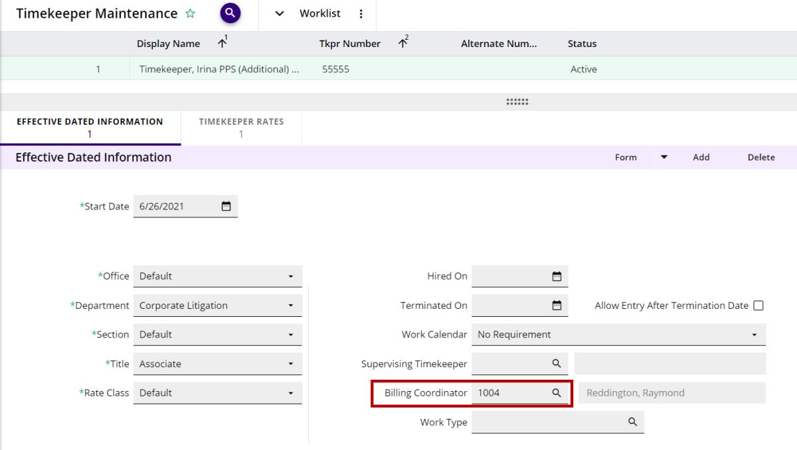

# 3E Billing Coordinator Setup for a Timekeeper/Fee Earner

The billing coordinator is a person that is responsible for one or more timekeeper/fee earners’ billing – the billing coordinator will see their timekeeper/fee earners’ proformas in their workflow inbox and will be able to generate invoices for those proformas (requires **3EProformaInvGeneratorRole** assigned to the billing coordinator’s user). Setting up billing coordinators allows a firm to “divide and conquer” by assigning specific timekeepers/fee earners to specific billing coordinators, rather than having all proformas in a single workflow inbox.

To set up a particular timekeeper/fee earner as the billing coordinator/invoice generator for a specific timekeeper/fee earner, follow these steps.

1.  In “Timekeeper Maintenance”/”Fee Earner Maintenance” select a timekeeper/fee earner who will work in 3E Proforma.

2.  Navigate to the “Effective dated Information” child form.

3.  Enter the timekeeper/fee earner who will be the billing coordinator/invoice generator in the **Billing Coordinator** field.

4.  Submit your edits.

 

