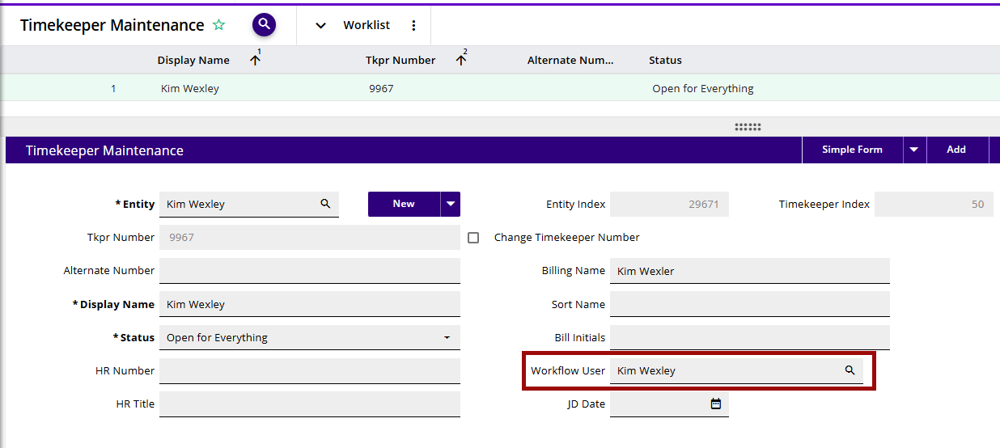

# 3E Timekeeper/Fee Earner Configuration

This step is essential as the 3E Proforma application identifies users by their timekeeper/fee earner record, unlike 3E which is based on the User record. Because of this, the user and timekeeper/fee earner records must be linked.

To link a timekeeper/fee earner and user:

1.  In “Timekeeper Maintenance”/”Fee Earner Maintenance” select a timekeeper/fee earner who will work in 3E Proforma.

<!-- -->

2.  Populate the “Workflow User” field with the User record that belongs to this timekeeper/fee earner. In most cases the User and the Timekeeper/Fee Earner will be the same person.

3.  Submit your edits.

**Note:** The Workflow User mapped to the Timekeeper/Fee Earner must be unique, which means you cannot have the same Workflow User mapped to multiple Timekeepers/Fee Earners. You can have an inactive User mapped to a Timekeeper/Fee Earner if that User has the user timekeeper/fee earner map child form populated with that Timekeeper/Fee Earner and the Supports 3E Proforma checkbox selected in the “User/Role Management” process. See [<u>User Timekeeper Map/User Fee Earner Map</u>](UserRole-Management/User-Timekeeper-MapUser-Fee-Earner-Map.md#user-timekeeper-mapuser-fee-earner-map) for more details.

