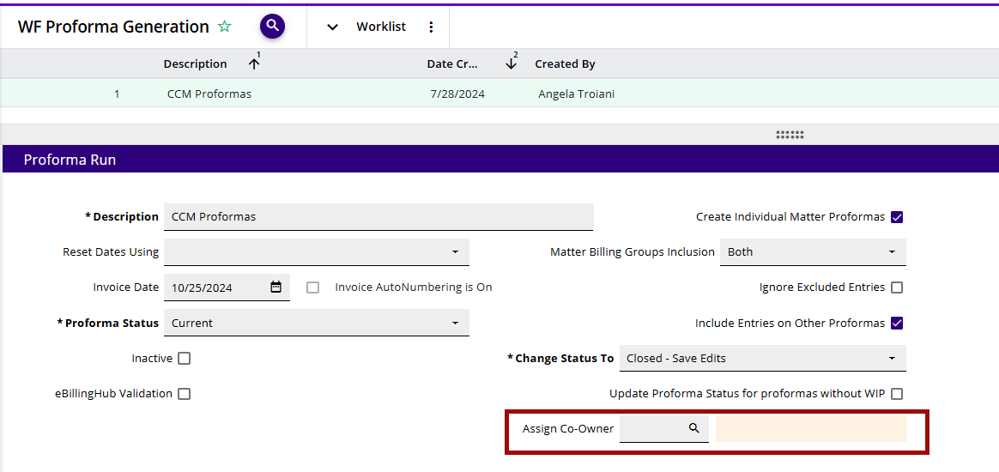
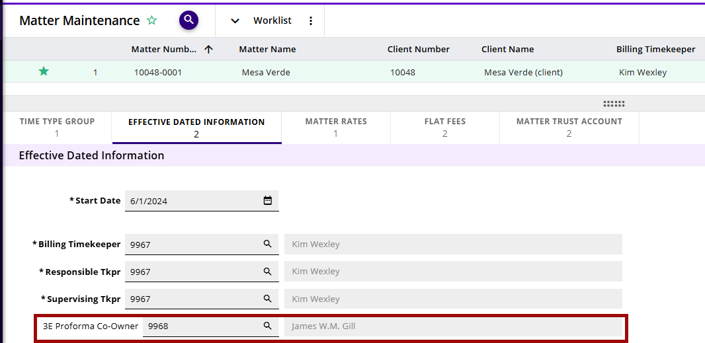
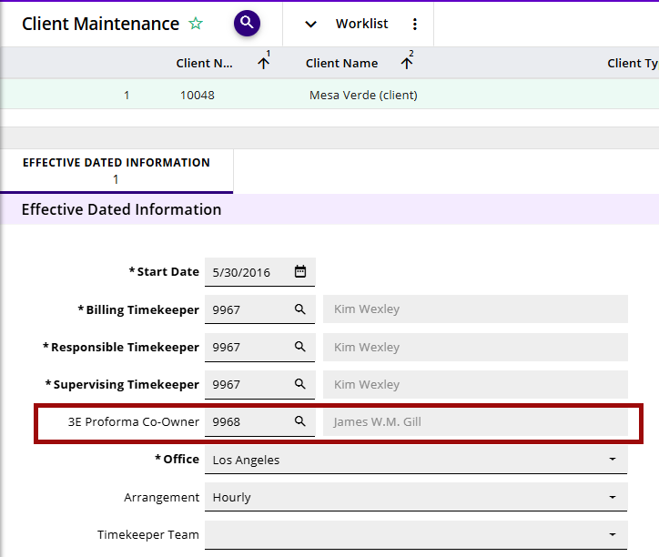
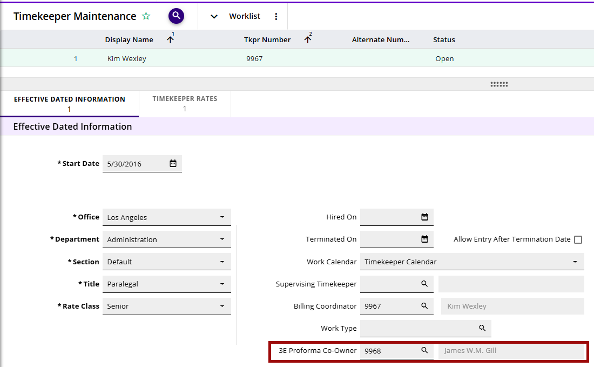
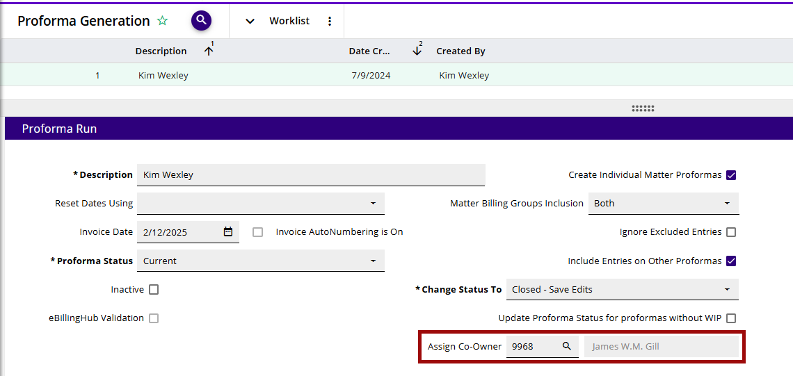
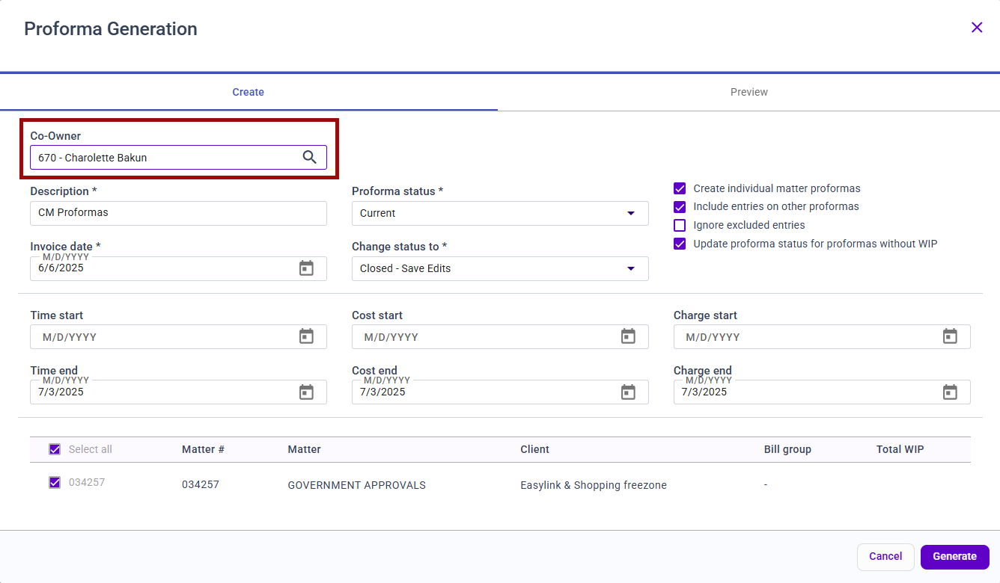
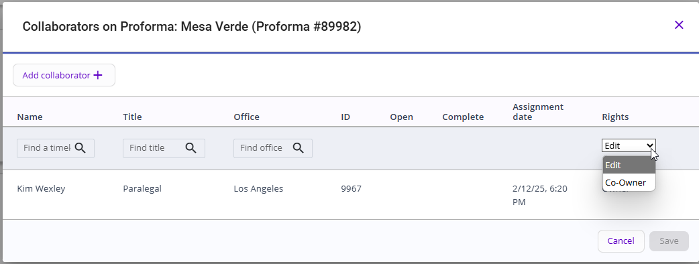

# Co-Owner Setup

Beginning with 3E 5.7.0/on prem 3E 3.2, proformas can now have a co-owner assigned. The co-owner has the same rights as the Proforma Owner, allowing for shared proforma responsibilities.

A default co-owner can be set at the Client, Matter, and Timekeeper/Fee Earner level in the respective Effective Dated Information child form. The co-owner hierarchy is:

- Proforma Generation

- Matter

- Client

- Timekeeper/Fee Earner

**Note:** Only one Co-Owner will be assigned to a proforma. The Co-Owner must be different than the Owner.

**Proforma Generation:**

** **

**Matter Maintenance:**

**Client Maintenance:**

**Timekeeper Maintenance:**

 

Co-owner can also be assigned or overridden on the fly, when generating proformas in the Proforma Generation process in 3E:

 

Or in 3E Proforma, Proforma Generation:

Within 3E Proforma, Co-owner rights can also be assigned to an existing proforma when the owner adds a collaborator:

**Note:** There can only be one Co-Owner assigned to a proforma. The Co-Owner must be different than the Owner.

