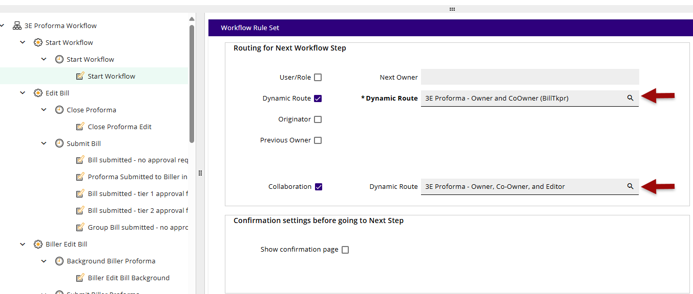
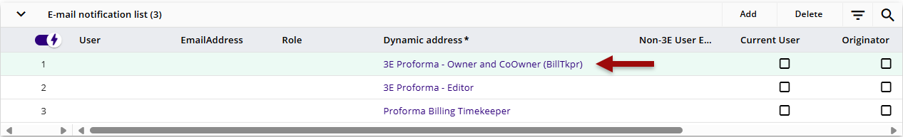

## Workflow setup for Co-Owner

To route the proformas to both the Owner and co-owner, update the workflow configuration to use the new stock dynamic routing filters.

In each workflow step, choose the routing that corresponds to who the Proforma Owner is:

- 3E Proforma – Owner and CoOwner (BillTkpr)

- 3E Proforma – Owner and CoOwner (RspTkpr)

- 3E Proforma – Owner and CoOwner (SpvTkpr)

Update the workflow rulesets to use the new/updated Co-Owner workflow filters

- Start Workflow ruleset - dynamic route, Collaboration dynamic route, email route

- Bill Submitted no approval, tier 1, tier 2 rulesets - email route

- Biller Return ruleset - dynamic route

- Bill write down approval - email route

- Reject proforma - dynamic route, email route

- Return proforma - dynamic route, email route

- Biller Submitted no approval, tier 1, tier 2 - email route

- Start workflow from group - dynamic route, email route (*this step handles proformas being returned from group workflow, no other group proforma workflow updates needed)*

Example of Dynamic Route with co-owner:

Example of email route with Co-Owner:

With the Workflow Configuration updated and a co-owner assigned, both the Owner and the Co-Owner will receive the proforma and have owner rights for editing/submitting the proforma in 3E Proforma.

 

