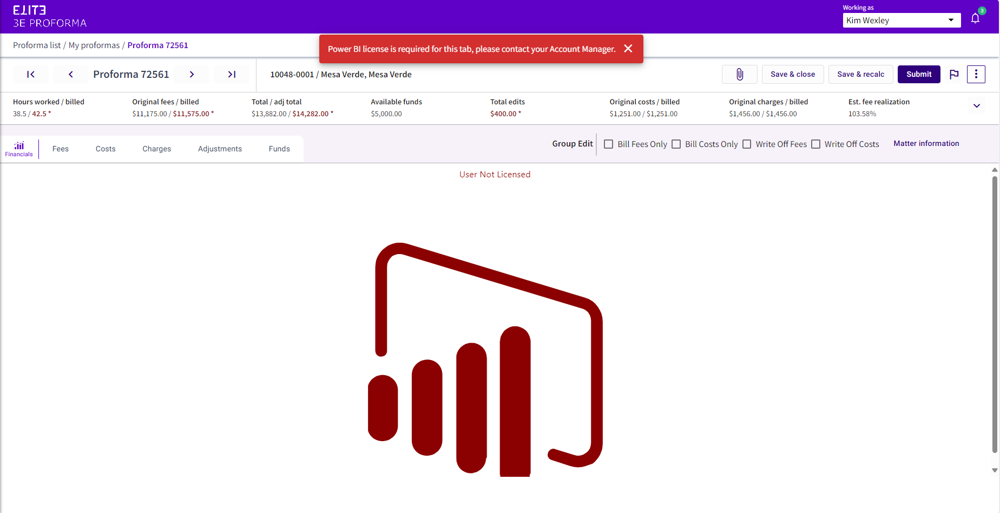

# Data Insights Integration

Beginning with version 7.10, 3E Proforma offers integration with Data Insights 4.10+. The integration displays a new Financials tab to the left of the Fees tab in Proforma Details, which displays a stock Data Insights report.

This feature requires 3E Cloud.

 

Users must have a Data Insights license for the report to display. If they do not, they will receive a warning message:

