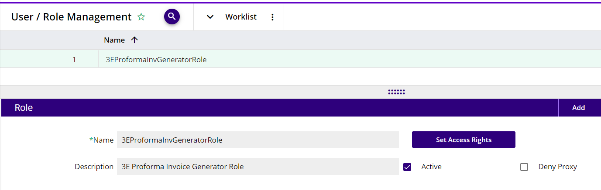
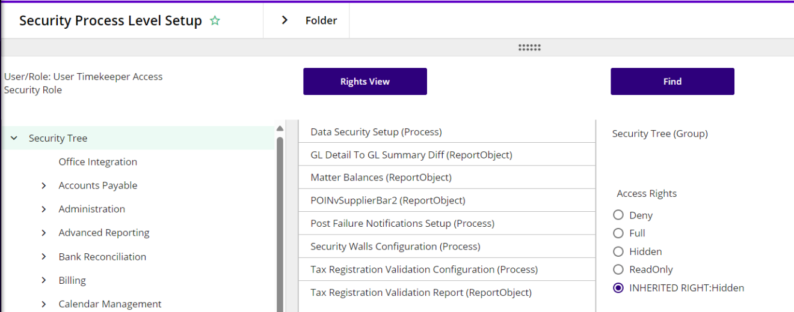
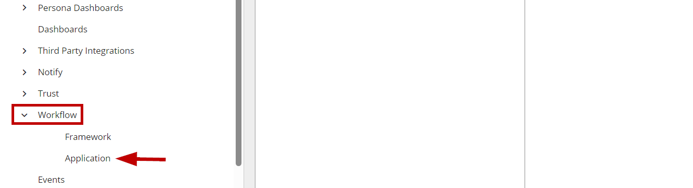
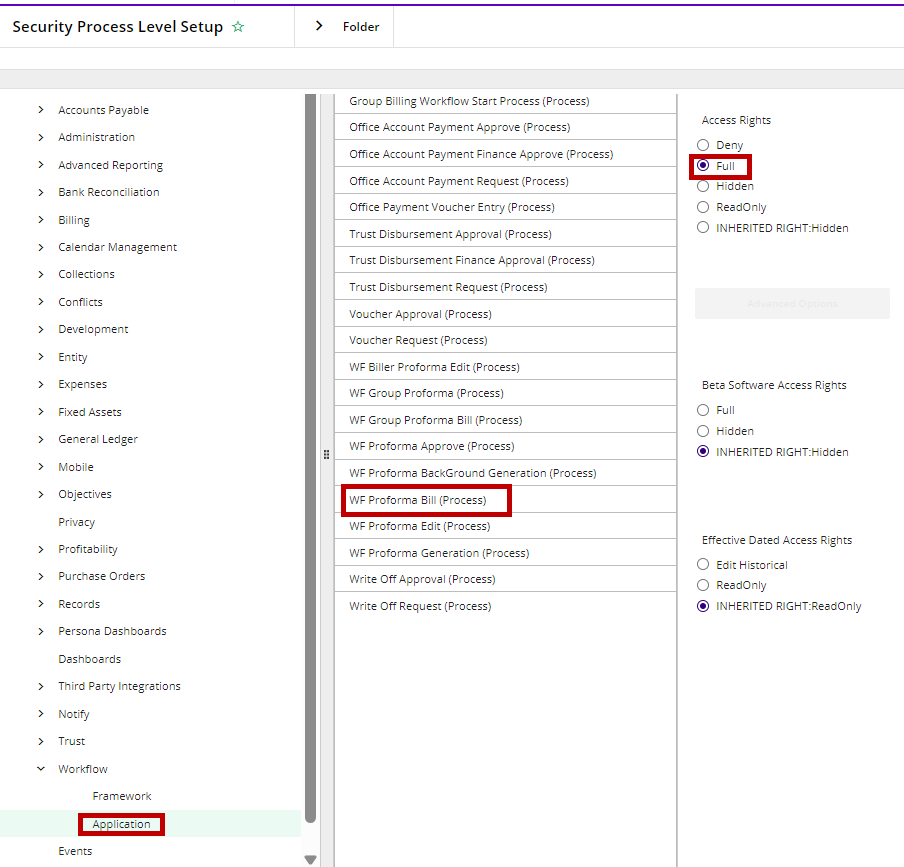

# Generate Bill(s) - Optional 3E Proforma Functionality

For organizations that have decentralized billing, meaning the expectation is for the lawyers to generate their own bills, there is now a   button that will appear on Proformas in the “Completed proformas” list. The button will only appear on proformas where the “working as” user is the Proforma Owner according to the workflow filter, 3E Proforma – Owner, and the user is assigned the 3EProformaInvGenerator role.

The release requires 3E 3.0.3 and UI 45 or greater. Please refer to the most current Release Notes or the Compatibility Matrix for 3E on-prem and UI/API version requirements.

The following setup is required to prevent any issues during the Generate Bill process in 3E Proforma:

 

1.  WF Proforma Bill (Process)

    1.  This setting needs to be set to **Full**. The recommendation is to assign the Billing Timekeepers/Fee Earners (Proforma Owners) to a Role and then set this setting to **Full** for the Role or assign the role per User. To do this:

        1.  Go to the 3EProformaInvGenerator role assigned, or the User in common to the Timekeepers/Fee Earners. For example:

2.  Click on **Set Access Rights.**

3.  Scroll down the Security Tree to Workflow and expand the group.

4.  Select **Application.**

5.  In the center column, select **WF Proforma Bill (Process).**

6.  In the right-most column, set the Access Rights to **Full.**

 

