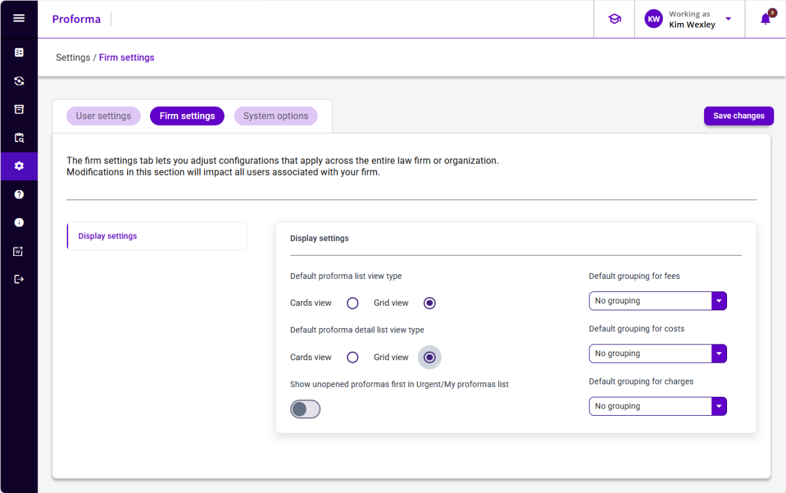

## Firm Settings

Firm settings are firm-level defaults and are applied to any user that has not modified their own user settings. If a user updates their user settings, the user settings will override the firm default (for that user only).

To view Firm Settings, a user must have the **3EProformaAdminRole** assigned to their user record.

Any time a setting is changed, be sure to click the **Save changes** button to save.

