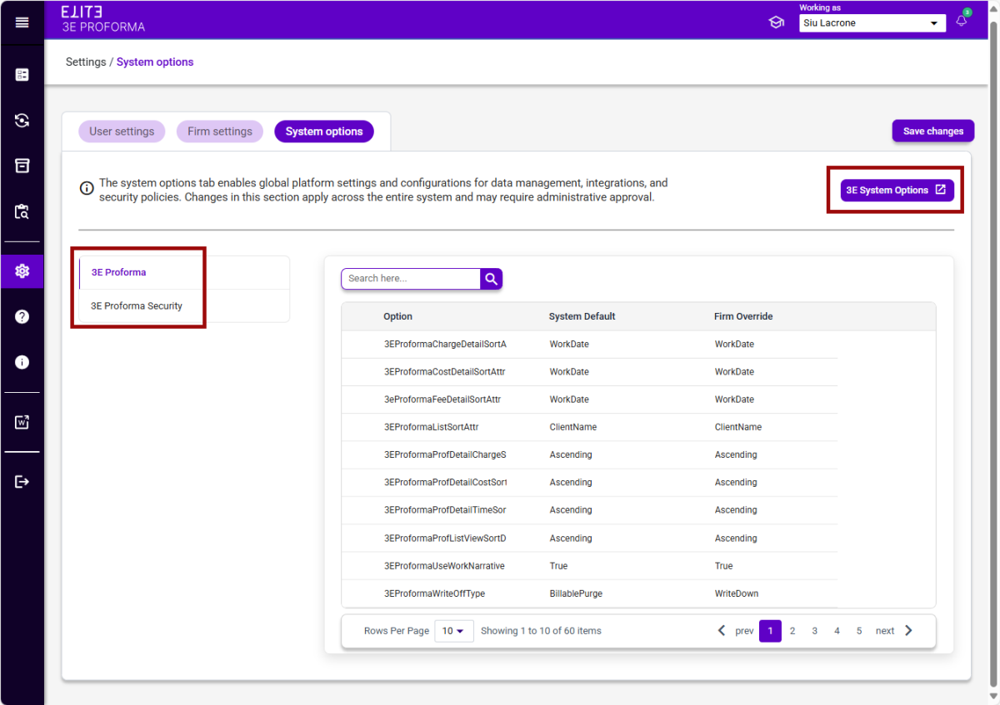

## System Options

The system options tab provides a read only view of the 3E Proforma and 3E Proforma Security System Options from 3E. This allows administrators to review System Default and Firm-level Overrides for the system option settings while performing testing in 3E Proforma without having to open 3E. To view System Options, a user must have the **3EProformaAdminRole** assigned to their user record.

The **3E Proforma** and **3E Proforma Security** groups are listed on the left-hand side of the window, click the one that you wish to view.

If the administrator wants to launch 3E to make changes to the system options or to view options at the Unit, Role, or User level, they can do so with the **3E System Options** button at the top right of the screen.

 

