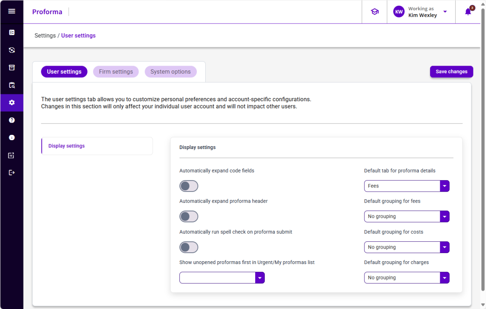

## User Settings

User settings allow a user to set default behavior for certain areas of the system. These settings are user specific. All users have access to the User settings tab. If a user updates their settings, the user setting will override the firm setting.

Any time a setting is changed, be sure to click the **Save changes** button to save.

