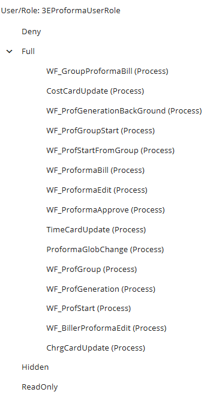

## Assigned Roles

#### 3EProformaUserRole

Beginning with 3E 5.5.1 (on prem 3E 3.2), there is a new stock user role, **3EProformaUserRole**, which should be assigned to all users who will access 3E Proforma. This role has all the required permissions for all basic functions in 3E Proforma. The role has the following rights:

Hybrid customers on a 3E version less than 3.2 should create a role with these rights and assign it to your 3E Proforma Users. The name of the role is not important; the users just need to have the same rights that are in the stock 3EProformaUserRole role.

