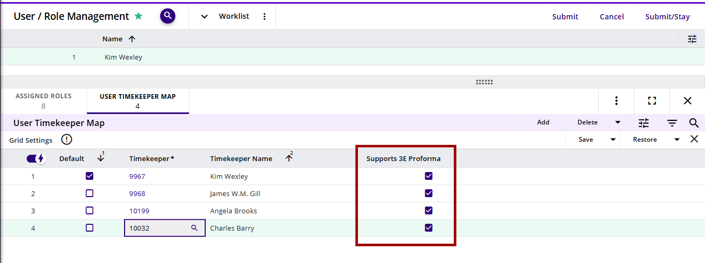

## User Timekeeper Map/User Fee Earner Map

Each 3E Proforma user must have a timekeeper/fee earner mapped to their user record. This may be just the user themself or it may be multiple timekeepers/fee earners.

For example, if there are Legal Assistants who will need to work in 3E Proforma as several timekeepers/fee earners, then map the appropriate timekeepers/fee earners to the Legal Assistant’s user record and select the **Supports 3E Proforma** check box as shown below.

If the Legal Assistant will also need to review and edit their own proformas or be included as an editor on someone else’s proformas, then they need to be mapped to their own timekeeper/fee earner record as well.

