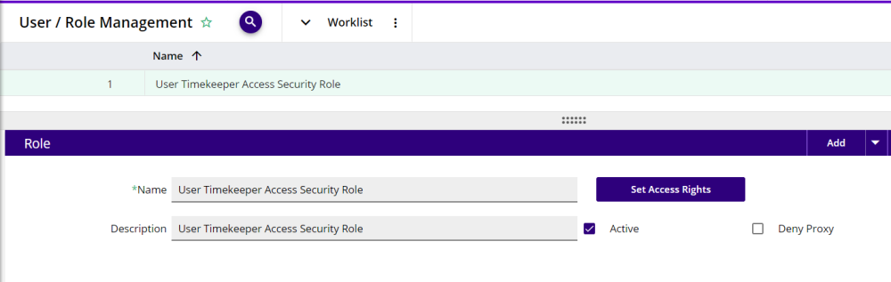
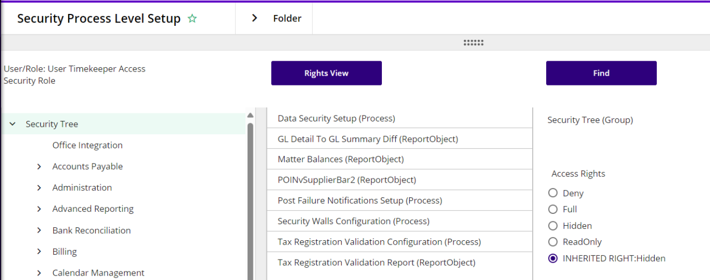
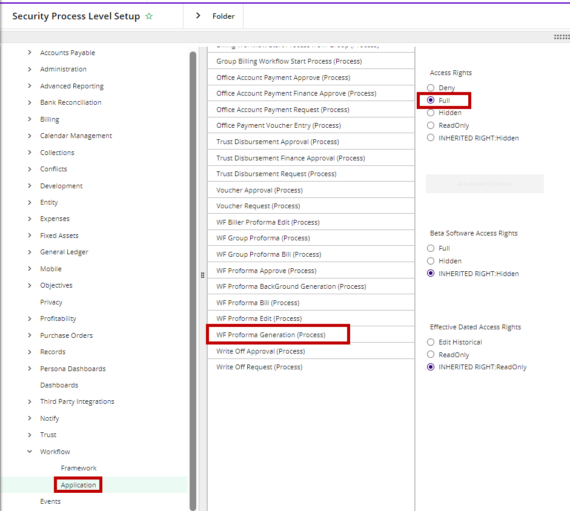
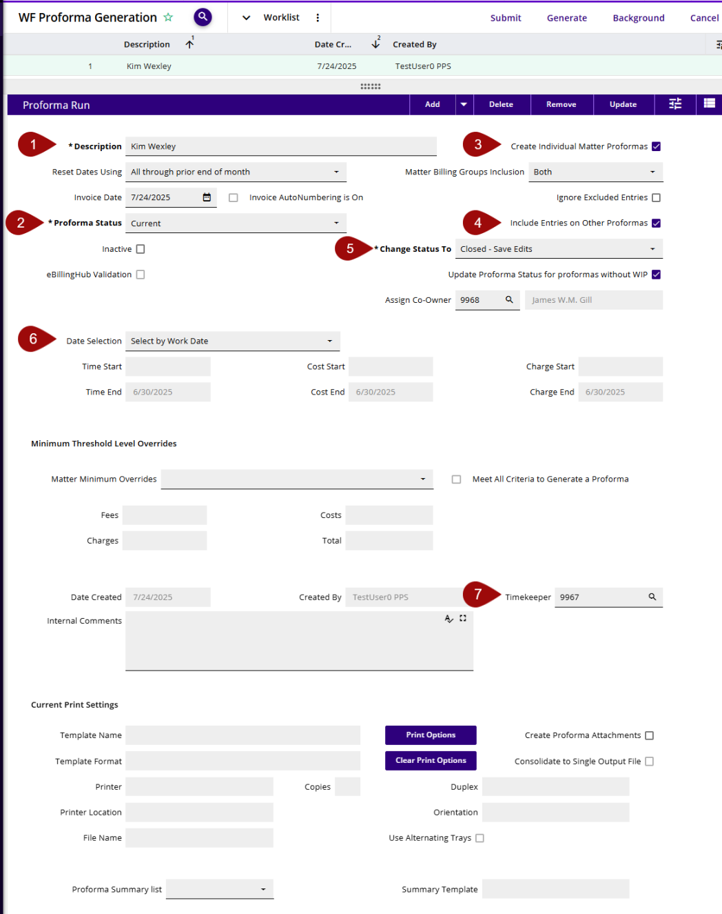

# WIP List and Generate Proforma(s) – Optional 3E Proforma functionality

For organizations that have decentralized billing, meaning the expectation is for the lawyers to generate their own proformas, there is now a WIP list view and the ability to generate proforma(s) for Client Matters where they are the assigned Billing Attorney.

The release requires 3E 3.0.3 and UI 36 or greater, please refer to the most current Release Notes or the Compatibility Matrix for 3E on-prem and UI/API version requirements, for a WIP list-specific setting.

The following setups are required to display the WIP list and for the ease of use when generating proformas from the WIP list:

 

1.  WF Proforma Generation (Process)

    1.  This setting needs to be set to **Full**. The recommendation is to assign the Billing Timekeepers/Fee Earners (Proforma Owners) to a Role and then set this setting to **Full** for the Role. Or assign the role per User. To do this:

        1.  Go to the Role assigned, or the User, in common to the Timekeepers/Fee Earners. For example:

2.  Click on **Set Access Rights.**

3.  Scroll down the Security Tree to Workflow and expand the group.

4.  Select **Application.**

5.  In the center column, select **WF Proforma Generation (Process).**

6.  In the right-most column, set the Access Rights to **Full.**

 

2.  In 3E Override / Set System Options:

    1.  In the 3E Proforma Security Group, go to the **Show_WIPList** option setting and override this setting to **True.**

    2.  This override setting is available at the Firm, Unit, and User levels.

<!-- -->

3.  WF Proforma Generation runs

    3.  Each Billing Timekeeper/Fee Earner requires their own WF Proforma Generation run setup with some basic information:

        1.  **Description:** Since each lawyer will have their own proforma run, create an easily identifiable description including the Billing Timekeeper/Fee Earner’s name.

        2.  **Proforma Status:** Choose the status that the firm uses for current proformas (hint:  it may not be called “Current”).

        3.  **Create Individual Matter Proformas:** Choose whether to create individual proformas for matters that are part of a billing group.  If all the matters in the billing group have the same Billing Timekeeper/Fee Earner, this can be either true or false, but if they do not all have the same Billing Timekeeper/Fee Earner **the best practice is to check the box** and generate individual proformas for each matter.

        4.  **Include Entries on Other Proformas:** Choose whether to include cards from other proformas on the new proforma.  **The best practice is to check the box** so that there is only one current proforma with all the WIP rather than multiple current proformas with subsets of the WIP.

        5.  **Change status to:** choose the status to use for other open proformas which will have their cards transferred to the new proforma (if \#4 is checked).  **The best practice is to set the status to Closed – Save Edits** so that the older proformas are closed out and any edits are saved.

        6.  **Date Selection:** Choose the type of date to evaluate for the Start and End dates on the proforma.  **The best practice is to use Select by Work Date**.

        7.  **Timekeeper/Fee Earner:** enter the timekeeper/fee earner number for the Billing Timekeeper/Fee Earner that will use this proforma generation run.  This is how 3E Proforma links the user to the proforma generation run in the WIP List.

        8.  Other fields not explicitly mentioned here can be set up as needed or left blank.

