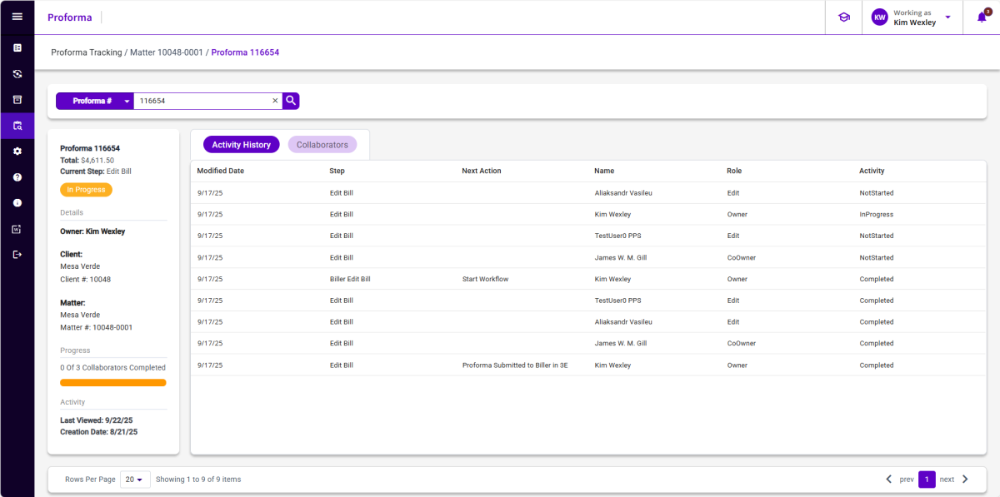

### **Tracking Proformas** 

Do the following to track proformas progressing through your firm's workflow process:

1.  Select **Proforma Tracking** from the Side Navigation Menu.

2.  Select Client, Matter, Timekeeper/Fee Earner, or Proforma from the drop-down list in the filter section.

3.  Select the filter check boxes (i.e., In Progress, Not Started, or Completed) to specify which type of proformas you want to search.

4.  Specify a date range. This is recommended if the search includes Completed proformas.

5.  Click **Apply** to initiate the search with the selected filters. If only default filters are used, you can also click the **Search** icon to start the search.

The side panel of the search results displays statistics about the proformas, such as Client, matter, timekeeper, and proforma name, \# of proformas assigned, and a tracking bar for the proforma progress.

The results list displays workflow details for the records returned. The details shown vary depending on whether you search for a group of proformas (Matter, Client, or Timekeeper) or by a single Proforma. For additional information, please see the 3E Proforma User Guide.

**Note:** Available options vary depending on whether you search for a group of proformas (Matter, Client, or Timekeeper/Fee Earner) or by a single Proforma.

