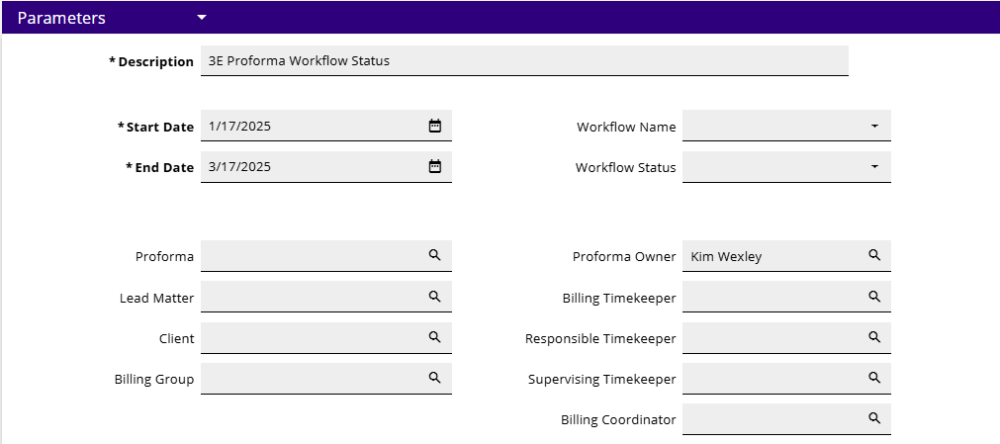
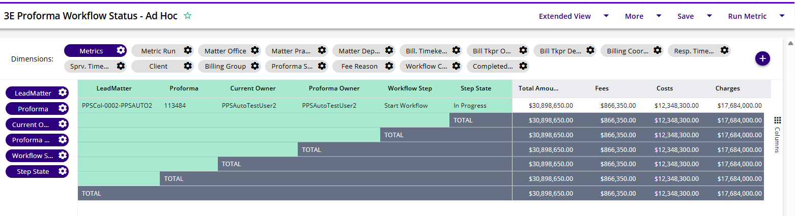

### **3E Proforma Workflow Status – Ad Hoc Metric**

Beginning with 3E version 5.6 / on prem version 3.2, a 3E Workflow Admin or Biller may now run the 3E Proforma Workflow Status metric to display the workflow details of the 3E Proforma Workflow and 3E Proforma Group Billing Workflow to analyze the proformas at each step of the workflow and manage the billing cycle more closely.

The new 3E Proforma Workflow metric can be found on the following dashboards:

- Billing Metrics dashboard in the Billing Metrics panel

- Workflow Dashboard in the Other Dashboards panel

This metric will search for the workflow details for uncompleted workflow items based on the parameters chosen. Users must choose a date range less than 90 days in duration.

 

**Hint:** Try viewing the metric in Extended View.

