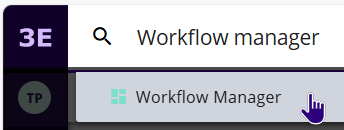
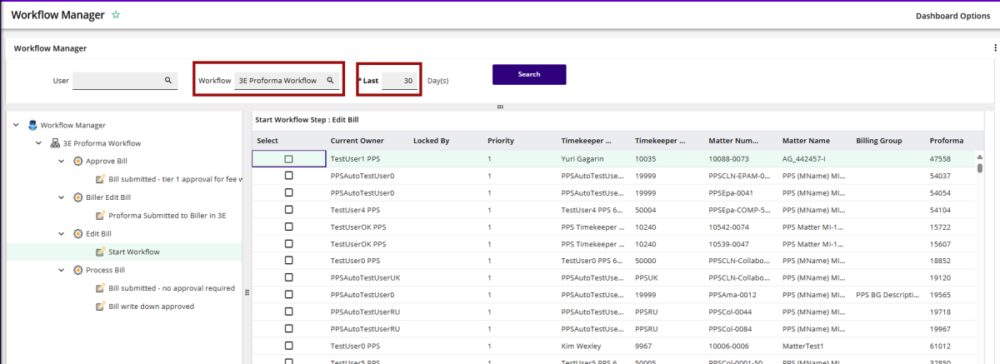
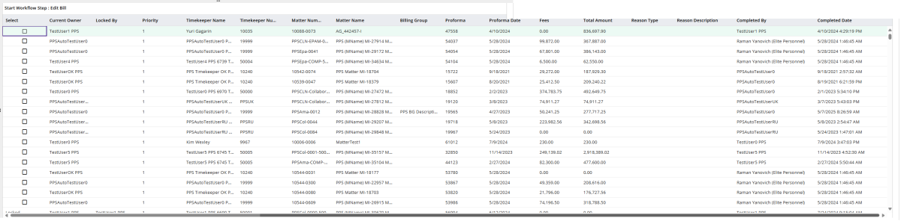

### **Workflow Manager**

3E users that have permissions to the Workflow Manager can also review the workflow status in that process.  Beginning with 3E version 5.6 / on prem version 3.2 you may search by Workflow (not just user), so that you can view all records in each workflow for all users.

In the global search, enter Workflow Manager.

In the Workflow Manager process, Workflow search box, enter the name of the 3E Proforma workflow, to see all proformas in all workflow steps.

Select a date range (30 days is the default), then click **Search**.

The left panel displays all the steps in the workflow, select one to see all the current records in that step.

**Note:** If the Total Amount column is not available, see KC article **000007067**: *3E Proforma - Add Total Amount to Workflow Manager* for instructions to add it.

