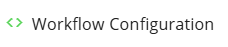
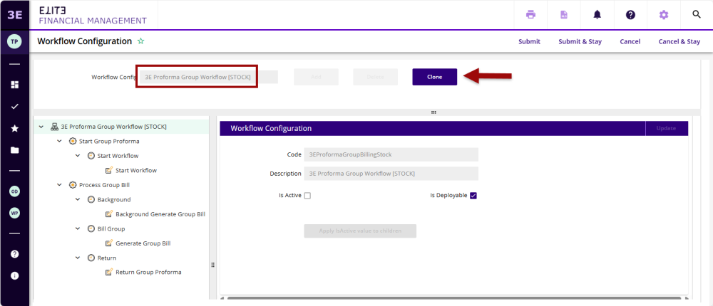
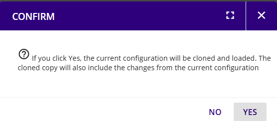
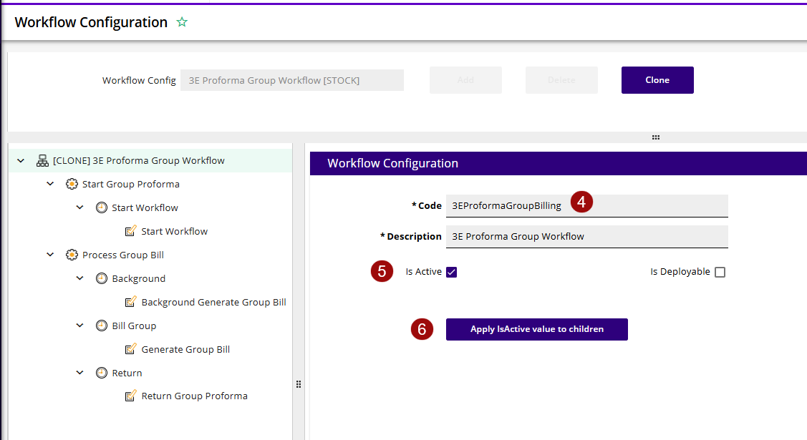
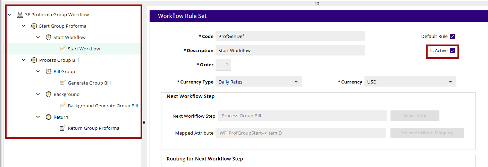
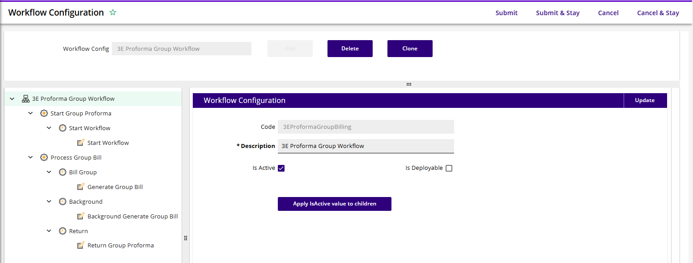

## 3E Proforma Group Workflow \[STOCK\]

As of 3E Proforma 7.8.0, the 3E Proforma Group Workflow became customizable. It is important to never edit the stock workflow; keeping the stock workflow stock ensures you always have a “clean” copy of the workflow should you need to start over.

To activate the workflow, clone the workflow and then make edits to your cloned copy:

1.  In 3E, search for Workflow Configuration. If you see multiple results, select this one:

2.  Search for and select the **3eProformaGroupBillingStock** workflow and click **Clone**.

3.  Choose “Yes” in the confirmation pop-up.

4.  In the newly cloned copy of the workflow, remove the text “Stock” from the end of the Code. The new name should be **3EProformaGroupBilling**.

**Note:** The workflow code MUST be 3EProformaGroupBilling ONLY. DO NOT ADD other text/ names/acronyms, etc. to the code or description or it will break the workflow.

5.  Select the **IsActive** check box

6.  Click the **Apply IsActive value to children** button.

**Note:** Only one (non-stock) Group Billing Workflow can be active at a time.

 

**Note:** Go through all the steps/actions/rules and make sure they are all checked as active.

 

7.  Click **Submit** to save this configuration. The newly cloned and submitted workflow should look like this:

**Note:** There should only ever be one active 3EProformaBilling and one active 3EProformaGroupBilling workflow at a time.

