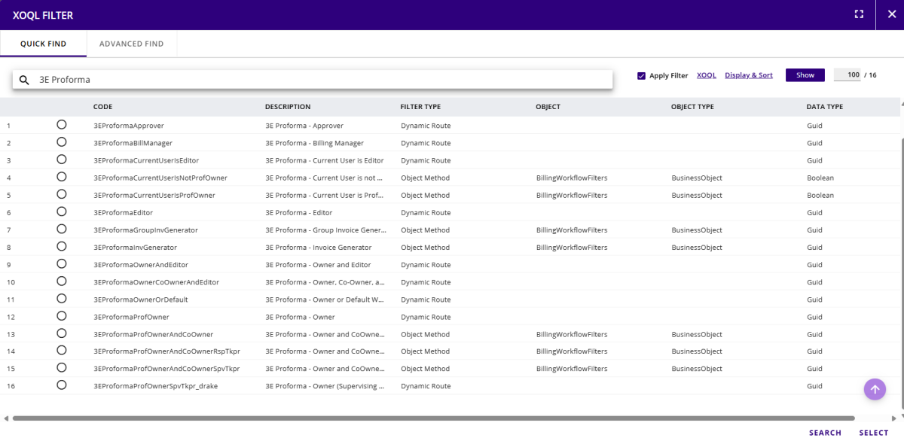
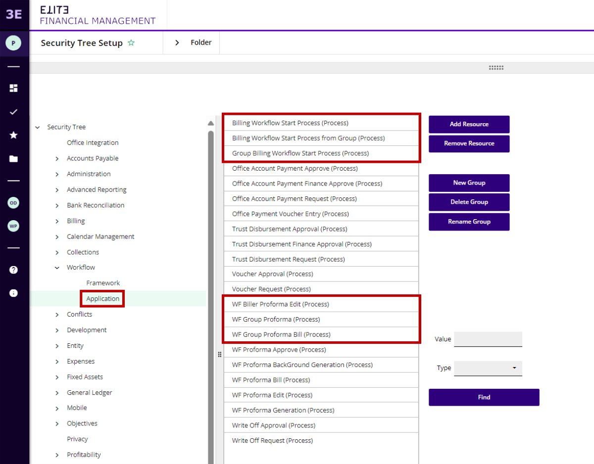

## Editing Workflow Rules

Workflow is configurable and overrides have been provided to account for any change in the rulesets under “3EProforma” to support this. Please refer to the [<u>Overrides section</u>](../OverrideSet-System-Options/3E-Proforma-System-Options/Workflow-Config-specific-settings-under-3E-Proforma-group.md) WIP List and Generate Proforma(s) – Optional 3E Proforma functionalityWIP List and Generate Proforma(s) – Optional 3E Proforma functionalityfor more details.

Workflow Filters have been provided to support configurable routing for each step. The following four filters cover the different 3E Proforma personas.

- **Owner/Billing Timekeeper** – “3E Proforma – Owner”

- **Co**-**Owner –** Co-Owner is incorporated into several dynamic routing filters. The co-owner is assigned at the client, matter, timekeeper/fee earner, or proforma run level. See [<u>Co-Owner Setup</u>](../Co-Owner-Setup.md#co-owner-setup) for more information.

- **Editor** – “3E Proforma – Editor”

- **Approver** – “3E Proforma – Approver”; currently this includes users assigned to role “3EProformaApproverRole”. This can be set as explained in the section <u>**“Assign users to the Approver/Invoice Generator Role”**.</u>

- **Invoice Generator** - “3E Proforma - Invoice Generator”; the user associated with the [<u>Billing Coordinator Timekeeper/Fee Earner</u>](../3E-Billing-Coordinator-Setup-for-a-TimekeeperFee-Earner.md#3e-billing-coordinator-setup-for-a-timekeeperfee-earner) set for the billing timekeeper effective dated child. If this value is not set the workflow sends the proforma for billing to all the users that belong to the “3EProformaInvGeneratorRole” role.

**Note:** Please see [<u>User/Role Management</u>](../UserRole-Management.md#userrole-management) for information about how to assign users to a role.

**Workflow Filters allow conditional outputs** - Submit/ Complete for the owner/editor.

This is to support a feature in 3E Proforma that requires only the owner to be able to submit the proforma for billing and editors to just edit and complete the proforma, so it moves out of their “needs review” bucket to the “completed” bucket. The following three filters support this functionality and can be edited according to your specific requirements:

- 3E Proforma - Current User is Editor- (3EProformaCurrentUserIsEditor)

- 3E Proforma - Current User is not Proforma Owner (3EProformaCurrentUserIsNotProfOwner)

- 3E Proforma - Current User is Proforma Owner (3EProformaCurrentUserIsProfOwner)

The following workflow processes support the workflows:

 

