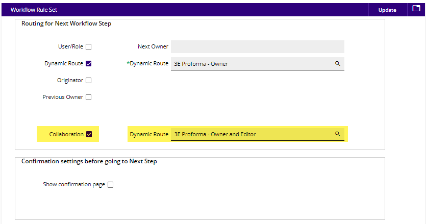
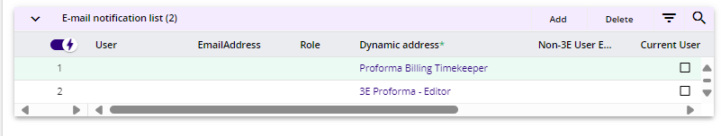

# Workflow Provided as Stock

**Note**: Workflow can be configured and modified based on each client. The workflow listed below is what is provided in stock. If a customer wants to use the co-owner functionality, be sure to review [<u>Workflow setup for Co-Owner</u>](Co-Owner-Setup/Workflow-setup-for-Co-Owner.md#workflow-setup-for-co-owner).

The workflow gets started once the proforma is generated using any of the 3E processes:

- Matter maintenance

- Proforma generation

- Workflow proforma generation

- Background proforma processing

The workflow covers the lifecycle of a proforma after it is generated and ends when it is billed (invoice generated) and the proforma status is changed to **Closed** or **Deferred**.

Proforma is generated

Routed to:

1\. Owner/Co-Owner (if in use, see [<u>Co-Owner Setup</u>](Co-Owner-Setup.md#co-owner-setup))

1.1 Submit the proforma after making changes and based on the changes

1.1.1 Route to the biller for review

1.1.1.1 **Return** the proforma to the owner

1.1.1.2 **Submit** the proforma to the approver (follows steps in 1.1.2)

1.1.1.3 **Submit** to invoice generator (follow steps in 1.1.3)

1.1.1.4 **Bill** the proforma

1.1.1.5 **Close** the proforma

1.1.2 **Route** to the approver based on the write-down logic. Approver can take either of the actions listed

1.1.2.1 The approver would submit the proforma to the invoice generator

1.1.2.1.1 Invoice generator can either invoice or return the proforma

1.1.2.1.1.1 **Return** sends the proforma back to the owner

1.1.2.1.1.2 **Generate** creates the invoice

1.1.2.2 **Reject** sends the proforma back to the owner

1.1.2.3 **Close** the proforma

1.1.3. **Route** to invoice generator if there is no approval required

1.1.3.1 Invoice generator can either invoice or return the proforma

1.1.3.1.1 **Return** sends the proforma back to the owner

1.1.3.1.2 **Generate** creates the invoice

1.2. **Close** the proforma by deferring it or changing its status to **Closed**

2\. Editor

2.1 Can edit the proforma and complete the review of the proforma

A proforma can only be forwarded to other lawyers when the Collaboration checkbox has been checked. Currently collaboration has been set up to automatically route the proformas to the owner and editors (and co-owners for 3E Cloud version 5.7/3E on prem version 3.2 or higher).

**Note:** Dynamic routing that includes the Editor will send the proforma to the Editors (users with cards on the proforma) and the other effective dated timekeepers/fee earners on the matter (that are not the Owner).  The effective dated timekeepers/fee earners will see all cards but have editor rights to the proforma.

Email notifications are set up via workflow.

**Note:** The email notifications on forward and add collaborator are hard coded and not configured in the workflow.

