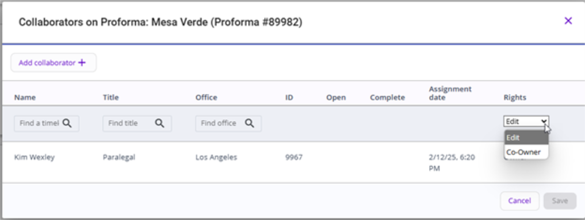

### **STEP 2: Assign Co-owner Rights in 3E Proforma**

Within 3E Proforma, co-owner rights can be assigned to a proforma collaborator.

**Note**: There can only be one Co-Owner assigned to a proforma.

Do the following to give a collaborator co-owner rights for a proforma:

1.  In the Proforma list, click the **Action** menu for a listed proforma and select **View Collaborators**.

**Note**: You can also access the Collaborator list in the Proforma Details view by clicking the Proforma-level **Action** menu and selecting **View collaborators**.

2.  In the Rights column, select **Co-Owner** for a listed collaborator.

<!-- -->

3.  Click **Save**.

