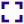
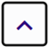

### **Icon Legend**

The following is a list of the most common icons used to access functions in 3E Proforma (e.g., filters and action menus, side menu icons?).

<table>
<colgroup>
<col style="width: 29%" />
<col style="width: 43%" />
<col style="width: 27%" />
</colgroup>
<thead>
<tr>
<th><strong>Icons</strong></th>
<th><strong>Name</strong></th>
<th><strong>Descriptions</strong></th>
</tr>
</thead>
<tbody>
<tr>
<td></td>
<td>Filter</td>
<td>Click to access a list's filter panel and enter criteria to narrow the number of displayed items.</td>
</tr>
<tr>
<td></td>
<td>Expand Narrative</td>
<td>Click to expand a narrative field for editing.</td>
</tr>
<tr>
<td></td>
<td>Expand / Collapse</td>
<td>Click the Expand/Collapse arrows to display or hide fields.</td>
</tr>
<tr>
<td></td>
<td>Action Menu</td>
<td>
Click to access a menu of proforma or card-level actions to use.

The existence of <a href="../../Proforma-Tasks/Viewing-Proforma-Level-Comments.md#viewing-proforma-level-comments"><u>proforma-level comments</u></a> is indicated by a dot displayed on the Proforma-level <strong>Action</strong> menu
</td>
</tr>
<tr>
<td></td>
<td>Notifications</td>
<td>Click to view notifications.</td>
</tr>
<tr>
<td></td>
<td>Priority Flag</td>
<td>Click to flag a proforma as a priority.</td>
</tr>
<tr>
<td></td>
<td>Sort Order</td>
<td>Click to sort a list in ascending or descending order.</td>
</tr>
<tr>
<td></td>
<td>Attachment</td>
<td>Click to manage attachments and notes.</td>
</tr>
<tr>
<td></td>
<td>Locked Status</td>
<td>
This icon displays when a proforma is currently opened by a user in <a href="../../Proforma-Detail-View.md#proforma-detail-view"><u>Proforma Detail view</u></a>.

Hover the cursor on the icon to view who locked the proforma. Locked proformas can be opened in read-only view.
</td>
</tr>
</tbody>
</table>

 

#### Grid Icon Legend

| **Icons** | **Name** | **Descriptions** |
|----|----|----|
|  | Card view | Click to view proforma detail cards in card view. |
|  | Grid | Click to view proforma details cards in a table format. |
|  | Group cards by | Click to group rows in a grid based on selected criteria. |
|  | Sort order | Click to sort a list in ascending or descending order. |
|  | Column filter | Click to filter grid columns. |
|  | Grid settings | Click to configure grid settings. |

