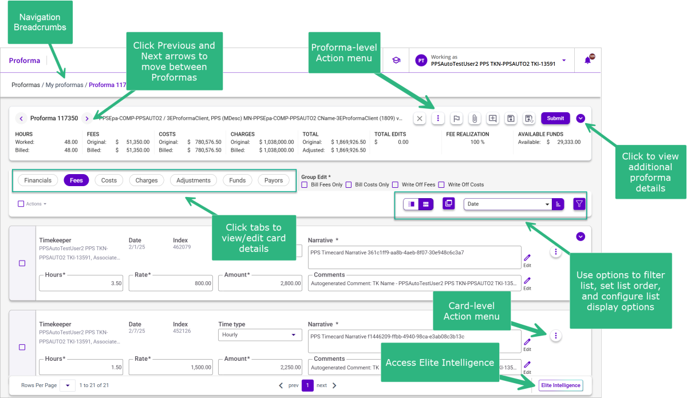

### **Navigating the Proforma Detail View**

The Proforma Details view is where you can view and make modifications to proformas. This view is accessed when you click the proforma number of a proforma displayed in the [<u>Proforma List</u>](../Navigating-3E-Proforma---Walkthrough.md#navigating-3e-proforma---walkthrough) view. In the details view, you can:

- View proforma header details

- Attach files and add notes to a proforma

- View financial data from Data Insights

- View and edit Fee, Costs, and Charge cards

- Make adjustments

- Perform and group edit.

**Expand / Collapse Proforma Header Details** 

Be default the Proforma Details view displays a single line of header details. Click the **Expand** arrow to display for all of the header fields. Click the **Collapse** arrow to close the expanded view.

**Action Menus** 

Menus are available at both the proforma and card levels of the Proforma Detail view. Click the menus to access a list of functions to initiate.

**Note**: The availability of actions (e.g., Add Costs, Add Fees, etc.) is determined by 3E User/Role security. See [Appendix A - Proforma Action Availability by Role](../../Appendix-A---Proforma-Action-Availability-by-Role.md#appendix-a---proforma-action-availability-by-role) for additional details.

**Action Toolbars**

Toolbars are available at both the header and card level in the Proforma Detail view.

- **Header level** - The header-level toolbar contains an Action menu in addition to options to add attachments and navigate to other proformas in the Proforma list.

- **Card level** - The card-level toolbar contains options to filter and sort a card list and apply actions (e.g., Exclude or combine) against listed cards. See [List View Types](../Standard-Features-and-Navigation/Lists.md#list-view-types) for further details.

**Navigating Card List**

A paging toolbar is available to help you quickly navigate a long card list that extends over multiple pages. You can control how many cards display on a page. Additionally, you can jump to a specific page.

**Breadcrumbs**

The breadcrumbs displayed at the top of the Proforma Details view shows the number of the currently opened proforma and the category list to which the proforma is assigned.

**Elite Intelligence**

Click Elite Intelligence to run an inquiry on matter financial, budget information, and 3E Proforma help.

