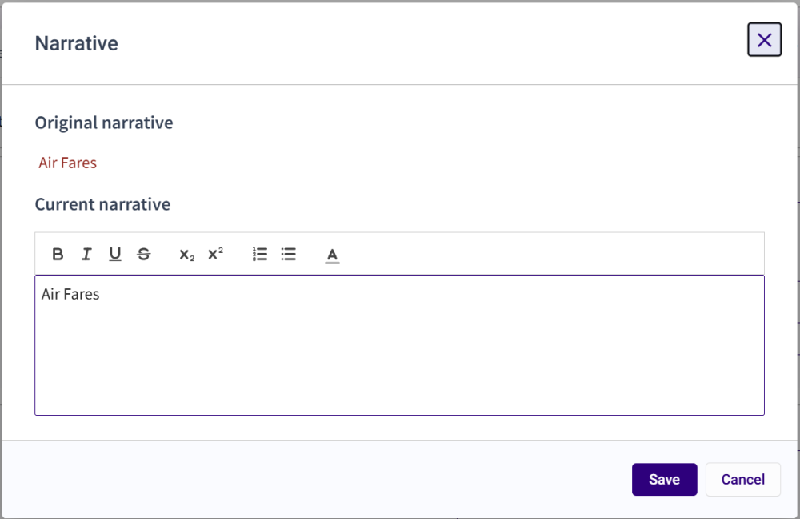

### **Card Narrative Fields**

Card details include a narrative field to display descriptive detail for a card. Information entered in the Narrative field is displayed on the actual bill. This field displays the first few lines of the narrative. Hover the mouse over the narrative field to see a tooltip that displays the full narrative (if it does not fit in the visible field). To view the full narrative or make edits, click **Read more/Edit** when using Card View, the Narrative form displays. If you're viewing cards using the Grid view, click in the Narrative column for a card and click the **Expand** icon .

#### Card View

#### Grid View

#### View Edit History

Hover the mouse over the field to view the last change made to the field. This enables you to review the last change and who made it.

The *Last Change* value will be updated by the **Save & Recalc** or **Save & Close** actions.

#### Narrative Form

The Narrative displays the original narrative from 3E and current narrative field text. Edit the narrative by clicking directly in the field and making changes.  To format the text, select one or more words to access the Formatting toolbar.

The Original narrative field will display all changes between the original and current narratives.

You can update the Current narrative field in this window. Click **Save** to save changes typed in the Current Narrative field and close the pop-up. Click **Cancel** to discard unsaved changes typed in the Current Narrative field and close the pop-up.

