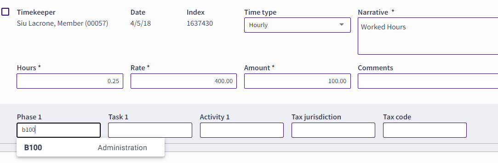

### **Entering Codes**

Throughout 3E Proforma, to enter any field that is a code (Tax Code, Task Code, Activity Code, etc.), do the following:

1.  Click in a code field and begin typing some alpha or numeric characters (2 character minimum) to see a list of items (both codes and descriptions) to choose from.

2.  Click on the required line to be applied to the card.

