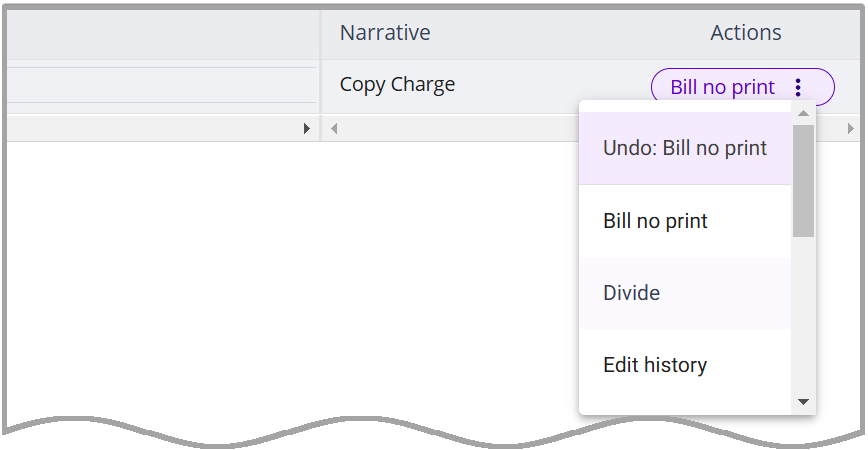

### **Set Card Status to Bill No Print**

3E Proforma provides the ability to include a card on a bill (i.e., include the amounts in the bill totals) without printing it on the bill. This is done by setting the card's status to *Bill No Print*.

Do the following to set a card's status to Bill no print (BNP).

**Note**: If a change was made to the proforma billable amounts and the proforma action is ‘BNP’, it will update the billable amount and calculate the correct billable units.

1.  Locate the proforma containing funds on the Proforma list.

2.  Click the proforma number to access the Proforma Details view.

3.  Click the appropriate tab (i.e., Fees, Costs, or Charge)

4.  Click the card-level **Action** menu and select **Bill no print**.

5.  Click **Save & recalc**.

