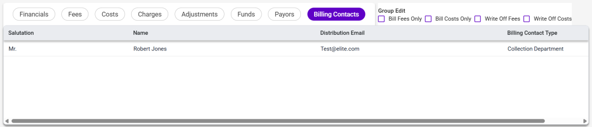

### **Proforma Details – Billing Contacts Tab**

The Billing Contacts tab displays the information maintained in the **Matter Maintenance \> Billing Contacts child form**, where Salutation and Distribution Email can be added or updated. The Billing Contacts tab displays a read-only view of this information.This tab does not display if there is no billing contact detail in the Matter Maintenance \> Billing Contacts child form.

**Note**: The Billing Contacts tab can only display in Proforma Details view when the [**ProfDetails_Show_BillingContacts**](../../Overrides-and-System-Options/3E-Proforma-Security-System-Options-List.md#1759202834)​ override system option is enabled (i.e., set to True).

| **Field Name** | **Descriptions** |
|----|----|
| **Salutation** | Displays billing contact salutation (e.g., Mr., Mrs., etc.) |
| **Name** | Displays the billing contact's name. |
| **Distribution Email** | Displays the billing contact's email address. |
| **Billing Contact Type** | Displays the role assigned to the contact that describes their function or relationship. |

** **

