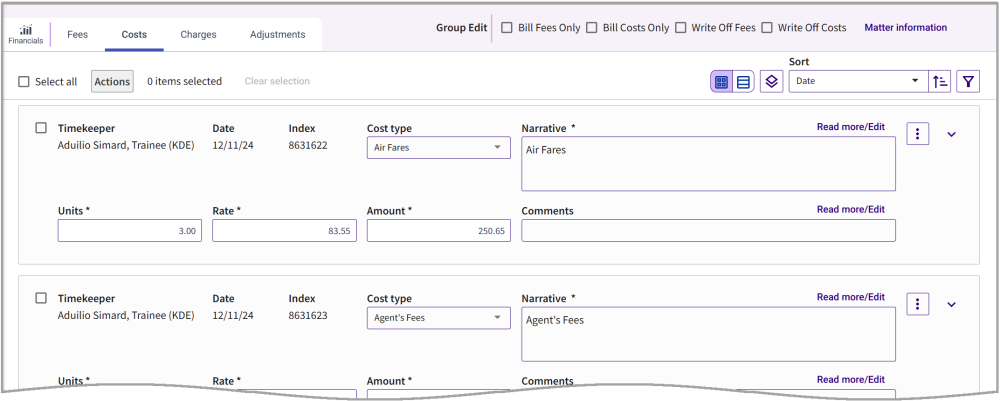

### **Proforma Details – Costs Tab**

The Cost tab shows cost card details such as the timekeeper, amount, quantity, and rates. For each entry, you can perform actions on it using the edit area below.

**Note** Timekeepers who are granted **Edit** rights to a proforma can view and edit only their cost cards. When the proforma has been opened by another user first, the users with Edit rights have only **Read** access to the proforma and can view only their cost cards.

<table style="width:100%;">
<colgroup>
<col style="width: 19%" />
<col style="width: 80%" />
</colgroup>
<thead>
<tr>
<th><strong>Column</strong></th>
<th><strong>Description</strong></th>
</tr>
</thead>
<tbody>
<tr>
<td><strong>Timekeeper</strong></td>
<td>This column displays the name of the timekeeper, his number, and the timekeeper’s title.</td>
</tr>
<tr>
<td><strong>Date</strong></td>
<td>This attribute shows the date on which the card was added.</td>
</tr>
<tr>
<td><strong>Cost Type</strong></td>
<td>This attribute shows the cost type of the cost card.</td>
</tr>
<tr>
<td><strong>Units</strong></td>
<td>This column displays the quantity for the cost card.</td>
</tr>
<tr>
<td><strong>Rate</strong></td>
<td>This column displays the price per unit for the cost card.</td>
</tr>
<tr>
<td><strong>Amount</strong></td>
<td>This column displays the calculated amount (Quantity x Rate)</td>
</tr>
<tr>
<td><strong>Narrative</strong></td>
<td>Displays narrative text that is displayed on the bill. Click <strong>Read more/Edit</strong> to display the full text or make changes if using Card View. When using Grid View, click the Narrative field and click the <strong>Expand</strong> icon . See <a href="../../Getting-Started/Standard-Features-and-Navigation/Card-Narrative-Fields.md#card-narrative-fields">Card Narrative Fields</a> for further details.</td>
</tr>
<tr>
<td><strong>Comments</strong></td>
<td>
Where desired or if required based on a card action, populate the Comments field with the comment. When the comment field is populated, it becomes read-only with a “Read more/Edit” link. Click the <strong>Read more/Edit</strong> link to edit the comment field in the pop-up.

Information entered into the Comment (bottom) field is for the billing staff and is not displayed on the actual bill.

 
</td>
</tr>
<tr>
<td><strong>Code Fields</strong></td>
<td>
To browse codes, expand the card by clicking the Expand icon .

These fields display the codes associated with the time card, such as: Phase Codes, Task Codes, Activity Codes, and Tax codes.  Phase, Task, and Activity fields display the Code (above) and the Description (below the Code).

<strong>Note:</strong>  If you wish to see the Code fields always displayed, open Settings , and set <strong>Automatically expand code fields</strong> to Yes.
</td>
</tr>
</tbody>
</table>

