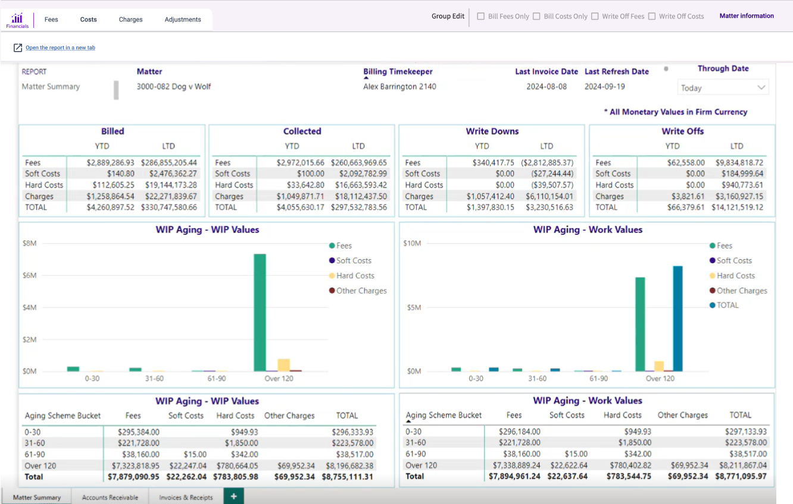

### **Proforma Details – Financials Tab**

The Financials tab displays a Data Insights report which provides financial information about the matter associated with the proforma including:

- Billing Timekeeper

- Last invoice date

- Billed YTD and LTD with fee/cost/charges breakdown

- Collected YTD and LTD with fee/cost/charges breakdown

- Write Downs YTD and LTD with fee/cost/charges breakdown

- Write Offs YTD and LTD with fee/cost/charges breakdown

- WIP Aging (WIP values and Work values) with fee/cost/charges breakdown

- Unallocated Amount

- Available BOA

- Available Trust

- AR Aging with fee/cost/charges breakdown

- AR Detail by Invoice Date & Number

- Available Funds by Effective Billing Timekeeper

- Invoice Detail by Invoice Date & Number

- Receipt Detail by Date & Invoice

- On the Invoices & Receipts section there are also three interactive settings to allow the user to choose which reports to display.

The report has an editable **Through Date** parameter. 

***All monetary values are displayed in Firm Currency.***

The report may be launched in a new browser tab for side-by-side viewing by clicking the **Open the report in a new tab** link.

 

**Prerequisites**

- The firm must have Data Insights 4.10 or higher installed.

- The stock Data Insights **3E Proforma Matter Summary** report must be configured in Data Insights.  For more information, see knowledge base article **E-22711:***Data Insights 4.10 Cloud Release Notes*.

- Users must have a PowerBI/Data Insights license to view the Financials tab.  If the user does not have a license, they will receive a warning message.

