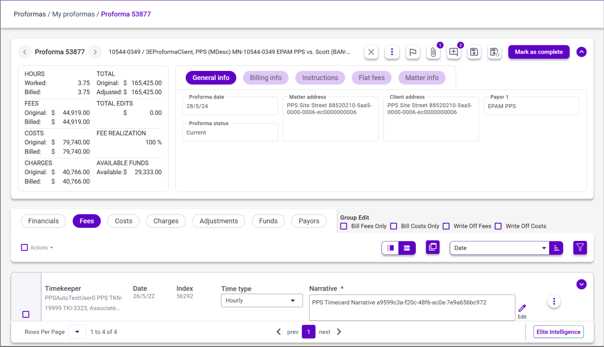

### **Proforma Details Parent Form**

**Note**: Depending on the proforma status and the user’s role on the proforma, the most relevant proforma action button is displayed. For example, for an approver, the **Approve** button is displayed).

<table style="width:100%;">
<colgroup>
<col style="width: 19%" />
<col style="width: 80%" />
</colgroup>
<thead>
<tr>
<th><strong>Field Name</strong></th>
<th><strong>Descriptions</strong></th>
</tr>
</thead>
<tbody>
<tr>
<td colspan="2"><strong>Action Bar</strong></td>
</tr>
<tr>
<td><strong>Next / Previous</strong></td>
<td>Click the Next or Previous arrows to navigate between proformas.</td>
</tr>
<tr>
<td>
<strong>Exit Proforma</strong>

</td>
<td>Click to close the proforma without saving changes.</td>
</tr>
<tr>
<td>
<strong>Attachments</strong>

</td>
<td>Click the Attachments icon to upload and attach files to the proforma. Additionally, you can add notes or print attachments. The number of attachments and notes added to the proforma displays by the Attachment icon.</td>
</tr>
<tr>
<td>
<strong>Add Comments</strong>

</td>
<td>Click to add a comment to the proforma. The total number of existing comments on a proforma will display on the icon.</td>
</tr>
<tr>
<td>
<strong>Save &amp; Close</strong>

</td>
<td>Click to save all edits made to the proforma and recalculate proforma totals. The Proforma Details view closes, returning you to the Proforma List view. The proforma is unlocked and becomes available to other users.</td>
</tr>
<tr>
<td>
<strong>Save &amp; Recalc</strong>

</td>
<td>Click to save all edits made to the proforma, recalculates proforma totals, and continue working in the Proforma Details view. The proforma remains locked and can be reviewed by other users in read-only view.</td>
</tr>
<tr>
<td><strong>Submit</strong></td>
<td>
Click this to submit the proforma to the Billing department. The proforma details page is closed, and the user is back to the proforma list in the category from which the proforma details were opened.

<strong>Note</strong>: This button only displays for a billing attorney
</td>
</tr>
<tr>
<td><strong>Mark as complete</strong></td>
<td>
Click when you have finished your edits. The proforma will move to your <strong>Completed Proformas</strong> list. You will then see a check mark in the <strong>C</strong> column in the <strong>Collaboration</strong> pop-up. The Proforma details page is closed, and you are returned back to the proforma list in the category from which the proforma details were opened.

<strong>Note</strong>: This button only displays for a regular timekeeper.
</td>
</tr>
<tr>
<td><strong>Reclaim</strong></td>
<td>
Click to return proformas back to the <strong>Needs Review</strong> list. The proforma moves from the Completed list/Approval pending to Needs review and the billing attorney can continue working on it

<strong>Note</strong>: This button only displays for a billing attorney on completed proforma.
</td>
</tr>
<tr>
<td><strong>Approve</strong></td>
<td>
Click to approve a proforma submitted by the billing attorney. The proforma moves to the Completed proformas list. The proforma details page is closed, and you are returned back to the proforma list.

<strong>Note</strong>: This button only displays for an approver.
</td>
</tr>
<tr>
<td>
<strong>Priority</strong>

</td>
<td>Click this icon flag, or unflag, a proforma as a priority, depending on its initial state. If the proforma was already set as priority, clicking the Priority icon un-marks the proforma as a priority. If the proforma was not a priority, clicking the Priority icon marks the proforma as a priority.</td>
</tr>
<tr>
<td>
<strong>Action Menu</strong>

</td>
<td>
Click to access action to perform on the proforma.

<strong>Note</strong>: The availability of actions (e.g., Add Costs, Add Fees, etc.) is determined by 3E user/role security. See <a href="../../Appendix-A---Proforma-Action-Availability-by-Role.md#appendix-a---proforma-action-availability-by-role">Appendix A - Proforma Action Availability by Role</a> for additional details.
</td>
</tr>
<tr>
<td colspan="2"><strong>Proforma Details</strong></td>
</tr>
<tr>
<td><strong>Hours worked / billed</strong></td>
<td>Displays hours worked and hours billed.</td>
</tr>
<tr>
<td><strong>Original fees /billed</strong></td>
<td>Displays original fees compared to billed fees.</td>
</tr>
<tr>
<td><strong>Total / adj total</strong></td>
<td>Displays original total amount compared to the adjusted totals amount.</td>
</tr>
<tr>
<td><strong>Available funds</strong></td>
<td>Displays the amount of available funds.</td>
</tr>
<tr>
<td><strong>Total edits</strong></td>
<td>Displays the total edit value.</td>
</tr>
<tr>
<td><strong>Original costs / billed</strong></td>
<td>Displays the original costs compared to the billed costs.</td>
</tr>
<tr>
<td><strong>Original charges / billed</strong></td>
<td>Displays the original charges compared to the billed charges.</td>
</tr>
<tr>
<td><strong>Est. fee realization</strong></td>
<td>Displays the estimated fee realization.</td>
</tr>
<tr>
<td><strong>Profit Margin Ratio</strong></td>
<td>
These values enable you to view both the original matter-level margin at proforma generation and the adjusted margin as edits are made. The values update when <strong>Save</strong> &amp; <strong>Recalc</strong> are selected, providing immediate feedback on how fee changes impact profitability during proforma review.

The ratios are calculated based on fees only (excluding costs, charges, and WIP) and are displayed as percentages with one decimal place, including standardized formatting for negative values. Ratios are comparing actual vs Reference Rate.

<strong>Note</strong>: These values only display when the <strong>ProfDetails_Show_Profit_Margin_Ratios</strong>​ system option is enabled. See <a href="../../Overrides-and-System-Options/3E-Proforma-Security-System-Options-List.md#3e-proforma-security-system-options-list">3E Proforma Security System Options List</a> for details.

<strong>Ratio Values</strong>

When enabled, the Proforma header displays the following two values:

<ul>
<li>
<strong>Original Profit Margin Ratio</strong> – Calculated when the proforma is generated and does not change.
</li>
<li>
<strong>Adjusted Profit Margin Ratio</strong> – Updated when edits are made and recalculated using Save &amp; Recalc.
</li>
</ul>

<strong>Calculations</strong>:

The ratios are calculated based on fees only (excluding costs, charges, and WIP) and are displayed as percentages with one decimal place, including standardized formatting for negative values. Ratios are comparing actual vs Reference Rate.

<ul>
<li>
<strong>Original Ratio</strong>: <em>((Total Fees Billed Amount - Total Fees Reference Amount + Total Proforma Original Fees - Total Proforma Fees Reference Amount) / (Matter Billed Fees + Proforma Original Fees)) * 100</em>
</li>
</ul>

<strong>Note</strong>: The Original ratio percentage is the value when the proforma is generated, it is point in time and will not update.

<ul>
<li>
<strong>Adjusted Ratio</strong>: <em>((Total Fees Billed Amount - Total Fees Reference Amount + Proforma Billed Fees - Proforma Fees Reference Amount) / (Matter Billed Fees + Proforma Billed Fees)) * 100</em>
</li>
</ul></td>
</tr>
<tr>
<td colspan="2"><strong>General info</strong></td>
</tr>
<tr>
<td><strong>Proforma Date</strong></td>
<td>Displays the date of the proforma.</td>
</tr>
<tr>
<td><strong>Proforma Status</strong></td>
<td>Displays the current status of the proforma record.</td>
</tr>
<tr>
<td><strong>Matter address</strong></td>
<td>Displays the matter address.</td>
</tr>
<tr>
<td><strong>Client address</strong></td>
<td>Displays the client's address.</td>
</tr>
<tr>
<td><strong>Payor</strong></td>
<td>Displays the payor name.</td>
</tr>
<tr>
<td><strong>Exclude from proforma group</strong></td>
<td>Select this check box to exclude the Matters proforma from a group so that it can be invoiced separately. This option displays only if the Bill Group proformas are generated as individual proformas, not as one large proforma for all Matters in the Bill Group.</td>
</tr>
<tr>
<td colspan="2"><strong>Billing info</strong></td>
</tr>
<tr>
<td><strong>Billing group</strong></td>
<td>Displays the name of the bill group.</td>
</tr>
<tr>
<td><strong>Bill Template</strong></td>
<td>Displays the bill template used to print the bill.</td>
</tr>
<tr>
<td><strong>Billing Frequency</strong></td>
<td>The billing frequency for the matter.</td>
</tr>
<tr>
<td><strong>Bill arrangement</strong></td>
<td>Displays details on the bill arrangement.</td>
</tr>
<tr>
<td><strong>Billing Timekeeper</strong></td>
<td>Displays the name of the Billing Timekeeper associated with the proforma.</td>
</tr>
<tr>
<td><strong>Responsible Timekeeper</strong></td>
<td>Displays the name of the Responsible Timekeeper associated with the proforma.</td>
</tr>
<tr>
<td><strong>Supervising Timekeeper</strong></td>
<td>Displays the name of the Supervising Timekeeper associated with the proforma.</td>
</tr>
<tr>
<td><strong>E-Billing</strong></td>
<td>Select this check box to indicate that e-bills should be generated for this matter.</td>
</tr>
<tr>
<td><strong>Email Bill to</strong></td>
<td>Displays the name of the recipient to which the bill will be emailed.</td>
</tr>
<tr>
<td><strong>Payment Terms</strong></td>
<td>Displays the payment terms for the matter.</td>
</tr>
<tr>
<td colspan="2"><strong>Instructions</strong></td>
</tr>
<tr>
<td><strong>Client billing instructions</strong></td>
<td>Displays client billing instructions.</td>
</tr>
<tr>
<td><strong>Matter billing instructions</strong></td>
<td>Displays matter billing instruction.</td>
</tr>
<tr>
<td><strong>Instructions</strong></td>
<td>
Displays internal proforma instructions for the Biller to follow.

<strong>Note</strong>: This field display edited text in red. This enables you to determine if the instructions have been changed
</td>
</tr>
<tr>
<td colspan="2"><strong>Flat fees</strong></td>
</tr>
<tr>
<td><strong>Time Type</strong></td>
<td>Displays the fee type.</td>
</tr>
<tr>
<td><strong>Start Date</strong></td>
<td>Displays the effective date for the flat fee.</td>
</tr>
<tr>
<td><strong>End Data</strong></td>
<td>Displays the date the flat fee expires.</td>
</tr>
<tr>
<td><strong>Amount</strong></td>
<td>Displays the amount of the flat fee.</td>
</tr>
<tr>
<td><strong>Currency</strong></td>
<td>Displays the currency of the flat fee.</td>
</tr>
<tr>
<td colspan="2"><strong>Matter info</strong></td>
</tr>
<tr>
<td><strong>Matter Number</strong></td>
<td>The unique number of the matter associated with the proforma.</td>
</tr>
<tr>
<td><strong>Matter Status</strong></td>
<td>Displays the matter's status.</td>
</tr>
<tr>
<td><strong>Practice Group</strong></td>
<td>Displays the matter's practice group.</td>
</tr>
<tr>
<td><strong>Department Code</strong></td>
<td>Display's the code of the matter's department.</td>
</tr>
<tr>
<td><strong>Matter Currency</strong></td>
<td>Displays the currency used by the matter.</td>
</tr>
<tr>
<td><strong>Time through</strong></td>
<td>The matter includes time cards through this date.</td>
</tr>
<tr>
<td><strong>Cost through</strong></td>
<td>The matter includes cost cards through this date.</td>
</tr>
<tr>
<td><strong>Charges through</strong></td>
<td>The matter includes charge cards through this date.</td>
</tr>
<tr>
<td><strong>Matter rate</strong></td>
<td>Descriptive detail of the matter's rate code.</td>
</tr>
<tr>
<td><strong>Matter rate exceptions</strong></td>
<td>Displays the rate of the rate exception.</td>
</tr>
<tr>
<td colspan="2"><strong>Group Edit</strong></td>
</tr>
<tr>
<td><strong>Bill Fees Only</strong></td>
<td>Select this check box to exclude all costs and charges.</td>
</tr>
<tr>
<td><strong>Bill Costs Only</strong></td>
<td>Select this check box to exclude all fees and charges.</td>
</tr>
<tr>
<td><strong>Write Off Fees</strong></td>
<td>
Select this check box to write off all fee cards. The individual cards will be updated in Proforma Details.  If this check box is deselected, all the fee cards will have the write off removed and reset to the original status.

<strong>Note</strong>: The 3E role <strong>3EProformaWriteOffRole</strong> must be assigned to 3E Proforma users that need to access this option. If the role is not assigned to the user, the Write Off Fees field will be hidden.
</td>
</tr>
<tr>
<td><strong>Write Off Costs</strong></td>
<td>
Group Edits checkbox for Write Off Fees and/or Write off Costs.  When checked, all cards of that type will be written off and the individual cards will be updated in Proforma Details.  If the box is subsequently unchecked, all the cards of that type will have the write off removed and reset to the original status.

<strong>Note</strong>: The 3E role <strong>3EProformaWriteOffRole</strong> must be assigned to 3E Proforma users that need to access this option. If the role is not assigned to the user, the Write Off Costs field will be hidden.
</td>
</tr>
<tr>
<td><strong>Matter information</strong></td>
<td>
Click this link to view matter information. This information displays in a pop-up window

The following general information about the proforma is displayed:

<ul>
<li>
Matter number
</li>
<li>
Proforma date
</li>
<li>
Time through
</li>
<li>
Cost through
</li>
<li>
Charges through
</li>
<li>
Billing group
</li>
<li>
Bill template
</li>
<li>
Matter currency
</li>
<li>
Billing timekeeper
</li>
<li>
Responsible timekeeper
</li>
<li>
Supervisor timekeeper
</li>
</ul></td>
</tr>
</tbody>
</table>

 

