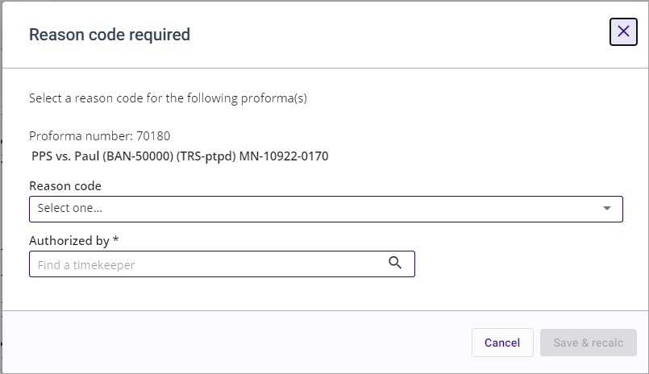

## Reason Code Requested

When you update numeric data and click any of the following actions that save proforma edits, the **Reason code required** pop-up will display.

**Note:** A reason code is required when the 3E System Option **Require_Reason_Code** is set to True.

- Save & recalc

- Save & close

- Submit

- Mark as complete

- Save changes

Do the following when prompted for a reason code:

1.  Make a selection from the **Reason code** drop-down list.

2.  Specify an Authorizing Timekeeper from the **Authorized by** field.

3.  Click **Save & Recalc**. The reason code will be saved in the system for fee, cost, and charges on the proforma. Further saving of proforma edits will not prompt for a reason code.

 

