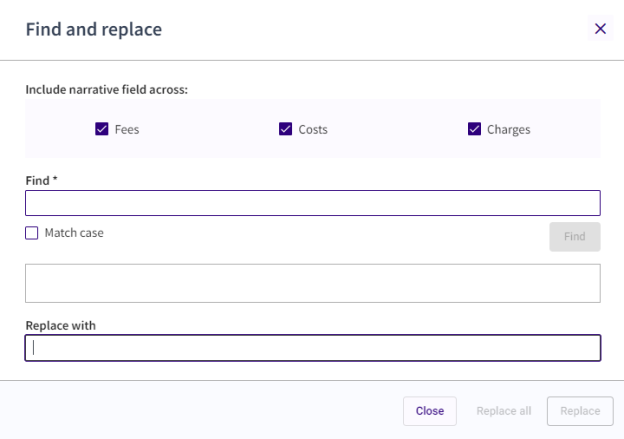

### **Find and Replace**

Do the following to search and replace words or phrases throughout the proforma.

1.  Locate a proforma in the Proforma List view and click its proforma number to open it in Proforma Detail view.

2.  Click t the Proforma-level Action menu and select **Find and Replace**.

3.  Select (or deselect) the check box(es) for the tabs that you want to search. All tabs are selected by default.

4.  Enter the word or phrase you are searching for in the **Find** text box.

5.  Click the **Find** button. All results are displayed in the text box below.

6.  Enter the word or phrase to replace the found word or phrase in the **Replace With** text box.

7.  Select the **Match Case** check box if you want to search only for words that match the case of the words entered in the Find text box. For example, if you search for “phone call,” and you select the Match Case check box, then the phrase “Phone call” will not be replaced. However, if you search for “phone call” and you do **not** select the Match Case check box, then “Phone call” will be replaced.

8.  Do one of the following:

- Click the **Replace All** button to replace all occurrences of the word or phrase. A message indicates how many instances of the word or phrase were replaced, if any.

- Click the **Replace** button to replace the current occurrence of the word or phrase. The word or phrase is replaced, and the next occurrence of the word or phrase is displayed.

10. Click the **Close** button.

