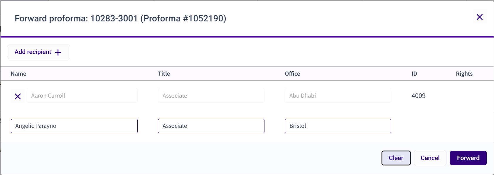

## Forward Proforma

3E Proforma provides the ability to forward proformas to other users. This feature leverages the [<u>collaboration mechanism</u>](../Collaboration.md#collaboration) and offers a simplified process (for proforma ‘owners’ and user with ‘full’ rights) for sending a proforma to one or more users.

Do the following forward a proforma:

1.  Locate the proforma in the Proforma list.

2.  Select **Forward** from the proforma-level **Action** menu.

**Note**: This task can also be initiated in the [<u>Proforma Details view</u>](../Getting-Started/Navigating-3E-Proforma---Walkthrough/Navigating-the-Proforma-Detail-View.md#navigating-the-proforma-detail-view). You can also forward a batch of proformas from the Proforma List view. See [Batch Processing Proforma Actions](Batch-Processing-Proforma-Actions.md#batch-processing-proforma-actions) for details.

**Note:** If a user who has the proforma opened, and therefore locked, forwards the proforma while in Proforma Detail view, any unsaved changes are automatically saved. In any other cases the changes are not saved.

2.  Click the **Add recipient** button.

3.  Type the name of the user to whom you want to forward the proforma.

4.  Click the **Forward** button. A confirmation message will display.

 

**Points to remember:**

- In the Proforma list the Forwarded icon display on the proforma and shows the number of users to whom proforma was forwarded. Hover the mouse over this indicator to see a tooltip listing the timekeepers to whom the proforma was forwarded.

- When a working timekeeper forwards the proforma, the proforma is marked as Complete and moved to the **Completed** list for that timekeeper.

- If the proforma owner (billing attorney) forwards the proforma, the proforma remains in the **My Proforma** and the **In Review** list.

- The proforma displays in the **My proformas** and **Needs review** lists of the user to whom the proforma was forwarded.

- The user to whom the proforma was forwarded displays at the second position in the Collaborators pop-up.

- In the [<u>Collaborators list</u>](../Collaboration/Collaborator-List-Form-and-Field-Definitions.md#collaborator-list-form-and-field-definitions), a check displays in the Complete column for the user who forwarded the proforma.

