- [Overview](#overview)
  - [About 3E Proforma](#about-3e-proforma)
  - [Standard Proforma Processing Without the Paper Chase](#standard-proforma-processing-without-the-paper-chase)
  - [Traditional Proforma Workflow](#traditional-proforma-workflow)
  - [3E Proforma Workflow](#e-proforma-workflow)
  - [Advantages of 3E Proforma](#advantages-of-3e-proforma)
- [Getting Started ](#getting-started)
  - [Accessing 3E Proforma](#accessing-3e-proforma)
    - [**Exit 3E Proforma**](#exit-3e-proforma)
  - [Working As Another User](#working-as-another-user)
  - [Navigating 3E Proforma - Walkthrough](#navigating-3e-proforma---walkthrough)
    - [**Navigating the Proforma List**](#navigating-the-proforma-list)
    - [**Navigating the Proforma Detail View**](#navigating-the-proforma-detail-view)
    - [**Side Navigation Menu**](#side-navigation-menu)
    - [**Global Toolbar**](#global-toolbar)
    - [**Paging Bar**](#paging-bar)
    - [**Icon Legend**](#icon-legend)
  - [Standard Features and Navigation](#standard-features-and-navigation)
    - [**Standard Features and Navigation**](#standard-features-and-navigation-1)
    - [**Filters**](#filters-1)
    - [**Lists**](#lists)
    - [**Entering Codes**](#entering-codes)
    - [**Card Narrative Fields**](#card-narrative-fields)
    - [**Edit-Level Tracking**](#edit-level-tracking)
    - [**AI Inquiry**](#ai-inquiry)
- [3E Proforma Settings](#e-proforma-settings)
  - [About Settings](#about-settings)
  - [Settings Form and Field Definitions](#settings-form-and-field-definitions)
    - [**User Settings**](#user-settings)
    - [**Firm Tab**](#firm-tab)
    - [**System Options**](#system-options)
- [Proforma List View](#proforma-list-view)
  - [About Proforma List View](#about-proforma-list-view)
  - [Proforma Lists Form and Field Definitions](#proforma-lists-form-and-field-definitions)
- [Proforma Detail View](#proforma-detail-view)
  - [About Proforma Details](#about-proforma-details)
  - [Proforma Details Form and Field Definitions](#proforma-details-form-and-field-definitions)
    - [**Proforma Details Parent Form**](#proforma-details-parent-form)
    - [**Proforma Details – Financials Tab**](#proforma-details-financials-tab)
    - [**Proforma Details – Fees Tab**](#proforma-details-fees-tab)
    - [**Proforma Details – Costs Tab**](#proforma-details-costs-tab)
    - [**Proforma Details - Charges Tab**](#proforma-details---charges-tab)
    - [**Proforma Details – Adjustments Tab**](#proforma-details-adjustments-tab)
    - [**Proforma Details – Funds Tab**](#proforma-details-funds-tab)
    - [**Proforma Details – Payors Tab**](#proforma-details-payors-tab)
    - [**Proforma Details – Billing Contacts Tab**](#proforma-details-billing-contacts-tab)
  - [Exiting Proforma Detail View](#exiting-proforma-detail-view)
  - [Reason Code Requested](#reason-code-requested)
  - [Add Proforma Instructions](#add-proforma-instructions)
  - [Add Invoice Narrative](#add-invoice-narrative)
  - [Approve or Reject Proformas](#approve-or-reject-proformas)
    - [**Approve Proforma**](#approve-proforma)
    - [**Reject Proforma**](#reject-proforma)
  - [Reclaim Proforma](#reclaim-proforma)
  - [Add Fees](#add-fees)
    - [**About Add Fees**](#about-add-fees)
    - [**Add Fee Card to Proforma**](#add-fee-card-to-proforma)
    - [**Add Fee Form and Field Definitions**](#add-fee-form-and-field-definitions)
  - [Add Costs](#add-costs)
    - [**About Add Cost**](#about-add-cost)
    - [**Add Cost to Proforma**](#add-cost-to-proforma)
    - [**Add Cost Form and Field Definitions**](#add-cost-form-and-field-definitions)
  - [Managing Cards](#managing-cards)
    - [**Exclude Cards**](#exclude-cards)
    - [**Transfer Cards**](#transfer-cards)
    - [**Change Card Status to No Charge**](#change-card-status-to-no-charge)
    - [**Set Card Status to Bill No Print**](#set-card-status-to-bill-no-print)
    - [**Update Card Purge Type**](#update-card-purge-type)
    - [**Combine Cards**](#combine-cards)
    - [**Divide Entries**](#divide-entries)
    - [**Flag Card as Non-billable**](#flag-card-as-non-billable)
    - [**Write Down a Card**](#write-down-a-card)
  - [Managing Funds](#managing-funds)
    - [**Apply Funds**](#apply-funds)
    - [**Remove Applied Funds**](#remove-applied-funds)
  - [Group Edit](#group-edit)
    - [**Bill Fees or Costs Only**](#bill-fees-or-costs-only)
    - [**Write Offs**](#write-offs)
  - [Adjustments](#adjustments)
    - [**About Adjustments**](#about-adjustments)
    - [**Add Adjustments**](#add-adjustments)
    - [**Add Adjustment Form and Field Definitions**](#add-adjustment-form-and-field-definitions)
  - [Include Late Cards in Proforma](#include-late-cards-in-proforma)
  - [View Proforma Edit History](#view-proforma-edit-history)
  - [Tools](#tools)
    - [**Find and Replace**](#find-and-replace)
    - [**Spell Check**](#spell-check)
- [Proforma Tasks](#proforma-tasks)
  - [Set Proforma Priority Status](#set-proforma-priority-status)
  - [Add Proforma Comments](#add-proforma-comments)
  - [Viewing Proforma Level Comments](#viewing-proforma-level-comments)
    - [**View Comments in 3E Proforma**](#view-comments-in-3e-proforma)
    - [**View Comments in 3E**](#view-comments-in-3e)
  - [Completing a Proforma](#completing-a-proforma)
  - [Forward Proforma](#forward-proforma)
  - [Submit Proforma for Review](#submit-proforma-for-review)
    - [**Submitting Billing Group Proformas**](#submitting-billing-group-proformas)
  - [Defer Proforma](#defer-proforma)
  - [Print Proforma](#print-proforma)
  - [View Bill Preview](#view-bill-preview)
  - [Batch Processing Proforma Actions](#batch-processing-proforma-actions)
- [Proforma Tracking](#proforma-tracking)
  - [About Proforma Tracking](#about-proforma-tracking)
  - [Tracking Proformas](#tracking-proformas)
  - [Proforma Tracking Form and Field Definitions](#proforma-tracking-form-and-field-definitions)
    - [**Tracking Proformas by Client, Matter, or Timekeeper**](#tracking-proformas-by-client-matter-or-timekeeper)
    - [**Tracking Proforma by Number**](#tracking-proforma-by-number)
- [Collaboration](#collaboration)
  - [About Collaborator List](#about-collaborator-list)
  - [Manage Proforma Collaborators](#manage-proforma-collaborators)
  - [Assign Co-owner to Proforma](#assign-co-owner-to-proforma)
    - [**STEP 1: Designate a Co-owner in 3E Cloud**](#step-1-designate-a-co-owner-in-3e-cloud)
    - [**STEP 2: Assign Co-owner Rights in 3E Proforma**](#step-2-assign-co-owner-rights-in-3e-proforma)
    - [**STEP 3: Update 3E Proforma Workflow Steps in 3E Cloud**](#step-3-update-3e-proforma-workflow-steps-in-3e-cloud)
  - [Collaborator List Form and Field Definitions](#collaborator-list-form-and-field-definitions)
- [Attachments](#attachments)
  - [About Attachments](#about-attachments)
  - [Add Attachment to Proforma](#add-attachment-to-proforma)
  - [Add Note to Proforma](#add-note-to-proforma)
  - [Attachments Form and Field Definitions](#attachments-form-and-field-definitions)
- [WIP List](#wip-list)
  - [About WIP List](#about-wip-list)
  - [Generate Proformas](#generate-proformas)
    - [**About Proforma Generation**](#about-proforma-generation)
    - [**Generate Proformas**](#generate-proformas-1)
    - [**Proforma Generation Form and Field Definitions**](#proforma-generation-form-and-field-definitions)
  - [WIP List Form and Field Definitions](#wip-list-form-and-field-definitions)
- [Archived Proformas](#archived-proformas)
  - [About Archived Proformas](#about-archived-proformas)
  - [Browse Archived Proformas](#browse-archived-proformas)
  - [Archived Proformas Form and Field Definitions](#archived-proformas-form-and-field-definitions)
- [Overrides and System Options](#overrides-and-system-options)
  - [3E Proforma System Options](#e-proforma-system-options)
    - [**Workflow Config specific settings under 3E Proforma group**](#workflow-config-specific-settings-under-3e-proforma-group)
  - [3E Proforma Security System Options List](#e-proforma-security-system-options-list)
  - [AI Overrides and System Options](#ai-overrides-and-system-options)
- [Appendix A - Proforma Action Availability by Role](#appendix-a---proforma-action-availability-by-role)
  - [Timekeepers (Proforma Editors)](#timekeepers-proforma-editors)
    - [**My proformas**](#my-proformas)
    - [**Needs review**](#needs-review)
    - [**In review**](#in-review)
    - [**Urgent**](#urgent)
    - [**Completed Proformas**](#completed-proformas)
  - [Billing Attorneys (proforma owners)](#billing-attorneys-proforma-owners)
    - [**My proformas**](#my-proformas-1)
    - [**Needs review**](#needs-review-1)
    - [**In review**](#in-review-1)
    - [**Approval pending**](#approval-pending)
    - [**Urgent**](#urgent-1)
    - [**Completed proformas**](#completed-proformas-1)
  - [Approvers ](#approvers)
    - [**My proformas**](#my-proformas-2)
    - [**Needs review** ](#needs-review-2)
    - [**In review** ](#in-review-2)
    - [**Urgent** ](#urgent-2)
    - [**Completed proformas**](#completed-proformas-2)
- [Glossary](#glossary)

Product Name

\<Version No.\> \<Guide Type\>

Updated January 15, 2024

 

Copyright Information

© 2025 Elite business. All rights reserved. Proprietary and confidential information of Elite. Disclosure, use or reproduction without the written authorization of Elite is prohibited.

Windows and Microsoft Word are trademarks of Microsoft Corporation. All other brand or product names are trademarks or registered.

**Contents**

[Overview [1](#overview)](#overview)

[About 3E Proforma [1](#about-3e-proforma)](#about-3e-proforma)

[Standard Proforma Processing Without the Paper Chase [1](#standard-proforma-processing-without-the-paper-chase)](#standard-proforma-processing-without-the-paper-chase)

[Traditional Proforma Workflow [1](#traditional-proforma-workflow)](#traditional-proforma-workflow)

[3E Proforma Workflow [2](#e-proforma-workflow)](#e-proforma-workflow)

[Advantages of 3E Proforma [2](#advantages-of-3e-proforma)](#advantages-of-3e-proforma)

[Getting Started [3](#getting-started)](#getting-started)

[Accessing 3E Proforma [3](#accessing-3e-proforma)](#accessing-3e-proforma)

[Exit 3E Proforma [3](#exit-3e-proforma)](#exit-3e-proforma)

[Working As Another User [3](#working-as-another-user)](#working-as-another-user)

[Navigating 3E Proforma - Walkthrough [4](#navigating-3e-proforma---walkthrough)](#navigating-3e-proforma---walkthrough)

[Navigating the Proforma List [4](#navigating-the-proforma-list)](#navigating-the-proforma-list)

[Categories [4](#categories)](#categories)

[Action Menus [4](#action-menus)](#action-menus)

[Filters [5](#filters)](#filters)

[Search [5](#search)](#search)

[Sort [5](#sort)](#sort)

[Paging [5](#paging)](#paging)

[Navigating the Proforma Detail View [5](#navigating-the-proforma-detail-view)](#navigating-the-proforma-detail-view)

[Side Navigation Menu [7](#side-navigation-menu)](#side-navigation-menu)

[Global Toolbar [9](#global-toolbar)](#global-toolbar)

[Working As [10](#working-as)](#working-as)

[Notifications [10](#notifications)](#notifications)

[Resource Center [10](#resource-center)](#resource-center)

[Paging Bar [10](#paging-bar)](#paging-bar)

[Icon Legend [11](#icon-legend)](#icon-legend)

[Grid Icon Legend [12](#grid-icon-legend)](#grid-icon-legend)

[Standard Features and Navigation [13](#standard-features-and-navigation)](#standard-features-and-navigation)

[Standard Features and Navigation [13](#standard-features-and-navigation-1)](#standard-features-and-navigation-1)

[Filters [14](#filters-1)](#filters-1)

[Accessing filters [14](#accessing-filters)](#accessing-filters)

[Specifying and Applying filter criteria [15](#specifying-and-applying-filter-criteria)](#specifying-and-applying-filter-criteria)

[Filtering numeric fields [15](#filtering-numeric-fields)](#filtering-numeric-fields)

[Clearing filters [15](#clearing-filters)](#clearing-filters)

[Filter Criteria [16](#filter-criteria)](#filter-criteria)

[Lists [18](#lists)](#lists)

[Navigating Lists in 3E Proforma [18](#navigating-lists-in-3e-proforma)](#navigating-lists-in-3e-proforma)

[List View Types [19](#list-view-types)](#list-view-types)

[Selecting Card or Grid View [19](#selecting-card-or-grid-view)](#selecting-card-or-grid-view)

[Proforma List - Card vs Grid View [19](#proforma-list---card-vs-grid-view)](#proforma-list---card-vs-grid-view)

[Proforma Details View - Card vs. Grid View [20](#proforma-details-view---card-vs.-grid-view)](#proforma-details-view---card-vs.-grid-view)

[Grid Column Settings [21](#grid-column-settings)](#grid-column-settings)

[Access column Settings [21](#access-column-settings)](#access-column-settings)

[Column Settings [22](#column-settings)](#column-settings)

[Grid Column Display Options [22](#grid-column-display-options)](#grid-column-display-options)

[Move Grid Columns [23](#move-grid-columns)](#move-grid-columns)

[Group List Items [24](#group-list-items)](#group-list-items)

[Grouping [24](#grouping)](#grouping)

[Grouped view [24](#grouped-view)](#grouped-view)

[Grouped view - expanded [25](#grouped-view---expanded)](#grouped-view---expanded)

[Filter and Sort List Items [25](#filter-and-sort-list-items)](#filter-and-sort-list-items)

[Filter List [25](#filter-list)](#filter-list)

[Sort List [26](#sort-list)](#sort-list)

[Entering Codes [26](#entering-codes)](#entering-codes)

[Card Narrative Fields [26](#card-narrative-fields)](#card-narrative-fields)

[Card View [26](#card-view)](#card-view)

[Grid View [27](#grid-view)](#grid-view)

[View Edit History [27](#view-edit-history)](#view-edit-history)

[Narrative Form [27](#narrative-form)](#narrative-form)

[Edit-Level Tracking [28](#edit-level-tracking)](#edit-level-tracking)

[AI Inquiry [29](#ai-inquiry)](#ai-inquiry)

[Elite Intelligence [29](#elite-intelligence)](#elite-intelligence)

[Delegate Tasks with AI for Proforma [30](#delegate-tasks-with-ai-for-proforma)](#delegate-tasks-with-ai-for-proforma)

[Available Actions [31](#available-actions)](#available-actions)

[AI for Proforma - Stock Prompt Library [34](#ai-for-proforma---stock-prompt-library)](#ai-for-proforma---stock-prompt-library)

[3E Proforma Settings [35](#e-proforma-settings)](#e-proforma-settings)

[About Settings [35](#about-settings)](#about-settings)

[Settings Form and Field Definitions [35](#settings-form-and-field-definitions)](#settings-form-and-field-definitions)

[User Settings [35](#user-settings)](#user-settings)

[Firm Tab [36](#firm-tab)](#firm-tab)

[System Options [38](#system-options)](#system-options)

[Proforma List View [40](#proforma-list-view)](#proforma-list-view)

[About Proforma List View [40](#about-proforma-list-view)](#about-proforma-list-view)

[Proforma Lists Form and Field Definitions [40](#proforma-lists-form-and-field-definitions)](#proforma-lists-form-and-field-definitions)

[Proforma Detail View [46](#proforma-detail-view)](#proforma-detail-view)

[About Proforma Details [46](#about-proforma-details)](#about-proforma-details)

[Proforma Details Form and Field Definitions [46](#proforma-details-form-and-field-definitions)](#proforma-details-form-and-field-definitions)

[Proforma Details Parent Form [46](#proforma-details-parent-form)](#proforma-details-parent-form)

[Proforma Details – Financials Tab [54](#proforma-details-financials-tab)](#proforma-details-financials-tab)

[Proforma Details – Fees Tab [55](#proforma-details-fees-tab)](#proforma-details-fees-tab)

[Proforma Details – Costs Tab [58](#proforma-details-costs-tab)](#proforma-details-costs-tab)

[Proforma Details - Charges Tab [59](#proforma-details---charges-tab)](#proforma-details---charges-tab)

[Proforma Details – Adjustments Tab [61](#proforma-details-adjustments-tab)](#proforma-details-adjustments-tab)

[Proforma Details – Funds Tab [62](#proforma-details-funds-tab)](#proforma-details-funds-tab)

[Proforma Details – Payors Tab [66](#proforma-details-payors-tab)](#proforma-details-payors-tab)

[Proforma Details – Billing Contacts Tab [68](#proforma-details-billing-contacts-tab)](#proforma-details-billing-contacts-tab)

[Exiting Proforma Detail View [69](#exiting-proforma-detail-view)](#exiting-proforma-detail-view)

[Reason Code Requested [69](#reason-code-requested)](#reason-code-requested)

[Add Proforma Instructions [70](#add-proforma-instructions)](#add-proforma-instructions)

[Add Invoice Narrative [70](#add-invoice-narrative)](#add-invoice-narrative)

[Approve or Reject Proformas [71](#approve-or-reject-proformas)](#approve-or-reject-proformas)

[Approve Proforma [71](#approve-proforma)](#approve-proforma)

[Reject Proforma [71](#reject-proforma)](#reject-proforma)

[Reclaim Proforma [71](#reclaim-proforma)](#reclaim-proforma)

[Add Fees [72](#add-fees)](#add-fees)

[About Add Fees [72](#about-add-fees)](#about-add-fees)

[Add Fee Card to Proforma [72](#add-fee-card-to-proforma)](#add-fee-card-to-proforma)

[Add Fee Form and Field Definitions [73](#add-fee-form-and-field-definitions)](#add-fee-form-and-field-definitions)

[Add Costs [76](#add-costs)](#add-costs)

[About Add Cost [76](#about-add-cost)](#about-add-cost)

[Add Cost to Proforma [76](#add-cost-to-proforma)](#add-cost-to-proforma)

[Add Cost Form and Field Definitions [77](#add-cost-form-and-field-definitions)](#add-cost-form-and-field-definitions)

[Managing Cards [80](#managing-cards)](#managing-cards)

[Exclude Cards [80](#exclude-cards)](#exclude-cards)

[Transfer Cards [81](#transfer-cards)](#transfer-cards)

[Change Card Status to No Charge [81](#change-card-status-to-no-charge)](#change-card-status-to-no-charge)

[Set Card Status to Bill No Print [82](#set-card-status-to-bill-no-print)](#set-card-status-to-bill-no-print)

[Update Card Purge Type [83](#update-card-purge-type)](#update-card-purge-type)

[Combine Cards [83](#combine-cards)](#combine-cards)

[Divide Entries [84](#divide-entries)](#divide-entries)

[About Divide Cards [84](#about-divide-cards)](#about-divide-cards)

[Divide Cards [84](#divide-cards)](#divide-cards)

[Divide Card Form and Field Definitions [85](#divide-card-form-and-field-definitions)](#divide-card-form-and-field-definitions)

[Time Divide Form and Field Definitions [86](#time-divide-form-and-field-definitions)](#time-divide-form-and-field-definitions)

[Cost Divide Form and Field Definitions [89](#cost-divide-form-and-field-definitions)](#cost-divide-form-and-field-definitions)

[Charge Divide Form and Field Definitions [92](#charge-divide-form-and-field-definitions)](#charge-divide-form-and-field-definitions)

[Flag Card as Non-billable [94](#flag-card-as-non-billable)](#flag-card-as-non-billable)

[Write Down a Card [95](#write-down-a-card)](#write-down-a-card)

[Managing Funds [95](#managing-funds)](#managing-funds)

[Apply Funds [95](#apply-funds)](#apply-funds)

[Remove Applied Funds [96](#remove-applied-funds)](#remove-applied-funds)

[Group Edit [96](#group-edit)](#group-edit)

[Bill Fees or Costs Only [96](#bill-fees-or-costs-only)](#bill-fees-or-costs-only)

[Write Offs [97](#write-offs)](#write-offs)

[Adjustments [98](#adjustments)](#adjustments)

[About Adjustments [98](#about-adjustments)](#about-adjustments)

[Add Adjustments [98](#add-adjustments)](#add-adjustments)

[Add Adjustment Form and Field Definitions [99](#add-adjustment-form-and-field-definitions)](#add-adjustment-form-and-field-definitions)

[Include Late Cards in Proforma [101](#include-late-cards-in-proforma)](#include-late-cards-in-proforma)

[View Proforma Edit History [102](#view-proforma-edit-history)](#view-proforma-edit-history)

[Tools [103](#tools)](#tools)

[Find and Replace [103](#find-and-replace)](#find-and-replace)

[Spell Check [104](#spell-check)](#spell-check)

[About Spell Check [104](#about-spell-check)](#about-spell-check)

[Spell Check Proforma [104](#spell-check-proforma)](#spell-check-proforma)

[Spell Check Form and Field Definitions [104](#spell-check-form-and-field-definitions)](#spell-check-form-and-field-definitions)

[Proforma Tasks [107](#proforma-tasks)](#proforma-tasks)

[Set Proforma Priority Status [107](#set-proforma-priority-status)](#set-proforma-priority-status)

[Add Proforma Comments [107](#add-proforma-comments)](#add-proforma-comments)

[Viewing Proforma Level Comments [108](#viewing-proforma-level-comments)](#viewing-proforma-level-comments)

[View Comments in 3E Proforma [109](#view-comments-in-3e-proforma)](#view-comments-in-3e-proforma)

[View Comments in 3E [109](#view-comments-in-3e)](#view-comments-in-3e)

[Completing a Proforma [109](#completing-a-proforma)](#completing-a-proforma)

[Forward Proforma [110](#forward-proforma)](#forward-proforma)

[Submit Proforma for Review [111](#submit-proforma-for-review)](#submit-proforma-for-review)

[Submitting Billing Group Proformas [111](#submitting-billing-group-proformas)](#submitting-billing-group-proformas)

[Defer Proforma [111](#defer-proforma)](#defer-proforma)

[Print Proforma [112](#print-proforma)](#print-proforma)

[View Bill Preview [113](#view-bill-preview)](#view-bill-preview)

[Batch Processing Proforma Actions [114](#batch-processing-proforma-actions)](#batch-processing-proforma-actions)

[Proforma Tracking [115](#proforma-tracking)](#proforma-tracking)

[About Proforma Tracking [115](#about-proforma-tracking)](#about-proforma-tracking)

[Tracking Proformas [115](#tracking-proformas)](#tracking-proformas)

[Proforma Tracking Form and Field Definitions [121](#proforma-tracking-form-and-field-definitions)](#proforma-tracking-form-and-field-definitions)

[Tracking Proformas by Client, Matter, or Timekeeper [121](#tracking-proformas-by-client-matter-or-timekeeper)](#tracking-proformas-by-client-matter-or-timekeeper)

[Tracking Proforma by Number [124](#tracking-proforma-by-number)](#tracking-proforma-by-number)

[Collaboration [127](#collaboration)](#collaboration)

[About Collaborator List [127](#about-collaborator-list)](#about-collaborator-list)

[Manage Proforma Collaborators [127](#manage-proforma-collaborators)](#manage-proforma-collaborators)

[Assign Co-owner to Proforma [128](#assign-co-owner-to-proforma)](#assign-co-owner-to-proforma)

[STEP 1: Designate a Co-owner in 3E Cloud [128](#step-1-designate-a-co-owner-in-3e-cloud)](#step-1-designate-a-co-owner-in-3e-cloud)

[STEP 2: Assign Co-owner Rights in 3E Proforma [129](#step-2-assign-co-owner-rights-in-3e-proforma)](#step-2-assign-co-owner-rights-in-3e-proforma)

[STEP 3: Update 3E Proforma Workflow Steps in 3E Cloud [130](#step-3-update-3e-proforma-workflow-steps-in-3e-cloud)](#step-3-update-3e-proforma-workflow-steps-in-3e-cloud)

[Collaborator List Form and Field Definitions [131](#collaborator-list-form-and-field-definitions)](#collaborator-list-form-and-field-definitions)

[Attachments [134](#attachments)](#attachments)

[About Attachments [134](#about-attachments)](#about-attachments)

[Add Attachment to Proforma [134](#add-attachment-to-proforma)](#add-attachment-to-proforma)

[Add Note to Proforma [134](#add-note-to-proforma)](#add-note-to-proforma)

[Attachments Form and Field Definitions [134](#attachments-form-and-field-definitions)](#attachments-form-and-field-definitions)

[WIP List [138](#wip-list)](#wip-list)

[About WIP List [138](#about-wip-list)](#about-wip-list)

[Generate Proformas [138](#generate-proformas)](#generate-proformas)

[About Proforma Generation [138](#about-proforma-generation)](#about-proforma-generation)

[Generate Proformas [138](#generate-proformas-1)](#generate-proformas-1)

[Proforma Generation Form and Field Definitions [139](#proforma-generation-form-and-field-definitions)](#proforma-generation-form-and-field-definitions)

[WIP List Form and Field Definitions [142](#wip-list-form-and-field-definitions)](#wip-list-form-and-field-definitions)

[Archived Proformas [145](#archived-proformas)](#archived-proformas)

[About Archived Proformas [145](#about-archived-proformas)](#about-archived-proformas)

[Browse Archived Proformas [145](#browse-archived-proformas)](#browse-archived-proformas)

[Archived Proformas Form and Field Definitions [145](#archived-proformas-form-and-field-definitions)](#archived-proformas-form-and-field-definitions)

[Overrides and System Options [148](#overrides-and-system-options)](#overrides-and-system-options)

[3E Proforma System Options [148](#e-proforma-system-options)](#e-proforma-system-options)

[Workflow Config specific settings under 3E Proforma group [158](#workflow-config-specific-settings-under-3e-proforma-group)](#workflow-config-specific-settings-under-3e-proforma-group)

[3E Proforma Security System Options List [161](#e-proforma-security-system-options-list)](#e-proforma-security-system-options-list)

[AI Overrides and System Options [194](#ai-overrides-and-system-options)](#ai-overrides-and-system-options)

[Appendix A - Proforma Action Availability by Role [195](#appendix-a---proforma-action-availability-by-role)](#appendix-a---proforma-action-availability-by-role)

[Timekeepers (Proforma Editors) [195](#timekeepers-proforma-editors)](#timekeepers-proforma-editors)

[My proformas [195](#my-proformas)](#my-proformas)

[Needs review [196](#needs-review)](#needs-review)

[In review [196](#in-review)](#in-review)

[Urgent [197](#urgent)](#urgent)

[Completed Proformas [197](#completed-proformas)](#completed-proformas)

[Billing Attorneys (proforma owners) [197](#billing-attorneys-proforma-owners)](#billing-attorneys-proforma-owners)

[My proformas [197](#my-proformas-1)](#my-proformas-1)

[Needs review [201](#needs-review-1)](#needs-review-1)

[In review [203](#in-review-1)](#in-review-1)

[Approval pending [205](#approval-pending)](#approval-pending)

[Urgent [205](#urgent-1)](#urgent-1)

[Completed proformas [208](#completed-proformas-1)](#completed-proformas-1)

[Approvers [209](#approvers)](#approvers)

[My proformas [209](#my-proformas-2)](#my-proformas-2)

[Needs review [210](#needs-review-2)](#needs-review-2)

[In review [211](#in-review-2)](#in-review-2)

[Urgent [211](#urgent-2)](#urgent-2)

[Completed proformas [212](#completed-proformas-2)](#completed-proformas-2)

[Glossary [214](#glossary)](#glossary)

# Overview

3E Proforma is an intuitive proforma distribution and mark-up solution for professional services organizations. It optimizes performance and simplifies administrative and proforma tasks using browser-based technology. It provides convenient proforma distribution and editing capabilities for your mobile professionals. It enhances productivity, accuracy, and security. 3E Proforma replicates traditional proforma notations and processes. It frees up your Accounting staff members from cumbersome and time-consuming proforma distribution and mark-up procedures.

## About 3E Proforma

The traditional proforma process is inherently cumbersome and time consuming. By eliminating the reams of paper that must be circulated between the Accounting staff and the timekeepers, and transforming handwritten changes, notations, and explanations to typewritten information, 3E Proforma provides a unique solution that simplifies, expedites, and mobilizes the proforma process. It's the fastest way to route proformas, the best way to ensure that instructions and mark-ups are both readable and implemented accurately, and the most efficient method for processing proformas.

## Standard Proforma Processing Without the Paper Chase

3E Proforma transforms the traditional method of routing and marking up proforma printouts into a paperless process that can be completed either in the office or from a remote location. 3E Proforma mirrors accepted proforma mark-up conventions, eliminating the need for Accounting staff and timekeepers to learn a new system. Users simply log on to view their proformas. Mark-ups and annotations previously made by hand can now be executed online.

## Traditional Proforma Workflow

Traditional proforma distribution can be a time-consuming and error-prone process. It consists of the following steps:

1.  The attorney enters his or her time on a matter.

2.  The biller does a "proforma run" in which all the proformas for each attorney in the firm are printed. A typical proforma run could produce thousands of pages of paper.

3.  The proformas are distributed to the attorneys in the firm. Large stacks of paper are placed on their desks. If the firm has multiple office locations, the distribution process requires a courier.

4.  The attorney reviews each piece of paper for each invoice for the month and marks them up by hand.

5.  The marked-up pages are returned to the biller, who manually enters each change in the system.

6.  The biller generates a bill that is sent to the client.

The traditional process is slow. Timekeepers spend a good percentage of their time on pre-billing. Proforma editing creates a bottleneck for firms. Billing staff need to interpret and re-key the timekeepers' edits.

## 3E Proforma Workflow

In contrast to the traditional process, the 3E Proforma workflow saves time and paper. It consists of the following steps:

1.  Electronic proformas are generated in Elite 3E and a list of proformas is sent to 3E Proforma.

<!-- -->

2.  The attorney makes edits online and submits the changes to the biller.

3.  The biller reviews the changes, looking for items that require manual adjustments, such as dividing cards on the proformas.

## Advantages of 3E Proforma

The advantages of 3E Proforma include:

- Users can collaborate with other timekeepers for review or approval.

- Users can provide basic instructions for transfers, write-ups/downs without needing to learn new terminology.

- Reduces (sometimes eliminates) paper used in the proforma process as well as shipping and overnight delivery charges associated with routing proformas to mobile staffers and branch offices.

- Edited proformas can be returned to accounting immediately, expediting the process of turning proformas into deliverable invoices and improving cash flow.

- Email notification can be sent to a timekeeper when a proforma is sent to them for review.

# Getting Started 

## Accessing 3E Proforma

To start 3E Proforma, do the following:

1.  Open your firm's unique 3E Proforma link in your Chrome or MS Edge browser.

**Note**: If you don't know the link, contact Elite Support or Services for assistance

2.  Enter your network credentials.

3.  Click **Sign in**.

### **Exit 3E Proforma**

Do the following to exit 3E Proforma:

1.  Click **Sign out** on the [<u>3E Proforma Navigation menu</u>](#side-navigation-menu).

**Note**: If the Navigation menu is collapsed, click the Sign out icon.

## Working As Another User

Do the following to work as a different timekeeper:

1.  On the [<u>Global Toolbar</u>](#global-toolbar), you will see your Timekeeper’s name. Click the **Down** arrow next to your name to see other timekeepers that have delegated access to their proformas.  If the list is long, you can use the search field to find the timekeeper instead of scrolling.

2.  To view the proformas available to another timekeeper, select the timekeeper from the drop-down list.

3.  Click **Switch timekeepers** on the confirmation message. Your views will change according to what proformas are associated with the selected timekeeper.

For example, if the logged-in timekeeper (Kathryn Jones) selects Jean Foster from the list, then Kathryn Jones will have access to the proformas that are available to Jean Foster.

**Note**: Delegation is set up in the **User Timekeeper Map** form in 3E. For more information about setting up delegation in the User Timekeeper Map, see the [*User/Role Management*](https://help.elite.com/3e-help-mlf/3Ehelp.htm#Subsystems/Elite 3E Administration Guide/About_User_Role_Management.htm) section in the 3E Administration Guide.

## Navigating 3E Proforma - Walkthrough

### **Navigating the Proforma List**

3E Proforma provides multiple options to enable you to quickly find the proformas you need to manage. You can use the following options to control what displays in the Proforma List View:

- [<u>Categories</u>](#categories)

- [<u>Action Menus</u>](#action-menus)

- [<u>Filters</u>](#filters)

- [<u>Search</u>](#search)

- [<u>Sort</u>](#sort)

- [<u>Paging</u>](#paging)

#### Categories

The proformas that display in the list depend on which Proforma category is selected. The actions that can be performed on a proforma also change.

The actions that can be performed in the Proformas List depend on the role of the current user for the exact proforma (Timekeeper, Billing Attorney or Approver).

Some proformas in a category have both a status and a sub-status.

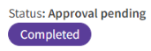

In the example above, the proforma’s status is **Approval pending**, and the sub-status is **Completed**.

See "Appendix A - Proforma Action Availability by Role" on page [195](#appendix-a---proforma-action-availability-by-role) for further details on the categories, statuses, sub-statuses, and actions available to users according to the roles of the current user.

#### Action Menus

Tasks such as forwarding, marking complete, or printing can be can be initiated by making a selection from one of the Action menus on the Proforma List page. There are two types of action menus available on the Proforma List.

- **Batch Action Menu** - Use to apply actions (e.g., Mark Complete or Defer) to multiple proformas simultaneously. See "Batch Processing Proforma Actions" on page [114](#batch-processing-proforma-actions) for further details.

- **Proforma Level Action Menu** - Use to apply an action for an individual proforma displayed in the list.

**Note**: The availability of actions (e.g., Add Costs, Add Fees, etc.) is determined by 3E User/Role security. See "Appendix A - Proforma Action Availability by Role" on page [195](#appendix-a---proforma-action-availability-by-role) for additional details.

#### Filters

You can apply filter criteria to narrow the list of proformas that display in the list. You can apply filter criteria such as client name, matter number, fee values, and more. See "Filters" on page [14](#filters-1) for additional details.

#### Search

You can conduct a quick search for a proforma by entering specific search criteria (e.g., client name, proforma number, or bill group).

#### Sort

You can sort the list by criteria such as client name, fees, and costs. Additionally, the list can be ordered, based on the sorting criteria, from A - Z or Z to A.

#### Paging

A paging bar at the bottom of the list enables you to move forwards or backwards in a multi-page list of proformas. You specify a specific page to jump to and control how many proformas display per page. On long pages, you have the option to quickly jump back to the top of the page.

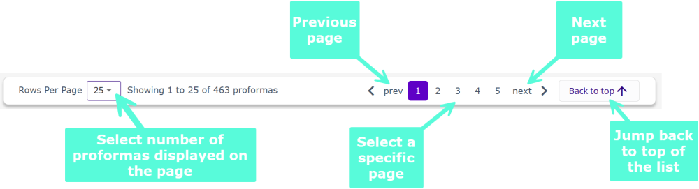

### **Navigating the Proforma Detail View**

The Proforma Details view is where you can view and make modifications to proformas. This view is accessed when you click the proforma number of a proforma displayed in the [<u>Proforma List</u>](#navigating-3e-proforma---walkthrough) view. In the details view, you can:

- View proforma header details

- Attach files and add notes to a proforma

- View financial data from Data Insights

- View and edit Fee, Costs, and Charge cards

- Make adjustments

- Perform and group edit.

**Expand / Collapse Proforma Header Details** 

Be default the Proforma Details view displays a single line of header details. Click the **Expand** arrow to display for all of the header fields. Click the **Collapse** arrow to close the expanded view.

**Action Menus** 

Menus are available at both the proforma and card levels of the Proforma Detail view. Click the menus to access a list of functions to initiate.

**Note**: The availability of actions (e.g., Add Costs, Add Fees, etc.) is determined by 3E User/Role security. See "Appendix A - Proforma Action Availability by Role" on page [195](#appendix-a---proforma-action-availability-by-role) for additional details.

**Action Toolbars**

Toolbars are available at both the header and card level in the Proforma Detail view.

- **Header level** - The header-level toolbar contains an Action menu in addition to options to add attachments and navigate to other proformas in the Proforma list.

- **Card level** - The card-level toolbar contains options to filter and sort a card list and apply actions (e.g., Exclude or combine) against listed cards. See "List View Types" on page [19](#list-view-types) for further details.

**Navigating Card List**

A paging toolbar is available to help you quickly navigate a long card list that extends over multiple pages. You can control how many cards display on a page. Additionally, you can jump to a specific page.

**Breadcrumbs**

The breadcrumbs displayed at the top of the Proforma Details view shows the number of the currently opened proforma and the category list to which the proforma is assigned.

**Elite Intelligence**

Click Elite Intelligence to run an inquiry on matter financial, budget information, and 3E Proforma help.

### **Side Navigation Menu**

The navigation bar on the left side of the screen contains the different views and menus that are available in 3E Proforma.

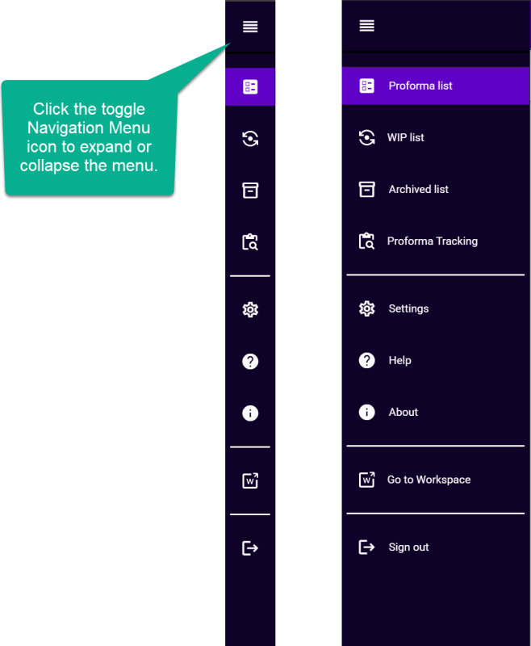

**Toggle Navigation Menu View**

Click on the **Toggle Navigation Menu** icon  to expand the toolbar to a menu with labels.

**Proforma Lists** 

Click to go to the Proforma List view.

**WIP List** 

Click to view a list of Matters for which you are the assigned Billing Attorney, or you are working as the assigned Billing Attorney

**Note**: The WIP list view displays for the Billing Attorney only when the organization has enabled this feature.

**Archived Proformas** 

Click to view displays all proformas that have been archived in the current and prior periods.

**Proforma Tracking**

Click to view a proforma's progress through its workflow.

**Settings** 

The Settings menu contains user configuration settings, which allow a user to set default behavior for certain areas of the system. 

**Help** 

Click to access 3E Proforma's online help.

**About** 

Click to display the 3E Proformas' version information as well as a link to the 3E instance URL and the Elite privacy statement.

**Go to Workspace** 

Click to open the Workspace application.

**Sign out** 

Click to log out of 3E Proforma.

### **Global Toolbar**

The Global toolbar displays always at the top of the 3E Proforma app, in both the Proforma List and Proforma Detail view. It contains two critical options:

- Working as

- Notifications

- Resource Center

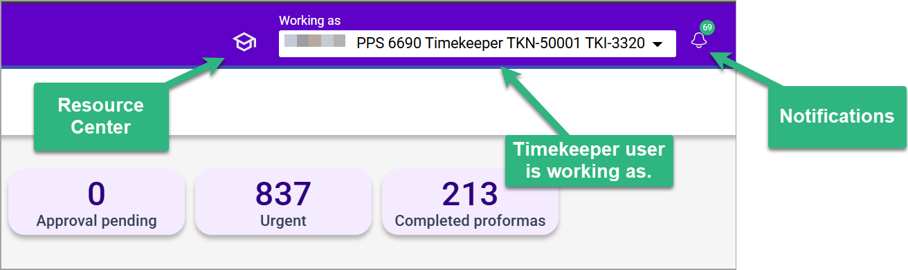

#### Working As

The **Working as** field displays who the logged-in user is working as. By default, the “Working as” timekeeper is the default timekeeper as designated in the User / Role Management setup in 3E. You can switch between the timekeepers you are “working as” based on the timekeepers mapped to you in 3E User / Role Management.

#### Notifications 

The Notification bell icon provides a visual indicator to notify you if any print or preview jobs are complete and ready for viewing. Click the **Notification** icon for details.

#### Resource Center 

Click to open the 3E Proforma Resource Center for announcements and What's New information.

### **Paging Bar**

Paging options are available in the Proforma List view and in card lists in the Proforma Details view. The paging bar is located at the bottom of the page.

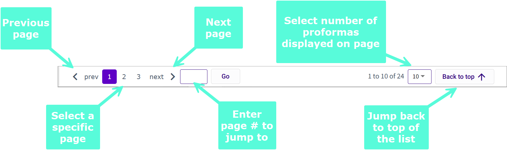

 

Use the Paging bar to do the following

- **Next / Previous Page** - Click the **Next** or **Previous** arrows to move between pages in a list.

- **Jump to Page** - In a long list, click the number of the page shown on Paging bar or enter a specific page number and click **Go**.

- **Set Page Lengt**h - Select a value from the drop-down list on the Paging bar to specify how many rows or records (e.g., proformas or cards) to include on a page.

- **Jump to Top** - Click **Back to top** to jump to the top of the currently viewed page.

 

 

### **Icon Legend**

The following is a list of the most common icons used to access functions in 3E Proforma (e.g., filters and action menus, side menu icons?).

<table>
<colgroup>
<col style="width: 29%" />
<col style="width: 43%" />
<col style="width: 27%" />
</colgroup>
<thead>
<tr>
<th><strong>Icons</strong></th>
<th><strong>Name</strong></th>
<th><strong>Descriptions</strong></th>
</tr>
</thead>
<tbody>
<tr>
<td></td>
<td>Filter</td>
<td>Click to access a list's filter panel and enter criteria to narrow the number of displayed items.</td>
</tr>
<tr>
<td></td>
<td>Expand Narrative</td>
<td>Click to expand a narrative field for editing.</td>
</tr>
<tr>
<td></td>
<td>Expand / Collapse</td>
<td>Click the Expand/Collapse arrows to display or hide fields.</td>
</tr>
<tr>
<td></td>
<td>Action Menu</td>
<td>
Click to access a menu of proforma or card-level actions to use.

The existence of <a href="#viewing-proforma-level-comments"><u>proforma-level comments</u></a> is indicated by a dot displayed on the Proforma-level <strong>Action</strong> menu
</td>
</tr>
<tr>
<td></td>
<td>Notifications</td>
<td>Click to view notifications.</td>
</tr>
<tr>
<td></td>
<td>Priority Flag</td>
<td>Click to flag a proforma as a priority.</td>
</tr>
<tr>
<td></td>
<td>Sort Order</td>
<td>Click to sort a list in ascending or descending order.</td>
</tr>
<tr>
<td></td>
<td>Attachment</td>
<td>Click to manage attachments and notes.</td>
</tr>
<tr>
<td></td>
<td>Locked Status</td>
<td>
This icon displays when a proforma is currently opened by a user in <a href="#proforma-detail-view"><u>Proforma Detail view</u></a>.

Hover the cursor on the icon to view who locked the proforma. Locked proformas can be opened in read-only view.
</td>
</tr>
</tbody>
</table>

 

#### Grid Icon Legend

| **Icons** | **Name** | **Descriptions** |
|----|----|----|
|  | Card view | Click to view proforma detail cards in card view. |
|  | Grid | Click to view proforma details cards in a table format. |
|  | Group cards by | Click to group rows in a grid based on selected criteria. |
|  | Sort order | Click to sort a list in ascending or descending order. |
|  | Column filter | Click to filter grid columns. |
| 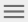 | Grid settings | Click to configure grid settings. |

## Standard Features and Navigation

This section will provide information on the standard features available throughout 3E Proforma (e.g., filters, grids, sorting). Information will also be provided to help you navigate the application.

The main components of 3E Proforma are the Navigation menu, the proforma lists, and the Global toolbar. More detail will be provided on these components in following content.

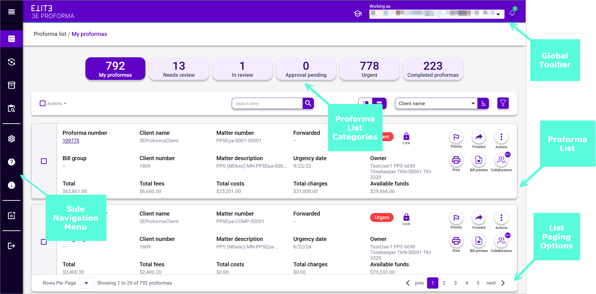

 

### **Standard Features and Navigation**

This section will provide information on the standard features available throughout 3E Proforma (e.g., filters, grids, sorting). Information will also be provided to help you navigate the application.

The main components of 3E Proforma are the Navigation menu, the proforma lists, and the Global toolbar. More detail will be provided on these components in following content.

 

### **Filters**

Proformas and cards are displayed in lists and grids in 3E Proforma. Filters are available to help reduce the amount of time needed to locate the record(s) you're looking for. Filters are available for:

- Proforma List and Detail View,

- Card lists (i.e., Fees and Costs),

- WIP List

- Archived Proformas

#### Accessing filters

Click the Filter icon where available, the filter panel will display.

#### Specifying and Applying filter criteria 

Select criteria such as specifying specific client names or matter numbers to include in a list. Additionally, you can filter list based on numerical values. Click **Apply** to save your filter criteria. The applied criteria, displays at the top of the Filter panel.

#### Filtering numeric fields

When filtering using numerical values, enter a value and use the available filter operators **Greater than**, **Less than**, or **Equal to**.

#### Clearing filters

Do one of the following to clear filters:

- **Clear all criteria** - Click **Clear**, at the bottom of the panel.

- **Remove specific criteria** - Click the **X** on a specific criteria badge displayed at the top of the filter panel.

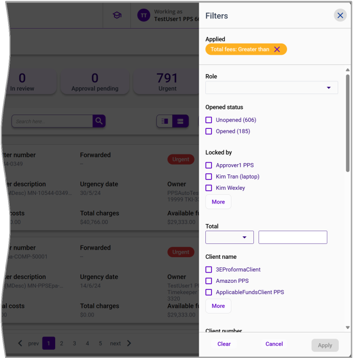

#### Filter Criteria

The list of proformas can be filtered by the following criteria:

**Note**: Available filter criteria will vary depending on the page or list.

| **Field Name** | **Description** |
|----|----|
| **Role** | Selecting a role in this criterion narrows down the list of proformas to those where the user's role on the proforma is the selected value. Available values are: Approver, Co-Owner, Editor, Owner. |
| **Opened status** | Selecting an opened status will narrow down the list of proformas to either Unopened or Opened proformas. The number in parenthesis is the number of proformas of that status. |
| **Locked by** | Selecting values in this criterion narrows down the list of proformas locked by selected users. |
| **Total** | Selecting Greater than/Less than or Equal to and populating the value in this criterion narrows down the list of proformas by the total amount of the proforma. |
| **Client name** | Selecting values in this criterion narrows down the list of proformas by selected clients, More than one client can be selected. |
| **Client number** | Selecting values in this criterion narrows down the list of proformas by the selected client number(s). More than one client number can be selected. |
| **Matter description** | Selecting values in this criterion narrows down the list of proformas by selected matters. More than one matter can be selected. |
| **Matter number** | Selecting values in this criterion narrows down the list of proformas by the selected matter number(s). More than one matter number can be selected. |
| **Total fees** | Selecting Greater than/Less than or Equal to and populating value in this criterion narrows down the list of proformas by the total fees of the proforma. |
| **Total Costs** | Selecting Greater than/Less than or Equal to and populating value in this criterion narrows down the list of proformas by the total costs of the proforma. |
| **Total Charges** | Selecting Greater than/Less than or Equal to and populating value in this criterion narrows down the list of proformas by the total charges of the proforma. |
| **Bill group** | Selecting values in this criterion narrows down the list of proformas by selected bill groups. More than one bill group can be selected |
| **Matter currency** | Selecting values in this criterion narrows down the list of proformas by selected currency. Only one currency can be selected. |
| **Available funds** | Selecting Greater than/Less than or Equal to and populating a value in this criterion narrows down the list of proformas by the total available funds of the proforma. |
| **Owner** | Selecting values in this criterion narrows down the list of proformas to those owned by the selected timekeeper. More than one timekeeper can be selected. |
| **Forwarded** | Selecting the check box narrows down the list of proformas that were forwarded to other timekeepers. |
| **Flagged** | Selecting the check box narrows down the list of proformas that were marked as priority. |
| **Approval pending** | Selecting the check box narrows down the list of proformas that require your approval and have an “Approval pending” sub-status. |

 

### **Lists**

#### Navigating Lists in 3E Proforma

3E Proforma displays proformas and card entries in a list format. A variety of options are available to enable you to control how these list display. List can be displayed in card or grid format. Listed items can be grouped by common criteria. Grid columns can be customized (e.g., moved or removed) to suit the unique needs of the user.

 

#### List View Types

Lists (e.g., proformas and card entries) in 3E Proforma can be viewed using two formats, card view and grid view. The card view groups key information in an easily viewable format. The grid format displays records in a table format with additional sorting and column customization options enabling you to customize how list details are displayed.

##### *Selecting Card or Grid View*

You can switch between list view types by clicking the Grid view or Card view icons on the list's Action toolbar.

##### *Proforma List - Card vs Grid View*

The following information details the difference between the Proforma List card and grid views:

- **Card View** -The card view displays proforma header information. Additionally, it makes the most-frequently used actions easily accessible (i.e., Set Priority, Forward, Print Proforma, Bill Preview, and Collaborators).

**Note**: Card and Grid view types are also available with the [<u>Archived Proformas</u>](#archived-proformas) list.

 

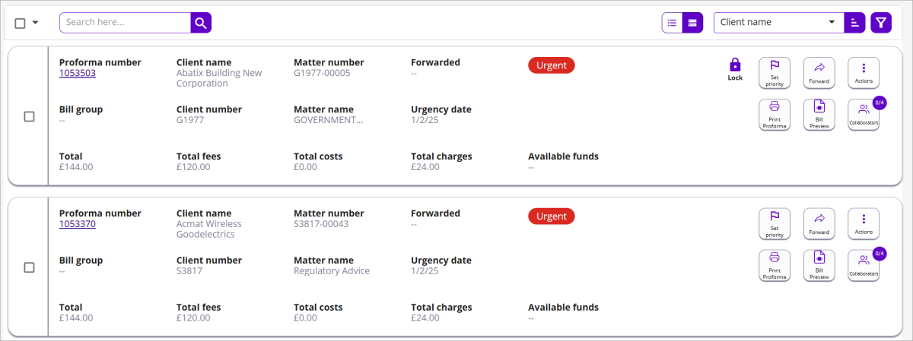

**Opened Status** - Unopened (i.e., unread) proformas are indicated with a purple border in Card view. Once a proforma has been opened, the purple boarder no longer displays.

- **Grid View** - In the Proforma List, grid view displays proformas in a compact tabular format. This allows for viewing more records on the screen at one time. Columns can be resized, rearranged, added and removed. See "Grid Column Settings" on page [21](#grid-column-settings) for further details.

To access Proforma Details, double-click the row of a proforma in the grid view.

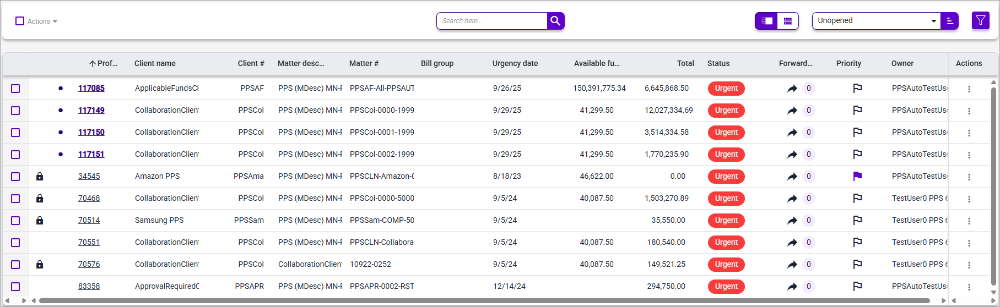

**Opened Status** - Unopened (i.e., unread) proformas are indicated with a purple dot next to the proforma number in Grid view. Once a proforma has been opened, the Unopened icon no longer displays.

##### *Proforma Details View - Card vs. Grid View* 

Details on the sub-tabs of the Proforma Detail view (e.g., Fees, Costs, and Adjustments) can viewed in two forms, grid and card format. You can toggle between the two view by clicking the **Cards view** or **Grid view** icons on the tab Action-bar.

- **Grid view** - The Grid View displays one row per card.  The Narrative and Actions fields are always pinned to the right side of the grid so that they are always visible.  If the left side of the grid has more columns than the screen can display, the user can scroll the left side independently to see the other columns.

**Note**: When tabbing through all fields except the narrative, hit Enter to select the field for editing and Tab out to save changes. When editing the **narrative**, click Tab (or click another field) to move out of the field and save changes.   *To view formatted text in the narrative, click into the narrative field.*

- **Card view** - Displays cards in a form allowing for easier editing of details.

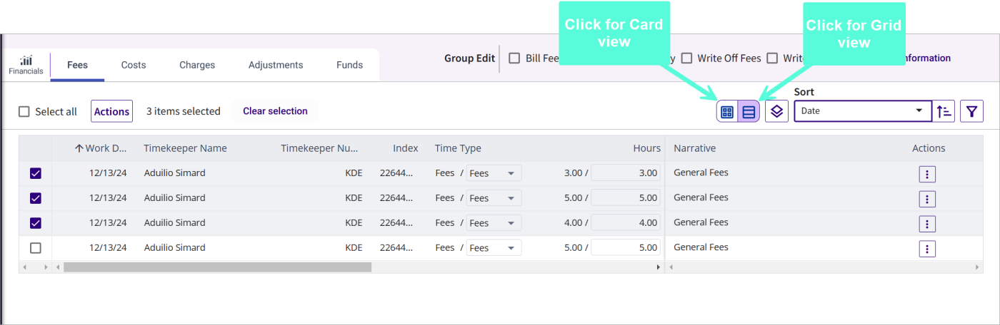

 

#### Grid Column Settings

A variety of options are available to customize the columns in grid view. Grid column settings include the following:

- Resize or Autosize columns

- Hide columns

- Drag and drop to reposition columns

- Pin columns

- Group columns based on selected criteria

##### *Access column Settings*

To access column settings, hover the mouse pointer over a column header and click the **Grid Menu** icon  .

##### *Column Settings*

Available column settings include the following:

- **Resize columns** - To change the size of a column, click the border and drag it to the preferred width. The grid is refreshed to display the new width or height. Resizing columns may affect which columns and rows are visible in the grid's display area.

- **Autosize Columns** - Select Autosize This Column from the Grid menu to auto-size a selected column. Click Autosize All Columns to autosize all grid columns.

- **Column sort order** - Click a column title to sort the grid in descending order. Click that column title again to sort in ascending order. Clicking a column title a third time removes the sort. You can also select sort options (i.e., ascending/descending) from the Grid menu to apply to a selected column. To apply multiple column sorts (e.g., primary, secondary, and tertiary sorts) to a grid, after applying the first column sort, press the **SHIFT** key while clicking the titles of additional sort columns. Sort hierarchy is indicated by the numbers adjacent to the **Sort** direction arrows.

- **Pin Column** - Select Pin Right/Pin Left from the Grid menu for a selected column to position to the left or right side of the grid. As you scroll left or right, the selected column remains frozen in that position. Select **Pin Column \> No Pin** to disable this option, or select **Reset Columns** .

- **Reset Columns** - Select from the Grid menu to reset grid columns to their default settings.

##### *Grid Column Display Options*

You can control the columns displayed by default in the grid by hiding selected columns or applying a filter.

Do the following to remove grid columns from view:

1.  Select the Grid Menu icon  and then click the **Column Filter** icon  .

2.  Clear check boxes adjacent to columns to be hidden in the grid. Select the check box adjacent to the filter field to select all column check boxes.

**Note** : Type filter criteria to narrow the columns to display in the list.

##### *Move Grid Columns*

Users can rearrange the grid columns to their liking.

**Note**: Any changes to the grid layout will be automatically saved for that user.  To reset the grid back to the stock settings, choose the Reset Columns option after clicking the  button.

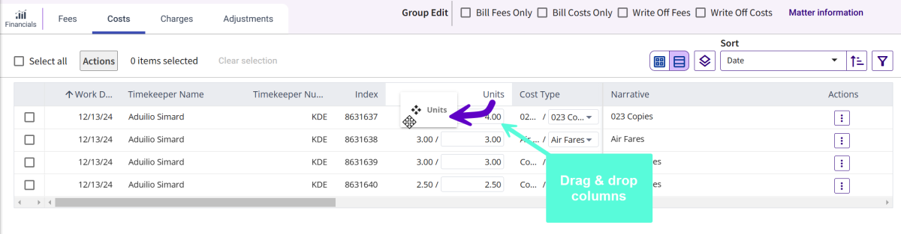

#### Group List Items

In Proforma Detail view, when looking at card entries, in [<u>Grid or Card view</u>](#list-view-types), you can group listed cards based on selected criteria (e.g., timekeeper, date, or time type).

##### *Grouping*

Click the **Grouping** icon  to select and apply grouping criteria to the grid.

**Note**: Group criteria may vary by card type.

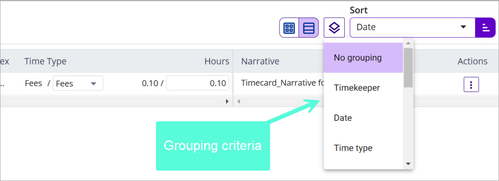

##### *Grouped view*

Once the cards are grouped, each row will display the name of the grouping, a record count of the number of cards for that grouping, and sub-totals for that grouping. For Fees, the sub-totals are hours worked vs. billed, original fees vs. billed, average rate worked vs. billed, and estimated fee realization.

##### *Grouped view - expanded*

To see the cards within a grouping, click the down arrow  to expand the group. To collapse the group, click the up arrow  of the expanded group.

 

#### Filter and Sort List Items

In addition to toggling list views and customizing column settings, filter and sort options are available in lists to help you quickly locate proformas or card entries.

##### *Filter List*

If you want to filter a list of cards, click the filter icon , the filter sidebar displays. Available filter criteria will vary by tab (i.e., Fees, Costs, Charges, etc.). See "Filters" on page [14](#filters-1) for further details.

##### *Sort List*

Select sort criteria from the **Sort** drop-down list. Sort criteria will vary by card tab. Click the **Sort** direction icon  to sort the list in ascending or descending order.

 

### **Entering Codes**

Throughout 3E Proforma, to enter any field that is a code (Tax Code, Task Code, Activity Code, etc.), do the following:

1.  Click in a code field and begin typing some alpha or numeric characters (2 character minimum) to see a list of items (both codes and descriptions) to choose from.

2.  Click on the required line to be applied to the card.

### **Card Narrative Fields**

Card details include a narrative field to display descriptive detail for a card. Information entered in the Narrative field is displayed on the actual bill. This field displays the first few lines of the narrative. Hover the mouse over the narrative field to see a tooltip that displays the full narrative (if it does not fit in the visible field). To view the full narrative or make edits, click **Read more/Edit** when using Card View, the Narrative form displays. If you're viewing cards using the Grid view, click in the Narrative column for a card and click the **Expand** icon .

#### Card View

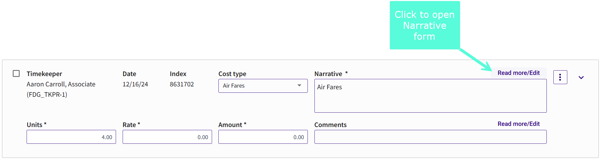

#### Grid View

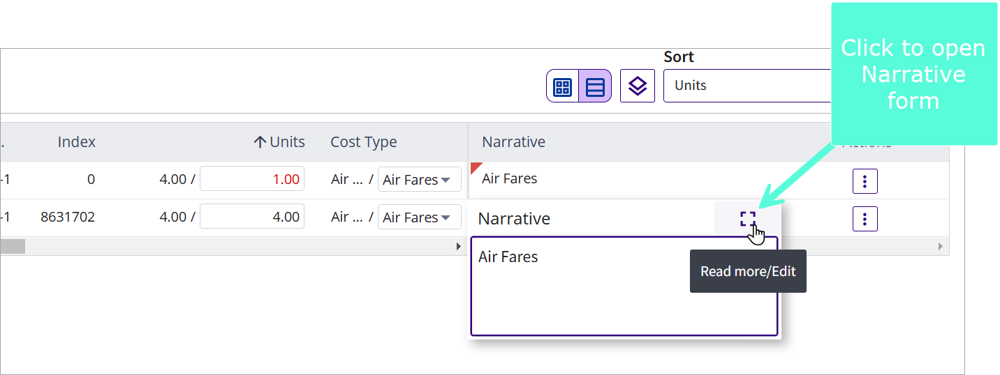

#### View Edit History

Hover the mouse over the field to view the last change made to the field. This enables you to review the last change and who made it.

The *Last Change* value will be updated by the **Save & Recalc** or **Save & Close** actions.

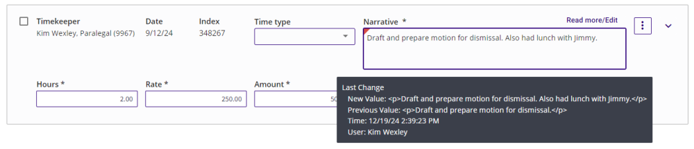

#### Narrative Form

The Narrative displays the original narrative from 3E and current narrative field text. Edit the narrative by clicking directly in the field and making changes.  To format the text, select one or more words to access the Formatting toolbar.

The Original narrative field will display all changes between the original and current narratives.

You can update the Current narrative field in this window. Click **Save** to save changes typed in the Current Narrative field and close the pop-up. Click **Cancel** to discard unsaved changes typed in the Current Narrative field and close the pop-up.

### **Edit-Level Tracking**

3E Proforma tracks and displays prior iteration edits (edit-level tracking) in a different color. An iteration can be explained by the following example:

**Before Edits**

Before any edits the card shows the following:

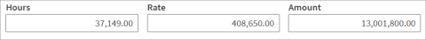

**After Edits**

The timekeeper edits the proforma as shown in the following:

**Note:** The edit text color is red.  In the [<u>Narrative field</u>](#card-narrative-fields), edits are designated with a red triangle in the top left corner of the field. \
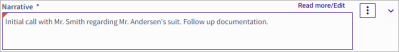

Any new edit replaces the original value or text; worked values remain the same.

### **AI Inquiry**

#### Elite Intelligence

3E Proforma provides an AI solution called Elite Intelligence which is imbedded within the billing workflow. Elite Intelligence enables you to query the 3E database for WIP, AR balances, payments, statement history, rates, and budgets directly in 3E Proforma. Additionally, this AI solution can be used to create AI-driven narratives and PTA code suggestions, streamlining time card entry.

This AI solution, using a 3E API integration, also enables you to ask questions about a specific proforma in the AI Inquiry instead of having to leave 3E Proforma to search for the information on the proforma.

This feature reduces manual effort and minimizes errors by intelligently recommending appropriate codes and descriptions based on context. By automating part of the entry process, users save time and can focus more on reviewing and refining their proformas rather than searching for the right codes. This feature is especially helpful for users managing high volumes of time entries or working across multiple matters.

With Elite Intelligence, attorneys and billing teams will become more self-sufficient, reducing reliance on back-office staff and shortening billing cycles, reducing bottlenecks, and accelerating approvals.

This AI solution can also be used to [<u>delegate common actions</u>](#delegate-tasks-with-ai-for-proforma), reducing manual effort and improving efficiency.

Elite Intelligence is accessible in both the Proforma List and Proforma Detail views. Click the **Elite Intelligence** button at the bottom right-side of the page to access the query pop-up.

**Proforma List**

Inquiry is available in the Proforma List for information about the proforma list records or online help. If the user provides specific matter or client information in their question, they can query for financial and budget information.

The inquiry feature can review up to 500 records at a time.

**Proforma Details**

The inquiry is available in the Proforma Details view for matter financial and budget information and online help.

**3E Proforma Help**

In addition to accessing information on matter details to assist with billing and time cards, Elite Intelligence has access to the 3E Proforma help content. You can query for "how to" information or detail specific features in the application.

 

**Important**: Before using Elite Intelligence, please review the [<u>Terms and Conditions</u>](https://www.elite.com/resources/proforma-ai-terms) covering Elite Proforma AI Capabilities.

**Note**: The Elite Intelligence button can be disabled in Override/Set System Options in the AI Group \> **3EProforma_Show_AI_Button** option. By default, the option is set to True (i.e., enabled). See [<u>AI Overrides & System Options</u>](https://help.elite.com/3ehelp/3Ehelp.htm#Subsystems/Elite 3E Administration Guide/AI Overrides & System Options.htm) in the *3E Administration Guide* for further details.

**Note**: Elite Intelligence requires 3E Cloud.

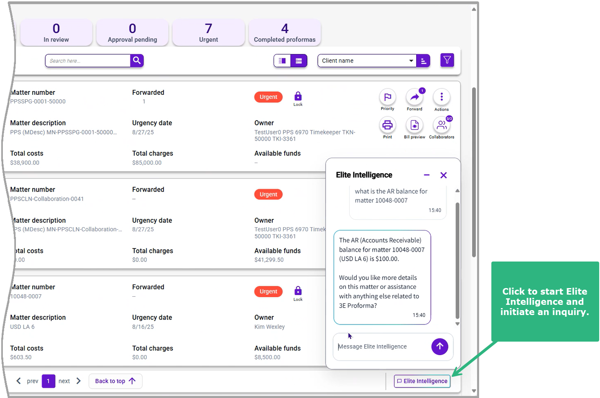

 

#### Delegate Tasks with AI for Proforma

You can instruct AI for Proforma to execute tasks such as filtering, sorting, submitting, and tracking, reducing manual intervention and improving productivity. In cases where multiple records will be affected, 3E Proforma will provide a list of records that will be changed, enabling you to de-select any items they do not want to impact before taking the action. See a list of [<u>common actions</u>](#available-actions) available for delegation below.

**Note**: This feature is only available in 3E Cloud.

Do the following to delegate tasks with AI for Proforma:

1.  Click **Elite Intelligence**, on the *Proforma Lis*t *or Proforma Details* page.

2.  Enter a task for the AI to complete (e.g., close all proformas less than \$1000) in the prompt field and click **Send**.

3.  Do one of the following:

- **Complete Task** - Click this link to have the AI complete the task on the listed record(s).

- **Dismiss Tasks** - Click to cancel the task request.

- **Click to View All** - Click to view a list of records generated by the AI. Specify the records on which the AI will carry out the task. Click Complete Tasks

 

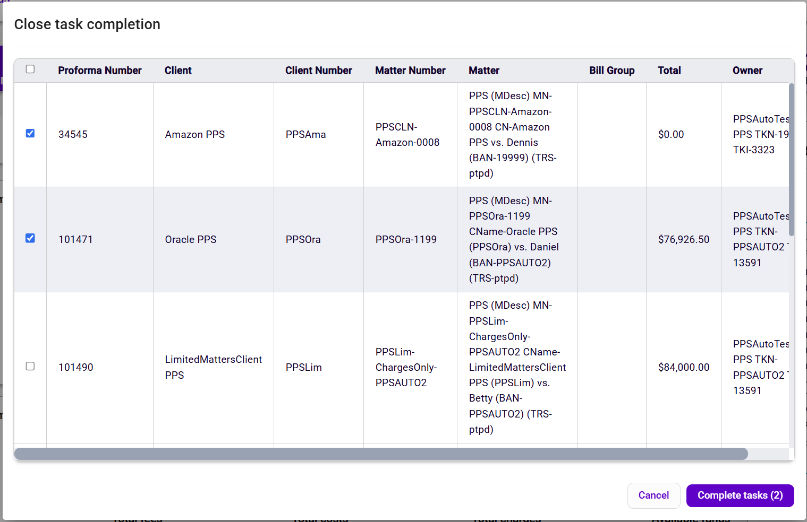

##### *Available Actions*

Actions available for you to delegate to the AI are restricted by your 3E role security and the 3E Proforma Security system options. Available actions (e.g., approve, close, or filter) vary by page view (e.g., Proforma List and Proforma Detail). See the following table for actions available by page view.

|                      |                                 |
|----------------------|---------------------------------|
| **Page View**        | **Action**                      |
| **Proforma List**    | Add comment                     |
| **Proforma List**    | Approve                         |
| **Proforma List**    | Bill Preview                    |
| **Proforma List**    | Close                           |
| **Proforma List**    | Defer                           |
| **Proforma List**    | Filter                          |
| **Proforma List**    | Forward                         |
| **Proforma List**    | Mark as complete (editors only) |
| **Proforma List**    | Mass print proforma             |
| **Proforma List**    | Open Proforma                   |
| **Proforma List**    | Print Proforma                  |
| **Proforma List**    | Reject                          |
| **Proforma List**    | Set priority                    |
| **Proforma List**    | Sort                            |
| **Proforma List**    | Submit                          |
| **Proforma List**    | Undefer                         |
| **Proforma Details** | Approve                         |
| **Proforma Details** | Bill Preview                    |
| **Proforma Details** | Cancel                          |
| **Proforma Details** | Close                           |
| **Proforma Details** | Comment                         |
| **Proforma Details** | Defer                           |
| **Proforma Details** | Invoice Narrative               |
| **Proforma Details** | Mark as Complete                |
| **Proforma Details** | Print Proforma                  |
| **Proforma Details** | Reclaim                         |
| **Proforma Details** | Reject                          |
| **Proforma Details** | Set Priority                    |
| **Proforma Details** | Submit                          |
| **Proforma Details** | Undefer                         |

#### AI for Proforma - Stock Prompt Library

AI for 3E Proforma comes with a list of pre-defined stock prompts for frequently used inquiries in the Proforma Details view. This prompt library simplifies workflows, reduce errors, and improve overall efficiency in managing proformas.

To access the library, after opening the AI Inquiry window, click **Elite Intelligence** and select **Library**. Select a listed prompt and click **Send**.

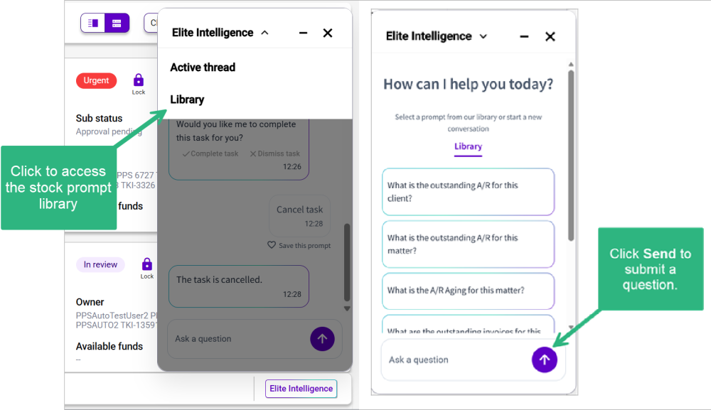

# 3E Proforma Settings

## About Settings

3E Proforma allow a user to set default display settings (e.g., default a list to card vs grid view) for certain areas of the application. Default settings can be configured at both the firm and user level. Use-level settings will override firm-level defaults settings.

 

## Settings Form and Field Definitions

The Settings page is used to set default behavior for certain areas of 3E Proforma. Defaults can be configured firm-wide and at the user-level.

[<u>User Settings</u>](#user-settings)

[<u>Firm Settings</u>](#firm-tab)

[<u>System Option Settings</u>](#system-options)

 

### **User Settings**

The User settings tab is used to configure user-specific defaults.

**Note**: User Settings take precedence over Firm Settings.

<table style="width:96%;">
<colgroup>
<col style="width: 30%" />
<col style="width: 65%" />
</colgroup>
<thead>
<tr>
<th><strong>Field Name</strong></th>
<th><strong>Definition</strong></th>
</tr>
</thead>
<tbody>
<tr>
<td><strong>Automatically expand code fields</strong></td>
<td>Click the toggle to turn on the auto expand code option for the Phase, Task, and Activity codes section of the card details for all proformas. The default setting is off.</td>
</tr>
<tr>
<td><strong>Automatically expand Proforma Header</strong></td>
<td>Click the toggle to turn on the option to automatically expand the proforma header section on all proformas. The default setting is off.</td>
</tr>
<tr>
<td><strong>Automatically run spell check on proforma submit</strong></td>
<td>Click the toggle to turn on the option to automatically have 3E Proforma run a spell check when a user submits a proforma, ensuring that the proforma is spell checked before it is sent for billing. The default setting is off.</td>
</tr>
<tr>
<td><strong>Show unopened proformas first in Urgent/My proformas list</strong></td>
<td>
Select <strong>True</strong> from this drop-down list to display unopened proformas first (i.e., Ascending order) in the Urgent and My proformas list. Select <strong>False</strong> to disabled sorting by Unopened status.

 
</td>
</tr>
<tr>
<td><strong>Default tab for proforma details</strong></td>
<td>Select the default tab (i.e., fees, costs, or charge) from this drop-down list to display when a proforma is opened. The default setting is Fees.</td>
</tr>
<tr>
<td><strong>Default grouping for fees</strong></td>
<td>Select an option from this drop-down list to use as criteria to group fee cards.</td>
</tr>
<tr>
<td><strong>Default grouping for costs</strong></td>
<td>Select an option from this drop-down list to use as criteria to group cost cards.</td>
</tr>
<tr>
<td><strong>Default grouping for charges</strong></td>
<td>Select an option from this drop-down list to use as criteria to group charge cards.</td>
</tr>
</tbody>
</table>

### **Firm Tab**

Use the settings on the Firm Settings tab to configure firm-wide defaults.

**Note**: The **Firm Settings** tab is only viewable by users that have the **3EProformaAdminRole** assigned to their user in 3E.

<table style="width:96%;">
<colgroup>
<col style="width: 30%" />
<col style="width: 65%" />
</colgroup>
<thead>
<tr>
<th><strong>Field Name</strong></th>
<th><strong>Definition</strong></th>
</tr>
</thead>
<tbody>
<tr>
<td><strong>Default proforma list view type</strong></td>
<td>Choose the default Proforma List view(i.e., Card or Grid).</td>
</tr>
<tr>
<td><strong>Default proforma detail list view type</strong></td>
<td>Choose the default List view(i.e., Card or Grid) for card entries viewed in <a href="#navigating-the-proforma-detail-view"><u>Proforma Detail view</u></a>.</td>
</tr>
<tr>
<td><strong>Show unopened proformas first in Urgent/My proformas list</strong></td>
<td>
Select <strong>True</strong> from this drop-down list to display unopened proformas first (i.e., Ascending order) in the Urgent and My proformas list. Select <strong>False</strong> to disabled sorting by Unopened status.

 
</td>
</tr>
<tr>
<td><strong>Default grouping for fees</strong></td>
<td>Select an option from this drop-down list to use as criteria to group fee cards.</td>
</tr>
<tr>
<td><strong>Default grouping for costs</strong></td>
<td>Select an option from this drop-down list to use as criteria to group cost cards.</td>
</tr>
<tr>
<td><strong>Default grouping for charges</strong></td>
<td>Select an option from this drop-down list to use as criteria to group charge cards.</td>
</tr>
</tbody>
</table>

### **System Options**

This tab provides a read-only view of 3E Override / System Option settings that apply to 3E Proforma.

**Note**: The **System Options** tab is only viewable by users that have the **3EProformaAdminRole** assigned to their user in 3E.

<table style="width:96%;">
<colgroup>
<col style="width: 30%" />
<col style="width: 65%" />
</colgroup>
<thead>
<tr>
<th><strong>Field Name</strong></th>
<th><strong>Definition</strong></th>
</tr>
</thead>
<tbody>
<tr>
<td><strong>3E System Options</strong></td>
<td>Click to open the <strong>Override/Set System Options</strong> page in 3E.</td>
</tr>
<tr>
<td><strong>3E Proforma</strong></td>
<td>Click to display the system options and overrides available for 3E Proforma.</td>
</tr>
<tr>
<td><strong>3E Proforma Security</strong></td>
<td>Click to display 3E Proforma system options that provide granular control of the application.</td>
</tr>
<tr>
<td colspan="2"><strong>Options Grid</strong></td>
</tr>
<tr>
<td><strong>Search</strong></td>
<td>Type search criteria to narrow the list of displayed options.</td>
</tr>
<tr>
<td><strong>Option</strong></td>
<td>Displays the option name.</td>
</tr>
<tr>
<td><strong>System Default</strong></td>
<td>Displays the default system setting.</td>
</tr>
<tr>
<td><strong>First Override</strong></td>
<td>Displays the firm-wide default override setting.</td>
</tr>
</tbody>
</table>

# Proforma List View

## About Proforma List View

The **Proforma List** displays a list of proformas. The proformas that display vary, depending on which list is selected (My proformas, My approvals, Needs review, In review, Approval pending, Urgent, Completed proformas). By default, the My proformas list is selected.

 

## Proforma Lists Form and Field Definitions

The **Proforma List** view consists of the following. Available options (e.g., list Categories) will vary based on your role (e.g., Approver).

**Note**: The list may display proformas in [<u>Card or List view</u>](#list-view-types). The default view is determined by the [<u>3E Proforma settings</u>](#e-proforma-settings).

<table style="width:100%;">
<colgroup>
<col style="width: 19%" />
<col style="width: 80%" />
</colgroup>
<thead>
<tr>
<th><strong>Field Name</strong></th>
<th><strong>Description</strong></th>
</tr>
</thead>
<tbody>
<tr>
<td><strong>Categories</strong></td>
<td><strong> </strong></td>
</tr>
<tr>
<td><strong>My proformas</strong></td>
<td>This displays proformas on which the current timekeeper needs to act. This list will change, as proformas will be added and removed from individual work lists. This list will change when the user takes actions on a proforma such as <strong>Submit</strong> or <strong>Mark as Complete</strong>, and background actions such as proforma collaboration changes may alter the list entries.</td>
</tr>
<tr>
<td><strong>My approvals</strong></td>
<td>This category only displays for users that are assigned the <em>3EProformaApproverRole</em> in 3E. It displays proformas that are awaiting approval from the current timekeeper. This list will change when the user takes actions on a proforma to Approve or Reject the proformas, and if the firm assigns approvals to everyone with the <em>3EProformaApproverRole</em>, then if another approver acts on the proforma, the changes will be reflected for all approvers.</td>
</tr>
<tr>
<td><strong>Needs review</strong></td>
<td>This displays proformas the timekeeper currently is associated with but have not been opened to the proforma detail view.</td>
</tr>
<tr>
<td><strong>In review</strong></td>
<td>This displays proformas that have been opened or edited by the current timekeeper.</td>
</tr>
<tr>
<td><strong>Approval pending</strong></td>
<td>This displays proformas submitted by the current billing attorney that require approval based on configuration settings for write-down threshold(s). If the firm does not have a configured write-down threshold(s), the proformas will move to the <strong>Completed proformas</strong> category upon <strong>Submit</strong>, <strong>Mark as complete</strong> or <strong>Defer</strong> action.</td>
</tr>
<tr>
<td><strong>Urgent</strong></td>
<td>
This displays proformas whose proforma date has met or exceeded the Urgency Date.

<strong>Note</strong>: The Urgency Date is a calculated date based on settings in 3E and the proforma generation date.
</td>
</tr>
<tr>
<td><strong>Completed proformas</strong></td>
<td>This displays proformas that have been Submitted by the billing timekeeper, Marked as complete by a proforma editor, Deferred by the billing timekeeper, and Approved by an approver.</td>
</tr>
<tr>
<td colspan="2"><strong>Proforma List Options</strong></td>
</tr>
<tr>
<td><strong>Select all</strong></td>
<td>
Click this check box to select all proformas on the page. Deselect this check box to clear all selections.

<strong>Note</strong>: When multiple proformas are selected, the number of selected proformas displays above this check box.
</td>
</tr>
<tr>
<td><strong>Actions</strong></td>
<td>
Click this Action menu and select an action to perform on multiple selected proformas.

<strong>Note</strong>: Actions available in the menue vary by assigned role (i.e., Timekeeper, Billing Attorney, or Approver). See "Appendix A - Proforma Action Availability by Role" on page <a href="#appendix-a---proforma-action-availability-by-role">195</a> for details.
</td>
</tr>
<tr>
<td><strong>Search</strong></td>
<td>
Type search criteria in this field to narrow down the proforma list. You can do a quick search on the following fields:

<ul>
<li>
Client name
</li>
<li>
Matter number
</li>
<li>
Matter name
</li>
<li>
Matter description
</li>
<li>
Proforma Number
</li>
<li>
Bill Group
</li>
</ul>

<strong>Note</strong>: You can enter a partial name or number and 3E Proforma will search the current list for records that have a match. Click the <strong>X</strong> in this field to clear search criteria.
</td>
</tr>
<tr>
<td>
<strong>Sort</strong>

</td>
<td>Select criteria to use to sort the list. Click the <strong>Sort</strong> icon to order this list in asending or descending order. By default, the list of is sorted by client’s name from A-Z .</td>
</tr>
<tr>
<td>
<strong>Filter</strong>

</td>
<td>Click the <strong>Filter</strong> icon to limit the number of proformas displayed in the Proforma list by using the Filter sidebar. See "Filters" on page <a href="#filters-1">14</a> for further details.</td>
</tr>
<tr>
<td><strong>Proforma List</strong></td>
<td><strong> </strong></td>
</tr>
<tr>
<td><strong>Select</strong></td>
<td>Select this check box to flag this proforma for a batch action.</td>
</tr>
<tr>
<td><strong>Lock icon</strong></td>
<td>Displays when a proforma is opened by another user. See "Icon Legend" on page <a href="#icon-legend">11</a> for further details.</td>
</tr>
<tr>
<td><strong>Proforma number</strong></td>
<td>Click to view proforma details. For a Group proforma, a “Group” prefix displays.</td>
</tr>
<tr>
<td><strong>Client Name</strong></td>
<td>Displays the client name associated with the proforma.</td>
</tr>
<tr>
<td><strong>Matter number</strong></td>
<td>Displays the matter number and the matter description associated with a single matter proforma or a lead matter for a group proforma.</td>
</tr>
<tr>
<td><strong>Forwarded</strong></td>
<td>
The Forwarded badge shows how many times the proforma has been forwarded. Hover the cursor over the badge to display timekeepers to whom the proforma has been forwarded. The same information displays in the proforma list for the received proforma after it has been forwarded.

</td>
</tr>
<tr>
<td><strong>Status</strong></td>
<td>Displays the status(e.g., Urgent) and sub-status of the proforma.</td>
</tr>
<tr>
<td><strong>Bill group</strong></td>
<td>Displays the bill group to which the group proforma belongs. For a proforma that is not a part of a group, dashes (--)  display.</td>
</tr>
<tr>
<td><strong>Client Number</strong></td>
<td>Displays the client name associated with the matter.</td>
</tr>
<tr>
<td><strong>Matter Name</strong></td>
<td>Displays the name of the matter for which the proforma is being created.</td>
</tr>
<tr>
<td><strong>Urgency date</strong></td>
<td>Displays the date when the proforma becomes due. Urgency date is calculated based on a setting in 3E Override / Set System Options and the Proforma date.</td>
</tr>
<tr>
<td><strong>Total</strong></td>
<td>The <strong>Total</strong> attribute displays the total bill amount of the proforma.</td>
</tr>
<tr>
<td><strong>Total fees</strong></td>
<td>
The <strong>Total fees</strong> attribute displays the total bill amount of the fees.

 
</td>
</tr>
<tr>
<td><strong>Total costs</strong></td>
<td>The <strong>Total costs</strong> attribute displays the total bill amount of the costs.</td>
</tr>
<tr>
<td><strong>Total charges</strong></td>
<td>The <strong>Total charges</strong> attribute displays the total bill amount of the charges.</td>
</tr>
<tr>
<td><strong>Available funds</strong></td>
<td><strong>Available funds</strong> displays the sum of unapplied billed on account, unapplied credits, and trust.</td>
</tr>
<tr>
<td><strong>Priority flag</strong></td>
<td>
Click the priority flag to toggle the proforma between a priority and non-priority status. A white flag indicates the default non-priority state.

<strong>Note</strong>: In Card view, this field displays as a Quick Action Button
</td>
</tr>
<tr>
<td><strong>Quick Action Buttons</strong></td>
<td>
In Card view, the following actions buttons display:

<ul>
<li>
Set Priority
</li>
<li>
Forward
</li>
<li>
Print Proforma
</li>
<li>
Bill Preview
</li>
<li>
Collaborators
</li>
</ul>

<strong>Note</strong>: The <strong>Collaborator</strong> button displays a badge that shows the total number of collaborators and the how many have completed their edits. The first number is how many collaborators have completed the proforma edits, the second number is total number of collaborators. Click the <strong>Collaborators</strong> button to see the details.

<strong>Note</strong>: In Grid view, these actions area available on the Actions menu.
</td>
</tr>
<tr>
<td><strong>Actions Menu</strong></td>
<td>
Click the <a href="#icon-legend"><u>Action menu</u></a> and select an action to perform on an individual proforma. Actions available on this list are dependent on the active Proforma List view. The Print Proforma, Bill Preview, and Collaborators actions are only available in the Action menu in Grid view. In Card view these action are available as Action buttons on the proforma.

<strong>Note</strong>: Actions available in the menu vary by assigned role (i.e., Timekeeper, Billing Attorney, or Approver). See "Appendix A - Proforma Action Availability by Role" on page <a href="#appendix-a---proforma-action-availability-by-role">195</a> for details.

<strong>Note</strong>: Action menus apply user/role security. Users with restricted access will not see the following proforma-level actions in this menu: Add Adjustment, Add Cost, and Add Fee.
</td>
</tr>
</tbody>
</table>

 

# Proforma Detail View

## About Proforma Details

The Proforma Details view is used to view proforma header information and complete tasks such as reviewing and editing time, cost, and charge cards.

Access the proforma details by clicking on the Proforma number on the Proforma list. By default, you will be taken to the Fees details.

**Note**: When the proforma details are opened, it becomes locked. Other users will be able to access the proforma in read-only view. If a user opens proforma details when the proforma is locked by another user, a warning message displays.

## Proforma Details Form and Field Definitions

The Proforma Edit view consists of the following:

[<u>Proforma Details - Parent Form</u>](#proforma-details-parent-form)

[<u>Proforma Details - Financials Tab</u>](#proforma-details-financials-tab)

[<u>Proforma Details - Fees Tab</u>](#proforma-details-fees-tab)

[<u>Proforma Details - Costs Tab</u>](#proforma-details-costs-tab)

[<u>Proforma Details - Charges Tab</u>](#proforma-details---charges-tab)

[<u>Proforma Details - Adjustments Tab</u>](#proforma-details-adjustments-tab)

[<u>Proforma Details - Funds Tab</u>](#proforma-details-funds-tab)

[<u>Proforma Details - Payors Tab</u>](#proforma-details-payors-tab)

[<u>Proforma Details – Billing Contacts Tab</u>](#proforma-details-billing-contacts-tab)

### **Proforma Details Parent Form**

**Note**: Depending on the proforma status and the user’s role on the proforma, the most relevant proforma action button is displayed. For example, for an approver, the **Approve** button is displayed).

<table style="width:100%;">
<colgroup>
<col style="width: 19%" />
<col style="width: 80%" />
</colgroup>
<thead>
<tr>
<th><strong>Field Name</strong></th>
<th><strong>Descriptions</strong></th>
</tr>
</thead>
<tbody>
<tr>
<td colspan="2"><strong>Action Bar</strong></td>
</tr>
<tr>
<td><strong>Next / Previous</strong></td>
<td>Click the Next or Previous arrows to navigate between proformas.</td>
</tr>
<tr>
<td>
<strong>Exit Proforma</strong>

</td>
<td>Click to close the proforma without saving changes.</td>
</tr>
<tr>
<td>
<strong>Attachments</strong>

</td>
<td>Click the Attachments icon to upload and attach files to the proforma. Additionally, you can add notes or print attachments. The number of attachments and notes added to the proforma displays by the Attachment icon.</td>
</tr>
<tr>
<td>
<strong>Add Comments</strong>

</td>
<td>Click to add a comment to the proforma. The total number of existing comments on a proforma will display on the icon.</td>
</tr>
<tr>
<td>
<strong>Save &amp; Close</strong>

</td>
<td>Click to save all edits made to the proforma and recalculate proforma totals. The Proforma Details view closes, returning you to the Proforma List view. The proforma is unlocked and becomes available to other users.</td>
</tr>
<tr>
<td>
<strong>Save &amp; Recalc</strong>

</td>
<td>Click to save all edits made to the proforma, recalculates proforma totals, and continue working in the Proforma Details view. The proforma remains locked and can be reviewed by other users in read-only view.</td>
</tr>
<tr>
<td><strong>Submit</strong></td>
<td>
Click this to submit the proforma to the Billing department. The proforma details page is closed, and the user is back to the proforma list in the category from which the proforma details were opened.

<strong>Note</strong>: This button only displays for a billing attorney
</td>
</tr>
<tr>
<td><strong>Mark as complete</strong></td>
<td>
Click when you have finished your edits. The proforma will move to your <strong>Completed Proformas</strong> list. You will then see a check mark in the <strong>C</strong> column in the <strong>Collaboration</strong> pop-up. The Proforma details page is closed, and you are returned back to the proforma list in the category from which the proforma details were opened.

<strong>Note</strong>: This button only displays for a regular timekeeper.
</td>
</tr>
<tr>
<td><strong>Reclaim</strong></td>
<td>
Click to return proformas back to the <strong>Needs Review</strong> list. The proforma moves from the Completed list/Approval pending to Needs review and the billing attorney can continue working on it

<strong>Note</strong>: This button only displays for a billing attorney on completed proforma.
</td>
</tr>
<tr>
<td><strong>Approve</strong></td>
<td>
Click to approve a proforma submitted by the billing attorney. The proforma moves to the Completed proformas list. The proforma details page is closed, and you are returned back to the proforma list.

<strong>Note</strong>: This button only displays for an approver.
</td>
</tr>
<tr>
<td>
<strong>Priority</strong>

</td>
<td>Click this icon flag, or unflag, a proforma as a priority, depending on its initial state. If the proforma was already set as priority, clicking the Priority icon un-marks the proforma as a priority. If the proforma was not a priority, clicking the Priority icon marks the proforma as a priority.</td>
</tr>
<tr>
<td>
<strong>Action Menu</strong>

</td>
<td>
Click to access action to perform on the proforma.

<strong>Note</strong>: The availability of actions (e.g., Add Costs, Add Fees, etc.) is determined by 3E user/role security. See "Appendix A - Proforma Action Availability by Role" on page <a href="#appendix-a---proforma-action-availability-by-role">195</a> for additional details.
</td>
</tr>
<tr>
<td colspan="2"><strong>Proforma Details</strong></td>
</tr>
<tr>
<td><strong>Hours worked / billed</strong></td>
<td>Displays hours worked and hours billed.</td>
</tr>
<tr>
<td><strong>Original fees /billed</strong></td>
<td>Displays original fees compared to billed fees.</td>
</tr>
<tr>
<td><strong>Total / adj total</strong></td>
<td>Displays original total amount compared to the adjusted totals amount.</td>
</tr>
<tr>
<td><strong>Available funds</strong></td>
<td>Displays the amount of available funds.</td>
</tr>
<tr>
<td><strong>Total edits</strong></td>
<td>Displays the total edit value.</td>
</tr>
<tr>
<td><strong>Original costs / billed</strong></td>
<td>Displays the original costs compared to the billed costs.</td>
</tr>
<tr>
<td><strong>Original charges / billed</strong></td>
<td>Displays the original charges compared to the billed charges.</td>
</tr>
<tr>
<td><strong>Est. fee realization</strong></td>
<td>Displays the estimated fee realization.</td>
</tr>
<tr>
<td><strong>Profit Margin Ratio</strong></td>
<td>
These values enable you to view both the original matter-level margin at proforma generation and the adjusted margin as edits are made. The values update when <strong>Save</strong> &amp; <strong>Recalc</strong> are selected, providing immediate feedback on how fee changes impact profitability during proforma review.

The ratios are calculated based on fees only (excluding costs, charges, and WIP) and are displayed as percentages with one decimal place, including standardized formatting for negative values. Ratios are comparing actual vs Reference Rate.

<strong>Note</strong>: These values only display when the <strong>ProfDetails_Show_Profit_Margin_Ratios</strong>​ system option is enabled. See "3E Proforma Security System Options List" on page <a href="#e-proforma-security-system-options-list">161</a> for details.

<strong>Ratio Values</strong>

When enabled, the Proforma header displays the following two values:

<ul>
<li>
<strong>Original Profit Margin Ratio</strong> – Calculated when the proforma is generated and does not change.
</li>
<li>
<strong>Adjusted Profit Margin Ratio</strong> – Updated when edits are made and recalculated using Save &amp; Recalc.
</li>
</ul>

<strong>Calculations</strong>:

The ratios are calculated based on fees only (excluding costs, charges, and WIP) and are displayed as percentages with one decimal place, including standardized formatting for negative values. Ratios are comparing actual vs Reference Rate.

<ul>
<li>
<strong>Original Ratio</strong>: <em>((Total Fees Billed Amount - Total Fees Reference Amount + Total Proforma Original Fees - Total Proforma Fees Reference Amount) / (Matter Billed Fees + Proforma Original Fees)) * 100</em>
</li>
</ul>

<strong>Note</strong>: The Original ratio percentage is the value when the proforma is generated, it is point in time and will not update.

<ul>
<li>
<strong>Adjusted Ratio</strong>: <em>((Total Fees Billed Amount - Total Fees Reference Amount + Proforma Billed Fees - Proforma Fees Reference Amount) / (Matter Billed Fees + Proforma Billed Fees)) * 100</em>
</li>
</ul></td>
</tr>
<tr>
<td colspan="2"><strong>General info</strong></td>
</tr>
<tr>
<td><strong>Proforma Date</strong></td>
<td>Displays the date of the proforma.</td>
</tr>
<tr>
<td><strong>Proforma Status</strong></td>
<td>Displays the current status of the proforma record.</td>
</tr>
<tr>
<td><strong>Matter address</strong></td>
<td>Displays the matter address.</td>
</tr>
<tr>
<td><strong>Client address</strong></td>
<td>Displays the client's address.</td>
</tr>
<tr>
<td><strong>Payor</strong></td>
<td>Displays the payor name.</td>
</tr>
<tr>
<td><strong>Exclude from proforma group</strong></td>
<td>Select this check box to exclude the Matters proforma from a group so that it can be invoiced separately. This option displays only if the Bill Group proformas are generated as individual proformas, not as one large proforma for all Matters in the Bill Group.</td>
</tr>
<tr>
<td colspan="2"><strong>Billing info</strong></td>
</tr>
<tr>
<td><strong>Billing group</strong></td>
<td>Displays the name of the bill group.</td>
</tr>
<tr>
<td><strong>Bill Template</strong></td>
<td>Displays the bill template used to print the bill.</td>
</tr>
<tr>
<td><strong>Billing Frequency</strong></td>
<td>The billing frequency for the matter.</td>
</tr>
<tr>
<td><strong>Bill arrangement</strong></td>
<td>Displays details on the bill arrangement.</td>
</tr>
<tr>
<td><strong>Billing Timekeeper</strong></td>
<td>Displays the name of the Billing Timekeeper associated with the proforma.</td>
</tr>
<tr>
<td><strong>Responsible Timekeeper</strong></td>
<td>Displays the name of the Responsible Timekeeper associated with the proforma.</td>
</tr>
<tr>
<td><strong>Supervising Timekeeper</strong></td>
<td>Displays the name of the Supervising Timekeeper associated with the proforma.</td>
</tr>
<tr>
<td><strong>E-Billing</strong></td>
<td>Select this check box to indicate that e-bills should be generated for this matter.</td>
</tr>
<tr>
<td><strong>Email Bill to</strong></td>
<td>Displays the name of the recipient to which the bill will be emailed.</td>
</tr>
<tr>
<td><strong>Payment Terms</strong></td>
<td>Displays the payment terms for the matter.</td>
</tr>
<tr>
<td colspan="2"><strong>Instructions</strong></td>
</tr>
<tr>
<td><strong>Client billing instructions</strong></td>
<td>Displays client billing instructions.</td>
</tr>
<tr>
<td><strong>Matter billing instructions</strong></td>
<td>Displays matter billing instruction.</td>
</tr>
<tr>
<td><strong>Instructions</strong></td>
<td>
Displays internal proforma instructions for the Biller to follow.

<strong>Note</strong>: This field display edited text in red. This enables you to determine if the instructions have been changed
</td>
</tr>
<tr>
<td colspan="2"><strong>Flat fees</strong></td>
</tr>
<tr>
<td><strong>Time Type</strong></td>
<td>Displays the fee type.</td>
</tr>
<tr>
<td><strong>Start Date</strong></td>
<td>Displays the effective date for the flat fee.</td>
</tr>
<tr>
<td><strong>End Data</strong></td>
<td>Displays the date the flat fee expires.</td>
</tr>
<tr>
<td><strong>Amount</strong></td>
<td>Displays the amount of the flat fee.</td>
</tr>
<tr>
<td><strong>Currency</strong></td>
<td>Displays the currency of the flat fee.</td>
</tr>
<tr>
<td colspan="2"><strong>Matter info</strong></td>
</tr>
<tr>
<td><strong>Matter Number</strong></td>
<td>The unique number of the matter associated with the proforma.</td>
</tr>
<tr>
<td><strong>Matter Status</strong></td>
<td>Displays the matter's status.</td>
</tr>
<tr>
<td><strong>Practice Group</strong></td>
<td>Displays the matter's practice group.</td>
</tr>
<tr>
<td><strong>Department Code</strong></td>
<td>Display's the code of the matter's department.</td>
</tr>
<tr>
<td><strong>Matter Currency</strong></td>
<td>Displays the currency used by the matter.</td>
</tr>
<tr>
<td><strong>Time through</strong></td>
<td>The matter includes time cards through this date.</td>
</tr>
<tr>
<td><strong>Cost through</strong></td>
<td>The matter includes cost cards through this date.</td>
</tr>
<tr>
<td><strong>Charges through</strong></td>
<td>The matter includes charge cards through this date.</td>
</tr>
<tr>
<td><strong>Matter rate</strong></td>
<td>Descriptive detail of the matter's rate code.</td>
</tr>
<tr>
<td><strong>Matter rate exceptions</strong></td>
<td>Displays the rate of the rate exception.</td>
</tr>
<tr>
<td colspan="2"><strong>Group Edit</strong></td>
</tr>
<tr>
<td><strong>Bill Fees Only</strong></td>
<td>Select this check box to exclude all costs and charges.</td>
</tr>
<tr>
<td><strong>Bill Costs Only</strong></td>
<td>Select this check box to exclude all fees and charges.</td>
</tr>
<tr>
<td><strong>Write Off Fees</strong></td>
<td>
Select this check box to write off all fee cards. The individual cards will be updated in Proforma Details.  If this check box is deselected, all the fee cards will have the write off removed and reset to the original status.

<strong>Note</strong>: The 3E role <strong>3EProformaWriteOffRole</strong> must be assigned to 3E Proforma users that need to access this option. If the role is not assigned to the user, the Write Off Fees field will be hidden.
</td>
</tr>
<tr>
<td><strong>Write Off Costs</strong></td>
<td>
Group Edits checkbox for Write Off Fees and/or Write off Costs.  When checked, all cards of that type will be written off and the individual cards will be updated in Proforma Details.  If the box is subsequently unchecked, all the cards of that type will have the write off removed and reset to the original status.

<strong>Note</strong>: The 3E role <strong>3EProformaWriteOffRole</strong> must be assigned to 3E Proforma users that need to access this option. If the role is not assigned to the user, the Write Off Costs field will be hidden.
</td>
</tr>
<tr>
<td><strong>Matter information</strong></td>
<td>
Click this link to view matter information. This information displays in a pop-up window

The following general information about the proforma is displayed:

<ul>
<li>
Matter number
</li>
<li>
Proforma date
</li>
<li>
Time through
</li>
<li>
Cost through
</li>
<li>
Charges through
</li>
<li>
Billing group
</li>
<li>
Bill template
</li>
<li>
Matter currency
</li>
<li>
Billing timekeeper
</li>
<li>
Responsible timekeeper
</li>
<li>
Supervisor timekeeper
</li>
</ul></td>
</tr>
</tbody>
</table>

 

### **Proforma Details – Financials Tab**

The Financials tab displays a Data Insights report which provides financial information about the matter associated with the proforma including:

- Billing Timekeeper

- Last invoice date

- Billed YTD and LTD with fee/cost/charges breakdown

- Collected YTD and LTD with fee/cost/charges breakdown

- Write Downs YTD and LTD with fee/cost/charges breakdown

- Write Offs YTD and LTD with fee/cost/charges breakdown

- WIP Aging (WIP values and Work values) with fee/cost/charges breakdown

- Unallocated Amount

- Available BOA

- Available Trust

- AR Aging with fee/cost/charges breakdown

- AR Detail by Invoice Date & Number

- Available Funds by Effective Billing Timekeeper

- Invoice Detail by Invoice Date & Number

- Receipt Detail by Date & Invoice

- On the Invoices & Receipts section there are also three interactive settings to allow the user to choose which reports to display.

The report has an editable **Through Date** parameter. 

***All monetary values are displayed in Firm Currency.***

The report may be launched in a new browser tab for side-by-side viewing by clicking the **Open the report in a new tab** link.

 

**Prerequisites**

- The firm must have Data Insights 4.10 or higher installed.

- The stock Data Insights **3E Proforma Matter Summary** report must be configured in Data Insights.  For more information, see knowledge base article **E-22711:***Data Insights 4.10 Cloud Release Notes*.

- Users must have a PowerBI/Data Insights license to view the Financials tab.  If the user does not have a license, they will receive a warning message.

### **Proforma Details – Fees Tab**

The Fees tab is used to view and modify fee cards.

The Fees tab on proforma details is selected by default and displays timecards. Saved changes on time cards may cause totals to recalculate.

**Note***:* Timekeepers who are granted **Edit** rights to a proforma can view and edit only their timecards. When the proforma has been opened by another user first, the users with Edit rights have only **ReadOnly** access to the proforma and can view only their timecards.

<table style="width:100%;">
<colgroup>
<col style="width: 19%" />
<col style="width: 80%" />
</colgroup>
<thead>
<tr>
<th><strong>Attribute</strong></th>
<th><strong>Description</strong></th>
</tr>
</thead>
<tbody>
<tr>
<td><strong>Timekeeper</strong></td>
<td>This attribute displays the name of the timekeeper, their number, and their title.</td>
</tr>
<tr>
<td><strong>Date</strong></td>
<td>This attribute shows the date that the card was added.</td>
</tr>
<tr>
<td><strong>Time type</strong></td>
<td>
This attribute shows the time type of the fees card (for example, Hourly, Flat fee, etc.).

<strong>Note</strong>: This field respects the time type rules set on the matter in 3E. Only time types that are allowed for the matter display.
</td>
</tr>
<tr>
<td><strong>Hours</strong></td>
<td>This attribute displays the worked hours and the bill hours. If a card is not edited, only worked hours are displayed. To change the hours to be billed, click in the Hours input field, and enter the new hours. If you make a change in the Bill Hours, or Bill Rate if editable, the Amount field will automatically recalculate and display the Worked Amount/Bill Amount. To update proforma totals based on edits, click the <strong>Save &amp; recalc</strong> button on top of the proforma.</td>
</tr>
<tr>
<td><strong>Rate</strong></td>
<td>
This column displays the timekeeper’s rate. The Rate can be set to be editable or non-editable by the firm in 3E.

If it is set to be editable, you can change the rate amount to be billed. Click in the Rate input field and enter the new rate.

To update proforma totals based on updated information, click the <strong>Save &amp; recalc</strong> button on top of the proforma.
</td>
</tr>
<tr>
<td><strong>Amount</strong></td>
<td>The Amount attribute displays the worked and bill amount for the associated timekeeper for this time entry. To change the amount to be billed, click in the Amount input field and enter the new amount. If you make a change in the Bill Amount, tab out of the field to automatically recalculate the Bill Hours based on your change.  To update proforma totals based on edits, click the <strong>Save &amp; recalc</strong> button on top of the proforma.</td>
</tr>
<tr>
<td><strong>Narrative</strong></td>
<td>Displays narrative text that is displayed on the bill. Click <strong>Read more/Edit</strong> to display the full text or make changes if using Card View. When using Grid View, click the Narrative field and click the <strong>Expand</strong> icon . See "Card Narrative Fields" on page <a href="#card-narrative-fields">26</a> for further details.</td>
</tr>
<tr>
<td><strong>Comments</strong></td>
<td>
Where desired, or if required based on a card action, populate the Comments field with a comment about the card. When the comment field is populated, it becomes read-only with a “Read more/Edit” link. Click the Read more/Edit link to edit the comment field in the pop-up. Information entered in the Comments (bottom) field is internal and is not displayed on the actual bill.

 
</td>
</tr>
<tr>
<td><strong>Code Fields</strong></td>
<td>
To browse codes, expand the card by clicking the Expand icon .

These fields display the codes associated with the time card, such as: Phase Codes, Task Codes, Activity Codes, and Tax codes.  Phase, Task, and Activity fields display the Code (above) and the Description (below the Code).

<strong>Note:</strong>  If you wish to see the Code fields always displayed, open Settings , and set <strong>Automatically expand code fields</strong> to Yes.
</td>
</tr>
</tbody>
</table>

### **Proforma Details – Costs Tab**

The Cost tab shows cost card details such as the timekeeper, amount, quantity, and rates. For each entry, you can perform actions on it using the edit area below.

**Note** Timekeepers who are granted **Edit** rights to a proforma can view and edit only their cost cards. When the proforma has been opened by another user first, the users with Edit rights have only **Read** access to the proforma and can view only their cost cards.

<table style="width:100%;">
<colgroup>
<col style="width: 19%" />
<col style="width: 80%" />
</colgroup>
<thead>
<tr>
<th><strong>Column</strong></th>
<th><strong>Description</strong></th>
</tr>
</thead>
<tbody>
<tr>
<td><strong>Timekeeper</strong></td>
<td>This column displays the name of the timekeeper, his number, and the timekeeper’s title.</td>
</tr>
<tr>
<td><strong>Date</strong></td>
<td>This attribute shows the date on which the card was added.</td>
</tr>
<tr>
<td><strong>Cost Type</strong></td>
<td>This attribute shows the cost type of the cost card.</td>
</tr>
<tr>
<td><strong>Units</strong></td>
<td>This column displays the quantity for the cost card.</td>
</tr>
<tr>
<td><strong>Rate</strong></td>
<td>This column displays the price per unit for the cost card.</td>
</tr>
<tr>
<td><strong>Amount</strong></td>
<td>This column displays the calculated amount (Quantity x Rate)</td>
</tr>
<tr>
<td><strong>Narrative</strong></td>
<td>Displays narrative text that is displayed on the bill. Click <strong>Read more/Edit</strong> to display the full text or make changes if using Card View. When using Grid View, click the Narrative field and click the <strong>Expand</strong> icon . See "Card Narrative Fields" on page <a href="#card-narrative-fields">26</a> for further details.</td>
</tr>
<tr>
<td><strong>Comments</strong></td>
<td>
Where desired or if required based on a card action, populate the Comments field with the comment. When the comment field is populated, it becomes read-only with a “Read more/Edit” link. Click the <strong>Read more/Edit</strong> link to edit the comment field in the pop-up.

Information entered into the Comment (bottom) field is for the billing staff and is not displayed on the actual bill.

 
</td>
</tr>
<tr>
<td><strong>Code Fields</strong></td>
<td>
To browse codes, expand the card by clicking the Expand icon .

These fields display the codes associated with the time card, such as: Phase Codes, Task Codes, Activity Codes, and Tax codes.  Phase, Task, and Activity fields display the Code (above) and the Description (below the Code).

<strong>Note:</strong>  If you wish to see the Code fields always displayed, open Settings , and set <strong>Automatically expand code fields</strong> to Yes.
</td>
</tr>
</tbody>
</table>

### **Proforma Details - Charges Tab**

Click the **Charges** tab to display any charges on the proforma, such as calculated interest or tax.

**Note:** Not all charges are actionable or editable. For example, calculated charges such as tax or interest are not editable. Some charges, such as tax, are not actionable.

 

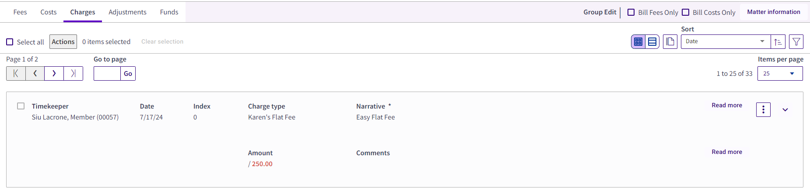

The table below describes the attributes of the charge card:

<table style="width:100%;">
<colgroup>
<col style="width: 19%" />
<col style="width: 80%" />
</colgroup>
<thead>
<tr>
<th><strong>Attribute</strong></th>
<th><strong>Description</strong></th>
</tr>
</thead>
<tbody>
<tr>
<td>Timekeeper</td>
<td>This attribute displays the name of the timekeeper, timekeeper number, and the title of the timekeeper.</td>
</tr>
<tr>
<td><strong>Date</strong></td>
<td>This attribute shows the date of the charge.</td>
</tr>
<tr>
<td><strong>Charge type</strong></td>
<td>This attribute shows the charge type of the charge card.</td>
</tr>
<tr>
<td><strong>Presentation Amount</strong></td>
<td>
This field displays the amount of the flat fee charge(s) on flat fee proformas.

<strong>Note</strong>: The Amount field displays the <em>FlatFee Amount</em> - <em>Total Fee Amount</em>.

For example, if the flat fee charge should be $300 and there are $800 of fees on the proforma, the Presentation Amount on the charge will display $300 and the Amount will display ($500), which is the amount of the flat fee less the total fees with that time type.
</td>
</tr>
<tr>
<td><strong>Amount</strong></td>
<td>The Amount attribute displays the worked amount for the associated timekeeper for this charge entry. To change the amount to be billed, click in the Amount input field and enter the new amount. To update proforma totals based on edits, click the <strong>Save &amp; recalc</strong> button on top of the proforma.</td>
</tr>
<tr>
<td><strong>Narrative</strong></td>
<td>Displays narrative text that is displayed on the bill. Click <strong>Read more/Edit</strong> to display the full text or make changes if using Card View. When using Grid View, click the Narrative field and click the <strong>Expand</strong> icon . See "Card Narrative Fields" on page <a href="#card-narrative-fields">26</a> for further details.</td>
</tr>
<tr>
<td><strong>Comments</strong></td>
<td>
Where desired or if required based on a card action, populate the Comments field with the comment. When the comment field is populated, it becomes read-only with a “Read more/Edit” link. Click the <strong>Read more/Edit</strong> link to edit the comment field in the pop-up.

Information entered into the Comment (bottom) field is for the billing staff and is not displayed on the actual bill.

 
</td>
</tr>
<tr>
<td><strong>Code Fields</strong></td>
<td>
To browse codes, expand the card by clicking the Expand icon .

These fields display the codes associated with the time card, such as: Phase Codes, Task Codes, Activity Codes, and Tax codes.  Phase, Task, and Activity fields display the Code (above) and the Description (below the Code).

<strong>Note:</strong>  If you wish to see the Code fields always displayed, open Settings , and set <strong>Automatically expand code fields</strong> to Yes.
</td>
</tr>
</tbody>
</table>

 

### **Proforma Details – Adjustments Tab**

The Adjustment tab is used to add Adjustment cards used to adjust the amount of the entire proforma total by an amount or a percent. Adjustment cards can also be edited and deleted.

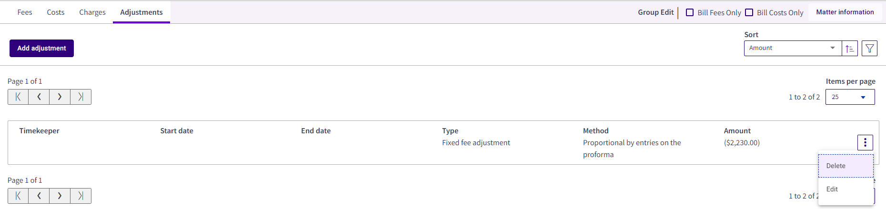

<table style="width:100%;">
<colgroup>
<col style="width: 19%" />
<col style="width: 80%" />
</colgroup>
<thead>
<tr>
<th><strong>Field Name</strong></th>
<th><strong>Description</strong></th>
</tr>
</thead>
<tbody>
<tr>
<td><strong>Add adjustment</strong></td>
<td>Click to create an adjustment for the proforma.</td>
</tr>
<tr>
<td><strong>Timekeeper</strong></td>
<td>Displays the name of the timekeeper whose fees have been adjusted.</td>
</tr>
<tr>
<td><strong>Start date</strong></td>
<td>Displays the start date for which time cards will be considered for the adjustment.</td>
</tr>
<tr>
<td><strong>End date</strong></td>
<td>Displays the end date for which time cards will be considered for the adjustment.</td>
</tr>
<tr>
<td><strong>Type</strong></td>
<td>Displays the apply adjustment type.</td>
</tr>
<tr>
<td><strong>Method</strong></td>
<td>Displays the how the adjustment is applied.</td>
</tr>
<tr>
<td><strong>Amount</strong></td>
<td>Displays the adjusted total.</td>
</tr>
<tr>
<td><strong>Action Menu</strong></td>
<td>
Select one of the adjustment actions as needed.

<ul>
<li>
<strong>Edit</strong> - Select to edit an adjustment.
</li>
<li>
<strong>Delete</strong> - Select to delete an adjustment.
</li>
</ul></td>
</tr>
</tbody>
</table>

### **Proforma Details – Funds Tab**

The Funds tab will display sub-tabs for each type of funds, trust funds and unallocated credit, that are available to be applied to the proforma.

**Trust Tab**

**Unallocated BOA**

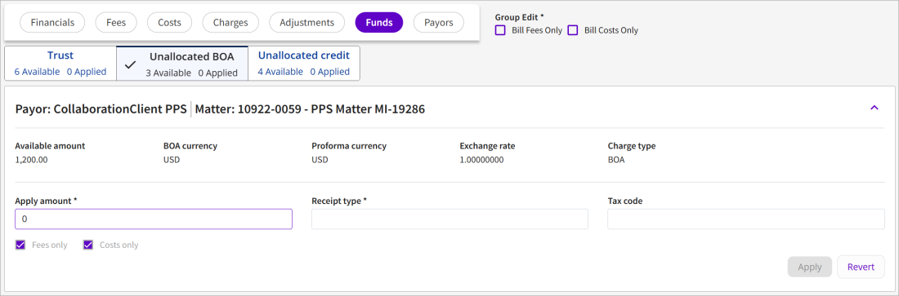

**Unallocated Credit Tab**

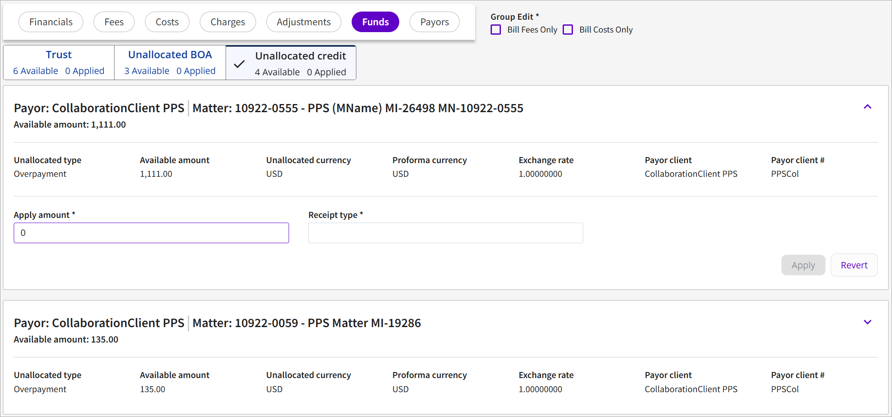

<table style="width:100%;">
<colgroup>
<col style="width: 19%" />
<col style="width: 80%" />
</colgroup>
<thead>
<tr>
<th><strong>Field Name</strong></th>
<th><strong>Description</strong></th>
</tr>
</thead>
<tbody>
<tr>
<td colspan="2"><strong>Trust Tab</strong></td>
</tr>
<tr>
<td><strong>Available amount</strong></td>
<td>Displays the available trust amount.</td>
</tr>
<tr>
<td><strong>Trust currency</strong></td>
<td>Displays the currency used for the trust funds.</td>
</tr>
<tr>
<td><strong>Proforma currency</strong></td>
<td>Displays the currency used for the proforma.</td>
</tr>
<tr>
<td><strong>Exchange rate</strong></td>
<td>Displays the exchange rate used when an amount is applied from a Trust using a currency different from the Proforma's. The rate is based on proforma's invoice date as exchange date and the Firm's currency type.</td>
</tr>
<tr>
<td><strong>Apply Amount</strong></td>
<td>Type the amount to apply.</td>
</tr>
<tr>
<td><strong>Disbursement type</strong></td>
<td>Select the disbursement type used when assembling disbursements for payment on trust checks from this drop-down list.</td>
</tr>
<tr>
<td><strong>Adjustment type</strong></td>
<td>Select the adjustment type for this transaction from the drop-down list. Trust adjustment types are used when processing adjustments to trust accounts, and serve as an identifier as to the type of adjustment being performed, e.g., interest adjustment, bank charges, wire charges, etc.</td>
</tr>
<tr>
<td><strong>Intended use</strong></td>
<td>Displays the Trust Intended Use Code for the disbursement.</td>
</tr>
<tr>
<td><strong>Clear days</strong></td>
<td>Type the number of days it takes for funds to clear the bank.</td>
</tr>
<tr>
<td><strong>Document number</strong></td>
<td>Type the document number that will be used for Trust Disbursement or Trust Adjustment.</td>
</tr>
<tr>
<td><strong>Payee</strong></td>
<td>Type or query to select the account payable payee record for the disbursement check.</td>
</tr>
<tr>
<td><strong>Flag 1099</strong></td>
<td>Select the 1099 flag for this trust transaction from this drop-down list.</td>
</tr>
<tr>
<td><strong>Receipt type</strong></td>
<td>Displays the receipt type from the transaction (e.g., EFT, cash, check).</td>
</tr>
<tr>
<td><strong>Apply</strong></td>
<td>Click to save and apply your settings for the trust disbursement.</td>
</tr>
<tr>
<td><strong>Revert</strong></td>
<td>Click to undo the trust disbursement settings.</td>
</tr>
<tr>
<td colspan="2"><strong>Unallocated BOA Tab</strong></td>
</tr>
<tr>
<td><strong>Available Amount</strong></td>
<td>Displays the BOA (billed on account) amount available for allocation.</td>
</tr>
<tr>
<td><strong>BOA Currency</strong></td>
<td>Displays the currency type used for the amount available for allocation.</td>
</tr>
<tr>
<td><strong>Proforma Currency</strong></td>
<td>Displays the currency used for the proforma.</td>
</tr>
<tr>
<td><strong>Exchange Rate</strong></td>
<td>Displays the exchange rate used when an amount is applied from a BOA using a currency different from the Proforma's. The rate is based on proforma's invoice date as exchange date and the Firm's currency type.</td>
</tr>
<tr>
<td><strong>Charge Type</strong></td>
<td>This read-only field displays a Charge Type that uses a BOA transaction type.</td>
</tr>
<tr>
<td><strong>Apply Amount</strong></td>
<td>Type the amount of the BOA payment that is being applied to the proforma, in the Proforma's currency. The amount cannot be greater than the balance in the account.</td>
</tr>
<tr>
<td><strong>Receipt Type</strong></td>
<td>Select a receipt type from this drop-down list to be used for the transaction.</td>
</tr>
<tr>
<td><strong>Tax Code</strong></td>
<td>Type or query to select a tax code to apply to this billed on account record.</td>
</tr>
<tr>
<td><strong>Fees Only</strong></td>
<td rowspan="2">
The Fees Only and Costs Only fields are read-only. Note, the following:

<ul>
<li>
If Fee Only is selected and Cost Only is not selected, then when the zero payment is processed, the receipt is applied only against fees. An error is generated if the BOA amount selected exceeds the Fees to be paid.
</li>
<li>
If Cost Only is selected and Fee Only is not selected, then the zero payment is processed, the receipt is applied only against costs. An error is generated if the BOA amount selected exceeds the costs to be paid.
</li>
<li>
If both Fee Only and Cost Only are selected or not selected, then BOA is processed as it normally is.
</li>
</ul></td>
</tr>
<tr>
<td><strong>Costs Only</strong></td>
</tr>
<tr>
<td colspan="2"><strong>Unallocated Credits Tab</strong></td>
</tr>
<tr>
<td><strong>Available amount</strong></td>
<td>Displays the credit amount available for allocation.</td>
</tr>
<tr>
<td><strong>Unallocated currency</strong></td>
<td>Displays the currency type used for the amount available for allocation.</td>
</tr>
<tr>
<td><strong>Proforma currency</strong></td>
<td>Displays the currency used for the proforma.</td>
</tr>
<tr>
<td><strong>Exchange rate</strong></td>
<td>Displays the exchange rate.</td>
</tr>
<tr>
<td><strong>Payor client</strong></td>
<td>Displays the payor that will be responsible for the unallocated payment.</td>
</tr>
<tr>
<td><strong>Payor client #</strong></td>
<td>Displays the Client Number associated with the Payor Name.</td>
</tr>
<tr>
<td><strong>Apply Amount</strong></td>
<td>Type the amount of the unallocated payment that is being applied to the proforma, in the Proforma's currency. The amount cannot be greater than the balance in the account.</td>
</tr>
<tr>
<td><strong>Receipt type</strong></td>
<td>Select a receipt type from this drop-down list to be used for the transaction.</td>
</tr>
</tbody>
</table>

### **Proforma Details – Payors Tab**

The Payors tab displays information about the matter's payor(s), including multi-payor details, and Payor by layer information.

**Note**: The Payors tab only displays when the 3E system option [**<u>Allow WF_Prof_Edit_Payor</u>**](file:///C:/Madcap Flare Projects/3E Proforma Help v2/Content/3E Proforma/Admin Guide - OLD/3E Proforma_SysOptions_Overrides.htm#Allow_WF_Prof_Edit_Payor) is set to **View**. Additionally, information displayed in the Payors grid is read-only.

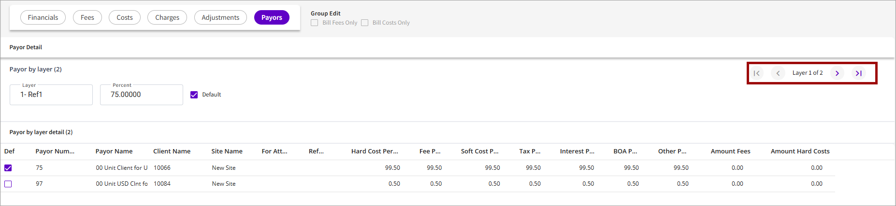

| **Field Name** | **Descriptions** |
|----|----|
| **Payor Number** | Displays the payor's number. |
| **Payor Name** | Displays the name of the payor responsible for a portion of the proforma. |
| **Client Number** | Displays the number of the client assigned to this payor. |
| **Client Name** | Displays the client assigned to this payor. |
| **Site Number** | Displays the number of the payor's billing site. |
| **Site Name** | Displays the name of the billing site for this payor. |
| **Statement Site Number** | Displays the number associated with the statement site. |
| **Statement Site Name** | Displays the site where the matter multi payor’s consolidated statements will be mailed. |
| **For Attention Of** | Displays the payor's contact name. Used as part of 3E's multipayor layors functionality. |
| **Reference Number** | Displays the client's reference for the firm's matter by payor and layer. |
| **Fee Percent** | Displays the percentage of fees that the payor will be responsible for paying. |
| **Hard Cost Percent** | Displays the percentage of hard costs that the payor will be responsible for paying. |
| **Soft Cost Percent** | Displays the percentage of soft costs that the payor will be responsible for paying. |
| **Tax Percent** | Displays the percentage of taxes that the payor will be responsible for paying. |
| **Interest Percent** | Displays the percentage of interest that the payor will be responsible for paying. |
| **BOA Percent** | Displays the percentage of bill on account that this payor will be responsible for paying. |
| **Other Percent** | Displays the percentage of other that this payor will be responsible for paying. |
| **Amount Fees** | Displays the amount of fees that this payor will be responsible for paying. Any amounts due to rounding are assigned to the Default Payor. |
| **Amount Hard Costs** | Displays the amount of hard costs that this payor will be responsible for paying. Any amounts due to rounding are assigned to the Default Payor. |
| **Amount Soft Costs** | Displays the amount of soft costs that this payor will be responsible for paying. Any amounts due to rounding are assigned to the Default Payor. |
| **Amount Taxes** | Displays the amount of soft costs that this payor will be responsible for paying. Any amounts due to rounding are assigned to the Default Payor. |
| **Amount Interest** | Displays the amount of interest that this payor will be responsible for paying. Any amounts due to rounding are assigned to the Default Payor. |
| **Amount BOA** | Displays the amount of bill on account that this payor will be responsible for paying. Any amounts due to rounding are assigned to the Default Payor. |
| **Amount Other** | Displays the amount of other that this payor will be responsible for paying. Any amounts due to rounding are assigned to the Default Payor. |

** **

### **Proforma Details – Billing Contacts Tab**

The Billing Contacts tab displays the information maintained in the **Matter Maintenance \> Billing Contacts child form**, where Salutation and Distribution Email can be added or updated. The Billing Contacts tab displays a read-only view of this information.This tab does not display if there is no billing contact detail in the Matter Maintenance \> Billing Contacts child form.

**Note**: The Billing Contacts tab can only display in Proforma Details view when the [**ProfDetails_Show_BillingContacts**](#1759202834)​ override system option is enabled (i.e., set to True).

| **Field Name** | **Descriptions** |
|----|----|
| **Salutation** | Displays billing contact salutation (e.g., Mr., Mrs., etc.) |
| **Name** | Displays the billing contact's name. |
| **Distribution Email** | Displays the billing contact's email address. |
| **Billing Contact Type** | Displays the role assigned to the contact that describes their function or relationship. |

** **

## Exiting Proforma Detail View

There are multiple ways to exit the Proforma Detail view. The following covers the differences between the main three actions to exit this page.

**Note**: Certain workflow actions such as Mark as Complete, Approve, or Submit will also close the Proforma Detail view and return a user to the Proforma List. The following information only applies to non-workflow actions used to exit this view.

- **Save & Close** - The Save & close button saves all edits made to the proforma, recalculates proforma totals and sends the user back to the list of proformas from which he opened the proforma details. The proforma is unlocked and becomes available to other users.

- **Close** - The owner clicks Close to exit the proforma without saving any changes and remove it from the workflow.

- **Cancel** - Click Cancel to unlock the proforma and cancel all unsaved changes. The proforma details page is closed, and the user is back to the proforma list from which proforma details were opened.

** **

## Reason Code Requested

When you update numeric data and click any of the following actions that save proforma edits, the **Reason code required** pop-up will display.

**Note:** A reason code is required when the 3E System Option **Require_Reason_Code** is set to True.

- Save & recalc

- Save & close

- Submit

- Mark as complete

- Save changes

Do the following when prompted for a reason code:

1.  Make a selection from the **Reason code** drop-down list.

2.  Specify an Authorizing Timekeeper from the **Authorized by** field.

3.  Click **Save & Recalc**. The reason code will be saved in the system for fee, cost, and charges on the proforma. Further saving of proforma edits will not prompt for a reason code.

 

## Add Proforma Instructions

Internal proforma instructions can be added for a Biller to follow.

Do the following to add instructions:

1.  Locate the proforma in the Proforma List and click the proforma number to access the proforma details.

2.  In the header section, click the **Expand** icon  to display the proforma totals section.

3.  Enter text in the **Instructions** field.

4.  Click **Save & Close**.

 

## Add Invoice Narrative

Click Invoice Narrative to enter text that will display in the preface of the bill sent to the client. The invoice narrative is added in the displayed pop-up.

Do the following to add an invoice narrative:

1.  Click the number of a proforma listed in the Proforma List view.

2.  Select **Invoice Narrative** from the proforma-level **Action** menu in the Proforma Detail view.

3.  Type text in the narrative field.

4.  Click **Save**.

## Approve or Reject Proformas

**Note**: You must be logged into 3E Proforma with approval rights to approve a proforma.

### **Approve Proforma**

Do the following to approve a proforma

1.  Click on the number of a proforma displayed in the Proforma list to access the proforma details.

2.  Review the changes that have been made to the proforma.

3.  Select **Approve** from the **Proforma Action** menu. A message displays that "Proforma XXXX has been approved." The proforma is removed from the list of *Needs review* and is sent to the Billing department.

### **Reject Proforma**

Do the following to reject a proforma

1.  Click on the number of a proforma displayed in the Proforma list to access the proforma details.

2.  Review the changes that have been made to the proforma.

3.  Select **Reject** from the **Proforma Action** menu. A message displays that "Proforma XXXX has been successfully returned." The proforma is removed from the list of Needs review and is returned to the Billing Attorney.

## Reclaim Proforma

You can reclaim a proforma that was submitted to the Accounting department in error. However, you must reclaim the proforma before it has been opened by the Accounting department or invoiced.

Do the following to reclaim a proforma:

1.  Click the **Completed proformas** or the **Approval pending** categories in the Proforma List view.

2.  Click the number of a submitted proforma in the list.

3.  Select **Reclaim** from the proforma-level **Action** menu in the Proforma Detail view.

**Note**: If the proforma has been opened by the biller or receiver, the following message displays.

 

## Add Fees

### **About Add Fees**

The Add Fee feature enables you to add time entries to proformas.

 

### **Add Fee Card to Proforma**

Do the following to add a fee card to a proforma:

1.  Locate the proforma containing funds on the Proforma list.

2.  Click the proforma number to access the Proforma Details view.

3.  Click the proforma-level **Action** menu and select **Add fee**.

4.  Enter the required details in the *Add fee* window. See "Add Fee Form and Field Definitions" on page [73](#add-fee-form-and-field-definitions) for further details on available entry options.

5.  Click **Add Fee** to save changes and exit the pop-up. The new card will be added to the list on the **Fee** tab.

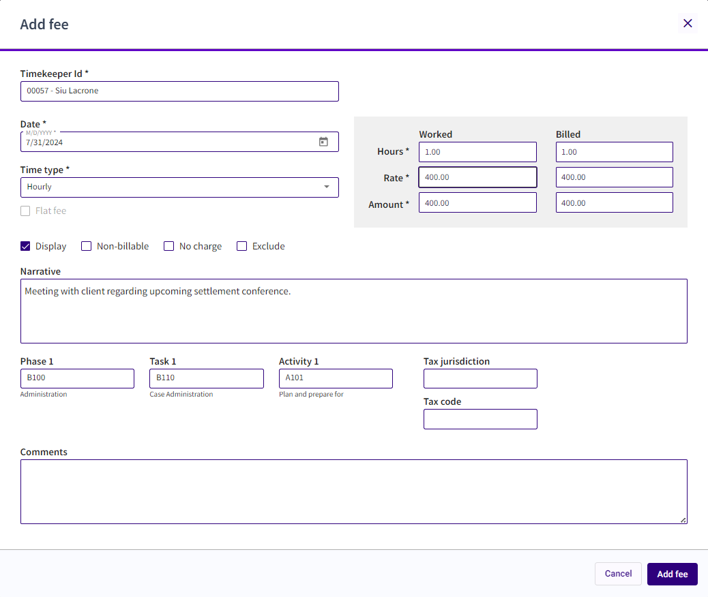

 

### **Add Fee Form and Field Definitions**

The Add Fee form is used to add a fee entry to a proforma.

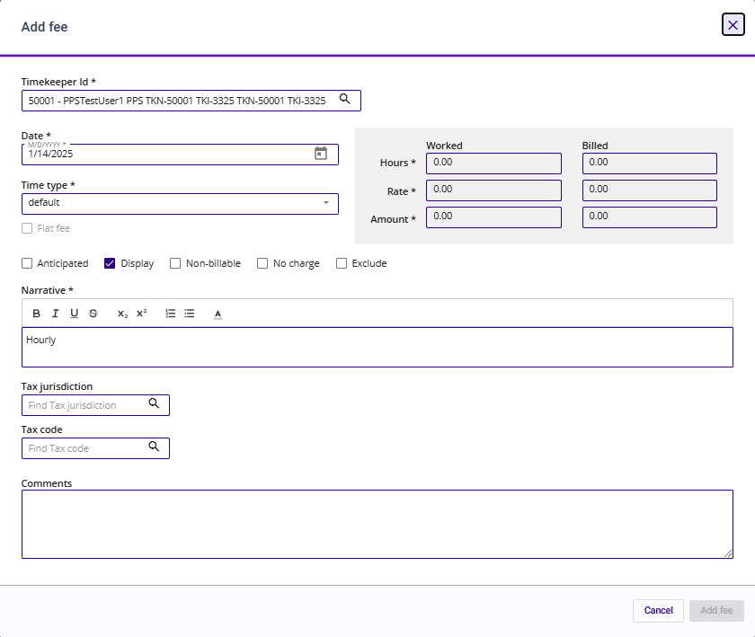

<table style="width:96%;">
<colgroup>
<col style="width: 30%" />
<col style="width: 65%" />
</colgroup>
<thead>
<tr>
<th><strong>Field Name</strong></th>
<th><strong>Descriptions</strong></th>
</tr>
</thead>
<tbody>
<tr>
<td><strong>Timekeeper ID</strong></td>
<td>Type or query to select the time card’s working timekeeper.</td>
</tr>
<tr>
<td><strong>Date</strong></td>
<td>Type or select the time card's work date.</td>
</tr>
<tr>
<td><strong>Time type</strong></td>
<td>Select the time type to use for this time entry from this drop-down list. Time types are descriptive codes used to group and summarize timecard records, e.g., Employee Benefits/Pensions.</td>
</tr>
<tr>
<td><strong>Flate fee</strong></td>
<td>
The read-only check box is selected if the time type is a flat fee type.

<strong>Note</strong>: If a flat fee is set up with multiple currencies, the specified currencies will be applied during the proformas generation process.
</td>
</tr>
<tr>
<td><strong>Hours (Worked)</strong></td>
<td>Type the number of worked hours. The bill hours defaults to the value entered in the worked hours. If you want to type an amount other than the default, type over the existing value with the new value.</td>
</tr>
<tr>
<td><strong>Hours (Billed)</strong></td>
<td>Type the hours that the timekeeper worked on the matter and will be billed on this proforma.</td>
</tr>
<tr>
<td><strong>Rate (Worked)</strong></td>
<td>Type the rate the timekeeper bills per hour for work on this matter.</td>
</tr>
<tr>
<td><strong>Rate (Bill )</strong></td>
<td>Type the rate the timekeeper bills per hour for work on this matter.</td>
</tr>
<tr>
<td><strong>Amount (Worked)</strong></td>
<td>The system performs the calculation as follows: Hours x Rate = Amount .</td>
</tr>
<tr>
<td><strong>Amount (Bill)</strong></td>
<td>The system performs the calculation as follows: Bill Hours x Bill Rate = Bill Amount .</td>
</tr>
<tr>
<td><strong>Anticipated</strong></td>
<td>
Select the check box to indicate this entry is anticipated. The time card will have the <strong>Anticipated</strong> box in 3E selected when the card is added/submitted. See the <a href="https://help.elite.com/3ehelp/Subsystems/Elite 3E Billing Transactions Guide/Anticipated_Entries.htm"><u>3E Billing Transactions Guide</u></a> for further details on Anticipated fees.

<strong>Note</strong>: If this check box is selected, the Proforma cannot be saved unless an Anticipated Payee is selected.
</td>
</tr>
<tr>
<td><strong>Display</strong></td>
<td>Select the check box if this record will display on a bill.</td>
</tr>
<tr>
<td><strong>Non-billable</strong></td>
<td>Select the check box to indicate that the proforma detail record is not a billable item.</td>
</tr>
<tr>
<td><strong>No charge</strong></td>
<td>Select the check box to indicate that the proforma detail record is not a billable item.</td>
</tr>
<tr>
<td><strong>Exclude</strong></td>
<td>Select this check box to indicate that the proforma detail record will be removed from the proforma when work value changes are processed.</td>
</tr>
<tr>
<td><strong>AI Narrative</strong></td>
<td>
Click this button to generate a narrative from values in the <strong>Phase</strong>, <strong>Task</strong>, and <strong>Activity</strong> fields. The AI Narrative will review the provided PTA codes on the card and the last 15 historical time cards that have the same code(s) and suggest a narrative. Edit the suggested narrative as needed.

<strong>Note</strong>: This button is unavailable when the Phase 1, Task 1, and Activity 1 code fields are empty.

<strong>Note</strong>: This feature enabled by default. To disable it, the 3E Override/Set System Option <strong>AI Group &gt; 3EProforma_Show_AI_Narrative</strong> must be set to <strong>False</strong>. By default, the option is set to True (visible). See <a href="https://help.elite.com/3ehelp/3Ehelp.htm#Subsystems/Elite 3E Administration Guide/AI Overrides &amp; System Options.htm"><u>AI Overrides &amp; System Options</u></a> in the <em>3E Administration Guide</em> for further details.
</td>
</tr>
<tr>
<td><strong>AI PTA</strong></td>
<td>
Click this button to suggest Phase 1, Task 1, and Activity 1 code(s) as required on the matter based on the text in the Narrative compared to historical time cards on the matter. The Edit the suggested PTA codes as needed.

<strong>Note</strong>: This button is unavailable when the Narrative field is empty.

<strong>Note</strong>: This button can be disabled in Override/Set System Options in the AI Groupà3EProforma_Show_AI_PTACodes option. By default, the option is set to True (visible). See <a href="https://help.elite.com/3ehelp/3Ehelp.htm#Subsystems/Elite 3E Administration Guide/AI Overrides &amp; System Options.htm"><u>AI Overrides &amp; System Options</u></a> in the <em>3E Administration Guide</em> for further details.
</td>
</tr>
<tr>
<td><strong>Narrative</strong></td>
<td>Type a narrative for the time card.</td>
</tr>
<tr>
<td><strong>Phase 1</strong></td>
<td>Type or query to select the phase for which the time was worked. This field is disabled if the matter associated with this time entry has no PTA group.</td>
</tr>
<tr>
<td><strong>Task 1</strong></td>
<td>Type or query to select the task for which the time was worked. This field is disabled if the matter associated with this time entry has no PTA group.</td>
</tr>
<tr>
<td><strong>Activity 1</strong></td>
<td>Type or query to select the activity for which the time was worked. This field is disabled if the matter associated with this time entry has no PTA group.</td>
</tr>
<tr>
<td><strong>Phase 2</strong></td>
<td rowspan="3">Type or query to select a second set of PTA group for use on time cards.</td>
</tr>
<tr>
<td><strong>Task 2</strong></td>
</tr>
<tr>
<td><strong>Activity 2</strong></td>
</tr>
<tr>
<td><strong>Tax jurisdiction</strong></td>
<td>From the drop-down list, select the time's tax jurisdiction.</td>
</tr>
<tr>
<td><strong>Tax code</strong></td>
<td>Type or query to select the time's tax code.</td>
</tr>
<tr>
<td><strong>Comments</strong></td>
<td>Type comments about the proforma.</td>
</tr>
</tbody>
</table>

 

## Add Costs

### **About Add Cost**

The Add Cost feature enables you to add cost entries to proformas.

 

### **Add Cost to Proforma**

Do the following to add a cost card to a proforma:

1.  Locate the proforma containing funds on the Proforma list.

2.  Click the proforma number to access the Proforma Details view.

3.  Click the proforma-level **Action** menu and select **Add cost**.

4.  Enter the required details in the Add cost window.

5.  Click **Add cost** to save changes and exit the pop-up. The new card will be added to the list on the **Cost** tab.

 

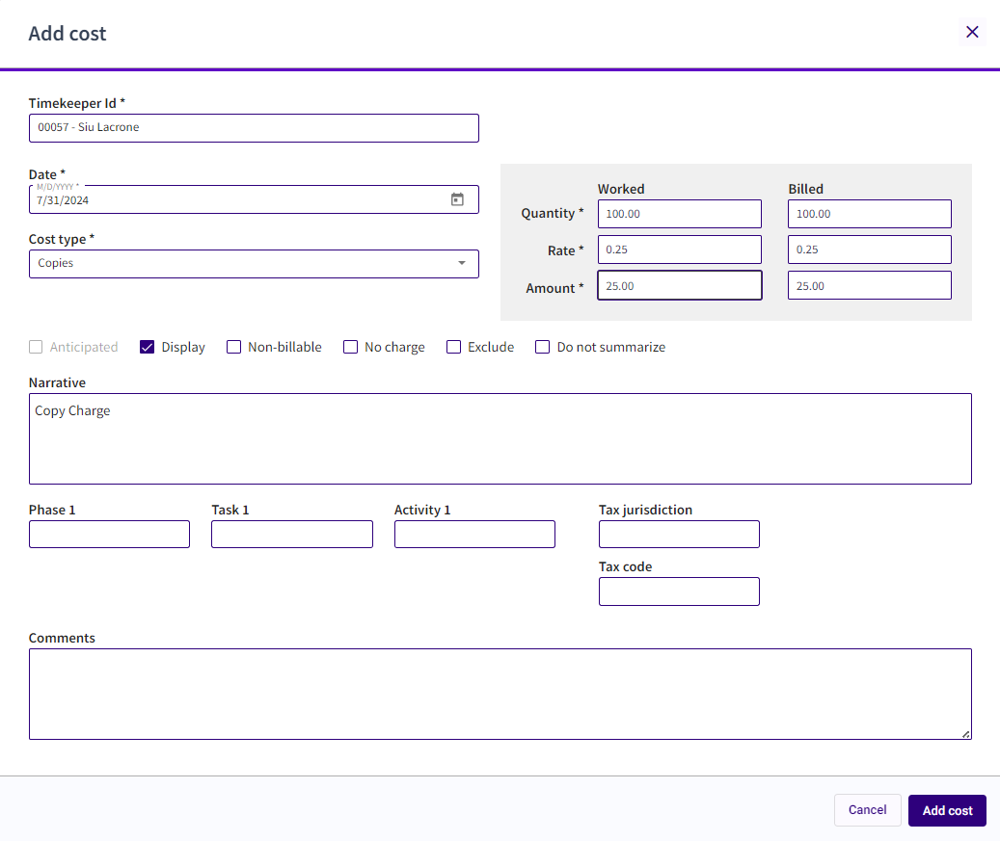

 

### **Add Cost Form and Field Definitions**

Use the Add Cost form to add a cost entry to a proforma.

<table style="width:96%;">
<colgroup>
<col style="width: 30%" />
<col style="width: 65%" />
</colgroup>
<thead>
<tr>
<th><strong>Field Name</strong></th>
<th><strong>Description</strong></th>
</tr>
</thead>
<tbody>
<tr>
<td><strong>Timekeeper ID</strong></td>
<td>Type or query to select the cost card’s working timekeeper.</td>
</tr>
<tr>
<td><strong>Date*</strong></td>
<td>Type or select the cost card's work date.</td>
</tr>
<tr>
<td><strong>Cost type*</strong></td>
<td>Type or query to select the cost type to use for the cost entry. Cost types are descriptive codes used to speed up the entry of cost information by allowing the user to retrieve the cost description by entering a cost type code.</td>
</tr>
<tr>
<td><strong>Quantity (Worked)</strong></td>
<td>Type the cost card's worked quantity.</td>
</tr>
<tr>
<td><strong>Quantity (Billed)</strong></td>
<td>Type the quantity that applies to the cost.</td>
</tr>
<tr>
<td><strong>Rate (Worked)</strong></td>
<td>Type the rate used to calculate the work amount at the time the proforma detail was worked.</td>
</tr>
<tr>
<td><strong>Rate (Billed)</strong></td>
<td>Type the rate to use to calculate the work amount.</td>
</tr>
<tr>
<td><strong>Amount (Worked)</strong></td>
<td>The system performs the calculation as follows: Quantity x Rate = Amount.</td>
</tr>
<tr>
<td><strong>Amount (Billed)</strong></td>
<td>The system performs the calculation as follows: Bill Quantity x Bill Rate = Bill Amount.</td>
</tr>
<tr>
<td><strong>Anticipated</strong></td>
<td>
Select the check box to indicate this entry is anticipated. This option displays when a cost type that is designated for anticipated costs is selected. You will be required to populate the <strong>Anticipated Payee</strong> field so that the voucher can be matched appropriately.

See the <a href="https://help.elite.com/3ehelp/Subsystems/Elite 3E Billing Transactions Guide/Anticipated_Entries.htm"><u>3E Billing Transactions Guide</u></a> for further details on Anticipated fees.

 

<strong>Note</strong>: If this check box is selected, the Proforma cannot be saved unless an Anticipated Payee is selected.
</td>
</tr>
<tr>
<td><strong>Display</strong></td>
<td>Select the check box if this record will display on a bill.</td>
</tr>
<tr>
<td><strong>Non-billable</strong></td>
<td>Select the check box to indicate that the proforma detail record is not a billable item.</td>
</tr>
<tr>
<td><strong>No charge</strong></td>
<td>Select the check box to indicate that the entry's value is no charge.</td>
</tr>
<tr>
<td><strong>Exclude</strong></td>
<td>Select the check box to indicate that the proforma detail record will be removed from the proforma when work value changes are processed.</td>
</tr>
<tr>
<td><strong>Do not summarize</strong></td>
<td>Select this check box to indicate the cost is not to be summarized on the bill. This overrides selections set on the cost type as well as on the matter record.</td>
</tr>
<tr>
<td><strong>Narrative*</strong></td>
<td>Type a narrative for the cost card.</td>
</tr>
<tr>
<td><strong>Phase 1</strong></td>
<td>Type or query to select the phase for which the cost was incurred. This field is disabled if the matter associated with this cost entry has no PTA group.</td>
</tr>
<tr>
<td><strong>Task 1</strong></td>
<td>Type or query to select the task for which the cost was incurred. This field is disabled if the matter associated with this cost entry has no PTA group.</td>
</tr>
<tr>
<td><strong>Activity 1</strong></td>
<td>Type or query to select the activity for which the cost was incurred. This field is disabled if the matter associated with this cost entry has no PTA group.</td>
</tr>
<tr>
<td><strong>Phase 2</strong></td>
<td rowspan="3">Type or query to select a second set of PTA group for use on cost cards.</td>
</tr>
<tr>
<td><strong>Task 2</strong></td>
</tr>
<tr>
<td><strong>Activity 2</strong></td>
</tr>
<tr>
<td><strong>Tax jurisdiction</strong></td>
<td>From the drop-down list, select the cost's tax jurisdiction.</td>
</tr>
<tr>
<td><strong>Tax code</strong></td>
<td>Type or query to select the cost's tax code.</td>
</tr>
<tr>
<td><strong>Anticipated payee</strong></td>
<td>
Select a payee from this drop-down list to be used in the Voucher process.

<strong>Note</strong>: Cost cannot be posted unless an Anticipated Payee is selected. When an Anticipated Payee is not selected a hard cost entry is set to pending.
</td>
</tr>
<tr>
<td><strong>Comments</strong></td>
<td>Type comments about the proforma. These comments are for internal firm use only and do not display on the bill.</td>
</tr>
</tbody>
</table>

 

## Managing Cards

### **Exclude Cards**

Do the following to exclude a card from a proforma:

**Note**: If a change was made to the card’s billable amounts, and then the proforma action is ‘Exclude’, the edited billable amount is cleared, and the time card displays the correct billable amount.

1.  Locate the proforma containing funds on the Proforma list.

2.  Click the proforma number to access the Proforma Details view.

3.  Click the appropriate tab (i.e., Fees, Costs, or Charge)

4.  Click the card-level **Action** menu and select **Exclude**.

5.  Click **Save & Close**.

**Note**: Whether the 3E Proforma action of Exclude is automatically loaded into 3E in Proforma Edit depends on the “Commit_cardactions” setting in core 3E. If the setting is set to **False**, a biller will be required to review and finalize the Exclude action in Proforma Edit by clicking on ProcExlude action. If the setting is set to **True**, the Exclude action is performed automatically in 3E Proforma on the Save & recalc/Save & close/Submit actions.

 

### **Transfer Cards**

Do the following to designate cards to be transfered:

1.  Locate the proforma containing funds on the Proforma list.

2.  Click the proforma number to access the Proforma Details view.

3.  Click the appropriate tab (i.e., Fees, Costs, or Charge)

4.  Click the card-level **Action** menu and select **Transfer**.

5.  Specify the attributes of the matter/proforma to which the card will be transferred.

**Note**: The matter list in the Transfer window will only display open and available matters so that you will not be able to choose a closed matter by mistake.

6.  Click **Save & Close**.

**Note**: Whether the 3E Proforma action of Transfer is automatically loaded into 3E in Proforma Edit depends on the “Commit_cardactions” setting in core 3E. If the setting is set to **False**, a biller will be required to review and finalize the Transfer action in Proforma Edit by clicking on ProcTransfer action. If the setting is set to **True**, the Transfer action is performed automatically in 3E Proforma on the Save & recalc/Save & close/Submit actions.

 

### **Change Card Status to No Charge**

The action updates the card to BNC and reduces the bill amount to zero.

**Note**: Bill hours are not changed. If a change was made to the proforma billable amounts and the proforma action is ‘No Charge’, the billable amount camount charges are ignored.

Do the following to change a card's status to BNC (Bill no charge) or NC (no charge) and reduces the bill amount to zero.

1.  Locate the proforma containing funds on the Proforma list.

2.  Click the proforma number to access the Proforma Details view.

3.  Click the appropriate tab (i.e., Fees, Costs, or Charge)

4.  Click the card-level **Action** menu and select **No Charge**.

5.  Click **Save & Close**.

 

### **Set Card Status to Bill No Print**

3E Proforma provides the ability to include a card on a bill (i.e., include the amounts in the bill totals) without printing it on the bill. This is done by setting the card's status to *Bill No Print*.

Do the following to set a card's status to Bill no print (BNP).

**Note**: If a change was made to the proforma billable amounts and the proforma action is ‘BNP’, it will update the billable amount and calculate the correct billable units.

1.  Locate the proforma containing funds on the Proforma list.

2.  Click the proforma number to access the Proforma Details view.

3.  Click the appropriate tab (i.e., Fees, Costs, or Charge)

4.  Click the card-level **Action** menu and select **Bill no print**.

5.  Click **Save & recalc**.

### **Update Card Purge Type**

Do the following to reduce a card's values to zero and updates the Purge Type.

**Note**: If a change was made to the proforma billable amounts and the proforma **Purge** action is selected, the billable amount changes are ignored.

1.  Locate the proforma containing funds on the Proforma list.

2.  Click the proforma number to access the Proforma Details view.

3.  Click the appropriate tab (i.e., Fees, Costs, or Charge)

4.  Click the card-level **Action** menu and select **Purge**.

5.  Select a purge type and click **Purge**.

6.  Click **Save & Close**.

 

### **Combine Cards**

Do the following to combine selected cards into a new cart.

**Note**: Whether the 3E Proforma action of Combine is automatically loaded into 3E in Proforma Edit depends on the “Commit_cardactions” setting in core 3E. If the setting is set to **False**, a biller will be required to review and finalize the Combine action in Proforma Edit by clicking on ProcTransfer or ProcExlude action. If the setting is set to **True**, the Combine action is performed automatically in 3E Proforma on the Save & recalc/Save & close/Submit actions.

1.  Locate the proforma containing funds on the Proforma list.

2.  Click the proforma number to access the Proforma Details view.

3.  Click the appropriate tab (i.e., Fees, Costs, or Charge).

4.  Select two or more cards to combine.

5.  Click the card-level **Action** menu and select **Combine**

6.  Select attributes to apply in the card resulting from the combining.

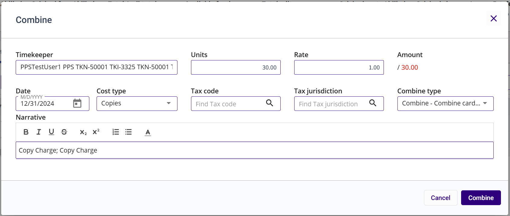

7.  Click **Combine**.

8.  Click **Save & Close**.

### **Divide Entries**

#### About Divide Cards

After time and cost entries have been included in a proforma, the worked and billed hours on the original entry can be divided. The purpose of dividing time and/or cost entries is to exclude them from the proforma, or to partially purge a record.

Calculated charge entries, i.e., taxes, interest, BOA, flat fees, markups, etc., cannot be divided; however, charge entries entered directly, i.e., as anticipated time/costs, etc, can be divided in the same manner as time and cost entries. One or multiple entries can be created for the divided amounts. The original entry is changed to the new reduced value. In addition, the divided entries can be optionally transferred to another proforma.

 

#### Divide Cards

Do the following to flag a card to be divided. Divided cards can be moved to another proforma, kept on the current proforma, or purged.

**Note:** Whether the 3E Proforma action of Divide is automatically loaded into 3E in Proforma Edit depends on the “Commit_cardactions” setting in core 3E. If the setting is set to **False**, a biller will be required to review and finalize the Divide action in Proforma Edit by clicking on ProcTransfer or ProcExlude action. If the setting is set to **True**, the Divide action is performed automatically in 3E Proforma on the Save & recalc/Save & close/Submit actions.

1.  Locate the proforma containing funds on the Proforma list.

2.  Click the proforma number to access the Proforma Details view.

3.  Click the appropriate tab (i.e., Fees, Costs, or Charge).

4.  Click the card-level **Action** menu for a listed card and select **Divide**.

**Note**: The **Divide** option is not available on the card list batch-Action menu.

5.  Select settings to apply when the card is divided. See "Divide Card Form and Field Definitions" on page [85](#divide-card-form-and-field-definitions) for details.

**Note**: Options available on the Divide form will vary by card type.

6.  Click **Divide**.

7.  Click **Save & Close**.

 

#### Divide Card Form and Field Definitions

This form is used to generate divided cards (e.g., Time or Costs) that can be moved to another proforma, kept on the current proforma, or purged.

[<u>Time Divide Form and Field Definitions</u>](#time-divide-form-and-field-definitions)

[<u>Cost Divide Form and Field Definitions</u>](#cost-divide-form-and-field-definitions)

[<u>Charge Divide Form and Field Definitions</u>](#charge-divide-form-and-field-definitions)

 

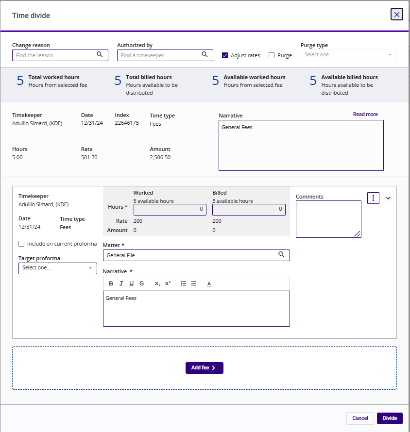

##### *Time Divide Form and Field Definitions*

Fields preceded with an asterisk in the table below are required.

<table style="width:96%;">
<colgroup>
<col style="width: 30%" />
<col style="width: 65%" />
</colgroup>
<thead>
<tr>
<th><strong>Field Name</strong></th>
<th><strong>Description</strong></th>
</tr>
</thead>
<tbody>
<tr>
<td><strong>Change Reason</strong></td>
<td>Type or query to select the reason for dividing this entry.</td>
</tr>
<tr>
<td><strong>Authorized by</strong></td>
<td>Type or query to select the authorizing party for the dividing of this entry.</td>
</tr>
<tr>
<td><strong>Adjust rates</strong></td>
<td>If the check box is selected, then the associated work and/or bill rate is adjusted in the Time <a href="#-883071847"><u>Divide List</u></a>.</td>
</tr>
<tr>
<td><strong>Purge</strong></td>
<td>Select the check box to divide the entry, and then purge the remaining value.</td>
</tr>
<tr>
<td><strong>Purge type</strong></td>
<td>From the drop-down list, select the purge type when purging the remaining value.</td>
</tr>
<tr>
<td><strong>Timekeeper</strong></td>
<td>The timekeeper for the matter displays. The timekeeper display name is in the next field.</td>
</tr>
<tr>
<td><strong>Date</strong></td>
<td>The work date for this entry displays for informational purposes only.</td>
</tr>
<tr>
<td><strong>Index</strong></td>
<td>The card index for this entry displays for informational purposes only.</td>
</tr>
<tr>
<td><strong>Time Type</strong></td>
<td>Displays the descriptive code used for this entry (e.g., Fees, hourly, etc.).</td>
</tr>
<tr>
<td><strong>Hours/Units</strong></td>
<td>The actual worked values (hours/Units) for the card entry display for informational purposes only.</td>
</tr>
<tr>
<td><strong>Rate</strong></td>
<td>The actual worked rate value for the card entry display for informational purposes only.</td>
</tr>
<tr>
<td><strong>Amount</strong></td>
<td>The actual worked amount value for the card entry display for informational purposes only.</td>
</tr>
<tr>
<td><strong>Narrative</strong></td>
<td>The narrative from the original time entry is displayed; however, it can be edited.</td>
</tr>
<tr>
<td colspan="2"><strong>Time Divide List</strong></td>
</tr>
<tr>
<td><strong>Timekeeper</strong></td>
<td>The timekeeper for the matter displays. The timekeeper display name is in the next field.</td>
</tr>
<tr>
<td><strong>Date</strong></td>
<td>The work date for this entry</td>
</tr>
<tr>
<td><strong>Time Type</strong></td>
<td>Displays the descriptive code used for this entry (e.g., Fees).</td>
</tr>
<tr>
<td><strong>Include on current proforma</strong></td>
<td>Select this check box to leave the divided entries on the current proforma after Process Transfers is performed. Leave this check box clear to transfer the entries to another proforma.</td>
</tr>
<tr>
<td><strong>Target proforma</strong></td>
<td>Type or query to select a destination proforma if the divided amounts are to be transferred to a different matter. If no destination proforma is indicated, the new entry remains on the matter.</td>
</tr>
<tr>
<td><strong>*Work Hours/Bill Hours</strong></td>
<td>
Type the worked hours to be subtracted from the existing entry and added to the new entry. This is the number of hours that will be excluded from the proforma. When hours are entered, the amount adjusts.

The bill hours defaults to the value entered in the worked hours. If you want to type an amount other than the default, type over the existing value with the new value.

<strong>Note</strong> : Both the Work and Bill Hours cannot exceed the original work and bill Hours on the proforma. Negative amounts and hours are not allowed.
</td>
</tr>
<tr>
<td><strong>Work Rate/Bill Rate</strong></td>
<td>This read-only field displays the fee rate per hour for the destination matter that displays in the child form. If a different destination is entered than the original matter, there could be a different rate. If the <strong>Adjust Rate</strong> check box is selected, then the divided timecard reflects the destinations matter's rate. To have the divided timecard reflect the original matter, de-select the <strong>Adjust</strong> Rate check and click <strong>Recalc Rate</strong> .</td>
</tr>
<tr>
<td><strong>*Work Amount/Bill Amount</strong></td>
<td>
This is the fee amount that will be excluded from the proforma. When the hours and rate are changed, the amount also changes. The hours must be entered first.

The bill amount defaults to the value entered in the work hours. If you want to type an amount other than the default, type over the existing value with the new value.

<strong>Note</strong>: Both the Work Amount and Bill Amount cannot exceed the original work and bill amounts on the proforma.
</td>
</tr>
<tr>
<td><strong>Matter</strong></td>
<td>The matter for this proforma displays. To divide the entry to a different matter, type or <u>query to select</u> the destination matter.</td>
</tr>
<tr>
<td><strong>Narrative</strong></td>
<td>The narrative on the original time card is duplicated on the new entry; however, you can type a new narrative.</td>
</tr>
<tr>
<td><strong>Comments</strong></td>
<td>Type text to add a comment on this card entry.</td>
</tr>
<tr>
<td><strong>Action Menu</strong></td>
<td>
The following options are available on this Action menu:

<ul>
<li>
<strong>No charge</strong> - Select to set the card's status to BNC (Bill no charge) or NC (no charge).
</li>
<li>
<strong>Non-billable</strong> - Select to flag the card as non-billable. This action reduces the hours and amount to zero. In 3E, the card will be marked for Excluded and Non Billable.
</li>
<li>
<strong>Recalc rate</strong> - Select to reset the time rate to the rate associated with the time entry's matter and recalculate the value of the time entry based on the matter’s rate.
</li>
</ul></td>
</tr>
<tr>
<td><strong>Add Fee</strong></td>
<td>Click to add a new card entry.</td>
</tr>
</tbody>
</table>

 

##### *Cost Divide Form and Field Definitions*

Fields preceded with an asterisk in the table below are required.

<table style="width:96%;">
<colgroup>
<col style="width: 30%" />
<col style="width: 65%" />
</colgroup>
<thead>
<tr>
<th><strong>Field Name</strong></th>
<th><strong>Description</strong></th>
</tr>
</thead>
<tbody>
<tr>
<td><strong>Change Reason</strong></td>
<td>Type or query to select the reason for dividing this entry.</td>
</tr>
<tr>
<td><strong>Authorized by</strong></td>
<td>Type or query to select the authorizing party for the dividing of this entry.</td>
</tr>
<tr>
<td><strong>Adjust rates</strong></td>
<td>If the check box is selected, then the associated work and/or bill rate is adjusted in the Time <a href="#-883071847"><u>Divide List</u></a>.</td>
</tr>
<tr>
<td><strong>Purge</strong></td>
<td>Select the check box to divide the entry, and then purge the remaining value.</td>
</tr>
<tr>
<td><strong>Purge type</strong></td>
<td>From the drop-down list, select the purge type when purging the remaining value.</td>
</tr>
<tr>
<td><strong>Timekeeper</strong></td>
<td>The timekeeper for the matter displays.</td>
</tr>
<tr>
<td><strong>Date</strong></td>
<td>The work date for this entry displays for informational purposes only.</td>
</tr>
<tr>
<td><strong>Index</strong></td>
<td>The card index for this entry displays for informational purposes only.</td>
</tr>
<tr>
<td>
<strong>Cost Type</strong>

<strong> </strong>
</td>
<td>Displays the descriptive code used for this entry (e.g., Copies.).</td>
</tr>
<tr>
<td><strong>Units</strong></td>
<td>The actual worked units value for the card entry display for informational purposes only.</td>
</tr>
<tr>
<td><strong>Rate</strong></td>
<td>The actual worked rate value for the card entry display for informational purposes only.</td>
</tr>
<tr>
<td><strong>Amount</strong></td>
<td>The actual worked amount value for the card entry display for informational purposes only.</td>
</tr>
<tr>
<td><strong>Narrative</strong></td>
<td>The narrative from the original time entry is displayed; however, <a href="#card-narrative-fields"><u>it can be edited</u></a>.</td>
</tr>
<tr>
<td colspan="2"><strong>Costs Divide List</strong></td>
</tr>
<tr>
<td><strong>Timekeeper</strong></td>
<td>The timekeeper for the matter displays. The timekeeper display name is in the next field.</td>
</tr>
<tr>
<td><strong>Date</strong></td>
<td>The work date for this entry</td>
</tr>
<tr>
<td><strong>Cost Type</strong></td>
<td>Displays the descriptive code used for this entry (e.g., Fees, hourly, etc.).</td>
</tr>
<tr>
<td><strong>Include on current proforma</strong></td>
<td>Select this check box to leave the divided entries on the current proforma after Process Transfers is performed. Leave this check box clear to transfer the entries to another proforma.</td>
</tr>
<tr>
<td><strong>Target proforma</strong></td>
<td>Type or query to select a destination proforma if the divided amounts are to be transferred to a different matter. If no destination proforma is indicated, the new entry remains on the matter.</td>
</tr>
<tr>
<td><strong>*Work Quantity/Bill Quantity</strong></td>
<td>
Type the quantity to be subtracted from the existing entry and added to the new entry. This is the amount that will be excluded from the proforma. When quantity is entered, the amount adjusts. The rate adjusts to the destination matter's rate if the <strong>Adjust Rate</strong> check box is selected.

The bill quantity defaults to the value entered in the work quantity. If you want to type an quantity other than the default, type over the existing value with the new value.

<strong>Note</strong>: Both the Work and Bill Quantity cannot exceed the original work and bill Quantity on the proforma. Negative amounts and hours are not allowed.
</td>
</tr>
<tr>
<td><strong>*Work Amount/Bill Amount</strong></td>
<td>
This is the cost amount that will be excluded from the proforma. When the quantity and rate are changed, the amount also changes. The quantity must be entered first.

The bill amount defaults to the value entered in the work hours. If you want to type an amount other than the default, type over the existing value with the new value.

<strong>Note</strong>: Both the Work Amount and Bill Amount cannot exceed the original work and bill amounts on the proforma.
</td>
</tr>
<tr>
<td><strong>Matter</strong></td>
<td>The matter for this proforma displays. To divide the entry to a different matter, type or <u>query to select</u> the destination matter. The matter name and the client name display in the boxes next to this field.</td>
</tr>
<tr>
<td><strong>Narrative</strong></td>
<td>The narrative on the original cost card is duplicated on the new entry; however, you can type a new narrative.</td>
</tr>
<tr>
<td><strong>Comments</strong></td>
<td>Type text to add a comment on this card entry.</td>
</tr>
<tr>
<td><strong>Action Menu</strong></td>
<td>
Options:

<ul>
<li>
<strong>No charge</strong> - Select to set the card's status to BNC (Bill no charge) or NC (no charge).
</li>
<li>
<strong>Non-billable</strong> - Select to flag the card as non-billable. This action reduces the hours and amount to zero. In 3E, the card will be marked for Excluded and Non Billable.
</li>
<li>
<strong>Recalc rate</strong> - Select to reset the cost rate to the rate associated with the cost entry's matter and recalculate the value of the cost entry based on the matter’s rate.
</li>
</ul></td>
</tr>
<tr>
<td><strong>Add Cost</strong></td>
<td>Click to add a new card entry.</td>
</tr>
</tbody>
</table>

 

##### *Charge Divide Form and Field Definitions*

The following is the standard Charge Divide form.

Fields preceded with an asterisk in the table below are required.

<table style="width:96%;">
<colgroup>
<col style="width: 30%" />
<col style="width: 65%" />
</colgroup>
<thead>
<tr>
<th><strong>Field Name</strong></th>
<th><strong>Description</strong></th>
</tr>
</thead>
<tbody>
<tr>
<td><strong>Change Reason</strong></td>
<td>Type or query to select the reason for dividing this entry.</td>
</tr>
<tr>
<td><strong>Authorized by</strong></td>
<td>Type or query to select the authorizing party for the dividing of this entry.</td>
</tr>
<tr>
<td><strong>Adjust rates</strong></td>
<td>If the check box is selected, then the associated work and/or bill rate is adjusted in the Time <a href="#-883071847"><u>Divide List</u></a>.</td>
</tr>
<tr>
<td><strong>Purge</strong></td>
<td>Select the check box to divide the entry, and then purge the remaining value.</td>
</tr>
<tr>
<td><strong>Purge type</strong></td>
<td>From the drop-down list, select the purge type when purging the remaining value.</td>
</tr>
<tr>
<td><strong>Timekeeper</strong></td>
<td>The timekeeper for the matter displays. The timekeeper display name is in the next field.</td>
</tr>
<tr>
<td><strong>Date</strong></td>
<td>The work date for this entry displays for informational purposes only.</td>
</tr>
<tr>
<td><strong>Index</strong></td>
<td>The card index for this entry displays for informational purposes only.</td>
</tr>
<tr>
<td><strong>Charge Type</strong></td>
<td>Displays the descriptive code used for this entry (e.g., Fees, hourly, etc.).</td>
</tr>
<tr>
<td><strong>Hours/Units</strong></td>
<td>The actual worked values (hours/Units) for the card entry display for informational purposes only.</td>
</tr>
<tr>
<td><strong>Rate</strong></td>
<td>The actual worked rate value for the card entry display for informational purposes only.</td>
</tr>
<tr>
<td><strong>Amount</strong></td>
<td>The actual worked amount value for the card entry display for informational purposes only.</td>
</tr>
<tr>
<td><strong>Narrative</strong></td>
<td>The narrative from the original time entry is displayed; however, it can be edited.</td>
</tr>
<tr>
<td colspan="2"><strong>Charge Divide List</strong></td>
</tr>
<tr>
<td><strong>Timekeeper</strong></td>
<td>The timekeeper for the matter displays. The timekeeper display name is in the next field.</td>
</tr>
<tr>
<td><strong>Date</strong></td>
<td>The work date for this entry</td>
</tr>
<tr>
<td><strong>Charge Type</strong></td>
<td>Displays the descriptive code used for this entry.</td>
</tr>
<tr>
<td><strong>Include on current proforma</strong></td>
<td>Select this check box to leave the divided entries on the current proforma after Process Transfers is performed. Leave this check box clear to transfer the entries to another proforma.</td>
</tr>
<tr>
<td><strong>Target proforma</strong></td>
<td>Type or query to select a destination proforma if the divided amounts are to be transferred to a different matter. If no destination proforma is indicated, the new entry remains on the matter.</td>
</tr>
<tr>
<td><strong>*Work Amount/Bill Amount</strong></td>
<td>
Type the amount to be subtracted from the existing entry and added to the new entry. This is the amount that will be excluded from the proforma.

The bill amount defaults to the value entered in the work amount. If you want to type an amount other than the default, type over the existing value with the new value.

<strong>Note</strong> : Both the Work Amount and Bill Amount cannot exceed the original work and bill amounts on the proforma. Negative amounts and hours are not allowed.
</td>
</tr>
<tr>
<td><strong>Matter</strong></td>
<td>The matter for this proforma displays. To divide the entry to a different matter, type or <u>query to select</u> the destination matter. The matter name and the client name display in the boxes next to this field.</td>
</tr>
<tr>
<td><strong>Narrative</strong></td>
<td>The narrative on the original charge card is duplicated on the new entry; however, you can type a new narrative.</td>
</tr>
<tr>
<td><strong>Comments</strong></td>
<td>Type text to add a comment on this card entry.</td>
</tr>
<tr>
<td><strong>Action Menu</strong></td>
<td>
Options:

<ul>
<li>
<strong>No charge</strong> - Select to set the card's status to BNC (Bill no charge) or NC (no charge).
</li>
<li>
<strong>Non-billable</strong> - Select to flag the card as non-billable. This action reduces the hours and amount to zero. In 3E, the card will be marked for Excluded and Non Billable.
</li>
<li>
<strong>Recalc rate</strong> - Select to reset the time rate to the rate associated with the charge entry's matter and recalculate the value of the charge entry based on the matter’s rate.
</li>
</ul></td>
</tr>
<tr>
<td><strong>Add Charge</strong></td>
<td>Click to add a new card entry.</td>
</tr>
</tbody>
</table>

 

### **Flag Card as Non-billable**

Do the following to flag a card as non-billable. Depending on the card type, this action reduces the hours/units and amount to zero. In 3E, the card will be marked for Excluded and Non Billable.

**Note**: If you choose this action, you are required to enter the appropriate reason you are marking the card as non-billable in the **Comment** pop-up. This allows approvers/billers to understand why you are marking the card as non-billable.

1.  Locate the proforma containing funds on the Proforma list.

2.  Click the proforma number to access the Proforma Details view.

3.  Click the appropriate tab (i.e., Fees, Costs, or Charge)

4.  Click the card-level **Action** menu and select **Non-billable**.

5.  Type a reason for the status change.

6.  Click **Complete non-billable**.

7.  Click **Save & Close**.

 

### **Write Down a Card**

Do the following to write-down the amount of a card. The action reduces the card's hours/units - depends on the card type, and amount to zero. In 3E, the card **Display** check box will be deselected and **Excluded** check box will remain deselected.

**Note**: If you choose **this** action, you are required to enter the appropriate reason for the write down in the **Comment** pop-up. This allows approvers /billers to understand why you are writing down the time card.

1.  Locate the proforma containing funds on the Proforma list.

2.  Click the proforma number to access the Proforma Details view.

3.  Click the appropriate tab (i.e., Fees, Costs, or Charge)

4.  Click the card-level **Action** menu and select **Write down**.

5.  Type a reason for the status change.

6.  Click **Complete write down**.

7.  Click **Save & Close**.

## Managing Funds

### **Apply Funds**

If the Matter record has funds in Lawyer’s Trust account(s), also known as IOLA or IOLTA bank account(s), funds in Unallocated Billed on Account (BOA), or Unallocated Credits, a Funds tab will display in the proforma details. The Funds tab has sub-tabs for each type of funds that are available to be applied to the proforma, trust and unallocated credits. For example, if the matter has funds in a Lawyer’s Trust account and Unallocated Credits there will be two (2) sub-tabs on the Funds tab. If the Matter record has more than one bank account holding trust funds, there will be a record on the Trust sub-tab for each bank account.

Do the following to apply funds:

1.  Locate the proforma containing funds on the Proforma list.

2.  Click the proforma number to access the Proforma Details view.

3.  Click on the desired sub-tab (i.e., Trust or Unallocated credit).

4.  Expand the row for the available amount to apply to the proforma when the invoice is generated.

5.  Complete the required fields of information. Required fields are designated with an \* next to the field label. See "Proforma Details Form and Field Definitions" on page [46](#proforma-details-form-and-field-definitions) for details.

6.  Click **Apply** to save and apply the funds. An *Applied* badge displays on the funds row. Additionally, the *Available* count decreases by one (1) count and the *Applied* count increases by one (1) on the sub-tab.

 

### **Remove Applied Funds**

Do the following to un-apply trust or credit funds:

1.  Locate the proforma containing funds on the Proforma list.

2.  Click the proforma number to access the Proforma Details view.

3.  Click on the desired sub-tab (i.e., Trust or Unallocated credit).

4.  Click the **X** on the *Applied* badge. the “Available” count increases by one (1) and the “Applied” count decreases by one (1) on the sub-tab.

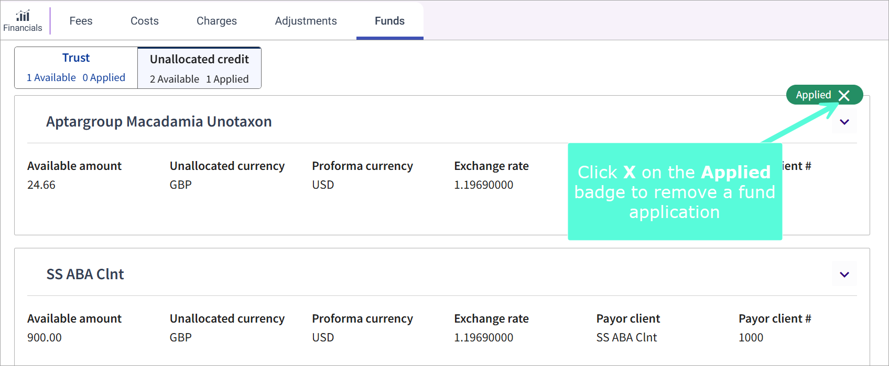

## Group Edit

### **Bill Fees or Costs Only**

You can choose to bill fees only or bill costs only for proformas.

Do the following to exclude certain card types from the proforma:

1.  Locate the proforma containing funds on the Proforma list.

2.  Click the proforma number to access the Proforma Details view.

3.  In the Group Edit section, do one of the following:

- Select **Bill Fees Only** to exclude cost and charge cards from the proforma.

- Select **Bill Costs Only** to exclude fee and charge cards from the proforma.

4.  Click **Save & Close**.

**Note**: An *Exclude* badge displays on excluded cards. If a user manually removes the exclude status from one or more cards by clicking the **X** on the Exclude badge, the other cards will still be excluded, but the **Bill Fees Only** or **Bill Costs Only** check box will be deselected.

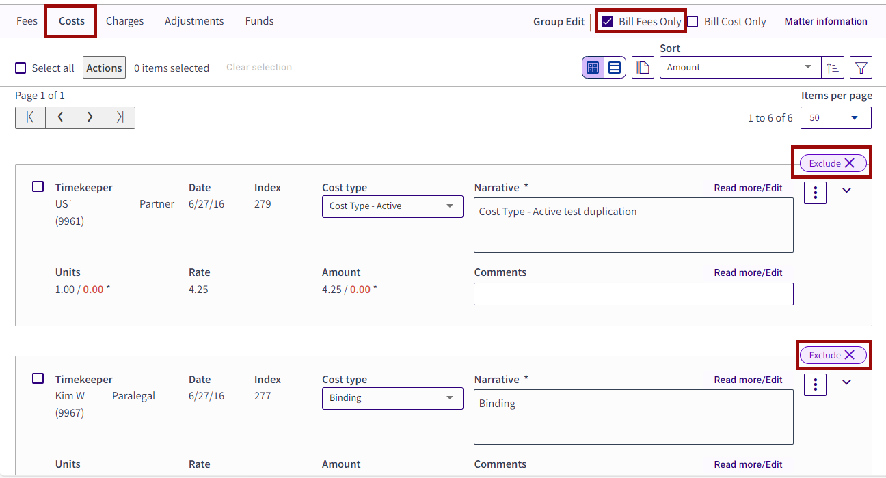

 

### **Write Offs**

Users can choose to write off all fees or costs at once in a single action.

Do the following to write off fees or costs:

1.  Locate the proforma containing funds on the Proforma list.

2.  Click the proforma number to access the Proforma Details view.

3.  In the *Group Edit* section, select the **Write Off Fees** or **Write Off Costs** check box. All cards of that type (i.e., Fees or Cards) will be written off and the individual cards will be updated in Proforma Details.

4.  Click **Save & Close**.

 

**Note**: If the Write Off check boxes are deselected, all the cards of that type will have the write off removed and reset to the original status.

**Note**: Administrators can use the 3E System Option in the 3EProforma group named **3EProformaWriteOffType** to define “Write Off”.  There are 3 available options, which can be set at the Firm level: Billable Purge, No Charge, and Write Down. The default value is **Billable Purge**.

 

## Adjustments

### **About Adjustments**

Adjustment cards are used to adjust the amount of the entire proforma total by an amount or a percent. For example, if I want to give my client a 10% discount on fees on a specific Proforma to reduce the overall bill total and show as a courtesy discount on the bill to my client, I will add a percent adjustment card and choose Adjustment type “Courtesy discount”.

To adjust the amount of the proforma down, the adjustment card amount or percentage must include a minus sign (-) upon entry.

An adjustment card can also be entered to target a specific timekeeper’s cards, either all cards for the specified timekeeper or card up to or between specified dates. Or the adjustment can target all timekeepers cards up to or between specified dates. Targeting a timekeeper and dates of cards is not required to add an adjustment to the proforma, these are options.

 

### **Add Adjustments**

Do the following to add an adjustment card:

1.  Access the Proforma Detail view for a proforma.

2.  Click the **Adjustment** tab and click **Add Adjustment**.

**Note**: You can also select Add Adjustment from the Proforma Detail's Action menu.

3.  Select an adjustment **Type** and **Method**.

4.  Select additional adjustment options as needed. See "Add Adjustment Form and Field Definitions" on page [99](#add-adjustment-form-and-field-definitions) for further details.

5.  Click **Save Adjustments** to apply your settings and close the Add Adjustment form.

 

### **Add Adjustment Form and Field Definitions**

The options on this form are used to create an adjustment entry.

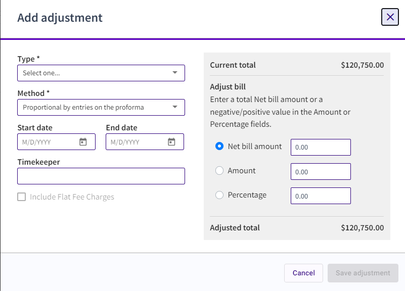

 

<table style="width:96%;">
<colgroup>
<col style="width: 30%" />
<col style="width: 65%" />
</colgroup>
<thead>
<tr>
<th><strong>Field Name</strong></th>
<th><strong>Description</strong></th>
</tr>
</thead>
<tbody>
<tr>
<td><strong>Type</strong></td>
<td>Select an Adjustment Type from the drop down list.</td>
</tr>
<tr>
<td><strong>Method</strong></td>
<td>Select an option from this drop-down list to determine how the adjustment is applied. The adjustment method will default to “Proportional by entries on the proforma”. There is a set list of adjustment methods to choose from and the method can be modified from what is defaulted.</td>
</tr>
<tr>
<td><strong>Start date</strong></td>
<td>Select a start date for which time cards will be considered for the adjustment. Only time cards with a date that is on or after the date entered are selected.</td>
</tr>
<tr>
<td><strong>End date</strong></td>
<td>Select an end date for which time cards will be considered for the adjustment. Only time cards with a date that is on or before the date entered are selected.</td>
</tr>
<tr>
<td><strong>Include Flat Fee Charges</strong></td>
<td>Select this check box to include the flat fee charges in the adjustment if the matter has a flat fee agreement.  This field is only available when there is a flat fee charge on the proforma and the <em>Adjust Bill</em> option is set to <strong>Percentage</strong>.</td>
</tr>
<tr>
<td><strong>Timekeeper</strong></td>
<td>Select the timekeeper/fee earner whose fees should be adjusted.</td>
</tr>
<tr>
<td><strong>Current Total</strong></td>
<td>Displays the current proforma total. If you have made other edits to cards that would affect the proforma total but have not clicked on Save &amp; recalc, you may not see the edited value as the current total.</td>
</tr>
<tr>
<td><strong>Adjust Bill</strong></td>
<td>
Choose one of the following:

<ul>
<li>
<strong>Net bill amount</strong> – Type the total of what the actual bill amount should be. It will automatically calculate the amount of the adjustment in the Amount field.
</li>
<li>
<strong>Amount</strong> – Type the amount of the adjustment. To adjust the bill amount down, enter a minus sign (-) before the amount of the desired adjustment.
</li>
<li>
<strong>Percentage</strong> – Type the percentage of the adjustment. To apply a percentage adjustment that adjusts the bill total down, enter a minus sign (-) before the percent discount desired. For example, -10 in the percentage field will decrease the fees by 10%.
</li>
</ul></td>
</tr>
<tr>
<td><strong>Adjusted Total</strong></td>
<td>Displays a value based on the amount or percentage entered. It allows you to view how the adjustment impacts the overall Proforma total prior to clicking on <strong>Save adjustment</strong>.</td>
</tr>
<tr>
<td><strong>Cancel</strong></td>
<td>Click to exit this form</td>
</tr>
<tr>
<td><strong>Save adjustment</strong></td>
<td>
Click to save your changes and close this form

<strong>Note</strong>: This button is inactive until the required fields and an adjustment amount or percentage is entered.
</td>
</tr>
</tbody>
</table>

 

## Include Late Cards in Proforma

Late cards are defined as time, costs, or charge cards that were entered after a proforma is generated with a work date before the “through” date.  For example:

- A proforma is generated for matter 1000-000 on May 6th with a “time through” date of April 30th

- On May 7th, Tom Dewey enters a time entry on matter 1000-000 with a work date of April 30th

When there are late cards for a matter, a notification will display at the top of the screen when the Proforma Details view is accessed.

Do the following to review the information and decide if any of the cards should be included in the current proforma:

1.  When a late card notification displays upon accessing the Proforma Details view, click **Review the late cards**. A list of late cards is displayed.

2.  Use the filters at the top of the Review late Cards window to view the late cards by type.  The cards can also be filtered by timekeeper using the timekeeper drop down list.

3.  To add the cards to the current proforma, select the box next to the cards to include

4.  Click **Include in proforma**. The selected time cards will be added to the current proforma and will display immediately on the [**Fees** <u>tab</u>](#proforma-details-fees-tab).  A confirmation message displays indicating that they were successfully included.

## View Proforma Edit History

3E Proforma includes an audit of edits made at both the proforma and card levels. The edit history is updated after a proforma has been saved.

To view edit history at the proforma level:

1.  Locate a proforma in the Proforma list.

2.  Select the **Edit History**from the Proforma-level **Action** menu. The Edit history side panel opens and edits for all editors display.

3.  Make a selection from the **Show edits by** drop-down list and choose an editor to select a specific editor’s changes, .

4.  To see a specific editor’s changes for a specific date/time, click that editor’s name.

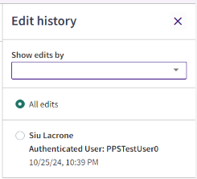

**Note**: The first name displayed is the “Working As” timekeeper, the Authenticated User is the user that was logged into 3E Proforma. The date/time is displayed in your time zone as defined on your user record in 3E.

## Tools

### **Find and Replace**

Do the following to search and replace words or phrases throughout the proforma.

1.  Locate a proforma in the Proforma List view and click its proforma number to open it in Proforma Detail view.

2.  Click t the Proforma-level Action menu and select **Find and Replace**.

3.  Select (or deselect) the check box(es) for the tabs that you want to search. All tabs are selected by default.

4.  Enter the word or phrase you are searching for in the **Find** text box.

5.  Click the **Find** button. All results are displayed in the text box below.

6.  Enter the word or phrase to replace the found word or phrase in the **Replace With** text box.

7.  Select the **Match Case** check box if you want to search only for words that match the case of the words entered in the Find text box. For example, if you search for “phone call,” and you select the Match Case check box, then the phrase “Phone call” will not be replaced. However, if you search for “phone call” and you do **not** select the Match Case check box, then “Phone call” will be replaced.

8.  Do one of the following:

- Click the **Replace All** button to replace all occurrences of the word or phrase. A message indicates how many instances of the word or phrase were replaced, if any.

- Click the **Replace** button to replace the current occurrence of the word or phrase. The word or phrase is replaced, and the next occurrence of the word or phrase is displayed.

10. Click the **Close** button.

### **Spell Check**

#### About Spell Check

To prevent clients from seeing spelling errors in printed proformas and bills, a spell check tool is available to check for errors in proforma detail.

 

#### Spell Check Proforma

Do the following to spell check proforma detail:

1.  Locate the proforma containing funds on the Proforma list.

2.  Click the proforma number to access the [<u>Proforma Details</u>](#navigating-the-proforma-detail-view) view.

3.  Select **Spell check** from the Proforma-level **Action** menu, the Spell check and dictionary window displays.

4.  Use the options in the spell check tool to select and apply a correct spelling of a word, skip a word, or add a new word to the tool's dictionary.

5.  Click **Save and close** when done.

 

#### Spell Check Form and Field Definitions

The spell check tool is used to scan proforma detail for spelling errors.

<table style="width:96%;">
<colgroup>
<col style="width: 30%" />
<col style="width: 65%" />
</colgroup>
<thead>
<tr>
<th><strong>Field Name</strong></th>
<th><strong>Description</strong></th>
</tr>
</thead>
<tbody>
<tr>
<td colspan="2"><strong>Spell check</strong></td>
</tr>
<tr>
<td><strong>Items to check in this proforma</strong></td>
<td>Displays the detected spelling error. The spell check tool also gives the location of the spelling error in the Proforma Details form.</td>
</tr>
<tr>
<td><strong>Ignore Selection</strong></td>
<td>Click to keep the highlighted word as it is currently spelled and continue with the spell check.</td>
</tr>
<tr>
<td><strong>Ignore All</strong></td>
<td>Click to keep the highlighted word, and other instances of the word in the proforma, as it is currently spelled. The spell check tool will continue with its search.</td>
</tr>
<tr>
<td><strong>Add to dictionary</strong></td>
<td>Click to add the word to your dictionary. The word or name will be added to your dictionary so the next time you perform a spell check your saved words and names will be included in identifying misspellings in the current proforma.</td>
</tr>
<tr>
<td><strong>Change to</strong></td>
<td>Choose the correct spelling from the list of options.</td>
</tr>
<tr>
<td><strong>Apply to selection</strong></td>
<td>Click to update the highlighted spelling error using the spelling selected in the <strong>Change to</strong> list. The spell check will continue to the next detected spelling error.</td>
</tr>
<tr>
<td><strong>Apply to all</strong></td>
<td>Click to correct the highlighted word throughout the entire proforma based on the <strong>Change to</strong> selection.</td>
</tr>
<tr>
<td colspan="2"><strong>Dictionary</strong></td>
</tr>
<tr>
<td><strong>Dictionary list</strong></td>
<td>Displays a custom dictionary list.</td>
</tr>
<tr>
<td><strong>Edit</strong></td>
<td>Click to edit a listed word.</td>
</tr>
<tr>
<td><strong>Delete</strong></td>
<td>Click to remove a word from the dictionary.</td>
</tr>
<tr>
<td><strong>New word</strong></td>
<td>Type text in this field to add a new entry to the dictionary list</td>
</tr>
<tr>
<td><strong>Add</strong></td>
<td>Click to save the new word to the dictionary list</td>
</tr>
</tbody>
</table>

# Proforma Tasks

## Set Proforma Priority Status

If the proforma was already set as priority, clicking the flag icon unmarks the proforma as a priority. If the proforma was not a priority, clicking the flag icon marks the proforma as a priority.

Do the following to flag a proforma as a priority.

1.  Locate the proforma in the Proforma list.

2.  Select the **Priority** button for the listed. If the proforma was already set as priority, clicking the flag icon unmarks the proforma as a priority. If the proforma was not a priority, clicking the flag icon marks the proforma as a priority.

**Note**: In Proforma Edit view, click the **Priority** flag in the header section to toggle a proforma's priority status.

## Add Proforma Comments

Do the following to add comments to the proforma.

**Note**: A maximum of 1000 characters can be entered for each comment. Previously added comments will display above the Comments field.

1.  Click the number of a proforma listed in the Proforma List view.

2.  Select **Add comments** from the proforma-level **Action** menu in the Proforma Detail view.

3.  Type text in the Comment field.

4.  Click **Add comment**.

5.  Click **Save & Close**.

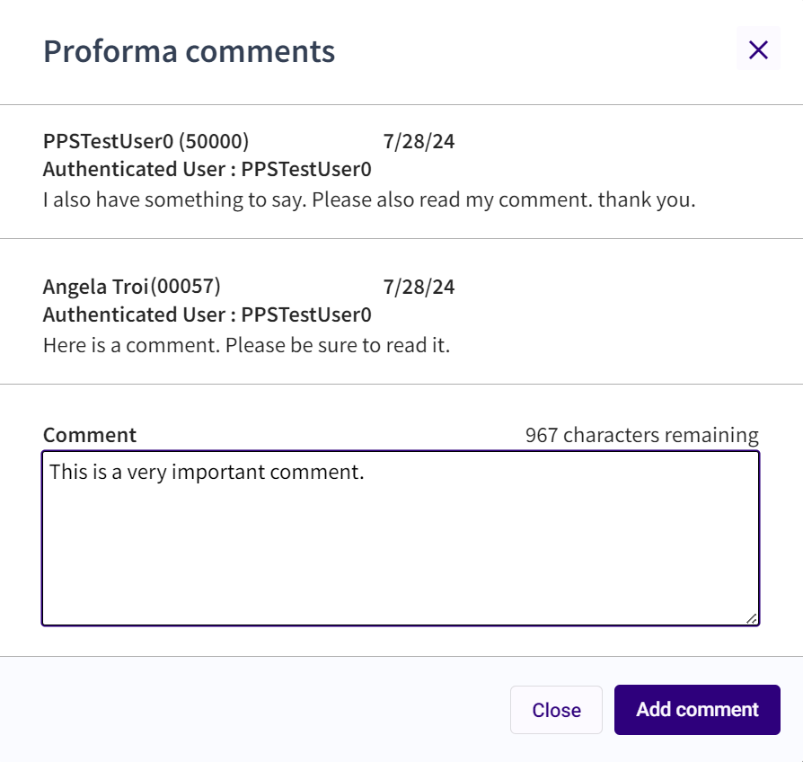

**Note**: Comments added to proformas in 3E Proforma are viewable in the parent form header of the *3E WF Proforma Edit* process. The comments icon in the header will also display the number of added comments. The ability to view comments *3E WF Proforma Edit* process is enabled when the 3E Override/Set System Options **Use Billing Workflow** is set to True (default is False). Additionally, the **IsComments** attribute on the ProfMaster archetype should be set to True (default). If this feature is not enabled, contact your system admin or Elite Services for assistance.

 

## Viewing Proforma Level Comments

Comments added to proformas can be viewed in 3E Proforma and in 3E.

### **View Comments in 3E Proforma**

Do the following to view proforma-level comments in 3E Proforma:

**Note**: The existence of proforma-level comments is indicated by a dot displayed on the Proforma-level **Action** menu, either in Proforma List or Proforma Detail view.

1.  Click the number of a proforma listed in the Proforma List view.

2.  Select **Add comments** from the proforma-level **Action** menu in the Proforma Detail view. The Proforma comments pop-up displays, listing previously added comments.

3.  Click **Close**.

### **View Comments in 3E**

Proforma level comments are visible to the biller in 3E via the Comments icon.

1.  Open a proforma in the Proforma Edit process.

2.  Click the **Comments** icon in the **Action** toolbar of the proforma to view any proforma level comments.

3.  Click **Close** to exit the comments pop-up.

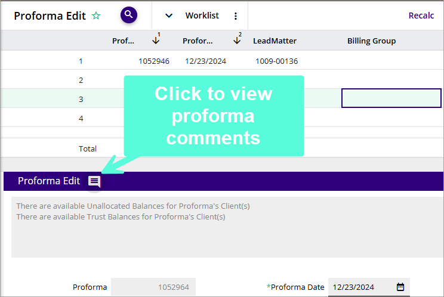

 

## Completing a Proforma

When you have finished your edits and you want the proforma flagged as completed so that other users on the proforma’s collaboration know your work is done, do the following:

1.  Locate the proforma containing funds on the Proforma list.

2.  Select the check box in the **Select** column for the listed proforma.

3.  Click the [<u>Proforma-level Action menu</u>](#action-menus) and select **Mark as Complete**. Any unsaved changes are automatically saved. The proforma will move from the My Proformas/Needs review/In review/Urgent list to the Completed list. A check mark will display in the Complete column of the [<u>Collaborator List</u>](#collaborator-list-form-and-field-definitions).

 

## Forward Proforma

3E Proforma provides the ability to forward proformas to other users. This feature leverages the [<u>collaboration mechanism</u>](#collaboration) and offers a simplified process (for proforma ‘owners’ and user with ‘full’ rights) for sending a proforma to one or more users.

Do the following forward a proforma:

1.  Locate the proforma in the Proforma list.

2.  Select **Forward** from the proforma-level **Action** menu.

**Note**: This task can also be initiated in the [<u>Proforma Details view</u>](#navigating-the-proforma-detail-view). You can also forward a batch of proformas from the Proforma List view. See "Batch Processing Proforma Actions" on page [114](#batch-processing-proforma-actions) for details.

**Note:** If a user who has the proforma opened, and therefore locked, forwards the proforma while in Proforma Detail view, any unsaved changes are automatically saved. In any other cases the changes are not saved.

2.  Click the **Add recipient** button.

3.  Type the name of the user to whom you want to forward the proforma.

4.  Click the **Forward** button. A confirmation message will display.

 

**Points to remember:**

- In the Proforma list the Forwarded icon display on the proforma and shows the number of users to whom proforma was forwarded. Hover the mouse over this indicator to see a tooltip listing the timekeepers to whom the proforma was forwarded.

- When a working timekeeper forwards the proforma, the proforma is marked as Complete and moved to the **Completed** list for that timekeeper.

- If the proforma owner (billing attorney) forwards the proforma, the proforma remains in the **My Proforma** and the **In Review** list.

- The proforma displays in the **My proformas** and **Needs review** lists of the user to whom the proforma was forwarded.

- The user to whom the proforma was forwarded displays at the second position in the Collaborators pop-up.

- In the [<u>Collaborators list</u>](#collaborator-list-form-and-field-definitions), a check displays in the Complete column for the user who forwarded the proforma.

## Submit Proforma for Review

After reviewing a proforma, making any necessary changes and adding instructions for the Accounting staff, the proforma needs to be sent to the Accounting department for review.

Do the following to submit proformas for review:

1.  Locate the proforma that's ready for review in the Proforma list.

2.  Select the **Submit** from the Proforma-level **Action** menu. Any unsaved changes are automatically saved and the proforma is submitted to the Accounting department. Submitting a proforma moves it to the Approval pending or Completed proformas list, depending on whether approval is required

**Note**: To submit a batch of proformas for review, see "Batch Processing Proforma Actions" on page [114](#batch-processing-proforma-actions) for details.

**Note**: Proformas can also be submitted in the Proforma Details view. Select **Submit** from the [<u>Proforma-level</u> **Action** <u>menu</u>](#navigating-the-proforma-detail-view).

### **Submitting Billing Group Proformas**

The billing group proforma is considered to be submitted and available for the Accounting department only when all proformas in the group are submitted. Therefore, individual proformas for matters that belong to a Bill Group should all be submitted even when there are no edits made on a proforma. This signals to the Billers that the Group is ready to be invoiced.

## Defer Proforma

Proformas can be deferred to exclude them being billed during a billing cycle. Deferred proformas move to the completed proformas list.

**Note**: Deferred proformas will remain on the Completed proformas list for the period of time designated by setups in 3E or until a new proforma for the Matter is generated.

Do the following to defer a proforma:

1.  Locate the proforma that's ready for review in the [<u>Proforma list</u>](#navigating-3e-proforma---walkthrough).

2.  Select the **Defer** from the Proforma-level **Action** menu. Any unsaved changes are automatically saved and the proforma is deferred to the Accounting department. Deferring a proforma removes it from the proforma list.

**Note**: To defer a batch of proformas for review, select proformas displayed in the Proforma List and then select **Defer** from the [<u>Proforma List Action menu</u>](#action-menus).

**Note**: Proformas can also be deferred in the Proforma Details view. Select **Defer** from the [<u>Proforma-level</u> **Action** <u>menu</u>](#navigating-the-proforma-detail-view).

## Print Proforma

In 3E Proforma you can print a proforma by generating a printable PDF file. You can generate print files for one proforma or a batch of proformas.

Do the following to print a proforma:

1.  Locate the proforma that's ready for review in the Proforma list.

2.  Click the **Print Proforma**. The PDF generation is a background process, leaving you free to continue working. A notification message displays when the PDF has been generated. Additionally, a notification indicator will display on the 3E Proforma [<u>Global toolbar.</u>](#standard-features-and-navigation)

3.  Click the **Notification** icon on the Global toolbar to access a link to the PDF.

4.  Click **View proforma** to open the PDF and print. Print PDF files will become available as proforma attachments. See "Attachments Form and Field Definitions" on page [134](#attachments-form-and-field-definitions) for details.

**Note**: To create print files for a batch of proformas, select check boxes for proformas displayed in the Proforma List and then select **Mass Print Proforma** from the [<u>Proforma List Action menu</u>](#batch-processing-proforma-actions). When the print job is complete, it will display in the [<u>notification list</u>](file:///C:/Madcap Flare Projects/3E Proforma Help v2/Content/3E Proforma/Release Notes/7.10.0/Global Toolbar.htm) with the following file name format: {Total number of the printed documents}Proforma {Date-Time} All-in-One. For example, a completed batch job of three proformas would be listed as *3Proforma 2/7/25, 5:36 AM All-in-One*.

**Note**: Proformas can also be printed in the Proforma Details view. Select **Print Proforma** from the [<u>Proforma-level</u> **Action** <u>menu</u>](#navigating-the-proforma-detail-view).

"Batch Processing Proforma Actions" on page [114](#batch-processing-proforma-actions)

## View Bill Preview

Do the following to get a PDF version of the bill as it will appear to the client.

1.  Locate the proforma that's ready for review in the Proforma list.

2.  Select **Bill Preview**from the Proforma-level **Action** menu. The PDF generation is a background process, leaving you free to continue working. A notification message displays when the PDF has been generated. Additionally, a notification indicator will display on the 3E Proforma [<u>Global toolbar.</u>](#standard-features-and-navigation)

3.  Click the **Notification** icon on the Global toolbar to access a link to the PDF.

4.  Click **View bill preview** to open the PDF and print. Print PDF files will become available as proforma attachments. See "Attachments Form and Field Definitions" on page [134](#attachments-form-and-field-definitions) for details.

**Note**: To create print files for a batch of bill previews, select check boxes for proformas displayed in the Proforma List and then select **Mass Bill Preview** from the [<u>Proforma List Action menu</u>](#batch-processing-proforma-actions). When the print job is complete, it will display in the [<u>notification list</u>](file:///C:/Madcap Flare Projects/3E Proforma Help v2/Content/3E Proforma/Release Notes/7.10.0/Global Toolbar.htm) with the following file name format: {Total number of the printed documents}BillPreview{Date-Time} All-in-One. For example, a completed batch job of two bill previews would be listed as *2BillPreview2/7/25, 5:36 AM All-in-One*.

**Note**: Bill previews can also be printed in the Proforma Details view. Select **Bill preview** from the [<u>Proforma-level</u> **Action** <u>menu</u>](#navigating-the-proforma-detail-view).

## Batch Processing Proforma Actions

Various proforma actions such as Approve or Bill preview can be performed on a batch of selected proformas.

Do the following to execute an action on multiple proformas:

1.  In the Proforma List view, select two or more displayed proformas on which to execute the action.

**Note**: Narrow the list of displayed proformas by clicking on of the Proforma List categories (e.g., In review), typing text (e.g., bill group) in the [**<u>Search</u>**](#navigating-3e-proforma---walkthrough) field, or applying [<u>filters</u>](#filters-1).

2.  Click the **Action** drop-down menu adjacent to the **Select** check box and choose an action (e.g., Bill Preview, Forward, or Submit).

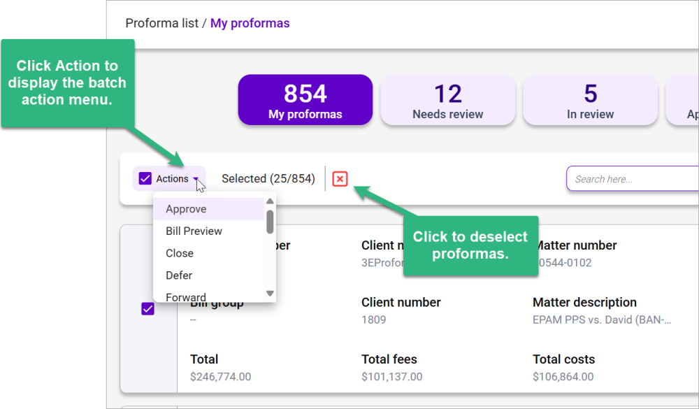

 

# Proforma Tracking

## About Proforma Tracking

The Proforma Tracking page provides a clear view into the entire proforma lifecycle—no more guesswork or follow-up emails. You can now easily search for proformas by Client, Matter, Timekeeper, or Proforma Number, and instantly access detailed information about collaborators, workflow steps, and current status.

## Tracking Proformas

Do the following to track proformas progressing through your firm's workflow process:

<table style="width:15%;">
<colgroup>
<col style="width: 15%" />
</colgroup>
<tbody>
<tr>
<td>
<strong>Note</strong>: Authenticated users assigned the role <strong>3EProformaAdminRole</strong> in 3E can view cross-matter or firm-wide data. With this firm-wide tracking view, this user can search by timekeeper, client, matter, or individual proforma and see only data they are authorized to view. Unauthorized data is never exposed. Firm security and matter confidentiality rules are respected.

A user who is not assigned the role <strong>3EProformaAdminRole</strong> in 3E, and is a <em>Working As</em> a timekeeper who is an administrator, will only see the records where the <em>Working As</em> timekeeper is linked to the proforma (e.g., owner, co-owner, approver, editor).
</td>
</tr>
</tbody>
</table>

 

1.  Select **Proforma Tracking** from the [<u>Side Navigation Menu</u>](#side-navigation-menu).

2.  Select Client, Matter, Timekeeper, or Proforma from the drop-down list in the filter section.

3.  Select the filter check boxes (i.e., In Progress, Not Started, or Completed) to specify which type of proformas you want to search .

4.  Specify a date range. This is recommended if the search includes Completed proformas.

5.  Click **Apply** to initiate the search with the selected filters. If only default filters are used, you can also click the **Search** icon to start the search.

The side panel of the search results displays statistics about the proformas, such as Client, matter, timekeeper, and proforma name, \# of proformas assigned, and a tracking bar for the proforma progress.

The results list displays workflow details for the records returned. The details shown vary depending on whether you search for a group of proformas (Matter, Client, or Timekeeper) or by a single Proforma.

For additional details, see "Proforma Tracking Form and Field Definitions" on page [121](#proforma-tracking-form-and-field-definitions)

**Note**: Available options vary depending on whether you search for a group of proformas (Matter, Client, or Timekeeper) or by a single Proforma.

## Proforma Tracking Form and Field Definitions

The Proforma Tracking page consists of the following:

**Note**: Available options vary depending on whether you search for a group of proformas (Matter, Client, or Timekeeper) or by a single Proforma.

[<u>Tracking Proformas by Client, Matter, or Timekeeper</u>](#tracking-proformas-by-client-matter-or-timekeeper)

[<u>Tracking Proforma by Number</u>](#tracking-proforma-by-number)

### **Tracking Proformas by Client, Matter, or Timekeeper**

<table style="width:96%;">
<colgroup>
<col style="width: 30%" />
<col style="width: 65%" />
</colgroup>
<thead>
<tr>
<th><strong>Field Names</strong></th>
<th><strong>Descriptions</strong></th>
</tr>
</thead>
<tbody>
<tr>
<td colspan="2"><strong>Search Criteria</strong></td>
</tr>
<tr>
<td><strong>Track by</strong></td>
<td>
Select an option from this drop-down list to specify how to track proformas, or single proforma (e.g., Client, Matter, Timekeeper, or Proforma).

<strong>Note</strong>: Search options and results are different when <strong>Proforma #</strong>is selected, see <a href="#tracking-proforma-by-number"><u>Tracking Proforma by Number</u></a> for further information.
</td>
</tr>
<tr>
<td><strong>In progress</strong></td>
<td>Select this check box to track proformas that have been opened and are in the edit, approval, or billing process</td>
</tr>
<tr>
<td><strong>Not Started</strong></td>
<td>Select this check box to track proformas that have been generated but not yet opened.</td>
</tr>
<tr>
<td><strong>Completed</strong></td>
<td>Select this check box to track proformas that have been billed, closed, or deferred.</td>
</tr>
<tr>
<td><strong>Start Date</strong></td>
<td>
Select a beginning date for a search period.

<strong>Note</strong>: Specifying a date range is recommended if searching includes Completed proformas.
</td>
</tr>
<tr>
<td><strong>End Date</strong></td>
<td>Select a end date of a search period.</td>
</tr>
<tr>
<td><strong>Apply</strong></td>
<td>Click to apply search criteria.</td>
</tr>
<tr>
<td colspan="2"><strong>Details</strong></td>
</tr>
<tr>
<td><strong>Record Details</strong></td>
<td>
Displays details for the record used to track proformas:

<ul>
<li>
<strong>Client</strong> – Displays client name an number.
</li>
<li>
<strong>Matter</strong> – Displays matter name and number.
</li>
<li>
<strong>Timekeeper</strong> – Displays timekeeper name, ID, and title.
</li>
</ul></td>
</tr>
<tr>
<td><strong>Proformas Assigned</strong></td>
<td>Displays the number of proformas in the workflow for the selected client, matter, or timekeeper.</td>
</tr>
<tr>
<td><strong>Proforma Progresss</strong></td>
<td>Displays the current status of the proformas in the workflow for the selected client, matter, or timekeeper (i.e., Completed, In Progress, or Not Started).</td>
</tr>
<tr>
<td colspan="2"><strong>Search Results</strong></td>
</tr>
<tr>
<td><strong>Proforma #</strong></td>
<td>The proforma number. Click this link to see the Proforma tracking for this specific proforma.</td>
</tr>
<tr>
<td><strong>Owner</strong></td>
<td>Owner of the proforma.</td>
</tr>
<tr>
<td><strong>Status</strong></td>
<td>
Current status of the proforma in the workflow:

<ul>
<li>
<strong>Completed</strong> = billed, closed, or deferred
</li>
<li>
<strong>In Progress</strong> = proforma has been opened and is in the edit, approval, or billing process
</li>
<li>
<strong>Not Started</strong> = proforma has been generated but not yet opened
</li>
</ul></td>
</tr>
<tr>
<td><strong>Total</strong></td>
<td>Displays the proforma total.</td>
</tr>
<tr>
<td><strong>Client Name</strong></td>
<td>Displays the client name.</td>
</tr>
<tr>
<td><strong>Client #</strong></td>
<td>Displays the client number.</td>
</tr>
<tr>
<td><strong>Matter Name</strong></td>
<td>Displays the matter name.</td>
</tr>
<tr>
<td><strong>Matter #</strong></td>
<td>Displays the matter number.</td>
</tr>
<tr>
<td><strong>Proforma Date</strong></td>
<td>Displays the proforma generation date.</td>
</tr>
<tr>
<td><strong>Last Viewed</strong></td>
<td>Date the proforma was last accessed.</td>
</tr>
<tr>
<td><strong>Completed Date</strong></td>
<td>Date the proforma was billed, deferred, or closed.</td>
</tr>
</tbody>
</table>

### **Tracking Proforma by Number**

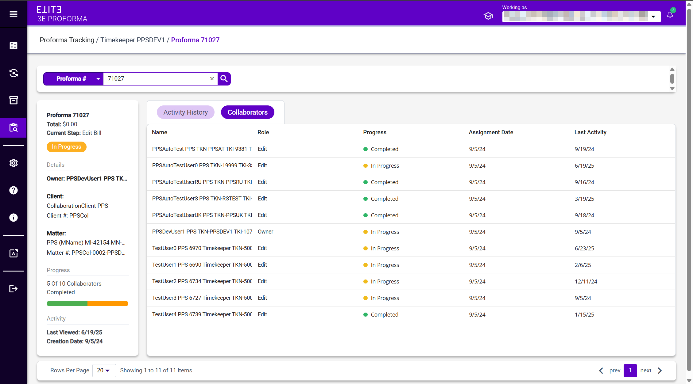

<table style="width:96%;">
<colgroup>
<col style="width: 30%" />
<col style="width: 65%" />
</colgroup>
<thead>
<tr>
<th><strong>Field Definitions</strong></th>
<th><strong>Descriptions</strong></th>
</tr>
</thead>
<tbody>
<tr>
<td colspan="2"><strong>Search Criteria</strong></td>
</tr>
<tr>
<td><strong>Track by</strong></td>
<td>Select <strong>Proforma #</strong> and type the number of a proforma to track.</td>
</tr>
<tr>
<td colspan="2"><strong>Details</strong></td>
</tr>
<tr>
<td><strong>Proforma Number</strong></td>
<td>Displays the proforma number.</td>
</tr>
<tr>
<td><strong>Total</strong></td>
<td>Displays the amount due.</td>
</tr>
<tr>
<td><strong>Current Steps</strong></td>
<td>Displays where the proforma is at the workflow process.</td>
</tr>
<tr>
<td><strong>Status badge</strong></td>
<td>Displays the proforma's current status.</td>
</tr>
<tr>
<td><strong>Owner</strong></td>
<td>Displays the proforma's assigned Owner timekeeper.</td>
</tr>
<tr>
<td><strong>Client</strong></td>
<td>Displays the name and number of the client associated with the proforma.</td>
</tr>
<tr>
<td><strong>Matter</strong></td>
<td>Displays the matter name and number.</td>
</tr>
<tr>
<td><strong>Progress</strong></td>
<td>Displays a tracking bar displaying a visual of the proforma's progress through the workflow.</td>
</tr>
<tr>
<td><strong>Activity</strong></td>
<td>Displays a date stamp of proforma activity (e.g., created, last viewed, etc.)</td>
</tr>
<tr>
<td colspan="2"><strong>Active History Tab</strong></td>
</tr>
<tr>
<td><strong>Modified Date</strong></td>
<td>Last date the step was accessed</td>
</tr>
<tr>
<td><strong>Step</strong></td>
<td>Name of workflow step</td>
</tr>
<tr>
<td><strong>Next Action</strong></td>
<td>Action triggered when this step was completed.</td>
</tr>
<tr>
<td><strong>Name</strong></td>
<td>
Name of the user assigned to the step. This may show a role when a step is sent to a group of people assigned to a role.

When the step is accessed, the name of the person who opened the proforma at that step will appear here.

For example, if an approval is needed, this may initially display 3EProformaApprover. When one of the approvers open the proforma to review it, the step will update with their name.
</td>
</tr>
<tr>
<td><strong>Role</strong></td>
<td>The role of the user as it applies to this proforma.</td>
</tr>
<tr>
<td><strong>Activity</strong></td>
<td>The status if the workflow step: NotStarted, InProgress, Completed</td>
</tr>
<tr>
<td colspan="2"><strong>Collaborators</strong></td>
</tr>
<tr>
<td><strong>Name</strong></td>
<td>Collaborator's name</td>
</tr>
<tr>
<td><strong>Role</strong></td>
<td>The role of the user as it applies to this proforma.</td>
</tr>
<tr>
<td><strong>Progress</strong></td>
<td>
Collaborator's status

Completed = the collaborator has marked the proforma Complete

In Progress = proforma has been opened but not marked Complete

Not Started = the collaborator has not yet opened the proforma
</td>
</tr>
<tr>
<td><strong>Assignment Date</strong></td>
<td>Date the collaborator was added to the proforma</td>
</tr>
<tr>
<td><strong>Last Activity</strong></td>
<td>Last date the collaborator viewed the proforma</td>
</tr>
</tbody>
</table>

# Collaboration

## About Collaborator List

3E Proforma provides the ability to create Collaboration groups. These are essentially the workgroup for a proforma, at the matter level. The collaboration group consists of all timekeepers who have time cards, cost cards, or charge cards on the proforma, or who have been added to the collaboration group by the owner of the proforma.

 

**Points to remember:**

- All proforma collaborators can work on any unlocked proforma at any time.

- Only one timekeeper can be the owner of a proforma, unless a [<u>co-owner is assigned to the proforma</u>](#assign-co-owner-to-proforma).

- Timekeeper’s rights cannot be edited in the Collaboration window.

- Timekeepers who have a proforma in the [<u>Proforma List</u>](#navigating-3e-proforma---walkthrough) can see the list of collaborators.

- Only the Billing attorney (proforma owner) can add a new collaborator.

- A new collaborator has full rights to the proforma but can only perform the **Mark as Complete** action as the working timekeeper.

- An automatic email notification can be sent to proforma owners when a collaborator has completed their edits. This ensures that the owner has timely notification that the collaborator edits are finished, and the owner can perform a final review and submit the proforma.

**Note**: To enable the email notification, the 3E Override/Set System Options **Notify_EmailOnComplete** must be set to **True**. It is set to False (i.e., disabled), by default. This feature requires 3E 5.6.0.

## Manage Proforma Collaborators

Do the following to manage the list of timekeepers collaborating on a proforma:

1.  In the Proforma list, click the **Action** menu for a listed proforma and select **View Collaborators**.

**Note**: You can also access the Collaborator list in the Proforma Details view by clicking the Proforma-level **Action** menu and selecting **View collaborators**.

2.  Do one of the following:

- **Add a collaborator** - Click **Add Collaborator** to add another timekeeper to the list.

- **Remove a collaborator** - Click the **Delete** icon  at the end of the row of a listed collaborator to delete them.

- **Remove multiple collaborators** - Click to remove all collaborators with Edit rights. This action does not affect the Owner and Co-Owner.

3.  Click **Save** to save any changes made to the list of collaborators on the proforma.

 

## Assign Co-owner to Proforma

Proforma owners have the ability to assign a co-owner. The co-owner has the same rights as the proforma owner, allowing for shared proforma responsibilities. Assigning a co-owner to a proforma requires the following steps:

- Designate a co-owner in 3E (i.e., at the matter, client, timekeeper, or proforma level)

- Assign a [<u>collaborator</u>](#collaboration) as a co-owner in 3E Proforma

- Modify 3E Proforma stock workflow configurations in 3E

Once these steps have been completed, both the owner and the co-owner will receive the proforma and have owner rights to edit and submit the proforma in 3E Proforma.

### **STEP 1: Designate a Co-owner in 3E Cloud**

A default co-owner can be set in multiple record types in 3E. It can be set in the *Effective Dated Information* child form of the Client, Matter, and Timekeeper records. Additionally, it can be set in Proforma Generation.

The order of precedence for the default co-owner setting is as follows:

- Proforma Generation

- Matter

- Client

- Timekeeper

**Note**: Assigning a co-owner in Proforma Generation will override a co-owner selected in Client, Matter, and Timekeeper records.

Do one of the following to designate a default co-owner in 3E:

- **Matter, Client, or Timekeeper process**: Navigate to the **Effective Dated Information** child form of either the Matter, Client, or Timekeeper process and specify the user in the **3E Proforma Co-owner** field.

- **Proforma Generation**: Go to the Proforma Generation process and specify the user in the **Assign Co-owner** field.

### **STEP 2: Assign Co-owner Rights in 3E Proforma**

Within 3E Proforma, co-owner rights can be assigned to a proforma collaborator.

**Note**: There can only be one Co-Owner assigned to a proforma.

Do the following to give a collaborator co-owner rights for a proforma:

1.  In the Proforma list, click the **Action** menu for a listed proforma and select **View Collaborators**.

**Note**: You can also access the Collaborator list in the Proforma Details view by clicking the Proforma-level **Action** menu and selecting **View collaborators**.

2.  In the Rights column, select **Co-Owner** for a listed collaborator.

<!-- -->

3.  Click **Save**.

### **STEP 3: Update 3E Proforma Workflow Steps in 3E Cloud**

To route the proformas to both the owner and co-owner, the following 3E Proforma workflow steps (i.e., rule sets) in the workflow configuration must be updated to use the co-Owner workflow dynamic routing filters:

- **Start Workflow** - dynamic route, collaboration dynamic route

- **Bill Submitted no approval, tier 1, tier 2 rule sets** - email route

- **Biller Retur**n - dynamic route

- **Bill write down approval** - email route

- **Reject proforma** - dynamic route, email route

- **Return proforma** - dynamic route, email route

- **Biller Submitted no approval, tier 1, tier 2** - email route

- **Start workflow from group** - dynamic route (Note, this step handles group proforma workflow, no other group proforma workflow updates needed.)

 

Do the following to update the workflow steps listed above:

1.  In 3E, access the **Workflow Configuration** process.

2.  Select the stock **3E Proforma** workflow configuration.

3.  Select a step (e.g., Start Workflow) and scroll to the **Routing for Next Workflow Setup** section.

4.  Do the following to update the dynamic routing filters for each of the above steps:

<!-- -->

1.  In the field adjacent to the Dynamic Route check box, choose the routing that corresponds to who the Proforma Owner is:

- **Billing Timekeeper** - 3E Proforma – Owner and CoOwner (BillTkpr)

- **Responsible Timekeeper** - 3E Proforma – Owner and CoOwner (RspTkpr)

- **Supervisor Timekeeper** - 3E Proforma – Owner and CoOwner (SpvTkpr)

2.  For the Start Workflow step, in the **Routing for Next Workflow Step** section, choose **3E Proforma – Owner, Co-Owner, and Editor** for the Collaboration \> Dynamic Route.

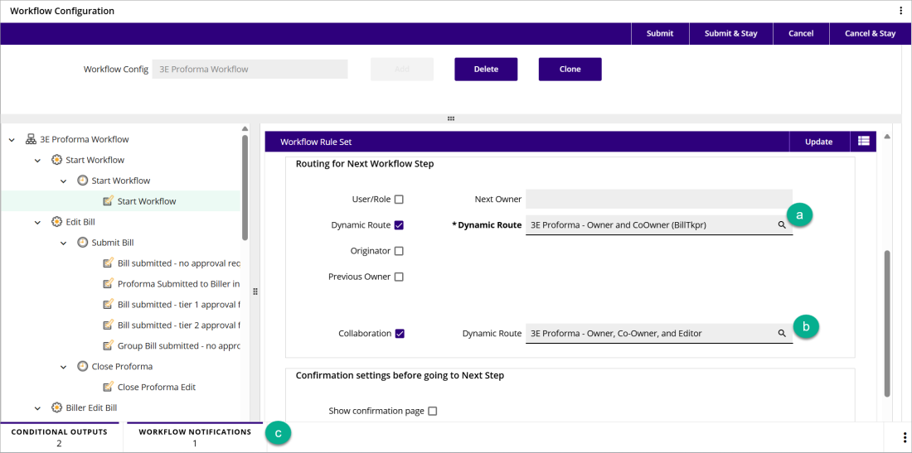

3.  For rules sets that require email routing (e.g., Bill write down approval), click the step's **Workflow Notifications** child form tab.

4.  In the **Dynamic address** column choose the routing that corresponds to who the Proforma Owner (e.g., Billing Timekeeper).

## Collaborator List Form and Field Definitions

The Collaborator list displays a list of timekeepers working on a proforma.

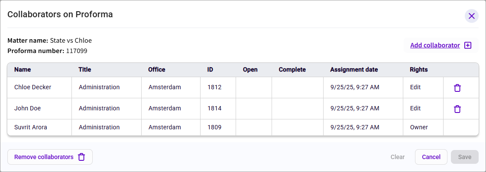

The table below describes the columns on the Collaboration Details section.

| **Field Name** | **Description** |
|----|----|
| **Add collaborator** | Click to add a collaborator to the list. |
| **Remove collaborators** | Click to remove multiple collaborators from the list simultaneously. This action only removes collaborators with edit rights. The Owner and Co-Owner will not be affected. Click **Save** to save the changes or **Cancel** to revert the collaborators back to the original list. |
| **Clear** | Click to undo additions to the list before saving. |
| **Collaborator Grid** | ** ** |
| **Name** | This column displays the name of all timekeepers who are part of the collaboration group for this proforma. |
| **Title** | This column displays the title of the timekeeper. |
| **Office** | This column displays the location of the timekeeper. |
| **ID** | This column displays the timekeeper’s unique identification number. |
| **Open** | This column displays a check mark if a timekeeper has the proforma currently open. |
| Complete | This column displays a check mark if the timekeeper has marked the proforma as complete. |
| **Assignment date** | This column displays the date that the rights were assigned to the timekeeper. |
| **Rights** | This column displays the rights assigned for each timekeeper for the proforma. The Owner ad [<u>Co-owner</u>](#assign-co-owner-to-proforma) are identified in this column. |
| **Delete**  | Click to remove a collaborator from the list. |

 

# Attachments

## About Attachments

In the Proforma Details view, you can attach document files, add notes to a proforma, and print files (e.g., proforma PDFs).

 

## Add Attachment to Proforma

Do the following to attach a file to a proforma:

1.  Access the [<u>Proforma Details</u>](#proforma-detail-view) for a proforma.

2.  Click the **Attachment** button.

3.  Click **Upload File** to add an attachment.

4.  Browse to and select a document to attach.

5.  Click **Open** to attach the file. Repeat steps 3-5 to add additional attachments.

6.  Click **Close** when done.

 

## Add Note to Proforma

Do the following to add a note to a proforma:

1.  Access the [<u>Proforma Details</u>](#proforma-detail-view) for a proforma.

2.  Click the **Attachment** button.

3.  Click **Add Note**.

4.  Edit the default note title (i.e., Note 1).

5.  Type text for the note in the following field.

6.  Click **Save Note**. The name of the note will appear in the attachments list.

 

## Attachments Form and Field Definitions

The **Attachments** form is used to attach a document or add a note to a proforma. This option is accessed in the Proforma Details view.

<table style="width:96%;">
<colgroup>
<col style="width: 30%" />
<col style="width: 65%" />
</colgroup>
<thead>
<tr>
<th><strong>Field Name</strong></th>
<th><strong>Description</strong></th>
</tr>
</thead>
<tbody>
<tr>
<td><strong>Add Note</strong></td>
<td>Click to add a note to the proforma.</td>
</tr>
<tr>
<td><strong>Upload File</strong></td>
<td>Click to upload and attach a document (e.g., invoice) to the proforma.</td>
</tr>
<tr>
<td colspan="2"><strong>Notes</strong></td>
</tr>
<tr>
<td><strong>Note Title</strong></td>
<td>Type text in this field to edit the default title (e.g., Note 1). The title defaults to 'Note' and is assigned a consecutive number. The note title displays in the attachments lists.</td>
</tr>
<tr>
<td><strong>Note Text</strong></td>
<td>Type the text for your note in this field.</td>
</tr>
<tr>
<td><strong>Cancel</strong></td>
<td>Click to close the Note fields without saving the note.</td>
</tr>
<tr>
<td><strong>Save Note</strong></td>
<td>Click to save the note.</td>
</tr>
<tr>
<td colspan="2"><strong>Attachments List</strong></td>
</tr>
<tr>
<td><strong>Select</strong></td>
<td>Select a check box to flag an attachment for an action (e.g., Delete or Print).</td>
</tr>
<tr>
<td><strong>View / Download</strong></td>
<td>
Click the View / Download icon  to open and view a note or download a listed attachment.

For attachments, image files and PDFs will be opened in a separate browser window, all other attachments will be downloaded for viewing.

For notes, the note box will display at the top of the <strong>Attachments</strong> window for viewing or editing.
</td>
</tr>
<tr>
<td colspan="2"><strong>Attachment Actions</strong></td>
</tr>
<tr>
<td><strong>Select All</strong></td>
<td>Select this check box to flag all listed attachments and notes for an action.</td>
</tr>
<tr>
<td><strong>Restore Deleted</strong></td>
<td>
Click to cancel the deletion action for a selected item that previously flagged to be deleted. This will return the record to a normal state, as indicated by the green check mark  .

<strong>Note:</strong>You can only restore deleted records <em>before</em> you close the Attachment window. Once the window is closed, all deleted files are deleted from the proforma and cannot be restored. They must be re-attached.
</td>
</tr>
<tr>
<td><strong>Delete</strong></td>
<td>Click to delete any selected notes or attached files. The deleted items will display in red text with a <del>strikethrough</del> to indicate that it will be deleted when the window is closed.</td>
</tr>
<tr>
<td><strong>Print With Template</strong></td>
<td>Click to print a selected invoice template. The icon next to the record will display a printer icon .</td>
</tr>
<tr>
<td><strong>Do Not Print</strong></td>
<td>Click to reverse the <strong>Print with Template</strong> action for a selected note or attachment. The selected item will not print with the invoice template.</td>
</tr>
<tr>
<td><strong>Close</strong></td>
<td>Click to exit the Attachments window.</td>
</tr>
</tbody>
</table>

 

 

# WIP List

## About WIP List

The WIP list displays a list of Matters for which you are the assigned Billing Attorney, or you are working as the assigned Billing Attorney, and where the Matters have work-in-progress (WIP). You can specify criteria to determine the total amounts of WIP on the Matters that displays in the list. See the "WIP List Form and Field Definitions" on page [142](#wip-list-form-and-field-definitions) for details.

The WIP list view displays for the Billing Attorney only when the organization has enabled this feature. If you do not see the WIP list, then you either do not have rights to the list or your organization has not enabled this feature.

 

## Generate Proformas

### **About Proforma Generation**

The Proforma Generation form is used to create proformas for matters in the WIP list.

 

### **Generate Proformas**

Do the following to generate proformas for matters in the WIP list:

1.  Click **WIP List** on the main [**<u>Navigation Menu</u>**](#side-navigation-menu).

2.  Click the **Filter** icon to narrow the list of matters displayed.

3.  Configure settings such as the date range as needed. See the "WIP List Form and Field Definitions" on page [142](#wip-list-form-and-field-definitions) for details.

4.  Do one of the following:

- **Single Proforma** - To generate a proforma for a single or group Matter, click the **Generate** button directly in the row for the Matter for which you want to generate a proforma.

- **Multiple Proformas** - To generate proformas for all or multiple Matters in the WIP list, click the **Select all check** box or select the check boxes for multiple matters in the list. The select the **Actions \> Generate** action.

5.  Set configuration for generating proformas on the [<u>Proforma Generation</u>](#proforma-generation-form-and-field-definitions) form.

**Note**: A Proforma Generation pop-up displays, with settings defined by your organization according to the desired outcome when generating proformas. The pop-up is set up specifically for your Timekeeper ID, so any changes you make in the pop-up will only affect you and ONLY for the specific proforma generation you are able to perform. The next time this pop-up displays it will contain the default settings. If you want your default settings changed, please consult with your organization’s administrator.

6.  Click the Review tab to review the proformas selected for generation.

7.  Click **Generate**.

 

### **Proforma Generation Form and Field Definitions**

The Proforma Generation form is used to configure settings for creating proformas for matters in the [<u>WIP list</u>](#wip-list-form-and-field-definitions). This form is accessed when the Generation action is initiated from the WIP List for one or more listed matters.

<table style="width:96%;">
<colgroup>
<col style="width: 30%" />
<col style="width: 65%" />
</colgroup>
<thead>
<tr>
<th><strong>Field Names</strong></th>
<th><strong>Descriptions</strong></th>
</tr>
</thead>
<tbody>
<tr>
<td colspan="2"><strong>Create Tab</strong></td>
</tr>
<tr>
<td><strong>Co-Owner</strong></td>
<td>Select a timekeeper in this field to assign as a co-owner for the proforma run.</td>
</tr>
<tr>
<td><strong>Description</strong></td>
<td>Type a maximum of 64 alphanumeric characters as the description for this proforma generation</td>
</tr>
<tr>
<td><strong>Invoice Date</strong></td>
<td>Type or select the date of the invoice used to produce the proforma.</td>
</tr>
<tr>
<td><strong>Proforma status</strong></td>
<td>From the drop-down list, select the status to be assigned to the proforma when generated, such as Open, Approved, or Pending Review. The Proforma Status will be changed to Closed on a proforma when unbilled time or costs are transferred from this proforma to another.</td>
</tr>
<tr>
<td><strong>Change status to</strong></td>
<td>If including entries from other proformas, select a new status from the drop-down list to update the other proformas. This field becomes enabled when the <strong>Include Entries on Other Proformas</strong> check box is selected.</td>
</tr>
<tr>
<td><strong>Create individual matter proformas</strong></td>
<td>To generate an individual proforma number for each matter in the billing group, select this check box. To use the same proforma number for all matters in the bill group, do not select this check box.</td>
</tr>
<tr>
<td><strong>Include entries on other proformas</strong></td>
<td>
To include unbilled entries from other proformas on this proforma, select this check box. When this check box is selected, you can click the Review Results button to determine if there are no conflicts before generating the proforma, e.g., any proformas being included are locked.

In addition, timecards, cost cards, and/or charge cards on held proformas will not be removed to be included on the new proforma until the held proforma status is changed to a current status.

When the check box is selected, time, cost and charge cards on Full Credit Note (FCN) proformas are not included.
</td>
</tr>
<tr>
<td><strong>Ignore excluded entries</strong></td>
<td>
Select this check box to ignore items excluded from other proformas.

<strong>Note</strong>: If the excluded item belongs to a closed or held proforma, this will have no effect, i.e., if you do not select this check box, then excluded entries will not be included if they are attached to a closed or held proforma.
</td>
</tr>
<tr>
<td><strong>Update proforma status for proformas without WIP</strong></td>
<td>
Select this check box to include proformas without WIP with the new proforma. Their status will be updated to match the value selected in the Change Status To drop-down list.

This enables users to close prior proformas at the same time as their regular proforma run, eliminating the need to use the Proforma Global Status Change utility to close those proformas.

<strong>Note</strong>: This option is only available when the <strong>Include Entries on Other Proformas</strong> check box is selected.
</td>
</tr>
<tr>
<td><strong>Time start</strong></td>
<td>Type or query to select the beginning date for the accumulated time entries to print.</td>
</tr>
<tr>
<td><strong>Time end</strong></td>
<td>Type or query to select the ending date for the accumulated time entries to print.</td>
</tr>
<tr>
<td><strong>Cost start</strong></td>
<td>Type or query to select the beginning date for the accumulated cost entries to print.</td>
</tr>
<tr>
<td><strong>Cost end</strong></td>
<td>Type or query to select the ending date for the accumulated cost entries to print.</td>
</tr>
<tr>
<td><strong>Charge start</strong></td>
<td>Type or query to select the beginning date for the accumulated charge entries to print.</td>
</tr>
<tr>
<td><strong>Charge end</strong></td>
<td>Type or query to select the ending date for the accumulated charge entries to print.</td>
</tr>
<tr>
<td colspan="2"><strong>Matter list</strong></td>
</tr>
<tr>
<td><strong>Matter #</strong></td>
<td>Displays the matter number</td>
</tr>
<tr>
<td><strong>Matter</strong></td>
<td>Displays the matter name</td>
</tr>
<tr>
<td><strong>Client</strong></td>
<td>Displays the name of the matter client</td>
</tr>
<tr>
<td><strong>Bill Group</strong></td>
<td>Displays the bill group to which the matter belongs.</td>
</tr>
<tr>
<td><strong>Total WIP</strong></td>
<td>Displays the total WIP amount.</td>
</tr>
<tr>
<td colspan="2"><strong>Preview Tab</strong></td>
</tr>
<tr>
<td><strong>Single proforma</strong></td>
<td>Displays the number of single proformas to be generated.</td>
</tr>
<tr>
<td><strong>Group proforma</strong></td>
<td>Displays the number of group proformas to be generated.</td>
</tr>
<tr>
<td><strong>Generate</strong></td>
<td>Displays the generation status</td>
</tr>
<tr>
<td><strong>Group</strong></td>
<td>Displays the bill group to which the proforma belongs.</td>
</tr>
<tr>
<td><strong>Matter #</strong></td>
<td>Displays the number of the matter for which the proforma is being generated.</td>
</tr>
<tr>
<td><strong>Matter name</strong></td>
<td>Displays the name of the matter for which the proforma is being generated.</td>
</tr>
<tr>
<td><strong>Client</strong></td>
<td>Displays the name of the matter client associated with the generated proforma.</td>
</tr>
<tr>
<td><strong>Status</strong></td>
<td>Displays the proforma status (e.g., New, Hold, or Locked).</td>
</tr>
<tr>
<td><strong>Proforma #</strong></td>
<td>Displays the number to be associated with the new proforma</td>
</tr>
<tr>
<td><strong>Locked by user</strong></td>
<td>Displays the name of the user actively working on a proforma selected with generation.</td>
</tr>
</tbody>
</table>

 

## WIP List Form and Field Definitions

The WIP list displays a list of Matters for which you are the assigned Billing Attorney, or you are working as the assigned Billing Attorney, and where the Matters have work-in-progress (WIP).

**Note**: See "Navigating the Proforma List" on page [4](#navigating-3e-proforma---walkthrough) for information on using the **Search** and **Sort** fields.

<table style="width:100%;">
<colgroup>
<col style="width: 19%" />
<col style="width: 80%" />
</colgroup>
<thead>
<tr>
<th><strong>Field Name</strong></th>
<th><strong>Description</strong></th>
</tr>
</thead>
<tbody>
<tr>
<td><strong>Start date</strong></td>
<td>Select a start date to restrict Matter WIP totals for a specific date range.</td>
</tr>
<tr>
<td><strong>End date</strong></td>
<td>Select an end date for the period to which you want to restrict the list of Matter WIP totals.</td>
</tr>
<tr>
<td><strong>Apply</strong></td>
<td>Click to apply date entries to the WIP list.</td>
</tr>
<tr>
<td><strong>Include cards from other proformas</strong></td>
<td>Select this check box to include the total of unbilled cards from other proformas for Matters.</td>
</tr>
<tr>
<td><strong>Total WIP</strong></td>
<td>Displays the hash sum of the WIP in the search results.</td>
</tr>
<tr>
<td><strong>Top Matters</strong></td>
<td>Displays up to 5 top matters by total WIP. The table displays Matter Name, WIP amount, and % of Total WIP.</td>
</tr>
<tr>
<td colspan="2"><strong>WIP List</strong></td>
</tr>
<tr>
<td><strong>Client</strong></td>
<td>Displays the name of the matter client.</td>
</tr>
<tr>
<td><strong>Matter Number/Matter Description</strong></td>
<td>Displays the matter number or description.</td>
</tr>
<tr>
<td><strong>Bill Group</strong></td>
<td>Displays the bill group to which the matter belongs.</td>
</tr>
<tr>
<td><strong>Currency</strong></td>
<td>Displays the matter currency.</td>
</tr>
<tr>
<td><strong>Total WIP</strong></td>
<td>Displays the total amount of WIP.</td>
</tr>
<tr>
<td><strong>Fees</strong></td>
<td>Displays the amount of fees.</td>
</tr>
<tr>
<td><strong>Costs</strong></td>
<td>Displays the costs.</td>
</tr>
<tr>
<td><strong>Charges</strong></td>
<td>Displays the charges.</td>
</tr>
<tr>
<td><strong>Available Funds</strong></td>
<td>Displays the amount of available funds.</td>
</tr>
<tr>
<td><strong>Generate</strong></td>
<td>Click to generate a proforma.</td>
</tr>
</tbody>
</table>

 

# Archived Proformas

## About Archived Proformas

The Archived Proformas List view displays all proformas that have been archived in the current and prior periods. Proformas automatically move to the Archived Proformas tab in the following cases:

- When the proforma is invoiced in 3E

- When the proforma is Deferred and the days to archive the proforma have passed. The date when the deferred proforma moves to the Archived Proformas tab is calculated as the proforma generation date plus the number of days to archive the deferred proforma.

- When the proforma status is changed to Closed.

The Archived list displays the 3E Invoice number and Invoice Date associated with the proforma.

Actions available with Archived Proformas include:

- Edit History

- Bill Preview

- Print Proforma

 

## Browse Archived Proformas

Do the following to view a list of archived proformas:

1.  Select **Archived Proformas** in the side Navigation menu.

<!-- -->

2.  Specify filtering criteria in the Filter panel to narrow the list of displayed proformas and click **Apply**.

3.  Do one of the following:

- **Batch Action** - You can generate a **Bill Preview** or **Print Proforma** for a batch of selected archived proforma.

- **Single Action** - Click the proforma number for a listed proforma to access the Proforma Details view for an archived proforma. Select actions such as **Edit History**, **Bill Preview**, or **Print Proforma** from the Proforma-level **Action** menu.

 

## Archived Proformas Form and Field Definitions

The Archived Proformas List view displays all proformas that have been archived in the current and prior periods.

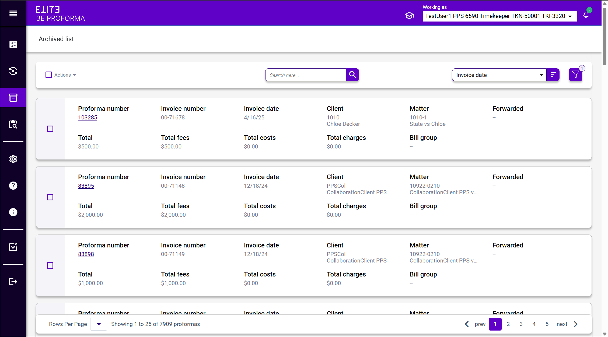

 

| **Field Name** | **Description** |
|----|----|
| **Select** | Select this check box to flag a proforma for an action (e.g., Bill Preview or Edit History) |
| **Invoice number** | Displays the invoice number. |
| **Invoice date** | Displays the date the invoice was created. |
| **Proforma number** | Displays the proforma number. Click this number to drill down to Proforma Detail view. |
| **Client** | Displays the name of the client associated with the matter. |
| **Matter** | Displays the matter name. |
| **Bill Group** | Displays the bill group to which the group |
| **Forwarded** | Indicates the proforma was forwarded to another timekeeper. |
| **Total** | Displays the total amount billed. |
| **Total fees** | Displays the total amount of fees. |

 

# Overrides and System Options

## 3E Proforma System Options

<table>
<colgroup>
<col style="width: 47%" />
<col style="width: 26%" />
<col style="width: 26%" />
</colgroup>
<thead>
<tr>
<th><strong>Option</strong></th>
<th><strong>Description</strong></th>
<th><strong>Default Setting</strong></th>
</tr>
</thead>
<tbody>
<tr>
<td><strong>3EProformaChargeDetailSortAttr</strong></td>
<td>3E Proforma Charge Details Sorting Attribute</td>
<td>Date</td>
</tr>
<tr>
<td><strong>3EProformaCostDetailSortAttr</strong></td>
<td>3E Proforma Cost Details Sorting Attribute</td>
<td>Date</td>
</tr>
<tr>
<td><strong>3EProformaFeeDetailSortAttr</strong></td>
<td>3E Proforma Fee Details Sorting Attribute</td>
<td>Date</td>
</tr>
<tr>
<td><strong>3EProformaListSortAttr</strong></td>
<td>3E Proforma List View Sorting Attribute</td>
<td>Clients Name</td>
</tr>
<tr>
<td><strong>3EProformaProfDetailChargeSortDirection</strong></td>
<td>Used in 3E Proforma for the Charge details child</td>
<td>Ascending</td>
</tr>
<tr>
<td><strong>3EProformaProfDetailCostSortDirection</strong></td>
<td>Used in 3E Proforma for the Cost details child</td>
<td>Ascending</td>
</tr>
<tr>
<td>3EProformaProfDetailTimeSortDirection</td>
<td>Used in 3E Proforma for the Fee/Time details child</td>
<td>Ascending</td>
</tr>
<tr>
<td><strong>3EProformaProfListViewSortDirection</strong></td>
<td>Used as the default sort for the Proforma List</td>
<td>Ascending</td>
</tr>
<tr>
<td><strong>3EProformaUseWorkNarrative</strong></td>
<td>When True, work narrative is edited in 3E Proforma, when false, presentation narrative is edited in 3E Proforma.</td>
<td>True</td>
</tr>
<tr>
<td><strong>3EProformaWriteOffType</strong></td>
<td>Defines the attribute used for Write-Off Fees and Write-Off Costs functionality. Options are Billable Purge, No Charge, and Write Down.</td>
<td>Billable Purge</td>
</tr>
<tr>
<td><strong>Action_notification_autohide_delay</strong></td>
<td>Delay in milliseconds before action success/failures action results fade away</td>
<td>20 sec</td>
</tr>
<tr>
<td>Allow WF_Prof_Edit_Payor</td>
<td>Allows users to view proforma payor information on the proforma</td>
<td>None</td>
</tr>
<tr>
<td><strong>ChargeDetail_BNP_Requires_Comment</strong></td>
<td><strong>Comments</strong> field on a charge card is mandatory field when the <strong>BNP</strong> action is selected</td>
<td>False</td>
</tr>
<tr>
<td><strong>ChargeDetail_NB_Requires_Comment</strong></td>
<td><strong>Comments</strong> field on a charge card is mandatory field when the <strong>Non-billable</strong> action is selected</td>
<td>False</td>
</tr>
<tr>
<td><strong>ChargeDetail_NoCharge_Requires_Comment</strong></td>
<td><strong>Comments</strong> field on a charge card is mandatory field when the <strong>No Charge</strong> action is selected</td>
<td>False</td>
</tr>
<tr>
<td><strong>ChargeDetail_WriteDown_Requires_Comment</strong></td>
<td><strong>Comments</strong> field on a charge card is mandatory field when the <strong>Write Down</strong> action is selected</td>
<td>False</td>
</tr>
<tr>
<td><strong>Commit_cardactions</strong></td>
<td>
Commits <strong>Exclude, Transfer,</strong> <strong>Combine</strong>, and <strong>Purge card</strong> actions to the 3E database

 

<strong>Excludes</strong>

<ul>
<li>
If set to <strong>False</strong>, a biller will be required to review and finalize the Exclude action in Proforma Edit by clicking on ProcExlude action.
</li>
<li>
If set to <strong>True</strong>, the Exclude action is performed automatically in 3E Proforma on the Save &amp; recalc/Save &amp; close/Submit actions.
</li>
</ul>

<strong>Transfers</strong>

<ul>
<li>
If set to <strong>False</strong>, a biller will be required to review and finalize the Transfer action in Proforma Edit by clicking on ProcTransfer action.
</li>
<li>
If set to <strong>True</strong>, the Transfer action is performed automatically in 3E Proforma on the Save &amp; recalc/Save &amp; close/Submit actions.
</li>
</ul>

<strong>Divides</strong>

<ul>
<li>
If set to <strong>False</strong>, a biller will be required to review and finalize the Divide action in Proforma Edit by clicking on ProcTransfer or ProcExlude action.
</li>
<li>
If set to <strong>True</strong>, the Divide action is performed automatically in 3E Proforma on the Save &amp; recalc/Save &amp; close/Submit actions.
</li>
</ul>

 

<strong>Process Transfers in 3E</strong>

If the <strong>ProcTransfer</strong> action (a.k.a., Process Transfer)is selected in Proforma Edit, and <strong>Commit_cardactions</strong> is set to <strong>True</strong>, Transfers, Divides, and Excludes are processed.
</td>
<td>False</td>
</tr>
<tr>
<td><strong>CostDetail_BNP_Requires_Comment</strong></td>
<td><strong>Comments</strong> field on a cost card is mandatory field when the <strong>BNP</strong> action is selected</td>
<td>False</td>
</tr>
<tr>
<td><strong>CostDetail_NB_Requires_Comment</strong></td>
<td><strong>Comments</strong> field on a cost card is mandatory field when the <strong>Non-billable</strong> action is selected</td>
<td>False</td>
</tr>
<tr>
<td><strong>CostDetail_NoCharge_Requires_Comment</strong></td>
<td><strong>Comments</strong> field on a cost card is mandatory field when the <strong>No Charge</strong> action is selected</td>
<td>False</td>
</tr>
<tr>
<td><strong>CostDetail_WriteDown_Requires_Comment</strong></td>
<td><strong>Comments</strong> field on a cost card is mandatory field when the <strong>Write Down</strong> action is selected</td>
<td>False</td>
</tr>
<tr>
<td><strong>Days to Archive Deferred Proformas</strong></td>
<td>Defines the number of days until deferred proformas are moved to Archived proformas. The number of days is added to the date when proforma was generated (there is no way to add to the date when proforma was deferred).</td>
<td>10</td>
</tr>
<tr>
<td><strong>DaysToUrgent</strong></td>
<td>Defines the number of days until a proforma is marked as urgent</td>
<td>10</td>
</tr>
<tr>
<td><strong>Notify_EmailOnAddCollaborator</strong></td>
<td>When true, sends an email notification to collaborators when they are added to a proforma.</td>
<td>False</td>
</tr>
<tr>
<td><strong>Notify_EmailOnForward</strong></td>
<td>When true, sends an email notification to a user when a proforma is forwarded to them.</td>
<td>False</td>
</tr>
<tr>
<td><strong>ProformaDetail_DisplayAllForNonOwners</strong></td>
<td>
If set to True, all cards are displayed for all timekeepers/fee earners.

If set to False, non-owners will only see their own cards.
</td>
<td>False</td>
</tr>
<tr>
<td><strong> </strong></td>
<td colspan="2" style="text-align: left;">
<strong>Note: </strong> If any one of these conditions are met, the user will see all cards:

<ul>
<li>
"ProformaDetail_DisplayAllForNonOwners" option is set to <strong>True</strong>
</li>
<li>
User is assigned to the Approver Role
</li>
<li>
Current timekeeper/fee earner was added as an Editor (or forwarded the proforma) by the BillTkpr, SuprTkpr, or RspTkpr of the proforma
</li>
<li>
User is an effective dated timekeeper/fee earner on the matter
</li>
</ul>

 
</td>
</tr>
<tr>
<td><strong>ProformaDetail_Pagesize</strong></td>
<td>Control the page size for time, cost, and charge details sections. Values that can be set are 10, 20, 25, 50, 100.</td>
<td>25</td>
</tr>
<tr>
<td><strong>ProformaList_Pagesize</strong></td>
<td>Control the default page size for all proforma lists. 
Available options are 10, 20, 25, 50</td>
<td>25</td>
</tr>
<tr>
<td><strong>ProformaStatus_Closed_Code</strong></td>
<td>Proforma status to use when closing an unprocessed proforma</td>
<td>Closed</td>
</tr>
<tr>
<td><strong>ProformaStatus_Closed_Processed_Code</strong></td>
<td>Proforma status to use when closing a processed proforma</td>
<td>SAVEEDITS</td>
</tr>
<tr>
<td><strong>ProformaStatus_Defer_Code</strong></td>
<td>Proforma status to use when deferring a proforma</td>
<td>Defer</td>
</tr>
<tr>
<td><strong> </strong></td>
<td colspan="2"><strong>Note:</strong> This should be updated for each Firm based on the status code they have set in the proforma status process for Hold. This status should not have Save Edits = True.</td>
</tr>
<tr>
<td><strong>ProformaStatus_Undefer_Code</strong></td>
<td>Proforma status to use when undeferring a proforma</td>
<td>Current</td>
</tr>
<tr>
<td><strong> </strong></td>
<td colspan="2"><strong>Note:</strong> This should be updated for each Firm based on the status code they have set in the proforma status process for Hold.</td>
</tr>
<tr>
<td><strong>Show_WIP</strong></td>
<td>Enables Billing Timekeepers/Fee Earners to see their WIP List Items and generate proformas</td>
<td>False</td>
</tr>
<tr>
<td><strong> </strong></td>
<td colspan="2"><strong>Note:</strong> This option was moved to the 3E Proforma Security group as of 3E 5.8/3E on prem 3.2.</td>
</tr>
<tr>
<td><strong>TimeDetail_BNP_Requires_Comment</strong></td>
<td><strong>Comments</strong> field on a time card is mandatory field when the <strong>BNP</strong> action is selected</td>
<td>False</td>
</tr>
<tr>
<td><strong>TimeDetail_NB_Requires_Comment</strong></td>
<td><strong>Comments</strong> field on a time card is mandatory field when the <strong>Non-billable</strong> action is selected</td>
<td>False</td>
</tr>
<tr>
<td><strong>TimeDetail_NoCharge_Requires_Comment</strong></td>
<td><strong>Comments</strong> field on a time card is mandatory field when the <strong>No Charge</strong> action is selected</td>
<td>False</td>
</tr>
<tr>
<td><strong>TimeDetail_WriteDown_Requires_Comment</strong></td>
<td><strong>Comments</strong> field on a time card is mandatory field when the <strong>Write Down</strong> action is selected</td>
<td>False</td>
</tr>
<tr>
<td><strong>Update Presentation Narrative</strong></td>
<td>Update presentation narrative</td>
<td>True</td>
</tr>
<tr>
<td><strong>Use Billing Workflow</strong></td>
<td>Enables the use of 3E Proforma Billing Workflow</td>
<td>False</td>
</tr>
<tr>
<td><strong> </strong></td>
<td colspan="2"><strong>Note:</strong> This setting MUST be set to True as per the “Before You Begin” checklist.</td>
</tr>
<tr>
<td><strong> </strong></td>
<td> </td>
<td> </td>
</tr>
</tbody>
</table>

 

### **Workflow Config specific settings under 3E Proforma group**

| **Option** | **Description** | **Default Setting** |
|----|----|----|
| **Approve Bill Description** | Description for the Workflow Approve Bill step | Approve Bill |
| **Approve Bill Process** | Process id for the Approve Bill step | WF_ProformaApprove |
| **Approver Role** | Name of the Role to assign users as approvers | 3EProformaApproverRole |
| **Biller Edit Bill Description** | Description for the Workflow Biller Edit Bill step | Biller Edit Bill |
| **Edit Bill Description** | Description for the Workflow Edit Bill step | Edit Bill |
| **Edit Bill Process** | Process id for the Workflow Edit Bill step | WF_ProformaEdit |
| **Generate Proforma Process** | Process id for the Generate Proforma step | WF_ProfGeneration |
| **Group Proforma Workflow Name** | Group Proforma Workflow Name | WF_ProfGroup |
| **Process Bill** | Process ID for the Process Bill step | WF_ProformaBill |
| **Proforma Workflow Name** | Billing Journey Workflow Name | 3EProformaBilling |
| **Start Group Workflow Process Name ** | Process ID to start Group Billing Workflow | WF_ProfGroupStart |
| **Start Workflow from Group Return Process Name** | Process ID to start the Billing Workflow when returning from Group Bill | WF_ProfStartFromGroup |
| **Start Workflow Process Name** | Process ID to start the Billing workflow | WF_ProfStart |
| **WF Bill Write Down Approved Rule Set Code** | The code assigned to the 'Bill write down approved' ruleset under 'Approve Bill' | ProfApproveDef |
| **WF Biller Return Rule Set Code** | The code assigned to the 'Biller Return' ruleset under 'Return Biller Proforma' in the workflow | BillerEditProfReturnDef |
| **WF Group Bill Submit Rule Set Code** | The code assigned to the 'Group Bill' ruleset without Approval | GroupProfSubmitDef |
| **WF Group Bill Write Down Approved Rule Set Code** | The code assigned to the 'Group Bill Write Down Approved' ruleset under 'Approve Bill' in the workflow | GroupProfApproveDef |
| **WF Reject Proforma Rule Set Code** | The code assigned to the 'Reject Proforma' ruleset under 'Approve Bill' in the workflow | ProfRejectDef |
| **WF Return Group Proforma Rule Set Code** | The code assigned to the 'Return Group Proforma' ruleset under 'Process Group Bill' in the workflow | GroupProfBillReturnDef |
| **WF Return Proforma Rule Set Code** | The code assigned to the 'Return Proforma' ruleset under 'Process Bill' in the workflow | ProfBillReturnDef |

## 3E Proforma Security System Options List

<table style="width:96%;">
<colgroup>
<col style="width: 48%" />
<col style="width: 31%" />
<col style="width: 16%" />
</colgroup>
<thead>
<tr>
<th><strong>Option</strong></th>
<th><strong>Description</strong></th>
<th><strong>Default Setting</strong></th>
</tr>
</thead>
<tbody>
<tr>
<td><strong>ArchivedList_Allow_BillPreview</strong></td>
<td>Show the Bill Preview action for the archived proformas in the Archived List</td>
<td>TRUE</td>
</tr>
<tr>
<td><strong>ArchiveList_Allow_PrintProforma</strong></td>
<td>Show the Print Proforma action for the archived proformas in the Archived List</td>
<td>TRUE</td>
</tr>
<tr>
<td><strong>Global_Allow_BillPreview</strong></td>
<td>Show the actions; My Proformas - Bulk Actions - Bill Preview, My Proformas - Bill Preview, Proforma Details - Bill Preview</td>
<td>TRUE</td>
</tr>
<tr>
<td><strong>Global_Allow_Charges</strong></td>
<td>Show the actions; My Proformas - Total Charges, Proforma Details - Review Late Cards - Charges, Proforma Details - Proforma Header - Charges Original, Proforma Details - Proforma Header - Charges Billed, Proforma Details - Charges Tab, WIP List - Total Charges,   Archived List - Total Charges</td>
<td>TRUE</td>
</tr>
<tr>
<td><strong>Global_Allow_Close</strong></td>
<td>Show the actions; My Proformas - Bulk Actions - Close, My Proformas - Actions - Close, Proforma Details - Proforma Actions - Close</td>
<td>TRUE</td>
</tr>
<tr>
<td><strong>Global_Allow_Collaborators</strong></td>
<td>Show the actions; My Proformas - Card View - Collaborators, My Proformas - Grid View – Actions - View Collaborators, Proforma Details - View  Collaborators</td>
<td>TRUE</td>
</tr>
<tr>
<td><strong>Global_Allow_Comments</strong></td>
<td>Show the actions; My Proformas - Actions - Add comments (proforma level), Proforma Header - Comments (proforma level)</td>
<td>TRUE</td>
</tr>
<tr>
<td><strong>Global_Allow_Costs</strong></td>
<td>Show the actions; My Proformas - Total Costs, Proforma Details - Review Late Cards - Costs, Proforma Details - Proforma Actions - Add costs, Proforma Details - Proforma Header - Costs Original, Proforma Details - Proforma Header - Costs Billed, Proforma Details - Costs Tab, WIP List - Total Costs, Archived List - Total Costs</td>
<td>TRUE</td>
</tr>
<tr>
<td><strong>Global_Allow_Defer</strong></td>
<td>Show the actions; My Proformas - Bulk Actions - Defer, My Proformas - Actions - Defer, Proforma Details - Proforma Actions - Defer</td>
<td>TRUE</td>
</tr>
<tr>
<td><strong>Global_Allow_Fees</strong></td>
<td>Show the actions; My Proformas - Total Fees, Proforma Details - Review Late Cards - Fees, Proforma Details - Proforma Actions - Add fee, Proforma Details - Proforma Header - Fees Original, Proforma Details - Proforma Header - Fees Billed, Proforma Details - Fees Tab,WIP List - Total Fees, Archived List - Total Fees</td>
<td>TRUE</td>
</tr>
<tr>
<td><strong>Global_Allow_Forward</strong></td>
<td>Show the actions; My Proformas - Bulk Actions - Forward, My Proformas - Forward, My Proformas - Forwarded, Proforma Details - Proforma Actions - Forward, Filter - Forwarded</td>
<td>TRUE</td>
</tr>
<tr>
<td><strong>Global_Allow_PrintProforma</strong></td>
<td>Show the actions; My Proformas - Bulk Actions - Print Proforma, My Proformas - Print, Proforma Details - Proforma Actions - Print Proforma</td>
<td>TRUE</td>
</tr>
<tr>
<td><strong>Global_Allow_ProformaTracking</strong></td>
<td>Allow users to see the Proforma workflow steps and the collaborator details via Proforma Tracking</td>
<td>TRUE</td>
</tr>
<tr>
<td><strong>Global_Allow_SetPriority</strong></td>
<td>Show the actions; My Proformas - Bulk Actions - Set priority, My Proformas - Card View - Priority, My Proformas - Grid View - Priority, Proforma Details - Proforma Actions - Set priority, Proforma Details - Proforma Header - Priority, Filter - Flagged</td>
<td>TRUE</td>
</tr>
<tr>
<td><strong>Global_Show_AvailableFunds</strong></td>
<td>Show the actions; My Proformas - Available Funds, Proforma Details - Proforma Header - Available Funds, Proforma Details - Funds Tab, Sort &amp; Filter - Available Funds</td>
<td>TRUE</td>
</tr>
<tr>
<td><strong>Global_Show_BillGroup</strong></td>
<td>Show the actions; My Proformas - Bill Group, Proforma Details - Proforma Header - Billing Info - Billing Group, WIP List - Bill Group, Archived List - Bill Group</td>
<td>TRUE</td>
</tr>
<tr>
<td><strong>ProfDetails_Add_Adjustments</strong></td>
<td>Show the actions; Proforma Details - Proforma Actions Add Adjustments &amp; Adjustments Tab Add Adjustments</td>
<td>TRUE</td>
</tr>
<tr>
<td><strong>ProfDetails_Adjustments_Allow_Delete</strong></td>
<td>Show the action; Proforma Details - Adjustments - Delete</td>
<td>TRUE</td>
</tr>
<tr>
<td><strong>ProfDetails_Adjustments_Allow_Edit</strong></td>
<td>Show the action; Proforma Details - Adjustments - Edit</td>
<td>TRUE</td>
</tr>
<tr>
<td><strong>ProfDetails_Adjustments_Show_EndDate</strong></td>
<td>Show the actions; Proforma Details - Adjustments - End Date &amp; Add Adjustment End Date</td>
<td>TRUE</td>
</tr>
<tr>
<td><strong>ProfDetails_Adjustments_Show_StartDate</strong></td>
<td>Show the actions; Proforma Details - Adjustments - Start Date &amp; Add Adjustment Start Date</td>
<td>TRUE</td>
</tr>
<tr>
<td><strong>ProfDetails_Adjustments_Show_Timekeeper</strong></td>
<td>Show the actions; Proforma Details - Adjustments – Timekeeper/Fee Earner &amp; Add Adjustment Timekeeper/Fee Earner</td>
<td>TRUE</td>
</tr>
<tr>
<td><strong>ProfDetails_Charges_Allow_BillNoPrint</strong></td>
<td>Show the actions; Proforma Details - Charges Tab - Bulk Actions - Bill no print, Proforma Details - Charges Tab - Card Actions - Bill no print</td>
<td>TRUE</td>
</tr>
<tr>
<td><strong>ProfDetails_Charges_Allow_Bulk_Combine</strong></td>
<td>Show the action; Proforma Details Charges Tab - Bulk Actions - Combine</td>
<td>TRUE</td>
</tr>
<tr>
<td><strong>ProfDetails_Charges_Allow_Bulk_Edit</strong></td>
<td>Show the action; Proforma Details Charges Tab - Bulk Actions - Bulk edit</td>
<td>TRUE</td>
</tr>
<tr>
<td><strong>ProfDetails_Charges_Allow_BulkActions</strong></td>
<td>Show the action; Proforma Details Charges Tab - Bulk Actions</td>
<td>TRUE</td>
</tr>
<tr>
<td><strong>ProfDetails_Charges_Allow_Card_Divide</strong></td>
<td>Show the action; Proforma Details Charges Tab - Card Actions - Divide</td>
<td>TRUE</td>
</tr>
<tr>
<td><strong>ProfDetails_Charges_Allow_Card_EditHistory</strong></td>
<td>Show the action; Proforma Details Charges Tab - Card Actions - Edit History</td>
<td>TRUE</td>
</tr>
<tr>
<td><strong>ProfDetails_Charges_Allow_Exclude</strong></td>
<td>Show the actions; Proforma Details - Charges Tab - Bulk Actions - Exclude, Proforma Details - Charges Tab - Card Actions - Exclude</td>
<td>TRUE</td>
</tr>
<tr>
<td><strong>ProfDetails_Charges_Allow_NoCharge</strong></td>
<td>Show the actions; Proforma Details - Charges Tab - Bulk Actions - No charge, Proforma Details - Charges Tab - Card Actions - No charge</td>
<td>TRUE</td>
</tr>
<tr>
<td><strong>ProfDetails_Charges_Allow_NonBillable</strong></td>
<td>Show the actions; Proforma Details - Charges Tab - Bulk Actions - Non-billable, Proforma Details - Charges Tab - Card Actions - Non-billable</td>
<td>TRUE</td>
</tr>
<tr>
<td><strong>ProfDetails_Charges_Allow_Purge</strong></td>
<td>Show the actions; Proforma Details - Charges Tab - Bulk Actions - Purge, Proforma Details - Charges Tab - Card Actions - Purge</td>
<td>TRUE</td>
</tr>
<tr>
<td><strong>ProfDetails_Charges_Allow_Transfer</strong></td>
<td>Show the actions; Proforma Details - Charges Tab - Bulk Actions - Transfer, Proforma Details - Charges Tab - Card Actions - Transfer</td>
<td>TRUE</td>
</tr>
<tr>
<td><strong>ProfDetails_Charges_Allow_WriteDown</strong></td>
<td>Show the actions; Proforma Details - Charges Tab - Bulk Actions - Write down, Proforma Details - Charges Tab - Card Actions - Write down</td>
<td>TRUE</td>
</tr>
<tr>
<td><strong>ProfDetails_Charges_Allow_WriteUp</strong></td>
<td>Allow users to write up the charge amounts for each charge card in the charges tab</td>
<td>TRUE</td>
</tr>
<tr>
<td><strong>ProfDetails_Charges_Amount</strong></td>
<td>
Proforma Details Charge Tab - Amount

Security rights options:

<ul>
<li>
Full
</li>
<li>
Read Only
</li>
<li>
Hidden
</li>
</ul>

This override can be applied at the Firm, Role, or User level.
</td>
<td>Full</td>
</tr>
<tr>
<td><strong>ProfDetails_Charges_Comments</strong></td>
<td>Proforma Details Charges Tab - Comments</td>
<td>Full</td>
</tr>
<tr>
<td><strong>ProfDetails_Charges_Narrative</strong></td>
<td>Proforma Details Charges Tab - Narrative</td>
<td>Full</td>
</tr>
<tr>
<td><strong>ProfDetails_Charges_TaxCode</strong></td>
<td>Proforma Details Charges Tab - TaxCode</td>
<td>Full</td>
</tr>
<tr>
<td><strong>ProfDetails_Charges_TaxJurisdiction</strong></td>
<td>Proforma Details Charges Tab - TaxJurisdiction</td>
<td>Full</td>
</tr>
<tr>
<td><strong>ProfDetails_Costs_Allow_BillNoPrint</strong></td>
<td>Show the actions; Proforma Details - Costs Tab - Bulk Actions - Bill no print, Proforma Details - Costs Tab - Card Actions - Bill no print</td>
<td>TRUE</td>
</tr>
<tr>
<td><strong>ProfDetails_Costs_Allow_Bulk_Combine</strong></td>
<td>Show the action; Proforma Details Costs Tab - Bulk Actions - Combine</td>
<td>TRUE</td>
</tr>
<tr>
<td><strong>ProfDetails_Costs_Allow_Bulk_Edit</strong></td>
<td>Show the action; Proforma Details Costs Tab - Bulk Actions - Bulk edit</td>
<td>TRUE</td>
</tr>
<tr>
<td><strong>ProfDetails_Costs_Allow_BulkActions</strong></td>
<td>Show the action; Proforma Details Costs Tab - Bulk Actions</td>
<td>TRUE</td>
</tr>
<tr>
<td><strong>ProfDetails_Costs_Allow_Card_Divide</strong></td>
<td>Show the action; Proforma Details Costs Tab - Card Actions - Divide</td>
<td>TRUE</td>
</tr>
<tr>
<td><strong>ProfDetails_Costs_Allow_Card_EditHistory</strong></td>
<td>Show the action; Proforma Details Costs Tab - Card Actions - Edit History</td>
<td>TRUE</td>
</tr>
<tr>
<td><strong>ProfDetails_Costs_Allow_Exclude</strong></td>
<td>Show the actions; Proforma Details - Proforma Actions - Add cost - Exclude, Proforma Details - Costs Tab - Bulk Actions - Exclude, Proforma Details - Costs Tab - Card Actions - Exclude</td>
<td>TRUE</td>
</tr>
<tr>
<td><strong>ProfDetails_Costs_Allow_NoCharge</strong></td>
<td>Show the actions; Proforma Details - Proforma Actions - Add cost - No charge, Proforma Details - Costs Tab - Bulk Actions - No charge, Proforma Details - Costs Tab - Card Actions - No charge</td>
<td>TRUE</td>
</tr>
<tr>
<td>ProfDetails_Costs_Allow_Non-Billable</td>
<td>Show the actions; Proforma Details - Proforma Actions - Add cost - Non-billable, Proforma Details - Costs Tab - Bulk Actions - Non-billable, Proforma Details - Costs Tab - Card Actions - Non-billable</td>
<td>TRUE</td>
</tr>
<tr>
<td><strong>ProfDetails_Costs_Allow_Purge</strong></td>
<td>Show the action; Proforma Details - Costs Tab - Bulk Actions - Purge, Proforma Details - Costs Tab - Card Actions - Purge</td>
<td>TRUE</td>
</tr>
<tr>
<td><strong>ProfDetails_Costs_Allow_Transfer</strong></td>
<td>Show the action; Proforma Details - Costs Tab - Bulk Actions - Transfer Proforma, Details - Costs Tab - Card Actions - Transfer</td>
<td>TRUE</td>
</tr>
<tr>
<td><strong>ProfDetails_Costs_Allow_WriteDown</strong></td>
<td>Show the action; Proforma Details - Costs Tab - Bulk Actions - Write down, Proforma Details - Costs Tab - Card Actions - Write down</td>
<td>TRUE</td>
</tr>
<tr>
<td><strong>ProfDetails_Costs_Allow_WriteUp</strong></td>
<td>Allow users to write up the cost amounts for each cost card in the costs tab</td>
<td>TRUE</td>
</tr>
<tr>
<td><strong>ProfDetails_Costs_Comments</strong></td>
<td>Proforma Details Costs Tab - Comments</td>
<td>Full</td>
</tr>
<tr>
<td><strong>ProfDetails_Costs_GroupTotal_BilledCosts</strong></td>
<td>Proforma Details Costs Tab - Group Totals - Billed Costs</td>
<td>Full</td>
</tr>
<tr>
<td><strong>ProfDetails_Costs_GroupTotal_BilledUnits</strong></td>
<td>Proforma Details Costs Tab - Group Totals - Billed Units</td>
<td>Full</td>
</tr>
<tr>
<td><strong>ProfDetails_Costs_Rate</strong></td>
<td>Proforma Details Costs Tab - Rate</td>
<td>Full</td>
</tr>
<tr>
<td><strong>ProfDetails_Costs_Show_GroupTotals</strong></td>
<td>Show Proforma Details Costs Tab - Group Totals</td>
<td>TRUE</td>
</tr>
<tr>
<td><strong>ProfDetails_Costs_TaxCode</strong></td>
<td>Proforma Details - Proforma Actions - Add cost - Tax code, Proforma Details - Costs Tab - Tax code</td>
<td>Full</td>
</tr>
<tr>
<td><strong>ProfDetails_Costs_TaxJurisdiction</strong></td>
<td>Proforma Details - Proforma Actions - Add cost - Tax jurisdiction, Proforma Details - Costs Tab - Tax jurisdiction</td>
<td>Full</td>
</tr>
<tr>
<td><strong>ProfDetails_Costs_Amount</strong></td>
<td>
Proforma Details Cost Tab - Amount

Security rights options:

<ul>
<li>
Full
</li>
<li>
Read Only
</li>
<li>
Hidden
</li>
</ul>

This override can be applied at the Firm, Role, or User level.
</td>
<td>Full</td>
</tr>
<tr>
<td><strong>ProfDetails_Costs_Units</strong></td>
<td>
Proforma Details Cost Tab - Unit

Security rights options:

<ul>
<li>
Full
</li>
<li>
Read Only
</li>
<li>
Hidden
</li>
</ul>

This override can be applied at the Firm, Role, or User level.
</td>
<td>Full</td>
</tr>
<tr>
<td><strong>ProfDetails_Details_GroupEdit_BillCostsOnly</strong></td>
<td>Proforma Details Group Edit - Bill Costs Only</td>
<td>Full</td>
</tr>
<tr>
<td><strong>ProfDetails_Details_GroupEdit_BillFeesOnly</strong></td>
<td>Proforma Details Group Edit - Bill Fees Only</td>
<td>Full</td>
</tr>
<tr>
<td><strong>ProfDetails_Details_GroupEdit_WriteOffCosts</strong></td>
<td>Proforma Details Group Edit - Write off Costs</td>
<td>Full</td>
</tr>
<tr>
<td><strong>ProfDetails_Details_GroupEdit_WriteOffFees</strong></td>
<td>Proforma Details Group Edit - Write off Fees</td>
<td>Full</td>
</tr>
<tr>
<td><strong>ProfDetails_Fees_Allow_BillNoPrint</strong></td>
<td>Show the action; Proforma Details - Fees Tab - Bulk Actions - Bill no print, Proforma Details - Fees Tab - Card Actions - Bill no print</td>
<td>TRUE</td>
</tr>
<tr>
<td><strong>ProfDetails_Fees_Allow_Bulk_Combine</strong></td>
<td>Show the action; Proforma Details Fees Tab - Bulk Actions - Combine</td>
<td>TRUE</td>
</tr>
<tr>
<td><strong>ProfDetails_Fees_Allow_Bulk_Edit</strong></td>
<td>Show the action; Proforma Details Fees Tab - Bulk Actions - Bulk edit</td>
<td>TRUE</td>
</tr>
<tr>
<td><strong>ProfDetails_Fees_Allow_BulkActions</strong></td>
<td>Show the actions; Proforma Details Fees Tab - Bulk Actions</td>
<td>TRUE</td>
</tr>
<tr>
<td><strong>ProfDetails_Fees_Allow_Card_Divide</strong></td>
<td>Show the action; Proforma Details Fees Tab - Card Actions - Divide</td>
<td>TRUE</td>
</tr>
<tr>
<td><strong>ProfDetails_Fees_Allow_Card_EditHistory</strong></td>
<td>Show the action; Proforma Details Fees Tab - Card Actions - Edit History</td>
<td>TRUE</td>
</tr>
<tr>
<td><strong>ProfDetails_Fees_Allow_Purge</strong></td>
<td>Show the action; Proforma Details - Fees Tab - Bulk Actions - Purge Proforma Details - Fees Tab - Card Actions - Purge</td>
<td>TRUE</td>
</tr>
<tr>
<td><strong>ProfDetails_Fees_Allow_Transfer</strong></td>
<td>Show the action; Proforma Details - Fees Tab - Bulk Actions - Transfer, Proforma Details - Fees Tab - Card Actions - Transfer</td>
<td>TRUE</td>
</tr>
<tr>
<td><strong>ProfDetails_Fees_Allow_WriteDown</strong></td>
<td>Show the action; Proforma Details - Fees Tab - Bulk Actions - Write down, Proforma Details - Fees Tab - Card Actions - Write down</td>
<td>TRUE</td>
</tr>
<tr>
<td><strong>ProfDetails_Fees_Allow_WriteUp</strong></td>
<td>Set access to Allow users to write up the fee amounts for each fee card in the fees tab</td>
<td>TRUE</td>
</tr>
<tr>
<td><strong>ProfDetails_Fees_Comments</strong></td>
<td>Proforma Details Fees Tab - Comments</td>
<td>Full</td>
</tr>
<tr>
<td><strong>ProfDetails_Fees_GroupTotals</strong></td>
<td>Show  Proforma Details Fees Tab - Group Totals</td>
<td>TRUE</td>
</tr>
<tr>
<td><strong>ProfDetails_Fees_GroupTotals_AvgRateBilled</strong></td>
<td>Proforma Details Fees Tab - Group Totals - Average Rate Billed</td>
<td>Full</td>
</tr>
<tr>
<td><strong>ProfDetails_Fees_GroupTotals_AvgRateWorked</strong></td>
<td>Show Proforma Details Fees Tab - Group Totals - Average Rate Worked</td>
<td>TRUE</td>
</tr>
<tr>
<td><strong>ProfDetails_Fees_GroupTotals_BilledFees</strong></td>
<td>Proforma Details Fees Tab - Group Totals - Billed Fees</td>
<td>Full</td>
</tr>
<tr>
<td><strong>ProfDetails_Fees_GroupTotals_HoursBilled</strong></td>
<td>Proforma Details Fees Tab - Group Totals - Hours Billed</td>
<td>Full</td>
</tr>
<tr>
<td><strong>ProfDetails_Fees_Amount</strong></td>
<td>
Proforma Details Fee Tab - Amount

Security rights options:

<ul>
<li>
Full
</li>
<li>
Read Only
</li>
<li>
Hidden
</li>
</ul>

This override can be applied at the Firm, Role, or User level.
</td>
<td>Full</td>
</tr>
<tr>
<td><strong>ProfDetails_Fees_Hours</strong></td>
<td>
Proforma Details Fee Tab - Hour

Security rights options:

<ul>
<li>
Full
</li>
<li>
Read Only
</li>
<li>
Hidden
</li>
</ul>

This override can be applied at the Firm, Role, or User level.
</td>
<td>Full</td>
</tr>
<tr>
<td><strong>ProfDetails_Fees_Rate</strong></td>
<td>Proforma Details Fees Tab - Rate value</td>
<td>Full</td>
</tr>
<tr>
<td><strong>ProfDetails_Funds_BOA_TaxCode</strong></td>
<td>Proforma Details Funds Tab - Unallocated BOA - Tax code</td>
<td>Full</td>
</tr>
<tr>
<td><strong>ProfDetails_Funds_Show_BOA</strong></td>
<td>Show Proforma Details Funds Tab - Unallocated BOA</td>
<td>TRUE</td>
</tr>
<tr>
<td><strong>ProfDetails_Funds_Show_BOA_BOACurrency</strong></td>
<td>Show Proforma Details Funds Tab - Unallocated BOA - BOA currency</td>
<td>TRUE</td>
</tr>
<tr>
<td><strong>ProfDetails_Funds_Show_BOA_ChargeType</strong></td>
<td>Show Proforma Details Funds Tab - Unallocated BOA - Charge type</td>
<td>TRUE</td>
</tr>
<tr>
<td><strong>ProfDetails_Funds_Show_BOA_CostsOnly</strong></td>
<td>Show Proforma Details Funds Tab - Unallocated BOA - Costs only</td>
<td>TRUE</td>
</tr>
<tr>
<td><strong>ProfDetails_Funds_Show_BOA_ExcRate</strong></td>
<td>Show Proforma Details Funds Tab - Unallocated BOA - Exchange rate</td>
<td>TRUE</td>
</tr>
<tr>
<td><strong>ProfDetails_Funds_Show_BOA_FeesOnly</strong></td>
<td>Show Proforma Details Funds Tab - Unallocated BOA - Fees only</td>
<td>TRUE</td>
</tr>
<tr>
<td><strong>ProfDetails_Funds_Show_BOA_ProfCurrency</strong></td>
<td>Show Proforma Details Funds Tab - Unallocated BOA - Proforma Currency</td>
<td>TRUE</td>
</tr>
<tr>
<td><strong>ProfDetails_Funds_Show_Trust</strong></td>
<td>Show Proforma Details Funds Tab - Trust Tab</td>
<td>TRUE</td>
</tr>
<tr>
<td><strong>ProfDetails_Funds_Show_Trust_ExcRate</strong></td>
<td>Show Proforma Details Funds Tab - Trust - Exchange rate</td>
<td>TRUE</td>
</tr>
<tr>
<td><strong>ProfDetails_Funds_Show_Trust_IntdUse</strong></td>
<td>Show Proforma Details Funds Tab - Trust - Intended Use</td>
<td>TRUE</td>
</tr>
<tr>
<td><strong>ProfDetails_Funds_Show_Trust_ProfCurrency</strong></td>
<td>Show Proforma Details Funds Tab - Trust - Proforma currency</td>
<td>TRUE</td>
</tr>
<tr>
<td><strong>ProfDetails_Funds_Show_Trust_TrustCurrency</strong></td>
<td>Show Proforma Details Funds Tab - Trust - Trust currency</td>
<td>TRUE</td>
</tr>
<tr>
<td><strong>ProfDetails_Funds_Show_Unallocated</strong></td>
<td>Show Proforma Details Funds Tab - Unallocated credit</td>
<td>TRUE</td>
</tr>
<tr>
<td><strong>ProfDetails_Funds_Show_Unallocated_ExcRate</strong></td>
<td>Show Proforma Details Funds Tab - Unallocated credit - Exchange Rate</td>
<td>TRUE</td>
</tr>
<tr>
<td><strong>ProfDetails_Funds_Show_Unallocated_ProfCurrency</strong></td>
<td>Show Proforma Details Funds Tab - Unallocated credit - Proforma currency</td>
<td>TRUE</td>
</tr>
<tr>
<td><strong>ProfDetails_Funds_Show_Unallocated_UnlCurrency</strong></td>
<td>Show Proforma Details Funds Tab - Unallocated credit - Unallocated currency</td>
<td>TRUE</td>
</tr>
<tr>
<td><strong>ProfDetails_Funds_Trust_ClearDays</strong></td>
<td>Proforma Details Funds Tab - Trust - Clear days</td>
<td>Full</td>
</tr>
<tr>
<td><strong>ProfDetails_Funds_Trust_DocNum</strong></td>
<td>Proforma Details Funds Tab - Trust - Document number</td>
<td>Full</td>
</tr>
<tr>
<td><strong>ProfDetails_Funds_Trust_RecType</strong></td>
<td>Proforma Details Funds Tab - Trust - Receipt Type checkbox &amp; field</td>
<td>Full</td>
</tr>
<tr>
<td><strong>ProfDetails_Header_Attachments</strong></td>
<td>Proforma Details - Edit/Read/Hidden permissions for the Attachments</td>
<td>Full</td>
</tr>
<tr>
<td><strong>ProfDetails_Header_GeneralInfo-GroupExclude</strong></td>
<td>Proforma Details - Proforma Header - General Info - Exclude from proforma Group</td>
<td>Full</td>
</tr>
<tr>
<td><strong>ProfDetails_Header_HoursBilled</strong></td>
<td>Proforma Details - Edit/Read/Hidden permissions for the Hours Billed</td>
<td>Full</td>
</tr>
<tr>
<td>ProfDetails_Header_Instructions-Inst</td>
<td>Proforma Details - Proforma Header - Instructions - Instructions</td>
<td>Full</td>
</tr>
<tr>
<td><strong>ProfDetails_Header_Show_BillingInfo</strong></td>
<td>Show Proforma Details - Proforma Header - Billing Info</td>
<td>TRUE</td>
</tr>
<tr>
<td><strong>ProfDetails_Header_Show_BillingInfo-BillTemplate</strong></td>
<td>Show Proforma Details - Proforma Header - Billing Info - Bill Template</td>
<td>TRUE</td>
</tr>
<tr>
<td><strong>ProfDetails_Header_Show_BillingInfo-eBill</strong></td>
<td>Show Proforma Details - Proforma Header - Billing Info - E-billing</td>
<td>TRUE</td>
</tr>
<tr>
<td><strong>ProfDetails_Header_Show_BillingInfo-emailBillto</strong></td>
<td>Show Proforma Details - Proforma Header - Billing Info - Email bill to</td>
<td>TRUE</td>
</tr>
<tr>
<td><strong>ProfDetails_Header_Show_BillingInfo-PayTerms</strong></td>
<td>Show Proforma Details - Proforma Header - Billing Info - Payment terms</td>
<td>TRUE</td>
</tr>
<tr>
<td><strong>ProfDetails_Header_Show_FlatFees</strong></td>
<td>Show Proforma Details - Proforma Header - Flat fees</td>
<td>TRUE</td>
</tr>
<tr>
<td><strong>ProfDetails_Header_Show_GeneralInfo</strong></td>
<td>Show Proforma Details - Proforma Header - General Info</td>
<td>TRUE</td>
</tr>
<tr>
<td>ProfDetails_Header_Show_GeneralInfo-Payor</td>
<td>Show Proforma Details - Proforma Header - General Info - Payor</td>
<td>TRUE</td>
</tr>
<tr>
<td><strong>ProfDetails_Header_Show_Instructions</strong></td>
<td>Show Proforma Details - Proforma Header - Instructions</td>
<td>TRUE</td>
</tr>
<tr>
<td><strong>ProfDetails_Header_Show_MatterInfo</strong></td>
<td>Show Proforma Details - Proforma Header - Matter info</td>
<td>TRUE</td>
</tr>
<tr>
<td><strong>ProfDetails_Header_Show_MatterInfo-DeptCode</strong></td>
<td>Show Proforma Details - Proforma Header - Matter info - Department Code</td>
<td>TRUE</td>
</tr>
<tr>
<td><strong>ProfDetails_Header_Show_MatterInfo-MatCurr</strong></td>
<td>Show Proforma Details - Proforma Header - Matter info - Matter currency</td>
<td>TRUE</td>
</tr>
<tr>
<td><strong>ProfDetails_Header_Show_MatterInfo-MatRateCode</strong></td>
<td>Show Proforma Details - Proforma Header - Matter info - Matter rate code</td>
<td>TRUE</td>
</tr>
<tr>
<td><strong>ProfDetails_Header_Show_MatterInfo-MatRateDesc</strong></td>
<td>Show Proforma Details - Proforma Header - Matter info - Matter rate description</td>
<td>TRUE</td>
</tr>
<tr>
<td><strong>ProfDetails_Header_Show_MatterInfo-MatRateExc</strong></td>
<td>Show Proforma Details - Proforma Header - Matter info - Matter rate exception</td>
<td>TRUE</td>
</tr>
<tr>
<td><strong>ProfDetails_Header_Show_MatterInfo-MatStatus</strong></td>
<td>Show Proforma Details - Proforma Header - Matter info - Matter status</td>
<td>TRUE</td>
</tr>
<tr>
<td><strong>ProfDetails_Header_Show_MatterInfo-PracGroup</strong></td>
<td>Show Proforma Details - Proforma Header - Matter info - Practice Group</td>
<td>TRUE</td>
</tr>
<tr>
<td><strong>ProfDetails_InfoNotifications</strong></td>
<td>Show Proforma Actions - Informational Notification - Late Cards, Proforma Actions - Informational Notification - Available Funds, Proforma Actions - Informational Notification - Updated Edits</td>
<td>TRUE</td>
</tr>
<tr>
<td><strong>ProfDetails_LateCards</strong></td>
<td>Proforma Details - Late Cards Notification/Review</td>
<td>Full</td>
</tr>
<tr>
<td><strong>ProfDetails_ProfActions_Allow_Cancel</strong></td>
<td>Show the action; Proforma Details - Proforma Actions - Cancel</td>
<td>TRUE</td>
</tr>
<tr>
<td><strong>ProfDetails_ProfActions_Allow_EditHistory</strong></td>
<td>Show the action; Proforma Details - Proforma Actions - Edit history</td>
<td>TRUE</td>
</tr>
<tr>
<td><strong>ProfDetails_ProfActions_InvoiceNarrative</strong></td>
<td>Proforma Details - Proforma Actions - Edit/Read/Hidden permissions for the Invoice Narrative</td>
<td>Full</td>
</tr>
<tr>
<td><strong>ProfDetails_Show_Adjustment</strong></td>
<td>Show Proforma Details - Proforma Header - Total Adjusted, Proforma Details - Adjustments Tab, Proforma Details - Proforma Actions - Add Adjustment</td>
<td>TRUE</td>
</tr>
<tr>
<td><strong>ProfDetails_Show_BillingContacts</strong></td>
<td>When set to <strong>True</strong>, this options enables the Billing Contacts tab to display in Proforma Details view.</td>
<td>True</td>
</tr>
<tr>
<td><strong>ProfDetails_Show_Financials</strong></td>
<td>Show Proforma Details - Financial Tab</td>
<td>TRUE</td>
</tr>
<tr>
<td><strong>ProfDetails_Show_Profit_Margin_Ratios</strong></td>
<td>
When enabled (i.e., set to True), the <em>Proforma Detail</em> header in 3E Proforma displays the following two values:

<ul>
<li>
Original Profit Margin Ratio
</li>
<li>
Adjusted Profit Margin Ratio
</li>
</ul>

This override can be applied at the Firm, Unit, Role, or User level.
</td>
<td>True</td>
</tr>
<tr>
<td><strong>ProformaList_Allow_BulkActionsAll</strong></td>
<td>Show all the bulk actions in the main Proforma List</td>
<td>TRUE</td>
</tr>
<tr>
<td><strong>ProformaList_Allow_MassBillPreview</strong></td>
<td>Show the Mass Bill Preview action of the Bulk Action in the main Proforma List</td>
<td>TRUE</td>
</tr>
<tr>
<td><strong>ProformaList_Allow_MassPrintProforma</strong></td>
<td>Show the Mass Print Proforma action of the Bulk Action in the main Proforma List</td>
<td>TRUE</td>
</tr>
<tr>
<td><strong>ProformaList_Allow_UrgencyDate</strong></td>
<td>Show My Proformas Urgency date</td>
<td>TRUE</td>
</tr>
<tr>
<td><strong>Show_ArchiveList</strong></td>
<td>Enables users to view their Archive List</td>
<td>TRUE</td>
</tr>
<tr>
<td><strong>Show_WIPList</strong></td>
<td>Enables users to view their WIP List</td>
<td>FALSE</td>
</tr>
<tr>
<td><strong>WIPList_Show_IncludeCardsFromOtherProformas</strong></td>
<td>Show the "Include cards from Other proformas" checkbox in the Proforma Generation popup in WIP List</td>
<td>TRUE</td>
</tr>
<tr>
<td><strong>WIPList_Show_TopMatters</strong></td>
<td>Show the Top Matter list in the header of the WIP list</td>
<td>TRUE</td>
</tr>
<tr>
<td><strong>WIPList_Show_TotalWIP</strong></td>
<td>Show the Total WIP value in the header of the WIP list</td>
<td>TRUE</td>
</tr>
<tr>
<td><strong>ProfDetails_Fees_Allow_NoCharge</strong></td>
<td>Proforma Details - Fees Tab - Bulk Actions - No Charge, Proforma Details - Fees Tab - Card Actions - No Charge</td>
<td>TRUE</td>
</tr>
<tr>
<td><strong>ProfDetails_Fees_Allow_NonBillable</strong></td>
<td>Proforma Details - Fees Tab - Bulk Actions - NonBillable, Proforma Details - Fees Tab - Card Actions - NonBillable</td>
<td>TRUE</td>
</tr>
<tr>
<td><strong>ProfDetails_Fees_Allow_Exclude</strong></td>
<td>Proforma Details - Fees Tab - Bulk Actions - Exclude, Proforma Details - Fees Tab - Card Actions - Exclude</td>
<td>TRUE</td>
</tr>
<tr>
<td><strong>ProfDetails_Fees_TaxJurisdiction</strong></td>
<td>Proforma Details - Proforma Actions - Add fees - Tax jurisdiction, Proforma Details - Fees Tab - Tax jurisdiction</td>
<td>Full</td>
</tr>
<tr>
<td><strong>ProfDetails_Fees_TaxCode</strong></td>
<td>Proforma Details - Proforma Actions - Add fees - Tax code, Proforma Details - Fees Tab - Tax code</td>
<td>Full</td>
</tr>
<tr>
<td><strong>ProfDetails_Show_Payors</strong></td>
<td>Show Proforma Details - Payors Tab</td>
<td>TRUE</td>
</tr>
<tr>
<td><strong>ProfDetails_Charges_GroupTotals</strong></td>
<td>Show Proforma Details Charges Tab - Group Totals</td>
<td>TRUE</td>
</tr>
<tr>
<td><strong>ProfDetails_Charges_GroupTotals_BilledCharges</strong></td>
<td>Proforma Details Charges Tab - Group Totals - Billed Charges</td>
<td>Full</td>
</tr>
</tbody>
</table>

 

## AI Overrides and System Options

For details on the system options that need to be enabled to use the Elite Intelligence, AI Narrative, and AI PTA codes features, see [<u>AI Overrides and System Options</u>](https://help.elite.com/3ehelp/3Ehelp.htm#Subsystems/Elite 3E Administration Guide/AI Overrides & System Options.htm) in the *3E Administration Guide* for further details.

# Appendix A - Proforma Action Availability by Role

The proformas that display in the [<u>Proforma list</u>](#navigating-3e-proforma---walkthrough) depend on which [<u>Proforma category</u>](#navigating-3e-proforma---walkthrough) is selected. The availability of [<u>actions</u>](file:///C:/Madcap Flare Projects/3E Proforma Help v2/Content/3E Proforma/Proforma Actions.htm) that can be performed on a proforma is based on the 3E User/Role security settings.

The actions that can be performed in the Proformas List depend on the role of the current user for the exact proforma:

- [<u>Timekeeper</u>](#timekeepers-proforma-editors)

- [<u>Billing Attorney</u>](#billing-attorneys-proforma-owners)

- [<u>Approver</u>](#approvers)

Some proformas in a category have both a status and a sub-status.

In the example above, the proforma’s status is **Completed**, and the sub-status is **Biller Review**.

This section describes the categories, statuses, sub-statuses, and actions available to users according to the roles of the current user.

## Timekeepers (Proforma Editors)

This section describes the Proforma List options for the timekeeper.

### **My proformas**

Selecting the My proformas category displays all proformas for which the user has a time card or a cost card and which are not marked as completed, submitted, or deferred.

 

Proformas with the following statuses are available:

| **Status** | **Description** |
|----|----|
| **Needs review** | Proformas in this status are waiting for the timekeeper’s review. |
| **In review** | Proformas in this status were opened and/or edited by this timekeeper. |
| **Urgent** | Proformas in this status have met or passed their urgency date. |

 

The following actions are available:

| **Action** | **Description** |
|----|----|
| **Set priority** | Select this action to set a proforma as priority. Other users who have the proforma in their list will also see that it is marked as priority. |
| **Mark as complete** | Select this action to indicate that all the edits for this proforma have been completed. |
| **Forward** | Select this action to forward a proforma to another user. |
| **Add comments** | Select this action to browse/add proforma level comments. |
| **View Collaborators** | Select the action to browse all proforma collaborators |

### **Needs review**

Selecting the **Needs review** list displays all proformas for which the user has a time card or a cost card and the proformas on which the user has been added to the collaboration group but which have not been touched yet. Only proformas in “Needs review” status are shown in the list.

The same actions as in the My proformas list are available.

### **In review**

Selecting the **In review** list displays all proformas that were opened and/or edited by the timekeeper. Only proformas in “In review” status are shown in the list. The same actions as in the **My proformas** list are available.

### **Urgent**

Selecting the **Urgent** list displays all proformas that have met or surpassed their urgency date. Only proformas in “Urgent” status are shown in the category. The same actions as in the **My proformas** list are available.

**Note:** Urgency date is calculated based on a setting in 3E Override / Set System Options and the proforma date.

### **Completed Proformas**

Selecting the **Completed proformas** category displays all proformas that have been completed by a timekeeper. Only proformas in “Completed” status are available in the list. There are no available actions.

## Billing Attorneys (proforma owners)

This section describes the Proforma List options for the billing attorney.

### **My proformas**

Selecting the My proformas category displays all proformas for which the user is the owner, and which are not yet submitted.

Proformas with the following statuses are available:

<table>
<colgroup>
<col style="width: 12%" />
<col style="width: 12%" />
<col style="width: 75%" />
</colgroup>
<thead>
<tr>
<th><strong>Status</strong></th>
<th><strong>Sub-status</strong></th>
<th><strong>Description</strong></th>
</tr>
</thead>
<tbody>
<tr>
<td rowspan="4"><strong>Needs review</strong></td>
<td>-</td>
<td>New proformas that have not been opened or edited.</td>
</tr>
<tr>
<td>Rejected</td>
<td>Proformas rejected by an approver and returned to the billing attorney for further review.</td>
</tr>
<tr>
<td>Returned</td>
<td>This status is for proformas that were returned to the billing attorney by a biller after it was already submitted and that were opened/edited by the billing attorney.</td>
</tr>
<tr>
<td>Biller returned</td>
<td>This status is for proformas that were returned to the billing attorney by a biller after it was already submitted and the biller approves/makes specified edits and that were opened/edited by the billing attorney.</td>
</tr>
<tr>
<td rowspan="4"><strong>In review</strong></td>
<td>-</td>
<td>Proformas opened and/or edited by the user.</td>
</tr>
<tr>
<td>Rejected</td>
<td>Proformas rejected by an approver and returned to the billing attorney and were opened/edited by the billing attorney.</td>
</tr>
<tr>
<td>Returned</td>
<td>This status is for proformas that were returned to the billing attorney by a biller after they were already submitted and that were opened/edited by the billing attorney.</td>
</tr>
<tr>
<td>Biller returned</td>
<td>This status is for proformas that were returned to the billing attorney by a biller after it was already submitted and the biller approves/makes specified edits and that were opened/edited by the billing attorney.</td>
</tr>
<tr>
<td rowspan="4"><strong>Urgent</strong></td>
<td>-</td>
<td>
Proformas in this list have met or surpassed the calculated “due date”.

<strong>Note:</strong>Urgency date is calculated based on a setting in 3E Override / Set System Options and the proforma date.
</td>
</tr>
<tr>
<td>Rejected</td>
<td>Proformas rejected by an approver and returned to the billing attorney and the urgency date has been met or surpassed.</td>
</tr>
<tr>
<td>Returned</td>
<td>This status is for proformas that were returned to the billing attorney by a biller after it was already submitted and that were opened/edited by the billing attorney.</td>
</tr>
<tr>
<td>Biller returned</td>
<td>This status is for proformas that were returned to the billing attorney by a biller after it was already submitted, and the biller approves/makes specified edits and that were opened/edited by the billing attorney. Their urgency date has been met or surpassed.</td>
</tr>
<tr>
<td><strong>Approval pending</strong></td>
<td>-</td>
<td>Proforma is waiting to be reviewed by an approver</td>
</tr>
</tbody>
</table>

 

The following actions are available depending on proforma status/sub-status:

<table>
<colgroup>
<col style="width: 13%" />
<col style="width: 25%" />
<col style="width: 61%" />
</colgroup>
<thead>
<tr>
<th><strong>Action</strong></th>
<th><strong>Available with status/sub-status</strong></th>
<th><strong>Description</strong></th>
</tr>
</thead>
<tbody>
<tr>
<td><strong>Print Proforma</strong></td>
<td>
Needs review/all sub-statuses

In review/all sub-statuses

Urgent/all sub-statuses

Approval pending
</td>
<td>Select this action to view a PDF version of the proforma</td>
</tr>
<tr>
<td><strong>Bill Preview</strong></td>
<td>
Needs review/all sub-statuses

In review/all sub-statuses

Urgent/all sub-statuses

Approval pending
</td>
<td>Select this action to view a PDF version of the bill as it will appear to the client</td>
</tr>
<tr>
<td><strong>Close</strong></td>
<td>
Needs review/all sub-statuses

In review/all sub-statuses

Urgent

Urgent/Returned

Urgent/Rejected
</td>
<td>
Select this action to close the proforma without saving and remove it from the workflow.

<strong>Note</strong>: Close is only available to Proforma Owners.
</td>
</tr>
<tr>
<td><strong>Submit</strong></td>
<td>
Needs review/all sub-statuses

In review/all sub-statuses

Urgent

Urgent/Returned

Urgent/Rejected

Urgent/Biller returned
</td>
<td>Select this action to indicate that all the edits for this proforma have been completed and it should be sent to the biller.</td>
</tr>
<tr>
<td><strong>Reclaim</strong></td>
<td>
Approval pending

Urgent/Completed

Completed

Completed/Approved

Completed/Biller review
</td>
<td>Select this action to return a proforma back to editing after it was submitted</td>
</tr>
<tr>
<td><strong>Forward</strong></td>
<td>
Needs review/all sub-statuses

In review/all sub-statuses

Urgent

Urgent/Returned

Urgent/Rejected

Urgent/Biller returned
</td>
<td>Select this action to forward a proforma to another user.</td>
</tr>
<tr>
<td><strong>Defer</strong></td>
<td>
Needs review/all sub-statuses

In review/all sub-statuses

Urgent

Urgent/Returned

Urgent/Rejected

Urgent/Biller returned
</td>
<td>Select this action to indicate that work on this proforma should be deferred to a later time</td>
</tr>
<tr>
<td><strong>Set priority</strong></td>
<td>
Needs review/all sub-statuses

In review/all sub-statuses

Urgent

Urgent/Returned

Urgent/Rejected

Urgent/Biller returned
</td>
<td>Select this action to set a proforma as priority. Other users who have the proforma in their list will also see that it is marked as priority.</td>
</tr>
<tr>
<td><strong>Comments</strong></td>
<td>
Needs review/all sub-statuses

In review/all sub-statuses

Urgent

Urgent/Returned

Urgent/Rejected

Urgent/Biller returned
</td>
<td>Select this action to view/add proforma-level comments.</td>
</tr>
</tbody>
</table>

 

### **Needs review**

Selecting the **Needs review** category displays all proformas for which the user is the owner, and which are not yet worked on.

Proformas with the following statuses are available:

<table>
<colgroup>
<col style="width: 10%" />
<col style="width: 25%" />
<col style="width: 63%" />
</colgroup>
<thead>
<tr>
<th><strong>Status</strong></th>
<th><strong>Sub-status</strong></th>
<th><strong>Description</strong></th>
</tr>
</thead>
<tbody>
<tr>
<td rowspan="4"><strong>Needs review</strong></td>
<td>-</td>
<td>Proforma is waiting for the billing attorney’s review. Proforma appears on the billing attorney’s dashboard and hasn’t been touched yet.</td>
</tr>
<tr>
<td>Rejected</td>
<td>Proformas rejected by approver and returned to the billing attorney’s review.</td>
</tr>
<tr>
<td>Returned</td>
<td>This status is for proformas that were returned to the billing attorney by a biller after they were already submitted and that were opened/edited by the billing attorney.</td>
</tr>
<tr>
<td>Biller returned</td>
<td>This status is for proformas that were returned to the billing attorney by a biller after they were already submitted, and the biller approves/makes specified edits and that were opened/edited by the billing attorney.</td>
</tr>
</tbody>
</table>

 

The following actions are available depending on proforma status/sub-status:

<table>
<colgroup>
<col style="width: 11%" />
<col style="width: 25%" />
<col style="width: 63%" />
</colgroup>
<thead>
<tr>
<th><strong>Action</strong></th>
<th><strong>Available with status/sub-status</strong></th>
<th><strong>Description</strong></th>
</tr>
</thead>
<tbody>
<tr>
<td><strong>Print Proforma</strong></td>
<td>
Needs review/all sub-statuses

 
</td>
<td>Select this action to view a PDF version of the proforma</td>
</tr>
<tr>
<td><strong>Bill Preview</strong></td>
<td>
Needs review/all sub-statuses

 
</td>
<td>Select this action to view a PDF version of the bill as it will appear to the client</td>
</tr>
<tr>
<td><strong>Close</strong></td>
<td>
Needs review/all sub-statuses

 
</td>
<td>
Select this action to close the proforma without saving and remove it from the workflow.

<strong>Note</strong>: Close is only available to Proforma Owners.
</td>
</tr>
<tr>
<td><strong>Submit</strong></td>
<td>
Needs review/all sub-statuses

 
</td>
<td>Select this action to indicate that all the edits for this proforma have been completed and it should be sent to the biller.</td>
</tr>
<tr>
<td><strong>Forward</strong></td>
<td>
Needs review/all sub-statuses

 
</td>
<td>Select this action to forward a proforma to another user.</td>
</tr>
<tr>
<td><strong>Defer</strong></td>
<td>
Needs review/all sub-statuses

 
</td>
<td>Select this action to indicate that work on this proforma should be deferred to a later time</td>
</tr>
<tr>
<td><strong>Set priority</strong></td>
<td>
Needs review/all sub-statuses

 
</td>
<td>Select this action to set a proforma as priority. Other users who have the proforma in their list will also see that it is marked as priority.</td>
</tr>
<tr>
<td><strong>Comments</strong></td>
<td>
Needs review/all sub-statuses

 
</td>
<td>Select this action to view/add proforma-level comments.</td>
</tr>
</tbody>
</table>

 

### **In review**

Selecting the **In review** category displays all proformas for which the user is the owner and which have been touched/edited already.

Proformas with the following statuses are available:

<table>
<colgroup>
<col style="width: 11%" />
<col style="width: 24%" />
<col style="width: 63%" />
</colgroup>
<thead>
<tr>
<th><strong>Status</strong></th>
<th><strong>Sub-status</strong></th>
<th><strong>Description</strong></th>
</tr>
</thead>
<tbody>
<tr>
<td rowspan="4"><strong>In review</strong></td>
<td>-</td>
<td>Proformas in this status were opened and/or edited by this billing attorney</td>
</tr>
<tr>
<td>Rejected</td>
<td>This status is for proformas that were rejected by the approver and returned to the billing attorney and that were opened/edited by this billing attorney</td>
</tr>
<tr>
<td>Returned</td>
<td>This status is for proformas that were returned to the billing attorney by a biller after they were already submitted and that were opened/edited by the billing attorney.</td>
</tr>
<tr>
<td>Biller returned</td>
<td>This status is for proformas that were returned to the billing attorney by a biller after they were already submitted, and the biller approves/makes specified edits and that were opened/edited by the billing attorney.</td>
</tr>
</tbody>
</table>

 

The following actions are available depending on proforma status/sub-status:

<table style="width:100%;">
<colgroup>
<col style="width: 11%" />
<col style="width: 24%" />
<col style="width: 64%" />
</colgroup>
<thead>
<tr>
<th><strong>Action</strong></th>
<th><strong>Available with status/sub-status</strong></th>
<th><strong>Description</strong></th>
</tr>
</thead>
<tbody>
<tr>
<td><strong>Print Proforma</strong></td>
<td>
In review/all sub-statuses

 
</td>
<td>Select this action to view a PDF version of the proforma</td>
</tr>
<tr>
<td><strong>Bill Preview</strong></td>
<td>
In review/all sub-statuses

 
</td>
<td>Select this action to view a PDF version of the bill as it will appear to the client</td>
</tr>
<tr>
<td><strong>Close</strong></td>
<td>
In review/all sub-statuses

 
</td>
<td>
Select this action to close the proforma without saving and remove it from the workflow.

<strong>Note</strong>: Close is only available to Proforma Owners.
</td>
</tr>
<tr>
<td><strong>Submit</strong></td>
<td>
In review/all sub-statuses

 
</td>
<td>Select this action to indicate that all the edits for this proforma have been completed and it should be sent to the biller.</td>
</tr>
<tr>
<td><strong>Forward</strong></td>
<td>
In review/all sub-statuses

 
</td>
<td>Select this action to forward a proforma to another user.</td>
</tr>
<tr>
<td><strong>Defer</strong></td>
<td>
In review/all sub-statuses

 
</td>
<td>Select this action to indicate that work on this proforma should be deferred to a later time</td>
</tr>
<tr>
<td><strong>Set priority</strong></td>
<td>
In review/all sub-statuses

 
</td>
<td>Select this action to set a proforma as priority. Other users who have the proforma in their list will also see that it is marked as priority.</td>
</tr>
<tr>
<td><strong>Comments</strong></td>
<td>
In review/all sub-statuses

 
</td>
<td>Select this action to view/add proforma-level comments.</td>
</tr>
</tbody>
</table>

 

### **Approval pending**

Selecting the **Approval pending** category displays all proformas for which the user is the owner, which are already submitted, but waiting for the approver’s review.

Proformas with the following statuses are available:

| **Status** | **Sub-status** | **Description** |
|----|----|----|
| **Approval pending** | \- | Proforma is waiting to be reviewed by the approver |

 

The following actions are available depending on the proforma status/sub-status:

| **Action** | **For what statuses/sub-statuses available** | **Description** |
|----|----|----|
| **Bill Preview** | Approval pending | Select this action to view a PDF version of the bill as it will appear to the client |
| **Print Proforma** | Approval pending | Select this action to view a PDF version of the proforma |
| **Reclaim** | Approval pending | Select this action to return a proforma back to editing after it was submitted |

 

### **Urgent**

Selecting the **Urgent** category displays all proformas for which the user is the owner, which are not submitted yet and the due date has passed.

Proformas with the following statuses are available:

<table>
<colgroup>
<col style="width: 11%" />
<col style="width: 24%" />
<col style="width: 64%" />
</colgroup>
<thead>
<tr>
<th><strong>Status</strong></th>
<th><strong>Sub-status</strong></th>
<th><strong>Description</strong></th>
</tr>
</thead>
<tbody>
<tr>
<td rowspan="5"><strong>Urgent</strong></td>
<td>-</td>
<td>Proformas in this status have met or surpassed their urgency date.</td>
</tr>
<tr>
<td>Rejected</td>
<td>Proformas in this status have been rejected by the approver and returned to the billing attorney. Their urgency date has been met or surpassed.</td>
</tr>
<tr>
<td>Returned</td>
<td>Proformas in this status have been returned to the billing attorney. Their urgency date has been met or surpassed.</td>
</tr>
<tr>
<td>Biller returned</td>
<td>This status is for proformas that were returned to the billing attorney by a biller after they were already submitted, and the biller approves/makes specified edits and that were opened/edited by the billing attorney. Their urgency date has been met or surpassed.</td>
</tr>
<tr>
<td>Completed</td>
<td>Proformas in this status have been already submitted by the billing attorney and are waiting for approver review. Their urgency date has been met or surpassed.</td>
</tr>
</tbody>
</table>

The following actions are available depending on proforma status/sub-status:

<table>
<colgroup>
<col style="width: 11%" />
<col style="width: 23%" />
<col style="width: 64%" />
</colgroup>
<thead>
<tr>
<th><strong>Action</strong></th>
<th><strong>Available with status/sub-status</strong></th>
<th><strong>Description</strong></th>
</tr>
</thead>
<tbody>
<tr>
<td><strong>Print Proforma</strong></td>
<td>
Urgent/all sub-statuses

 
</td>
<td>Select this action to view a PDF version of the proforma</td>
</tr>
<tr>
<td><strong>Bill Preview</strong></td>
<td>
Urgent/all sub-statuses

 
</td>
<td>Select this action to view a PDF version of the bill as it will appear to the client</td>
</tr>
<tr>
<td><strong>Close</strong></td>
<td>
Urgent

Urgent/Returned

Urgent/Rejected
</td>
<td>
Select this action to close the proforma without saving and remove it from the workflow.

<strong>Note</strong>: Close is only available to Proforma Owners.
</td>
</tr>
<tr>
<td><strong>Submit</strong></td>
<td>
Urgent

Urgent/Returned

Urgent/Rejected

Urgent/Biller returned
</td>
<td>Select this action to indicate that all the edits for this proforma have been completed and it should be sent to the biller.</td>
</tr>
<tr>
<td><strong>Reclaim</strong></td>
<td>
Urgent/Completed

 
</td>
<td>Select this action to return a proforma back to editing after it was submitted</td>
</tr>
<tr>
<td><strong>Forward</strong></td>
<td>
Urgent

Urgent/Returned

Urgent/Rejected

Urgent/Biller returned
</td>
<td>Select this action to forward a proforma to another user.</td>
</tr>
<tr>
<td><strong>Defer</strong></td>
<td>
Urgent

Urgent/Returned

Urgent/Rejected

Urgent/Biller returned
</td>
<td>Select this action to indicate that work on this proforma should be deferred to a later time</td>
</tr>
<tr>
<td><strong>Set priority</strong></td>
<td>
Urgent

Urgent/Returned

Urgent/Rejected

Urgent/Biller returned
</td>
<td>Select this action to set a proforma as priority. Other users who have the proforma in their list will also see that it is marked as priority.</td>
</tr>
<tr>
<td><strong>Comments</strong></td>
<td>
Urgent

Urgent/Returned

Urgent/Rejected

Urgent/Biller returned
</td>
<td>Select this action to view/add proforma-level comments.</td>
</tr>
</tbody>
</table>

 

### **Completed proformas**

Selecting the **Completed proformas** category displays all proformas for which the user is the owner, and which are successfully submitted.

Proformas with the following statuses are available:

<table>
<colgroup>
<col style="width: 11%" />
<col style="width: 23%" />
<col style="width: 65%" />
</colgroup>
<thead>
<tr>
<th><strong>Status</strong></th>
<th><strong>Sub-status</strong></th>
<th><strong>Description</strong></th>
</tr>
</thead>
<tbody>
<tr>
<td rowspan="4"><strong>Completed</strong></td>
<td>-</td>
<td>Proformas in this status have been successfully submitted by the billing attorney.</td>
</tr>
<tr>
<td>Approved</td>
<td>Proformas in this sub-status have been successfully submitted by the billing attorney and approved by an approver.</td>
</tr>
<tr>
<td>Biller review</td>
<td>Proformas in this sub-status have been submitted by the billing attorney but require review and approval of certain edits by a Biller.</td>
</tr>
<tr>
<td>Deferred</td>
<td>Proformas in this sub-status have been successfully deferred.</td>
</tr>
</tbody>
</table>

 

The following actions are available depending on proforma status/sub-status:

<table>
<colgroup>
<col style="width: 11%" />
<col style="width: 22%" />
<col style="width: 65%" />
</colgroup>
<thead>
<tr>
<th><strong>Action</strong></th>
<th><strong>Available with status/sub-status</strong></th>
<th><strong>Description</strong></th>
</tr>
</thead>
<tbody>
<tr>
<td><strong>Generate bill</strong></td>
<td>Urgent/Completed, Completed, Completed/Approved, Completed/Biller review</td>
<td>
Select this action when you want to generate an invoice for the proforma.

<strong>Note</strong>: Only the proforma owner with the appropriate rights can generate bills.
</td>
</tr>
<tr>
<td><strong>Reclaim</strong></td>
<td>Urgent/Completed. Completed, Completed/Approved, Completed/Biller review</td>
<td>Select this action when you want to return a proforma back to the Needs review category after it was already submitted.</td>
</tr>
<tr>
<td><strong>Undefer</strong></td>
<td>Completed/Deferred</td>
<td>
Select this action when you want to return a proforma back to the Needs review category after it was deferred.

<strong>Note</strong>: Only the proforma owner can undefer a deferred proforma.
</td>
</tr>
</tbody>
</table>

## Approvers 

This section describes the Proforma List options for the approver.

### **My proformas**

Selecting the **My proformas** category displays all proformas that are waiting for the user’s approval.

Proformas with the following statuses are available:

 

| **Status** | **Sub-status** | **Description** |
|----|----|----|
| **Needs review** | Approval pending | Proformas in this status are waiting for the approver’s review |
| **In review** | Approval pending | Proformas in this status are waiting for the approver’s review and have been opened/edited by the approver |
| **Urgent** | Approval pending | Proformas in this status are waiting for the approver’s review and their urgency date has been met or surpassed. |

 

The following actions are available:

| **Action** | **Description** |
|----|----|
| **Approve** | Select this action to approve the selected proforma. Approved proformas are sent directly to the Billing department. |
| **Reject** | Select this action to reject the selected proforma and send it back to the owner of the proforma. A sub-status in the owner's list indicates that the proforma was rejected. Selecting this action displays a window for entering the reason the proforma was rejected. |

 

### **Needs review** 

Selecting the **Needs review** category displays all proformas that are waiting for the user’s approval.

 

Proformas with the following statuses are available:

| **Status** | **Sub-status** | **Description** |
|----|----|----|
| Needs review | Approval pending | Proformas in this status are waiting for the approver’s review |

 

The following actions are available:

| **Action** | **Description** |
|----|----|
| **Approve** | Select this action to approve the selected proforma. Approved proformas are sent directly to the Billing department. |
| **Reject** | Select this action to reject the selected proforma and send it back to the owner of the proforma. A sub-status in the owner's list indicates that the proforma was rejected. Selecting this action displays a window for entering the reason the proforma was rejected. |

 

### **In review** 

Selecting the **In review** category displays all proformas that are waiting for the user’s approval and have been opened/edited by the user.

Proformas with the following statuses are available:

| **Status** | **Sub-status** | **Description** |
|----|----|----|
| **In review** | Approval pending | Proformas in this status are waiting for the approver’s review and have been opened/edited by the approver |

 

The following actions are available:

| **Action** | **Description** |
|----|----|
| **Approve** | Select this action to approve the selected proforma. Approved proformas are sent directly to the Billing department. |
| **Reject** | Select this action to reject the selected proforma and send it back to the owner of the proforma. A sub-status in the owner's list indicates that the proforma was rejected. Selecting this action displays a window for entering the reason the proforma was rejected. |

 

### **Urgent** 

Selecting the **Urgent** category displays all proformas that are waiting for the user’s review and that have already passed their due date.

 

Proformas with the following statuses are available:

| **Status** | **Sub-status** | **Description** |
|----|----|----|
| **Urgent** | Approval pending | Proformas in this status are waiting for the approver’s review and their urgency date has been met or surpassed. |

** **

The following actions are available:

| **Action** | **Description** |
|----|----|
| **Approve** | Select this action to approve the selected proforma. Approved proformas are sent directly to the Billing department. |
| **Reject** | Select this action to reject the selected proforma and send it back to the owner of the proforma. A sub-status in the owner's list indicates that the proforma was rejected. Selecting this action displays a window for entering the reason the proforma was rejected. |

 

### **Completed proformas**

Selecting the **Completed proformas** category displays all proformas for which the user is the Approver, and which are successfully submitted.

Proformas with the following statuses are available:

<table>
<colgroup>
<col style="width: 11%" />
<col style="width: 23%" />
<col style="width: 65%" />
</colgroup>
<thead>
<tr>
<th><strong>Status</strong></th>
<th><strong>Sub-status</strong></th>
<th><strong>Description</strong></th>
</tr>
</thead>
<tbody>
<tr>
<td rowspan="4"><strong>Completed</strong></td>
<td>-</td>
<td>Proformas in this status have been successfully submitted by the billing attorney.</td>
</tr>
<tr>
<td>Approved</td>
<td>Proformas in this sub-status have been successfully submitted by the billing attorney and approved by an approver.</td>
</tr>
<tr>
<td>Biller review</td>
<td>Proformas in this sub-status have been submitted by the billing attorney but require review and approval of certain edits by a Biller.</td>
</tr>
<tr>
<td>Deferred</td>
<td>Proformas in this sub-status have been successfully deferred.</td>
</tr>
</tbody>
</table>

 

The following actions are available depending on proforma status/sub-status:

| **Action** | **Available with status/sub-status** | **Description** |
|------------|--------------------------------------|-----------------|
| **N/A**    | \-                                   | \-              |

 

# Glossary

A

Approvals

Proformas that need to be approved before going to the Billing Department display in the Approvals list. For example, the workflow might be set up so that all proformas with an amount of \$20,000 or more must be approved by a certain Timekeeper.

Archived Proformas

Proformas that are no longer current because they have either been billed or replaced by another proforma display in the Archived Proformas list.

C

Collaboration Group

The Collaboration Group consists of anyone who has a time card, cost card, or charge card on a proforma, by default. However, the Billing Attorney can add other people to the Collaboration Group.

D

Defer

To defer a proforma is to indicate that you do not want to bill the proforma until a later time.

O

Owner

The lead attorney assigned to the matter, also known as the Billing Attorney. When a proforma is generated in 3E, it is automatically assigned to the Billing Attorney.

P

Proforma

A proforma contains the information required to bill a client for a matter, typically for one month's work. It includes information about the matter (client name and address, matter name, matter description, etc.), time spent on the matter, the rate charged for that time, costs associated with the matter, and instructions for the Billing department. Proformas are edited by timekeepers and then sent to the Billing department to create the bill.

R

Reclaim

To remove a proforma from the Submitted Proformas list and move it back to the Needs review list.

S

Submit

To send a proforma from a Timekeeper to the Billing department.

T

Timekeeper

Anyone who performs work on a matter that can be billed to the client.

W

WIP

Work-in-progress

Write Off

To reduce an amount owed by a client on a proforma by a specified amount.
