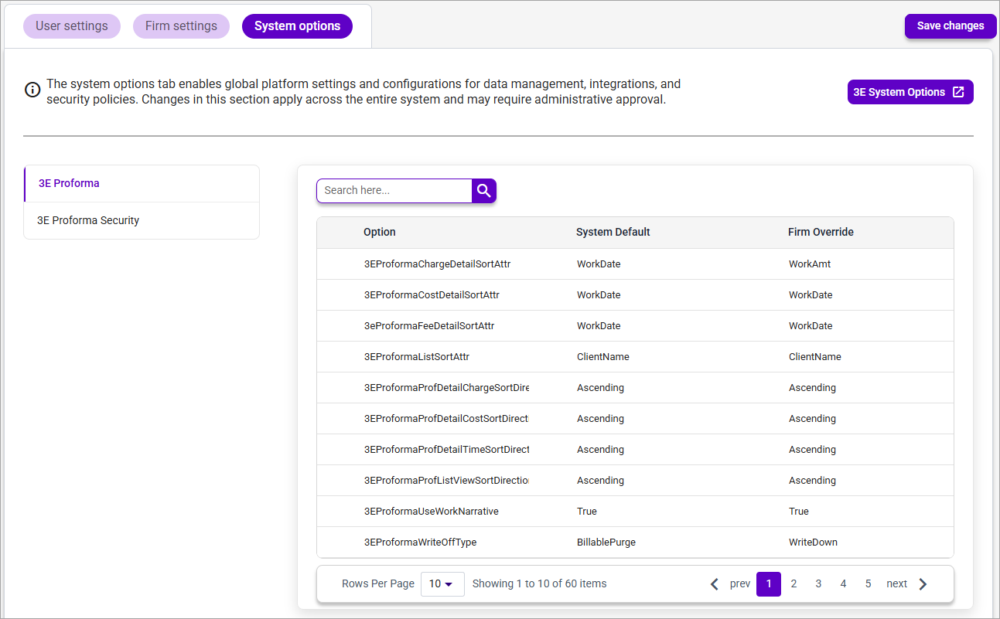

### **System Options**

This tab provides a read-only view of 3E Override / System Option settings that apply to 3E Proforma.

**Note**: The **System Options** tab is only viewable by users that have the **3EProformaAdminRole** assigned to their user in 3E.

<table style="width:96%;">
<colgroup>
<col style="width: 30%" />
<col style="width: 65%" />
</colgroup>
<thead>
<tr>
<th><strong>Field Name</strong></th>
<th><strong>Definition</strong></th>
</tr>
</thead>
<tbody>
<tr>
<td><strong>3E System Options</strong></td>
<td>Click to open the <strong>Override/Set System Options</strong> page in 3E.</td>
</tr>
<tr>
<td><strong>3E Proforma</strong></td>
<td>Click to display the system options and overrides available for 3E Proforma.</td>
</tr>
<tr>
<td><strong>3E Proforma Security</strong></td>
<td>Click to display 3E Proforma system options that provide granular control of the application.</td>
</tr>
<tr>
<td colspan="2"><strong>Options Grid</strong></td>
</tr>
<tr>
<td><strong>Search</strong></td>
<td>Type search criteria to narrow the list of displayed options.</td>
</tr>
<tr>
<td><strong>Option</strong></td>
<td>Displays the option name.</td>
</tr>
<tr>
<td><strong>System Default</strong></td>
<td>Displays the default system setting.</td>
</tr>
<tr>
<td><strong>First Override</strong></td>
<td>Displays the firm-wide default override setting.</td>
</tr>
</tbody>
</table>

