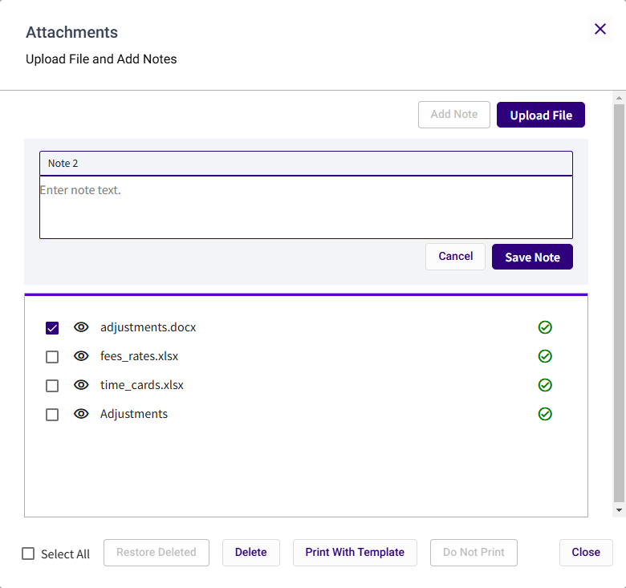

## Attachments Form and Field Definitions

The **Attachments** form is used to attach a document or add a note to a proforma. This option is accessed in the Proforma Details view.

<table style="width:96%;">
<colgroup>
<col style="width: 30%" />
<col style="width: 65%" />
</colgroup>
<thead>
<tr>
<th><strong>Field Name</strong></th>
<th><strong>Description</strong></th>
</tr>
</thead>
<tbody>
<tr>
<td><strong>Add Note</strong></td>
<td>Click to add a note to the proforma.</td>
</tr>
<tr>
<td><strong>Upload File</strong></td>
<td>Click to upload and attach a document (e.g., invoice) to the proforma.</td>
</tr>
<tr>
<td colspan="2"><strong>Notes</strong></td>
</tr>
<tr>
<td><strong>Note Title</strong></td>
<td>Type text in this field to edit the default title (e.g., Note 1). The title defaults to 'Note' and is assigned a consecutive number. The note title displays in the attachments lists.</td>
</tr>
<tr>
<td><strong>Note Text</strong></td>
<td>Type the text for your note in this field.</td>
</tr>
<tr>
<td><strong>Cancel</strong></td>
<td>Click to close the Note fields without saving the note.</td>
</tr>
<tr>
<td><strong>Save Note</strong></td>
<td>Click to save the note.</td>
</tr>
<tr>
<td colspan="2"><strong>Attachments List</strong></td>
</tr>
<tr>
<td><strong>Select</strong></td>
<td>Select a check box to flag an attachment for an action (e.g., Delete or Print).</td>
</tr>
<tr>
<td><strong>View / Download</strong></td>
<td>
Click the View / Download icon  to open and view a note or download a listed attachment.

For attachments, image files and PDFs will be opened in a separate browser window, all other attachments will be downloaded for viewing.

For notes, the note box will display at the top of the <strong>Attachments</strong> window for viewing or editing.
</td>
</tr>
<tr>
<td colspan="2"><strong>Attachment Actions</strong></td>
</tr>
<tr>
<td><strong>Select All</strong></td>
<td>Select this check box to flag all listed attachments and notes for an action.</td>
</tr>
<tr>
<td><strong>Restore Deleted</strong></td>
<td>
Click to cancel the deletion action for a selected item that previously flagged to be deleted. This will return the record to a normal state, as indicated by the green check mark  .

<strong>Note:</strong>You can only restore deleted records <em>before</em> you close the Attachment window. Once the window is closed, all deleted files are deleted from the proforma and cannot be restored. They must be re-attached.
</td>
</tr>
<tr>
<td><strong>Delete</strong></td>
<td>Click to delete any selected notes or attached files. The deleted items will display in red text with a <del>strikethrough</del> to indicate that it will be deleted when the window is closed.</td>
</tr>
<tr>
<td><strong>Print With Template</strong></td>
<td>Click to print a selected invoice template. The icon next to the record will display a printer icon .</td>
</tr>
<tr>
<td><strong>Do Not Print</strong></td>
<td>Click to reverse the <strong>Print with Template</strong> action for a selected note or attachment. The selected item will not print with the invoice template.</td>
</tr>
<tr>
<td><strong>Close</strong></td>
<td>Click to exit the Attachments window.</td>
</tr>
</tbody>
</table>

 

 

