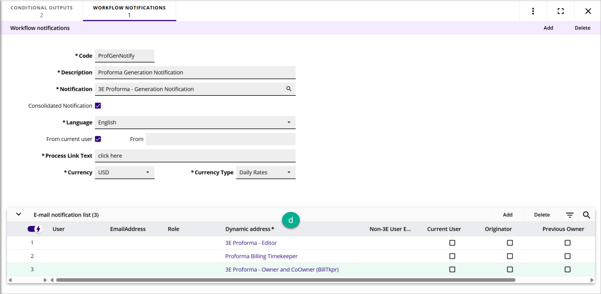

### **STEP 3: Update 3E Proforma Workflow Steps in 3E Cloud**

To route the proformas to both the owner and co-owner, the following 3E Proforma workflow steps (i.e., rule sets) in the workflow configuration must be updated to use the co-Owner workflow dynamic routing filters:

- **Start Workflow** - dynamic route, collaboration dynamic route

- **Bill Submitted no approval, tier 1, tier 2 rule sets** - email route

- **Biller Retur**n - dynamic route

- **Bill write down approval** - email route

- **Reject proforma** - dynamic route, email route

- **Return proforma** - dynamic route, email route

- **Biller Submitted no approval, tier 1, tier 2** - email route

- **Start workflow from group** - dynamic route (Note, this step handles group proforma workflow, no other group proforma workflow updates needed.)

 

Do the following to update the workflow steps listed above:

1.  In 3E, access the **Workflow Configuration** process.

2.  Select the stock **3E Proforma** workflow configuration.

3.  Select a step (e.g., Start Workflow) and scroll to the **Routing for Next Workflow Setup** section.

4.  Do the following to update the dynamic routing filters for each of the above steps:

<!-- -->

1.  In the field adjacent to the Dynamic Route check box, choose the routing that corresponds to who the Proforma Owner is:

- **Billing Timekeeper** - 3E Proforma – Owner and CoOwner (BillTkpr)

- **Responsible Timekeeper** - 3E Proforma – Owner and CoOwner (RspTkpr)

- **Supervisor Timekeeper** - 3E Proforma – Owner and CoOwner (SpvTkpr)

2.  For the Start Workflow step, in the **Routing for Next Workflow Step** section, choose **3E Proforma – Owner, Co-Owner, and Editor** for the Collaboration \> Dynamic Route.

3.  For rules sets that require email routing (e.g., Bill write down approval), click the step's **Workflow Notifications** child form tab.

4.  In the **Dynamic address** column choose the routing that corresponds to who the Proforma Owner (e.g., Billing Timekeeper).

