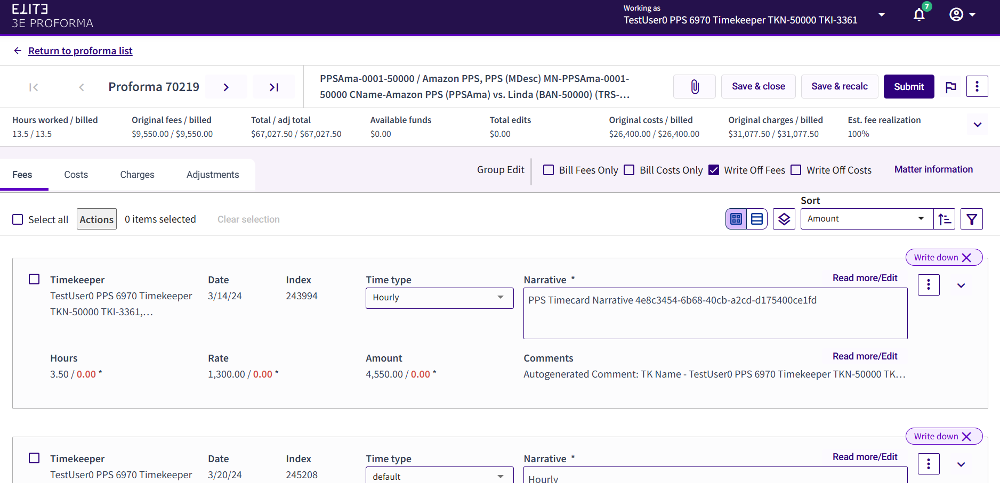

### **Write Offs**

Users can choose to write off all fees or costs at once in a single action.

Do the following to write off fees or costs:

1.  Locate the proforma containing funds on the Proforma list.

2.  Click the proforma number to access the Proforma Details view.

3.  In the *Group Edit* section, select the **Write Off Fees** or **Write Off Costs** check box. All cards of that type (i.e., Fees or Cards) will be written off and the individual cards will be updated in Proforma Details.

4.  Click **Save & Close**.

 

**Note**: If the Write Off check boxes are deselected, all the cards of that type will have the write off removed and reset to the original status.

**Note**: Administrators can use the 3E System Option in the 3EProforma group named **3EProformaWriteOffType** to define “Write Off”.  There are 3 available options, which can be set at the Firm level: Billable Purge, No Charge, and Write Down. The default value is **Billable Purge**.

 

