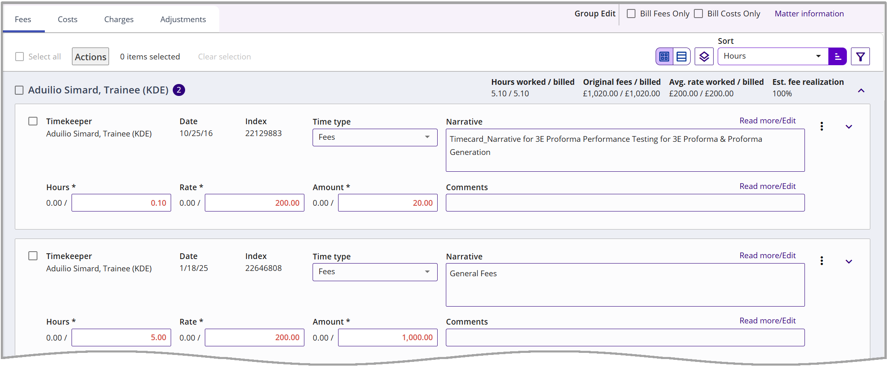
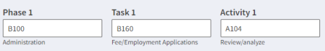

### **Proforma Details – Fees Tab**

The Fees tab is used to view and modify fee cards.

The Fees tab on proforma details is selected by default and displays timecards. Saved changes on time cards may cause totals to recalculate.

**Note***:* Timekeepers who are granted **Edit** rights to a proforma can view and edit only their timecards. When the proforma has been opened by another user first, the users with Edit rights have only **ReadOnly** access to the proforma and can view only their timecards.

<table style="width:100%;">
<colgroup>
<col style="width: 19%" />
<col style="width: 80%" />
</colgroup>
<thead>
<tr>
<th><strong>Attribute</strong></th>
<th><strong>Description</strong></th>
</tr>
</thead>
<tbody>
<tr>
<td><strong>Timekeeper</strong></td>
<td>This attribute displays the name of the timekeeper, their number, and their title.</td>
</tr>
<tr>
<td><strong>Date</strong></td>
<td>This attribute shows the date that the card was added.</td>
</tr>
<tr>
<td><strong>Time type</strong></td>
<td>
This attribute shows the time type of the fees card (for example, Hourly, Flat fee, etc.).

<strong>Note</strong>: This field respects the time type rules set on the matter in 3E. Only time types that are allowed for the matter display.
</td>
</tr>
<tr>
<td><strong>Hours</strong></td>
<td>This attribute displays the worked hours and the bill hours. If a card is not edited, only worked hours are displayed. To change the hours to be billed, click in the Hours input field, and enter the new hours. If you make a change in the Bill Hours, or Bill Rate if editable, the Amount field will automatically recalculate and display the Worked Amount/Bill Amount. To update proforma totals based on edits, click the <strong>Save &amp; recalc</strong> button on top of the proforma.</td>
</tr>
<tr>
<td><strong>Rate</strong></td>
<td>
This column displays the timekeeper’s rate. The Rate can be set to be editable or non-editable by the firm in 3E.

If it is set to be editable, you can change the rate amount to be billed. Click in the Rate input field and enter the new rate.

To update proforma totals based on updated information, click the <strong>Save &amp; recalc</strong> button on top of the proforma.
</td>
</tr>
<tr>
<td><strong>Amount</strong></td>
<td>The Amount attribute displays the worked and bill amount for the associated timekeeper for this time entry. To change the amount to be billed, click in the Amount input field and enter the new amount. If you make a change in the Bill Amount, tab out of the field to automatically recalculate the Bill Hours based on your change.  To update proforma totals based on edits, click the <strong>Save &amp; recalc</strong> button on top of the proforma.</td>
</tr>
<tr>
<td><strong>Narrative</strong></td>
<td>Displays narrative text that is displayed on the bill. Click <strong>Read more/Edit</strong> to display the full text or make changes if using Card View. When using Grid View, click the Narrative field and click the <strong>Expand</strong> icon . See <a href="../../Getting-Started/Standard-Features-and-Navigation/Card-Narrative-Fields.md#card-narrative-fields">Card Narrative Fields</a> for further details.</td>
</tr>
<tr>
<td><strong>Comments</strong></td>
<td>
Where desired, or if required based on a card action, populate the Comments field with a comment about the card. When the comment field is populated, it becomes read-only with a “Read more/Edit” link. Click the Read more/Edit link to edit the comment field in the pop-up. Information entered in the Comments (bottom) field is internal and is not displayed on the actual bill.

 
</td>
</tr>
<tr>
<td><strong>Code Fields</strong></td>
<td>
To browse codes, expand the card by clicking the Expand icon .

These fields display the codes associated with the time card, such as: Phase Codes, Task Codes, Activity Codes, and Tax codes.  Phase, Task, and Activity fields display the Code (above) and the Description (below the Code).

<strong>Note:</strong>  If you wish to see the Code fields always displayed, open Settings , and set <strong>Automatically expand code fields</strong> to Yes.
</td>
</tr>
</tbody>
</table>

