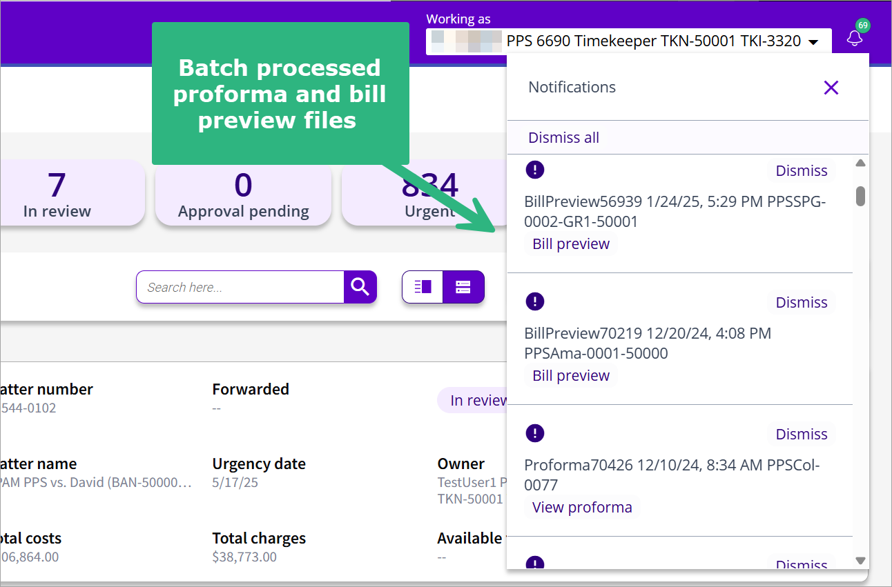

## Print Proforma

In 3E Proforma you can print a proforma by generating a printable PDF file. You can generate print files for one proforma or a batch of proformas.

Do the following to print a proforma:

1.  Locate the proforma that's ready for review in the Proforma list.

2.  Click the **Print Proforma**. The PDF generation is a background process, leaving you free to continue working. A notification message displays when the PDF has been generated. Additionally, a notification indicator will display on the 3E Proforma [<u>Global toolbar.</u>](../getting-started/standard-features-and-navigation.md#standard-features-and-navigation)

3.  Click the **Notification** icon on the Global toolbar to access a link to the PDF.

4.  Click **View proforma** to open the PDF and print. Print PDF files will become available as proforma attachments. See [Attachments Form and Field Definitions](../attachments/attachments-form-and-field-definitions.md#attachments-form-and-field-definitions) for details.

**Note**: To create print files for a batch of proformas, select check boxes for proformas displayed in the Proforma List and then select **Mass Print Proforma** from the [<u>Proforma List Action menu</u>](batch-processing-proforma-actions.md#batch-processing-proforma-actions). When the print job is complete, it will display in the [<u>notification list</u>](../getting-started/navigating-3e-proforma-walkthrough/global-toolbar.md) with the following file name format: {Total number of the printed documents}Proforma {Date-Time} All-in-One. For example, a completed batch job of three proformas would be listed as *3Proforma 2/7/25, 5:36 AM All-in-One*.

**Note**: Proformas can also be printed in the Proforma Details view. Select **Print Proforma** from the [<u>Proforma-level</u> **Action** <u>menu</u>](../getting-started/navigating-3e-proforma-walkthrough/navigating-the-proforma-detail-view.md#navigating-the-proforma-detail-view).

[Batch Processing Proforma Actions](batch-processing-proforma-actions.md#batch-processing-proforma-actions)

