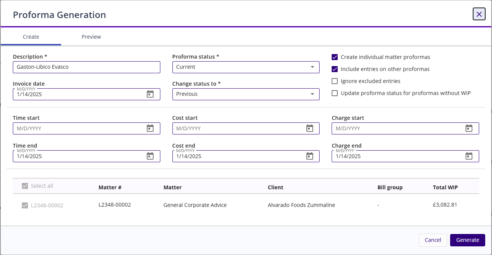

### **Proforma Generation Form and Field Definitions**

The Proforma Generation form is used to configure settings for creating proformas for matters in the [<u>WIP list</u>](../wip-list-form-and-field-definitions.md#wip-list-form-and-field-definitions). This form is accessed when the Generation action is initiated from the WIP List for one or more listed matters.

<table style="width:96%;">
<colgroup>
<col style="width: 30%" />
<col style="width: 65%" />
</colgroup>
<thead>
<tr>
<th><strong>Field Names</strong></th>
<th><strong>Descriptions</strong></th>
</tr>
</thead>
<tbody>
<tr>
<td colspan="2"><strong>Create Tab</strong></td>
</tr>
<tr>
<td><strong>Co-Owner</strong></td>
<td>Select a timekeeper in this field to assign as a co-owner for the proforma run.</td>
</tr>
<tr>
<td><strong>Description</strong></td>
<td>Type a maximum of 64 alphanumeric characters as the description for this proforma generation</td>
</tr>
<tr>
<td><strong>Invoice Date</strong></td>
<td>Type or select the date of the invoice used to produce the proforma.</td>
</tr>
<tr>
<td><strong>Proforma status</strong></td>
<td>From the drop-down list, select the status to be assigned to the proforma when generated, such as Open, Approved, or Pending Review. The Proforma Status will be changed to Closed on a proforma when unbilled time or costs are transferred from this proforma to another.</td>
</tr>
<tr>
<td><strong>Change status to</strong></td>
<td>If including entries from other proformas, select a new status from the drop-down list to update the other proformas. This field becomes enabled when the <strong>Include Entries on Other Proformas</strong> check box is selected.</td>
</tr>
<tr>
<td><strong>Create individual matter proformas</strong></td>
<td>To generate an individual proforma number for each matter in the billing group, select this check box. To use the same proforma number for all matters in the bill group, do not select this check box.</td>
</tr>
<tr>
<td><strong>Include entries on other proformas</strong></td>
<td>
To include unbilled entries from other proformas on this proforma, select this check box. When this check box is selected, you can click the Review Results button to determine if there are no conflicts before generating the proforma, e.g., any proformas being included are locked.

In addition, timecards, cost cards, and/or charge cards on held proformas will not be removed to be included on the new proforma until the held proforma status is changed to a current status.

When the check box is selected, time, cost and charge cards on Full Credit Note (FCN) proformas are not included.
</td>
</tr>
<tr>
<td><strong>Ignore excluded entries</strong></td>
<td>
Select this check box to ignore items excluded from other proformas.

<strong>Note</strong>: If the excluded item belongs to a closed or held proforma, this will have no effect, i.e., if you do not select this check box, then excluded entries will not be included if they are attached to a closed or held proforma.
</td>
</tr>
<tr>
<td><strong>Update proforma status for proformas without WIP</strong></td>
<td>
Select this check box to include proformas without WIP with the new proforma. Their status will be updated to match the value selected in the Change Status To drop-down list.

This enables users to close prior proformas at the same time as their regular proforma run, eliminating the need to use the Proforma Global Status Change utility to close those proformas.

<strong>Note</strong>: This option is only available when the <strong>Include Entries on Other Proformas</strong> check box is selected.
</td>
</tr>
<tr>
<td><strong>Time start</strong></td>
<td>Type or query to select the beginning date for the accumulated time entries to print.</td>
</tr>
<tr>
<td><strong>Time end</strong></td>
<td>Type or query to select the ending date for the accumulated time entries to print.</td>
</tr>
<tr>
<td><strong>Cost start</strong></td>
<td>Type or query to select the beginning date for the accumulated cost entries to print.</td>
</tr>
<tr>
<td><strong>Cost end</strong></td>
<td>Type or query to select the ending date for the accumulated cost entries to print.</td>
</tr>
<tr>
<td><strong>Charge start</strong></td>
<td>Type or query to select the beginning date for the accumulated charge entries to print.</td>
</tr>
<tr>
<td><strong>Charge end</strong></td>
<td>Type or query to select the ending date for the accumulated charge entries to print.</td>
</tr>
<tr>
<td colspan="2"><strong>Matter list</strong></td>
</tr>
<tr>
<td><strong>Matter #</strong></td>
<td>Displays the matter number</td>
</tr>
<tr>
<td><strong>Matter</strong></td>
<td>Displays the matter name</td>
</tr>
<tr>
<td><strong>Client</strong></td>
<td>Displays the name of the matter client</td>
</tr>
<tr>
<td><strong>Bill Group</strong></td>
<td>Displays the bill group to which the matter belongs.</td>
</tr>
<tr>
<td><strong>Total WIP</strong></td>
<td>Displays the total WIP amount.</td>
</tr>
<tr>
<td colspan="2"><strong>Preview Tab</strong></td>
</tr>
<tr>
<td><strong>Single proforma</strong></td>
<td>Displays the number of single proformas to be generated.</td>
</tr>
<tr>
<td><strong>Group proforma</strong></td>
<td>Displays the number of group proformas to be generated.</td>
</tr>
<tr>
<td><strong>Generate</strong></td>
<td>Displays the generation status</td>
</tr>
<tr>
<td><strong>Group</strong></td>
<td>Displays the bill group to which the proforma belongs.</td>
</tr>
<tr>
<td><strong>Matter #</strong></td>
<td>Displays the number of the matter for which the proforma is being generated.</td>
</tr>
<tr>
<td><strong>Matter name</strong></td>
<td>Displays the name of the matter for which the proforma is being generated.</td>
</tr>
<tr>
<td><strong>Client</strong></td>
<td>Displays the name of the matter client associated with the generated proforma.</td>
</tr>
<tr>
<td><strong>Status</strong></td>
<td>Displays the proforma status (e.g., New, Hold, or Locked).</td>
</tr>
<tr>
<td><strong>Proforma #</strong></td>
<td>Displays the number to be associated with the new proforma</td>
</tr>
<tr>
<td><strong>Locked by user</strong></td>
<td>Displays the name of the user actively working on a proforma selected with generation.</td>
</tr>
</tbody>
</table>

 

