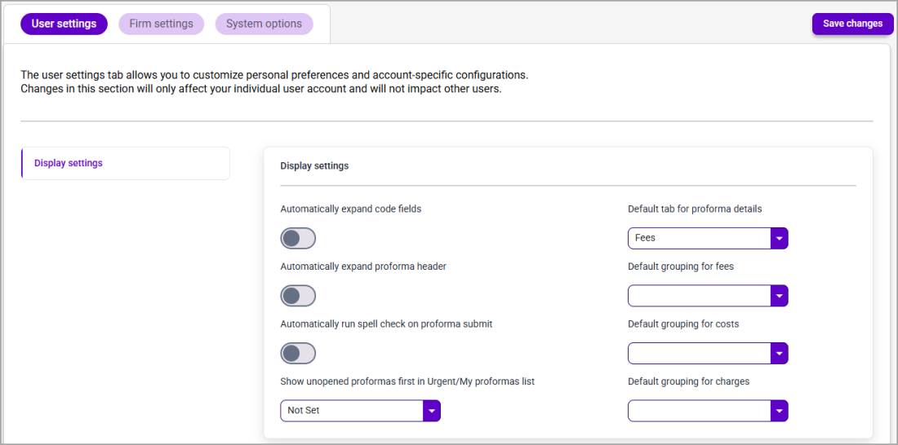

# User Settings

The User settings tab is used to configure user-specific defaults.

**Note**: User Settings take precedence over Firm Settings.

| **Field Name**                                                | **Definition**                                                                                                                                                                                                                              |
| ------------------------------------------------------------- | ------------------------------------------------------------------------------------------------------------------------------------------------------------------------------------------------------------------------------------------- |
| **Automatically expand code fields**                          | Click the toggle to turn on the auto expand code option for the Phase, Task, and Activity codes section of the card details for all proformas. The default setting is off.                                                                  |
| **Automatically expand Proforma Header**                      | Click the toggle to turn on the option to automatically expand the proforma header section on all proformas. The default setting is off.                                                                                                    |
| **Automatically run spell check on proforma submit**          | Click the toggle to turn on the option to automatically have 3E Proforma run a spell check when a user submits a proforma, ensuring that the proforma is spell checked before it is sent for billing. The default setting is off.           |
| **Show unopened proformas first in Urgent/My proformas list** | 
Select <strong>True</strong> from this drop-down list to display unopened proformas first (i.e., Ascending order) in the Urgent and My proformas list. Select <strong>False</strong> to disabled sorting by Unopened status.

 
 |
| **Default tab for proforma details**                          | Select the default tab (i.e., fees, costs, or charge) from this drop-down list to display when a proforma is opened. The default setting is Fees.                                                                                           |
| **Default grouping for fees**                                 | Select an option from this drop-down list to use as criteria to group fee cards.                                                                                                                                                            |
| **Default grouping for costs**                                | Select an option from this drop-down list to use as criteria to group cost cards.                                                                                                                                                           |
| **Default grouping for charges**                              | Select an option from this drop-down list to use as criteria to group charge cards.                                                                                                                                                         |
