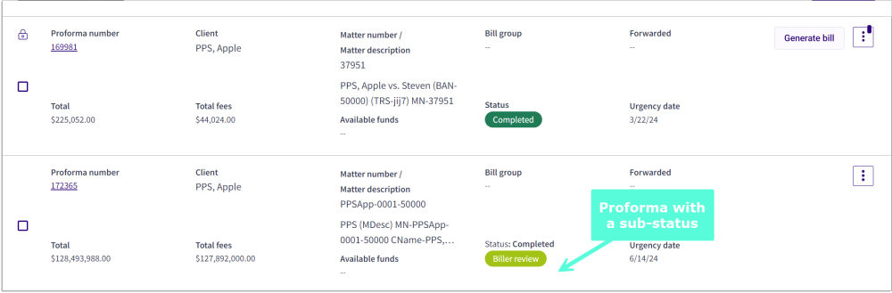

# Appendix A - Proforma Action Availability by Role

The proformas that display in the [Proforma list](Getting-Started/Navigating-3E-Proforma---Walkthrough.md#navigating-3e-proforma---walkthrough) depend on which [Proforma category](Getting-Started/Navigating-3E-Proforma---Walkthrough.md#navigating-3e-proforma---walkthrough) is selected. The availability of **actions** that can be performed on a proforma is based on the 3E User/Role security settings.

The actions that can be performed in the Proformas List depend on the role of the current user for the exact proforma:

* [Timekeeper](Appendix-A---Proforma-Action-Availability-by-Role/Timekeepers-Proforma-Editors.md#timekeepers-proforma-editors)
* [Billing Attorney](Appendix-A---Proforma-Action-Availability-by-Role/Billing-Attorneys-proforma-owners.md#billing-attorneys-proforma-owners)
* [Approver](Appendix-A---Proforma-Action-Availability-by-Role/Approvers.md#approvers)

Some proformas in a category have both a status and a sub-status.

In the example above, the proforma’s status is **Completed**, and the sub-status is **Biller Review**.

This section describes the categories, statuses, sub-statuses, and actions available to users according to the roles of the current user.
