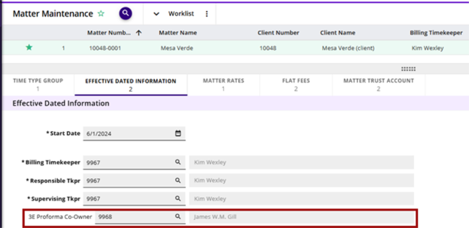

# STEP 1: Designate a Co-owner in 3E Cloud

A default co-owner can be set in multiple record types in 3E. It can be set in the _Effective Dated Information_ child form of the Client, Matter, and Timekeeper records. Additionally, it can be set in Proforma Generation.

The order of precedence for the default co-owner setting is as follows:

* Proforma Generation
* Matter
* Client
* Timekeeper

**Note**: Assigning a co-owner in Proforma Generation will override a co-owner selected in Client, Matter, and Timekeeper records.

Do one of the following to designate a default co-owner in 3E:

* **Matter, Client, or Timekeeper process**: Navigate to the **Effective Dated Information** child form of either the Matter, Client, or Timekeeper process and specify the user in the **3E Proforma Co-owner** field.

* **Proforma Generation**: Go to the Proforma Generation process and specify the user in the **Assign Co-owner** field.
