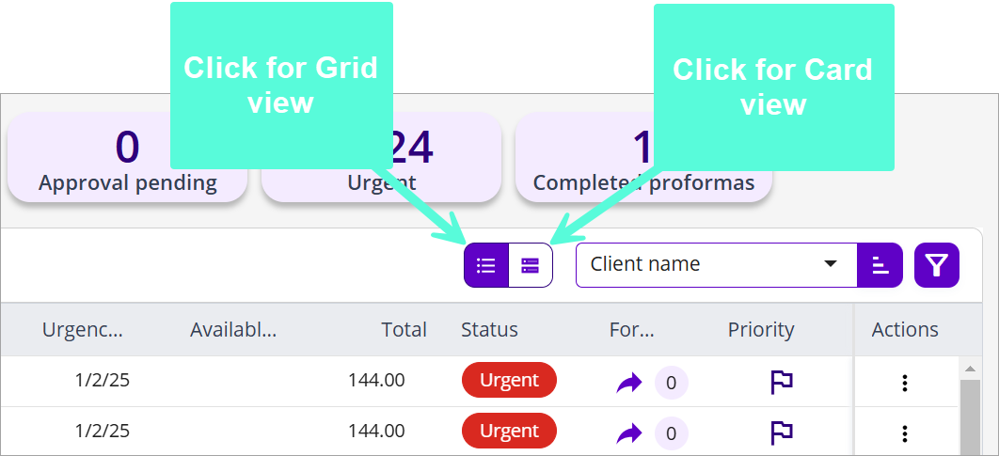
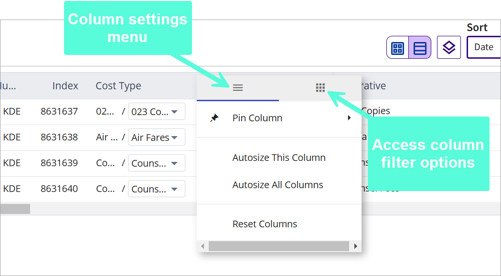
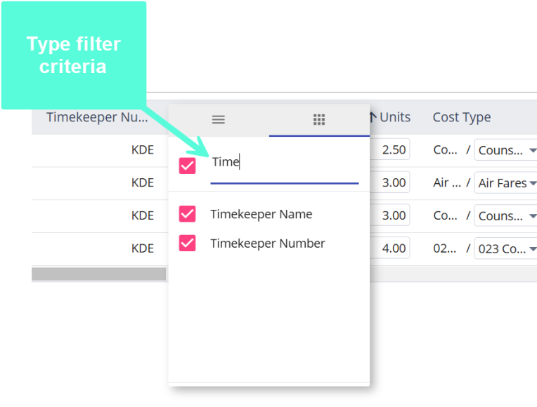
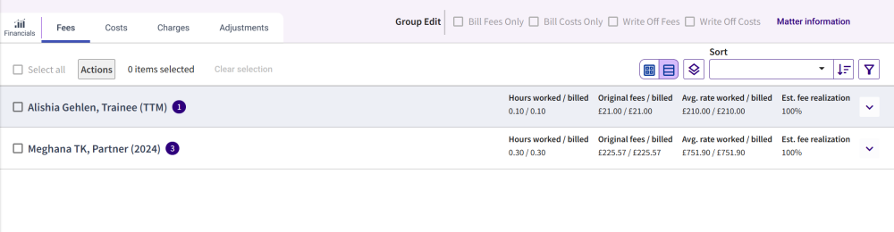
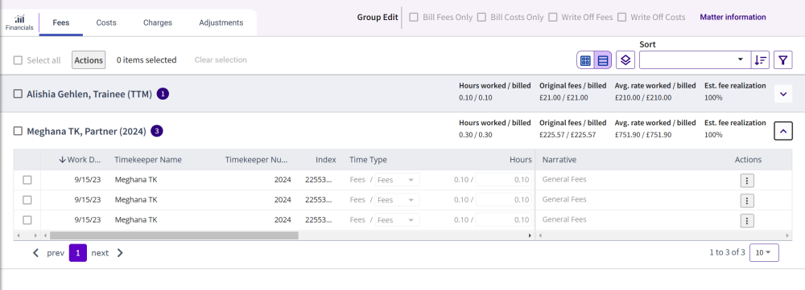

# Lists

## Navigating Lists in 3E Proforma

3E Proforma displays proformas and card entries in a list format. A variety of options are available to enable you to control how these list display. List can be displayed in card or grid format. Listed items can be grouped by common criteria. Grid columns can be customized (e.g., moved or removed) to suit the unique needs of the user.

&#x20;

## List View Types

Lists (e.g., proformas and card entries) in 3E Proforma can be viewed using two formats, card view and grid view. The card view groups key information in an easily viewable format. The grid format displays records in a table format with additional sorting and column customization options enabling you to customize how list details are displayed.

### _Selecting Card or Grid View_

You can switch between list view types by clicking the Grid view or Card view icons on the list's Action toolbar.

### _Proforma List - Card vs Grid View_

The following information details the difference between the Proforma List card and grid views:

* **Card View** -The card view displays proforma header information. Additionally, it makes the most-frequently used actions easily accessible (i.e., Set Priority, Forward, Print Proforma, Bill Preview, and Collaborators).

**Note**: Card and Grid view types are also available with the [Archived Proformas](../../Archived-Proformas.md#archived-proformas) list.

&#x20;

**Opened Status** - Unopened (i.e., unread) proformas are indicated with a purple border in Card view. Once a proforma has been opened, the purple boarder no longer displays.

* **Grid View** - In the Proforma List, grid view displays proformas in a compact tabular format. This allows for viewing more records on the screen at one time. Columns can be resized, rearranged, added and removed. See [Grid Column Settings](Lists.md#grid-column-settings) for further details.

To access Proforma Details, double-click the row of a proforma in the grid view.

**Opened Status** - Unopened (i.e., unread) proformas are indicated with a purple dot next to the proforma number in Grid view. Once a proforma has been opened, the Unopened icon no longer displays.

### _Proforma Details View - Card vs. Grid View_

Details on the sub-tabs of the Proforma Detail view (e.g., Fees, Costs, and Adjustments) can viewed in two forms, grid and card format. You can toggle between the two view by clicking the **Cards view** or **Grid view** icons on the tab Action-bar.

* **Grid view** - The Grid View displays one row per card.  The Narrative and Actions fields are always pinned to the right side of the grid so that they are always visible.  If the left side of the grid has more columns than the screen can display, the user can scroll the left side independently to see the other columns.

**Note**: When tabbing through all fields except the narrative, hit Enter to select the field for editing and Tab out to save changes. When editing the **narrative**, click Tab (or click another field) to move out of the field and save changes.   _To view formatted text in the narrative, click into the narrative field._

* **Card view** - Displays cards in a form allowing for easier editing of details.

&#x20;

## Grid Column Settings

A variety of options are available to customize the columns in grid view. Grid column settings include the following:

* Resize or Autosize columns
* Hide columns
* Drag and drop to reposition columns
* Pin columns
* Group columns based on selected criteria

### _Access column Settings_

To access column settings, hover the mouse pointer over a column header and click the **Grid Menu** icon  .

### _Column Settings_

Available column settings include the following:

* **Resize columns** - To change the size of a column, click the border and drag it to the preferred width. The grid is refreshed to display the new width or height. Resizing columns may affect which columns and rows are visible in the grid's display area.
* **Autosize Columns** - Select Autosize This Column from the Grid menu to auto-size a selected column. Click Autosize All Columns to autosize all grid columns.
* **Column sort order** - Click a column title to sort the grid in descending order. Click that column title again to sort in ascending order. Clicking a column title a third time removes the sort. You can also select sort options (i.e., ascending/descending) from the Grid menu to apply to a selected column. To apply multiple column sorts (e.g., primary, secondary, and tertiary sorts) to a grid, after applying the first column sort, press the **SHIFT** key while clicking the titles of additional sort columns. Sort hierarchy is indicated by the numbers adjacent to the **Sort** direction arrows.
* **Pin Column** - Select Pin Right/Pin Left from the Grid menu for a selected column to position to the left or right side of the grid. As you scroll left or right, the selected column remains frozen in that position. Select **Pin Column > No Pin** to disable this option, or select **Reset Columns** .
* **Reset Columns** - Select from the Grid menu to reset grid columns to their default settings.

### _Grid Column Display Options_

You can control the columns displayed by default in the grid by hiding selected columns or applying a filter.

Do the following to remove grid columns from view:

1. Select the Grid Menu icon  and then click the **Column Filter** icon  .
2. Clear check boxes adjacent to columns to be hidden in the grid. Select the check box adjacent to the filter field to select all column check boxes.

**Note** : Type filter criteria to narrow the columns to display in the list.

### _Move Grid Columns_

Users can rearrange the grid columns to their liking.

**Note**: Any changes to the grid layout will be automatically saved for that user.  To reset the grid back to the stock settings, choose the Reset Columns option after clicking the  button.

## Group List Items

In Proforma Detail view, when looking at card entries, in [Grid or Card view](Lists.md#list-view-types), you can group listed cards based on selected criteria (e.g., timekeeper, date, or time type).

### _Grouping_

Click the **Grouping** icon  to select and apply grouping criteria to the grid.

**Note**: Group criteria may vary by card type.

### _Grouped view_

Once the cards are grouped, each row will display the name of the grouping, a record count of the number of cards for that grouping, and sub-totals for that grouping. For Fees, the sub-totals are hours worked vs. billed, original fees vs. billed, average rate worked vs. billed, and estimated fee realization.

### _Grouped view - expanded_

To see the cards within a grouping, click the down arrow  to expand the group. To collapse the group, click the up arrow  of the expanded group.

&#x20;

## Filter and Sort List Items

In addition to toggling list views and customizing column settings, filter and sort options are available in lists to help you quickly locate proformas or card entries.

### _Filter List_

If you want to filter a list of cards, click the filter icon , the filter sidebar displays. Available filter criteria will vary by tab (i.e., Fees, Costs, Charges, etc.). See [Filters](Filters.md#filters) for further details.

### _Sort List_

Select sort criteria from the **Sort** drop-down list. Sort criteria will vary by card tab. Click the **Sort** direction icon  to sort the list in ascending or descending order.

&#x20;
