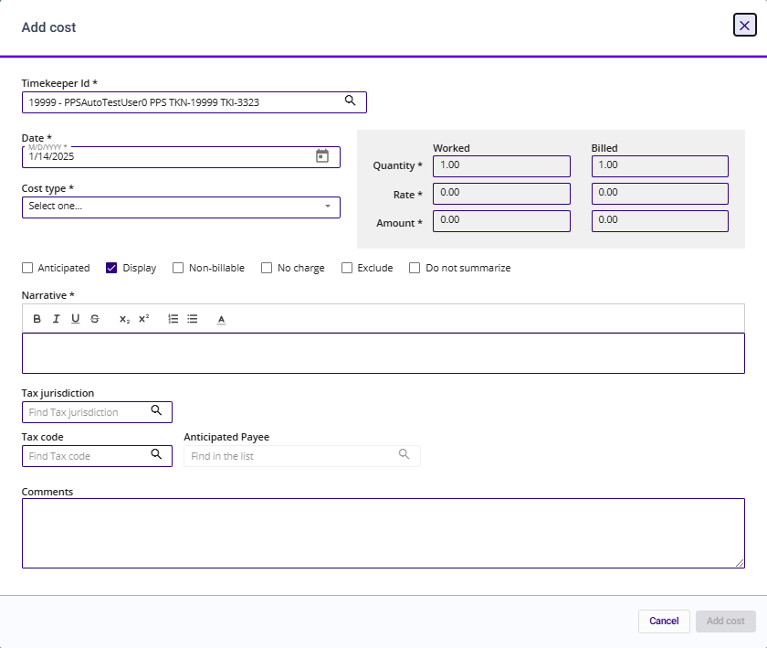

# Add Cost Form and Field Definitions

Use the Add Cost form to add a cost entry to a proforma.

| **Field Name**        | **Description**                                                                                                                                                                                                                                                                                                                                                                                                                                                                                                                                                                                                                                         |
| --------------------- | ------------------------------------------------------------------------------------------------------------------------------------------------------------------------------------------------------------------------------------------------------------------------------------------------------------------------------------------------------------------------------------------------------------------------------------------------------------------------------------------------------------------------------------------------------------------------------------------------------------------------------------------------------- |
| **Timekeeper ID**     | Type or query to select the cost card’s working timekeeper.                                                                                                                                                                                                                                                                                                                                                                                                                                                                                                                                                                                             |
| **Date\***            | Type or select the cost card's work date.                                                                                                                                                                                                                                                                                                                                                                                                                                                                                                                                                                                                               |
| **Cost type\***       | Type or query to select the cost type to use for the cost entry. Cost types are descriptive codes used to speed up the entry of cost information by allowing the user to retrieve the cost description by entering a cost type code.                                                                                                                                                                                                                                                                                                                                                                                                                    |
| **Quantity (Worked)** | Type the cost card's worked quantity.                                                                                                                                                                                                                                                                                                                                                                                                                                                                                                                                                                                                                   |
| **Quantity (Billed)** | Type the quantity that applies to the cost.                                                                                                                                                                                                                                                                                                                                                                                                                                                                                                                                                                                                             |
| **Rate (Worked)**     | Type the rate used to calculate the work amount at the time the proforma detail was worked.                                                                                                                                                                                                                                                                                                                                                                                                                                                                                                                                                             |
| **Rate (Billed)**     | Type the rate to use to calculate the work amount.                                                                                                                                                                                                                                                                                                                                                                                                                                                                                                                                                                                                      |
| **Amount (Worked)**   | The system performs the calculation as follows: Quantity x Rate = Amount.                                                                                                                                                                                                                                                                                                                                                                                                                                                                                                                                                                               |
| **Amount (Billed)**   | The system performs the calculation as follows: Bill Quantity x Bill Rate = Bill Amount.                                                                                                                                                                                                                                                                                                                                                                                                                                                                                                                                                                |
| **Anticipated**       | 
Select the check box to indicate this entry is anticipated. This option displays when a cost type that is designated for anticipated costs is selected. You will be required to populate the <strong>Anticipated Payee</strong> field so that the voucher can be matched appropriately.

See the <a href="https:/help.elite.com/3ehelp/Subsystems/Elite%203E%20Billing%20Transactions%20Guide/Anticipated_Entries.htm">3E Billing Transactions Guide</a> for further details on Anticipated fees.

 

<strong>Note</strong>: If this check box is selected, the Proforma cannot be saved unless an Anticipated Payee is selected.
 |
| **Display**           | Select the check box if this record will display on a bill.                                                                                                                                                                                                                                                                                                                                                                                                                                                                                                                                                                                             |
| **Non-billable**      | Select the check box to indicate that the proforma detail record is not a billable item.                                                                                                                                                                                                                                                                                                                                                                                                                                                                                                                                                                |
| **No charge**         | Select the check box to indicate that the entry's value is no charge.                                                                                                                                                                                                                                                                                                                                                                                                                                                                                                                                                                                   |
| **Exclude**           | Select the check box to indicate that the proforma detail record will be removed from the proforma when work value changes are processed.                                                                                                                                                                                                                                                                                                                                                                                                                                                                                                               |
| **Do not summarize**  | Select this check box to indicate the cost is not to be summarized on the bill. This overrides selections set on the cost type as well as on the matter record.                                                                                                                                                                                                                                                                                                                                                                                                                                                                                         |
| **Narrative\***       | Type a narrative for the cost card.                                                                                                                                                                                                                                                                                                                                                                                                                                                                                                                                                                                                                     |
| **Phase 1**           | Type or query to select the phase for which the cost was incurred. This field is disabled if the matter associated with this cost entry has no PTA group.                                                                                                                                                                                                                                                                                                                                                                                                                                                                                               |
| **Task 1**            | Type or query to select the task for which the cost was incurred. This field is disabled if the matter associated with this cost entry has no PTA group.                                                                                                                                                                                                                                                                                                                                                                                                                                                                                                |
| **Activity 1**        | Type or query to select the activity for which the cost was incurred. This field is disabled if the matter associated with this cost entry has no PTA group.                                                                                                                                                                                                                                                                                                                                                                                                                                                                                            |
| **Phase 2**           | Type or query to select a second set of PTA group for use on cost cards.                                                                                                                                                                                                                                                                                                                                                                                                                                                                                                                                                                                |
| **Task 2**            |                                                                                                                                                                                                                                                                                                                                                                                                                                                                                                                                                                                                                                                         |
| **Activity 2**        |                                                                                                                                                                                                                                                                                                                                                                                                                                                                                                                                                                                                                                                         |
| **Tax jurisdiction**  | From the drop-down list, select the cost's tax jurisdiction.                                                                                                                                                                                                                                                                                                                                                                                                                                                                                                                                                                                            |
| **Tax code**          | Type or query to select the cost's tax code.                                                                                                                                                                                                                                                                                                                                                                                                                                                                                                                                                                                                            |
| **Anticipated payee** | 
Select a payee from this drop-down list to be used in the Voucher process.

<strong>Note</strong>: Cost cannot be posted unless an Anticipated Payee is selected. When an Anticipated Payee is not selected a hard cost entry is set to pending.
                                                                                                                                                                                                                                                                                                                                                                                            |
| **Comments**          | Type comments about the proforma. These comments are for internal firm use only and do not display on the bill.                                                                                                                                                                                                                                                                                                                                                                                                                                                                                                                                         |

&#x20;
