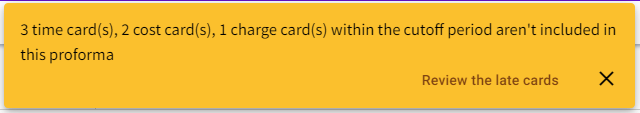
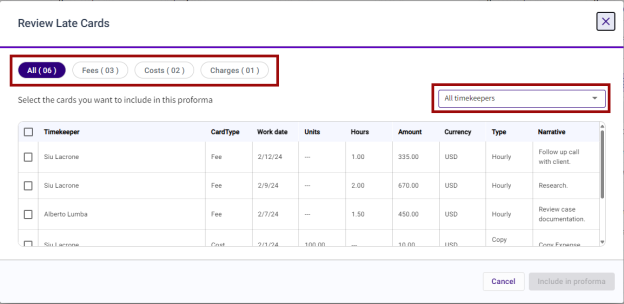

# Include Late Cards in Proforma

Late cards are defined as time, costs, or charge cards that were entered after a proforma is generated with a work date before the “through” date.  For example:

* A proforma is generated for matter 1000-000 on May 6th with a “time through” date of April 30th
* On May 7th, Tom Dewey enters a time entry on matter 1000-000 with a work date of April 30th

When there are late cards for a matter, a notification will display at the top of the screen when the Proforma Details view is accessed.

Do the following to review the information and decide if any of the cards should be included in the current proforma:

1. When a late card notification displays upon accessing the Proforma Details view, click **Review the late cards**. A list of late cards is displayed.
2. Use the filters at the top of the Review late Cards window to view the late cards by type.  The cards can also be filtered by timekeeper using the timekeeper drop down list.

3. To add the cards to the current proforma, select the box next to the cards to include
4. Click **Include in proforma**. The selected time cards will be added to the current proforma and will display immediately on the [**Fees** tab](Proforma-Details-Form-and-Field-Definitions/Proforma-Details--Fees-Tab.md#proforma-details--fees-tab).  A confirmation message displays indicating that they were successfully included.
