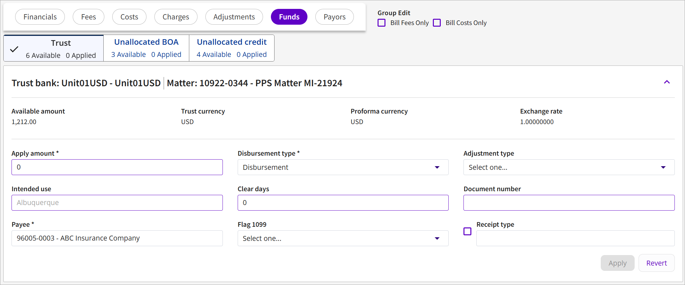

# Proforma Details – Funds Tab

The Funds tab will display sub-tabs for each type of funds, trust funds and unallocated credit, that are available to be applied to the proforma.

**Trust Tab**

**Unallocated BOA**

**Unallocated Credit Tab**

| **Field Name**              | **Description**                                                                                                                                                                                                                                                                                                                                                                                                                                                                                                                                                                                                                                                    |
| --------------------------- | ------------------------------------------------------------------------------------------------------------------------------------------------------------------------------------------------------------------------------------------------------------------------------------------------------------------------------------------------------------------------------------------------------------------------------------------------------------------------------------------------------------------------------------------------------------------------------------------------------------------------------------------------------------------ |
| **Trust Tab**               |                                                                                                                                                                                                                                                                                                                                                                                                                                                                                                                                                                                                                                                                    |
| **Available amount**        | Displays the available trust amount.                                                                                                                                                                                                                                                                                                                                                                                                                                                                                                                                                                                                                               |
| **Trust currency**          | Displays the currency used for the trust funds.                                                                                                                                                                                                                                                                                                                                                                                                                                                                                                                                                                                                                    |
| **Proforma currency**       | Displays the currency used for the proforma.                                                                                                                                                                                                                                                                                                                                                                                                                                                                                                                                                                                                                       |
| **Exchange rate**           | Displays the exchange rate used when an amount is applied from a Trust using a currency different from the Proforma's. The rate is based on proforma's invoice date as exchange date and the Firm's currency type.                                                                                                                                                                                                                                                                                                                                                                                                                                                 |
| **Apply Amount**            | Type the amount to apply.                                                                                                                                                                                                                                                                                                                                                                                                                                                                                                                                                                                                                                          |
| **Disbursement type**       | Select the disbursement type used when assembling disbursements for payment on trust checks from this drop-down list.                                                                                                                                                                                                                                                                                                                                                                                                                                                                                                                                              |
| **Adjustment type**         | Select the adjustment type for this transaction from the drop-down list. Trust adjustment types are used when processing adjustments to trust accounts, and serve as an identifier as to the type of adjustment being performed, e.g., interest adjustment, bank charges, wire charges, etc.                                                                                                                                                                                                                                                                                                                                                                       |
| **Intended use**            | Displays the Trust Intended Use Code for the disbursement.                                                                                                                                                                                                                                                                                                                                                                                                                                                                                                                                                                                                         |
| **Clear days**              | Type the number of days it takes for funds to clear the bank.                                                                                                                                                                                                                                                                                                                                                                                                                                                                                                                                                                                                      |
| **Document number**         | Type the document number that will be used for Trust Disbursement or Trust Adjustment.                                                                                                                                                                                                                                                                                                                                                                                                                                                                                                                                                                             |
| **Payee**                   | Type or query to select the account payable payee record for the disbursement check.                                                                                                                                                                                                                                                                                                                                                                                                                                                                                                                                                                               |
| **Flag 1099**               | Select the 1099 flag for this trust transaction from this drop-down list.                                                                                                                                                                                                                                                                                                                                                                                                                                                                                                                                                                                          |
| **Receipt type**            | Displays the receipt type from the transaction (e.g., EFT, cash, check).                                                                                                                                                                                                                                                                                                                                                                                                                                                                                                                                                                                           |
| **Apply**                   | Click to save and apply your settings for the trust disbursement.                                                                                                                                                                                                                                                                                                                                                                                                                                                                                                                                                                                                  |
| **Revert**                  | Click to undo the trust disbursement settings.                                                                                                                                                                                                                                                                                                                                                                                                                                                                                                                                                                                                                     |
| **Unallocated BOA Tab**     |                                                                                                                                                                                                                                                                                                                                                                                                                                                                                                                                                                                                                                                                    |
| **Available Amount**        | Displays the BOA (billed on account) amount available for allocation.                                                                                                                                                                                                                                                                                                                                                                                                                                                                                                                                                                                              |
| **BOA Currency**            | Displays the currency type used for the amount available for allocation.                                                                                                                                                                                                                                                                                                                                                                                                                                                                                                                                                                                           |
| **Proforma Currency**       | Displays the currency used for the proforma.                                                                                                                                                                                                                                                                                                                                                                                                                                                                                                                                                                                                                       |
| **Exchange Rate**           | Displays the exchange rate used when an amount is applied from a BOA using a currency different from the Proforma's. The rate is based on proforma's invoice date as exchange date and the Firm's currency type.                                                                                                                                                                                                                                                                                                                                                                                                                                                   |
| **Charge Type**             | This read-only field displays a Charge Type that uses a BOA transaction type.                                                                                                                                                                                                                                                                                                                                                                                                                                                                                                                                                                                      |
| **Apply Amount**            | Type the amount of the BOA payment that is being applied to the proforma, in the Proforma's currency. The amount cannot be greater than the balance in the account.                                                                                                                                                                                                                                                                                                                                                                                                                                                                                                |
| **Receipt Type**            | Select a receipt type from this drop-down list to be used for the transaction.                                                                                                                                                                                                                                                                                                                                                                                                                                                                                                                                                                                     |
| **Tax Code**                | Type or query to select a tax code to apply to this billed on account record.                                                                                                                                                                                                                                                                                                                                                                                                                                                                                                                                                                                      |
| **Fees Only**               | 
The Fees Only and Costs Only fields are read-only. Note, the following:
<ul><li>If Fee Only is selected and Cost Only is not selected, then when the zero payment is processed, the receipt is applied only against fees. An error is generated if the BOA amount selected exceeds the Fees to be paid.</li><li>If Cost Only is selected and Fee Only is not selected, then the zero payment is processed, the receipt is applied only against costs. An error is generated if the BOA amount selected exceeds the costs to be paid.</li><li>If both Fee Only and Cost Only are selected or not selected, then BOA is processed as it normally is.</li></ul> |
| **Costs Only**              |                                                                                                                                                                                                                                                                                                                                                                                                                                                                                                                                                                                                                                                                    |
| **Unallocated Credits Tab** |                                                                                                                                                                                                                                                                                                                                                                                                                                                                                                                                                                                                                                                                    |
| **Available amount**        | Displays the credit amount available for allocation.                                                                                                                                                                                                                                                                                                                                                                                                                                                                                                                                                                                                               |
| **Unallocated currency**    | Displays the currency type used for the amount available for allocation.                                                                                                                                                                                                                                                                                                                                                                                                                                                                                                                                                                                           |
| **Proforma currency**       | Displays the currency used for the proforma.                                                                                                                                                                                                                                                                                                                                                                                                                                                                                                                                                                                                                       |
| **Exchange rate**           | Displays the exchange rate.                                                                                                                                                                                                                                                                                                                                                                                                                                                                                                                                                                                                                                        |
| **Payor client**            | Displays the payor that will be responsible for the unallocated payment.                                                                                                                                                                                                                                                                                                                                                                                                                                                                                                                                                                                           |
| **Payor client #**          | Displays the Client Number associated with the Payor Name.                                                                                                                                                                                                                                                                                                                                                                                                                                                                                                                                                                                                         |
| **Apply Amount**            | Type the amount of the unallocated payment that is being applied to the proforma, in the Proforma's currency. The amount cannot be greater than the balance in the account.                                                                                                                                                                                                                                                                                                                                                                                                                                                                                        |
| **Receipt type**            | Select a receipt type from this drop-down list to be used for the transaction.                                                                                                                                                                                                                                                                                                                                                                                                                                                                                                                                                                                     |
