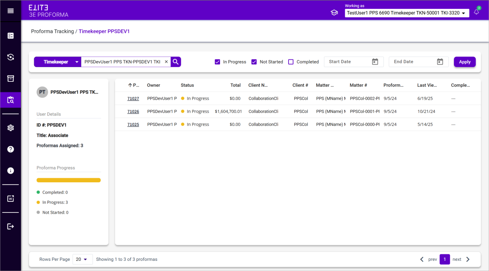

# Tracking Proformas by Client, Matter, or Timekeeper

| **Field Names**        | **Descriptions**                                                                                                                                                                                                                                                                                                                                                                                             |
| ---------------------- | ------------------------------------------------------------------------------------------------------------------------------------------------------------------------------------------------------------------------------------------------------------------------------------------------------------------------------------------------------------------------------------------------------------ |
| **Search Criteria**    |                                                                                                                                                                                                                                                                                                                                                                                                              |
| **Track by**           | 
Select an option from this drop-down list to specify how to track proformas, or single proforma (e.g., Client, Matter, Timekeeper, or Proforma).

<strong>Note</strong>: Search options and results are different when <strong>Proforma #</strong>is selected, see <a href="Tracking-Proforma-by-Number.md#tracking-proforma-by-number">Tracking Proforma by Number</a> for further information.
 |
| **In progress**        | Select this check box to track proformas that have been opened and are in the edit, approval, or billing process                                                                                                                                                                                                                                                                                             |
| **Not Started**        | Select this check box to track proformas that have been generated but not yet opened.                                                                                                                                                                                                                                                                                                                        |
| **Completed**          | Select this check box to track proformas that have been billed, closed, or deferred.                                                                                                                                                                                                                                                                                                                         |
| **Start Date**         | 
Select a beginning date for a search period.

<strong>Note</strong>: Specifying a date range is recommended if searching includes Completed proformas.
                                                                                                                                                                                                                                           |
| **End Date**           | Select a end date of a search period.                                                                                                                                                                                                                                                                                                                                                                        |
| **Apply**              | Click to apply search criteria.                                                                                                                                                                                                                                                                                                                                                                              |
| **Details**            |                                                                                                                                                                                                                                                                                                                                                                                                              |
| **Record Details**     | 
Displays details for the record used to track proformas:
<ul><li><strong>Client</strong> – Displays client name an number.</li><li><strong>Matter</strong> – Displays matter name and number.</li><li><strong>Timekeeper</strong> – Displays timekeeper name, ID, and title.</li></ul>                                                                                                                 |
| **Proformas Assigned** | Displays the number of proformas in the workflow for the selected client, matter, or timekeeper.                                                                                                                                                                                                                                                                                                             |
| **Proforma Progresss** | Displays the current status of the proformas in the workflow for the selected client, matter, or timekeeper (i.e., Completed, In Progress, or Not Started).                                                                                                                                                                                                                                                  |
| **Search Results**     |                                                                                                                                                                                                                                                                                                                                                                                                              |
| **Proforma #**         | The proforma number. Click this link to see the Proforma tracking for this specific proforma.                                                                                                                                                                                                                                                                                                                |
| **Owner**              | Owner of the proforma.                                                                                                                                                                                                                                                                                                                                                                                       |
| **Status**             | 
Current status of the proforma in the workflow:
<ul><li><strong>Completed</strong> = billed, closed, or deferred</li><li><strong>In Progress</strong> = proforma has been opened and is in the edit, approval, or billing process</li><li><strong>Not Started</strong> = proforma has been generated but not yet opened</li></ul>                                                                      |
| **Total**              | Displays the proforma total.                                                                                                                                                                                                                                                                                                                                                                                 |
| **Client Name**        | Displays the client name.                                                                                                                                                                                                                                                                                                                                                                                    |
| **Client #**           | Displays the client number.                                                                                                                                                                                                                                                                                                                                                                                  |
| **Matter Name**        | Displays the matter name.                                                                                                                                                                                                                                                                                                                                                                                    |
| **Matter #**           | Displays the matter number.                                                                                                                                                                                                                                                                                                                                                                                  |
| **Proforma Date**      | Displays the proforma generation date.                                                                                                                                                                                                                                                                                                                                                                       |
| **Last Viewed**        | Date the proforma was last accessed.                                                                                                                                                                                                                                                                                                                                                                         |
| **Completed Date**     | Date the proforma was billed, deferred, or closed.                                                                                                                                                                                                                                                                                                                                                           |
