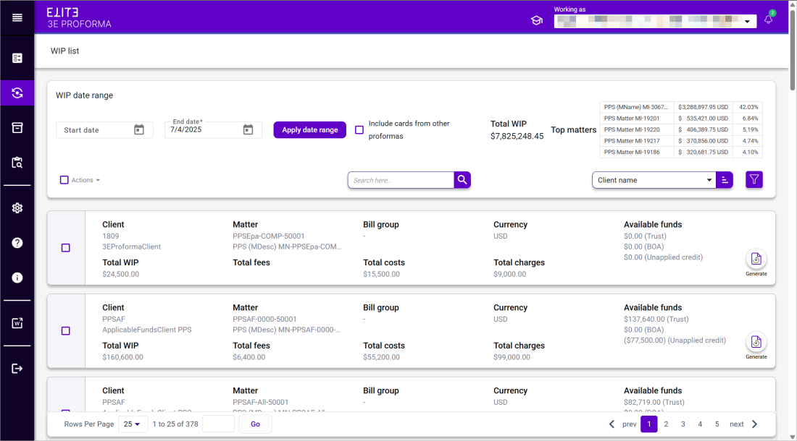

# WIP List Form and Field Definitions

The WIP list displays a list of Matters for which you are the assigned Billing Attorney, or you are working as the assigned Billing Attorney, and where the Matters have work-in-progress (WIP).

**Note**: See [Navigating the Proforma List](../Getting-Started/Navigating-3E-Proforma---Walkthrough.md#navigating-3e-proforma---walkthrough) for information on using the **Search** and **Sort** fields.

| **Field Name**                         | **Description**                                                                                            |
| -------------------------------------- | ---------------------------------------------------------------------------------------------------------- |
| **Start date**                         | Select a start date to restrict Matter WIP totals for a specific date range.                               |
| **End date**                           | Select an end date for the period to which you want to restrict the list of Matter WIP totals.             |
| **Apply**                              | Click to apply date entries to the WIP list.                                                               |
| **Include cards from other proformas** | Select this check box to include the total of unbilled cards from other proformas for Matters.             |
| **Total WIP**                          | Displays the hash sum of the WIP in the search results.                                                    |
| **Top Matters**                        | Displays up to 5 top matters by total WIP. The table displays Matter Name, WIP amount, and % of Total WIP. |
| **WIP List**                           |                                                                                                            |
| **Client**                             | Displays the name of the matter client.                                                                    |
| **Matter Number/Matter Description**   | Displays the matter number or description.                                                                 |
| **Bill Group**                         | Displays the bill group to which the matter belongs.                                                       |
| **Currency**                           | Displays the matter currency.                                                                              |
| **Total WIP**                          | Displays the total amount of WIP.                                                                          |
| **Fees**                               | Displays the amount of fees.                                                                               |
| **Costs**                              | Displays the costs.                                                                                        |
| **Charges**                            | Displays the charges.                                                                                      |
| **Available Funds**                    | Displays the amount of available funds.                                                                    |
| **Generate**                           | Click to generate a proforma.                                                                              |

&#x20;
