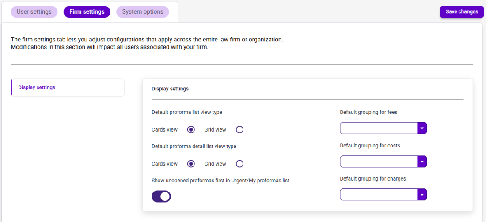

# Firm Tab

Use the settings on the Firm Settings tab to configure firm-wide defaults.

**Note**: The **Firm Settings** tab is only viewable by users that have the **3EProformaAdminRole** assigned to their user in 3E.

<figure><figcaption></figcaption></figure>

| **Field Name**                                                | **Definition**                                                                                                                                                                                                                                                                                                           |
| ------------------------------------------------------------- | ------------------------------------------------------------------------------------------------------------------------------------------------------------------------------------------------------------------------------------------------------------------------------------------------------------------------ |
| **Default proforma list view type**                           | Choose the default Proforma List view(i.e., Card or Grid).                                                                                                                                                                                                                                                               |
| **Default proforma detail list view type**                    | Choose the default List view(i.e., Card or Grid) for card entries viewed in [Proforma Detail view](https://github.com/DirkTechPubs/gitbook-3E-proforma-POC/blob/main/3ep-user-guide-v1/Getting-Started/Navigating-3E-Proforma---Walkthrough/Navigating-the-Proforma-Detail-View.md#navigating-the-proforma-detail-view). |
| **Show unopened proformas first in Urgent/My proformas list** | 
Select <strong>True</strong> from this drop-down list to display unopened proformas first (i.e., Ascending order) in the Urgent and My proformas list. Select <strong>False</strong> to disabled sorting by Unopened status.

 
                                                                              |
| **Default grouping for fees**                                 | Select an option from this drop-down list to use as criteria to group fee cards.                                                                                                                                                                                                                                         |
| **Default grouping for costs**                                | Select an option from this drop-down list to use as criteria to group cost cards.                                                                                                                                                                                                                                        |
| **Default grouping for charges**                              | Select an option from this drop-down list to use as criteria to group charge cards.                                                                                                                                                                                                                                      |
