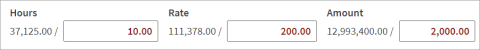

# Edit-Level Tracking

3E Proforma tracks and displays prior iteration edits (edit-level tracking) in a different color. An iteration can be explained by the following example:

**Before Edits**

Before any edits the card shows the following:

**After Edits**

The timekeeper edits the proforma as shown in the following:

**Note:** The edit text color is red.  In the [Narrative field](card-narrative-fields.md#card-narrative-fields), edits are designated with a red triangle in the top left corner of the field. \

Any new edit replaces the original value or text; worked values remain the same.
